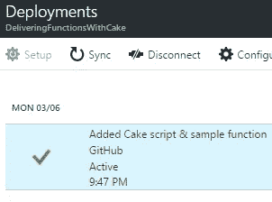
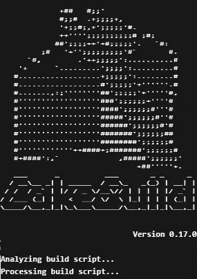
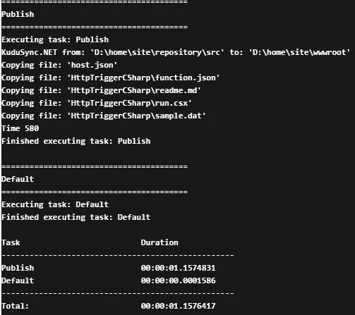

# ⚡Delivering 功能与蛋糕🍰

> 原文：<https://medium.com/hackernoon/delivering-functions-with-cake-4b269c50f817>

## C#中的 Azure 函数自定义部署脚本

Azure Functions 使用与 Azure App Services 相同的“引擎”进行部署，默认情况下，当你从 GitHub Kudu 连接连续部署时，它会为你处理一切，并且它会正常工作——你将提交你的代码，并且在你的代码上线后不久。



在这篇文章中，我将带您了解当部署源发生变化时，覆盖默认部署流程的过程。

我将使用 C#作为部署的例子，但基本上天空是这里的限制，你可以使用 F#与 FAKE，JavaScript 与 Node，PowerShell 或作为默认的普通旧批处理脚本-基本上任何你喜欢的工具。

你为什么要这么做？基本上，它支持更高级的部署场景，如自定义路径、私有 NuGet feeds，而无需将敏感信息提交给存储库，仅举几例。

## 标准部署

所以让我们先看看 Azure Functions 的标准 Kudu 批处理部署脚本是什么样子的(不要担心，会有一个摘要，所以你可以跳过它😎)

如果去掉错误处理、工具引导和变量的初始设置，重要的一行就是这一行

```
"%KUDU_SYNC_CMD%" -v 50 -f "%DEPLOYMENT_SOURCE%" -t "%DEPLOYMENT_TARGET%" -n "%NEXT_MANIFEST_PATH%" -p "%PREVIOUS_MANIFEST_PATH%" -i ".git;.hg;.deployment;deploy.cmd"
```

因此，这基本上是将存储库中的文件与功能应用程序上运行的文件同步，不包括存储库系统文件和部署脚本，删除任何不再存在的文件，添加任何新文件并覆盖任何更改文件。

## 覆盖默认脚本

覆盖默认行为实际上非常简单，在存储库的根中添加一个`.deployment`文件，`.deployment`文件可以控制部署的许多方面，无需定制脚本，即覆盖部署源(即 GIT 存储库)中的 Azure 函数脚本根，但我们感兴趣的设置是`command`设置，它允许我们设置在部署时应该执行哪个命令。

不，每次由提交或初始部署触发部署时，它都会寻找一个名为`deploy.cmd`的文件并执行它。

## 自助蛋糕

因此，蛋糕在 Azure 应用服务上默认不可用，所以我们需要确保它在我们可以使用 C#部署之前就位，我们在我们的定制`deploy.cmd`中这样做

这将创建一个`Tool`目录，从 NuGet 获取并安装 Cake 脚本运行程序，然后执行`deploy.cake`，这是我们的 C#部署脚本。

## 使用蛋糕进行部署

因此，Cake 中的标准批量部署脚本可能如下所示

`#tool`指令从 NuGet 获取 KuduSync(而默认从 NPM 获取)

`#addin`指令获取`Cake.Kudu`插件，这是我写的一个蛋糕插件，它从 C#中抽象了 Kudu 环境中的一些东西，可以通过类型化的对象、属性和方法轻松访问，即 KuduSync 实用程序。



然后我们可以只写`Kudu.Sync("./src");`,它会做与批处理脚本相同的事情，但是作为对未来的准备(因为这是正确的做法😉)我利用蛋糕任务运行器。

尽管没有那么多代码——与批处理脚本相比，我为 C#开发人员分配了更多可读和熟悉的代码。

更好的日志输出只是一个很好的奖励。

## 结论

这篇文章中的蛋糕脚本是一个非常基础和幼稚的脚本，当你意识到你得到了 C#的全部能力。NET 框架和数以百计的蛋糕插件有助于它的真正强大的故事，我会做更先进的场景后续职位。

你可以在[cakebuild.net](http://cakebuild.net/)了解更多关于 Cake 的信息，那里除了 Cake 自己的文档之外——大多数插件 API 都有文档记录，包括 [Cake。Kudu](http://cakebuild.net/api/Cake.Kudu.Provider/KuduProvider/) 。

如往常一样，如果你有任何反馈、表扬或问题，请随时联系我。你可以在下面的 GitHub 库找到这篇文章的完整代码

[](https://github.com/azurevoodoo/DeliveringFunctionswithCake) [## azure voodoo/交付蛋糕功能

### 通过 Cake 脚本使用 C#部署 Azure 函数

github.com](https://github.com/azurevoodoo/DeliveringFunctionswithCake) [](http://bit.ly/HackernoonFB)[](https://goo.gl/k7XYbx)[](https://goo.gl/4ofytp)

> [黑客中午](http://bit.ly/Hackernoon)是黑客如何开始他们的下午。我们是 [@AMI](http://bit.ly/atAMIatAMI) 家庭的一员。我们现在[接受投稿](http://bit.ly/hackernoonsubmission)并乐意[讨论广告&赞助](mailto:partners@amipublications.com)机会。
> 
> 如果你喜欢这个故事，我们推荐你阅读我们的[最新科技故事](http://bit.ly/hackernoonlatestt)和[趋势科技故事](https://hackernoon.com/trending)。直到下一次，不要把世界的现实想当然！

