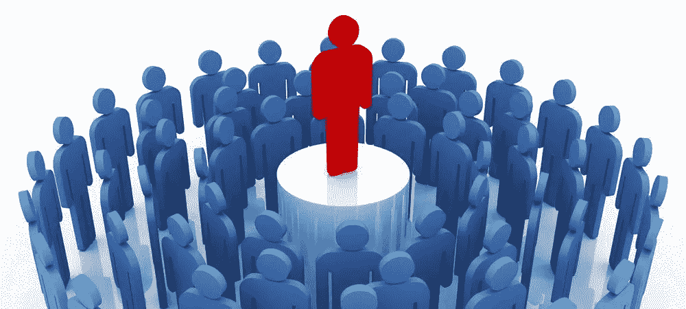

# 贬低民主

> 原文：<https://medium.com/hackernoon/demoting-democracy-40890ee99c8b>

D 民主。它真的管用吗？据说这是除了所有其他已经尝试过的政府之外最糟糕的政府形式，但是这种形式够好吗*？以全球变暖为例。人类可能在几十年前就应该对此做些什么，但我们的过程充其量也就是太慢了。什么都没发生。一个政治决定*对我们的生活到底有多大影响？在运行中的民主国家中非常小。尽管很难批评民主。即使当显而易见的小丑当选，真的没有人可以责怪。正如苏格拉底所预测的那样，人们已经说话了，他们非常清楚地选择了糖果店老板而不是医生。当然，人们会在不同的地方批评部分民主方法，但是你很少听到对民主理念的批评。您不能*真的*从系统内部改变系统。**

*[民主](https://extranewsfeed.com/tagged/democracy)很可能是人类尝试过的最不糟糕的治理形式，但是如果*治理*是这里的关键词而不是民主呢？如果我们真的不需要治理呢。有人会认为，像谷歌和脸书这样的公司对人们生活的影响比过去几十年的任何政治运动都要深远。是什么想法让他们能够做到这一点？互联网协议、开源软件和计算能力价格的下降正在以超乎我们想象的速度推动我们走向未来。没有 Linux，就没有安卓。微观经济无处不在，当一个集中的系统被关闭时，它就会分散并繁荣起来。Napster 的关闭催生了 BitTorrent 技术。丝绸之路正在被开放集市所取代，甚至有一个分散的优步正在等待它的前身的垮台。然后是比特币。*

*民主不会改变，但如果您选择退出，它对您生活的影响将会减弱，您可以在许多层面上这样做。用推特代替报纸只是第一步。已经有通过手机管理您一生的方法了。总会有一个足够富裕的社会阶层，不需要太在意国界。你也不必。尽你所能解放自己。促进权力下放。自学。你的候选人不会为你做这件事。*

******

> *[黑客中午](http://bit.ly/Hackernoon)是黑客如何开始他们的下午。我们是 [@AMI](http://bit.ly/atAMIatAMI) 家庭的一员。我们现在[接受投稿](http://bit.ly/hackernoonsubmission)，并乐意[讨论广告&赞助](mailto:partners@amipublications.com)机会。*
> 
> *如果你喜欢这个故事，我们推荐你阅读我们的[最新科技故事](http://bit.ly/hackernoonlatestt)和[趋势科技故事](https://hackernoon.com/trending)。直到下一次，不要把世界的现实想当然！*

**