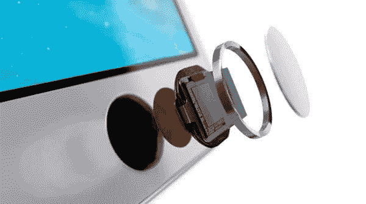
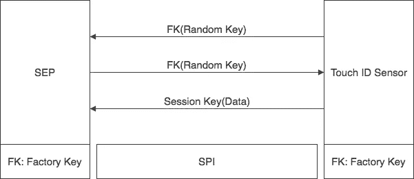
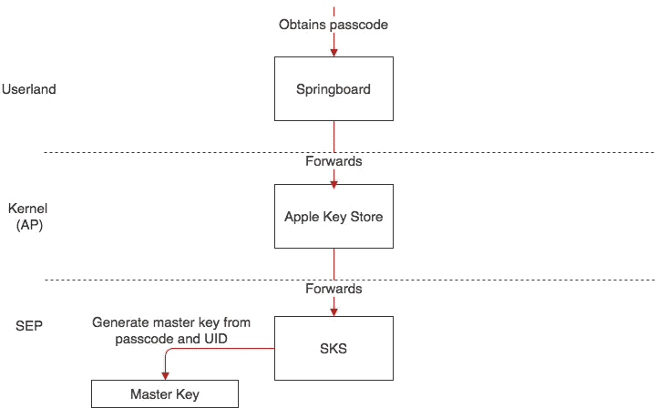
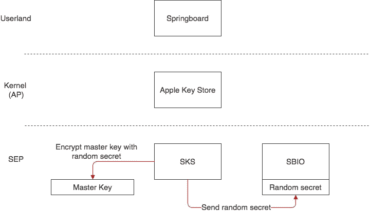
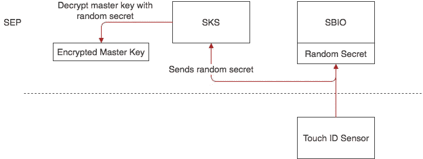

# 揭秘苹果的触控 ID

> 原文：<https://medium.com/hackernoon/demystifying-apples-touch-id-4883d5121b77>

## iPhone X 将把触控 ID 换成 Face ID；但是是什么机制多年来一直如此安全地保存着我们的指纹呢？我仔细看了看。

*最初发表于*[*【fabianstiehle.com】*](http://fabianstiehle.com/Touch-ID)*。*

随着用户要求越来越方便，越来越多的数据需要存储在移动设备上。然而，这种便利是以隐私为代价的。这种矛盾最突出的例子可能是许多流行移动设备上的指纹传感器。

指纹信息可能被归类为最私人的信息。因此，保存和处理这些信息的机制需要最高的安全和数据保护标准。

本文将讨论在苹果 iPhone 上实现的存储指纹数据的机制。请注意，本文不会讨论指纹或指纹传感器的安全性，而只会讨论安全存储和处理。

# 安全的三大支柱

指纹数据的整体安全性可分为三大支柱:

*   指纹散列法
*   散列加密和安全通信
*   通过安全的飞地与其他系统组件完全分离

# 指纹散列法

触控 ID 的一个非常重要的概念是指纹不会永久保存。相反，指纹被临时保存在安全区域的加密存储空间中。(我们稍后将讨论安全飞地。)然后指纹被矢量化以供分析，直到它被完全丢弃。

[苹果](https://hackernoon.com/tagged/apple)对这个过程的自我描述如下:

> *“该分析利用了皮下嵴流动角度映射，这是一个有损过程，会丢弃重建用户实际指纹所需的细节数据。”1*

最值得注意的是，苹果声明原始指纹无法复制。那么，什么是“真皮下嵴流动角标测”？

首先，我们需要了解指纹背景下的“脊流”。“脊”描述了指纹图像中的曲线。脊流通常用于指纹技术中的模式匹配。

Ridge Flow Patterns (From: Center for Unified Biometrics and Sensors, University at Buffalo, [https://cubs.buffalo.edu)](https://cubs.buffalo.edu/)

那么，指纹中的皮下组织是什么？触控 ID 扫描“皮下”指纹数据。传感器周围的环用于向皮肤发送电信号，以便皮下层(皮肤内层)能够有助于读取。

Fingerprint sensor. Notice the golden ring around the sensor that starts the subdermal scan. (From: Apple.com, Newsroom)

既然我们复习了指纹术语，我们就可以理解苹果官方对“脊流角度映射”的解释了:

> *“从指纹的一部分提取的纹线的方向和宽度的数学表示。”1*

这一过程让人想起现代密码认证的处理方式，原始密码从不存储在数据库中，而是存储在一个哈希值中，原始密码无法从该哈希值中复制。

# 散列加密和安全通信

指纹的数学表示使用哈希函数进行哈希运算，只有 Secure Enclave 可以读取该函数。(我们稍后将对此进行更详细的讨论。)

散列指纹表示现在被转发到安全区域。这是由主处理器完成的，它将散列数据转发到安全区域。苹果公司提供的关于这一过程的唯一信息如下:

> *“处理器将数据转发到安全区域，但无法读取。它使用会话密钥进行加密和验证，该会话密钥是使用为触控 ID 传感器和安全飞地提供的设备共享密钥协商的。会话密钥交换使用 AES 密钥包装，双方提供一个随机密钥来建立会话密钥，并使用 AES-CCM 传输加密。1*

这包含了一个对触控 ID 安全至关重要的理念:

> *“[……]为触控 ID 传感器和安全区域提供的设备共享密钥。”*

伊万·克尔斯蒂奇(苹果公司安全工程和架构负责人)在 Blackhat 2016 上的一次演讲让这一点变得更加清晰。Ivan 谈到了“安全飞地和触控 ID 之间的工厂配对安全通道”。在工厂中，建立了确保触控 ID 和安全区域之间的通信安全的密钥。如果没有这种独特的密钥对，触控 ID 传感器可能会被恶意的传感器所取代，然后恶意的传感器可以访问安全区域。

这也是臭名昭著的错误 53 的原因，如果触控 ID 传感器在没有与 Secure Enclave 配对的情况下被更换，iPhone 会警告错误 53，这使得手机实际上无法使用。只有 Apple 和 Apple 认证的合作伙伴可以执行这样的配对。这个激进的“特征”在过去也受到了一些批评。

让我们仔细看看传感器和 Enclave 之间的通信。通过工厂配对密钥，经由密钥包装算法建立安全会话密钥。通过使用另一个加密密钥对会话密钥进行加密，密钥包装算法可用于安全地传输会话密钥。

在指纹数据到达安全区域之前，安全传输特别重要。在这个安全模型中，应用程序处理器是不可信的。只有 Enclave 被信任安全相关数据。

我们可以想象这个过程如下:触控 ID 传感器向安全区域(SEP)发送一个随机密钥。数据通过串行外设接口(SPI)发送。随机密钥使用工厂配对密钥(FP)加密。通过这两个随机密钥，建立一个会话密钥，用它来加密所有进一步的数据。

Session key negotiation

由于工厂密钥仅用于加密随机密钥部分，因此几乎没有任何数据可用于被可能的攻击者重构工厂密钥。正如曼努埃尔·莫戈隆所说:

> “在密码分析中，密钥使用得越多，它被破解的可能性就越大。通过使用密钥加密密钥来包装密钥，KEK 的使用次数将会减少[…]”. 2

苹果没有提供关于这两个随机密钥的任何进一步信息——然而，如果这些密钥是从特定数据集或以特定方式生成的，它可以提供额外的安全和认证层。如果随机密钥不符合特定模式，触控 ID 或 SEP 可以中止会话密钥协商。

请注意，这只能是对苹果如何处理触控 ID 和飞地之间的安全通信的一种假设。信息匮乏。

# 安全的飞地

Secure Enclave 是安全架构的主要杰作，我之所以保存这个解释这么久是有原因的:它是所有内容汇集的地方。

Secure Enclave 是一个独立的处理器，完全独立于主处理器。它运行自己的内核、驱动程序和应用程序，并拥有自己的加密存储空间。苹果称之为“安全飞地处理器”(SEP)。它基于 L4 微处理器。(L4-嵌入式)但是经过了 Apple 的一些修改。

SEP 和 AP(应用处理器)之间的通信被隔离到邮箱系统。它提供了收件箱(请求)和发件箱(回复)。AP 写入邮箱的收件箱，并由此触发 SEP 中的硬件中断，这通知 SEP 已经接收到消息。当回复就绪时，SEP 将消息写回发件箱，并产生另一个中断来通知 AP。

只有 Secure Enclave 有权访问加密操作，并且它是通过“安全密钥服务”(SKS)处理所有数据保护密钥(iOS 有几个密钥)的唯一实体，安全密钥服务是在 SEP 上运行的应用程序

有了这种与其他系统的完全隔离，即使在 AP 受到威胁时，SEP 也能保持所有数据保护的完整性。

## 安全引导和设备 UID

SEP 也有自己的引导过程——完全独立于主内核。两个内核都通过信任链来验证它们的完整性。所有组件都由苹果公司加密签名。这还包括引导加载程序、内核、内核扩展和固件。

但是 SEP 做的更多。SEP 硬件包含一个真随机数发生器，并且在第一次加电时，产生一个对 SEP 唯一的私钥。此根设备密钥从不与其他软件共享。(苹果也不知道)这个密钥被用来导出所有的秘密密钥。(事实上，这只是故事的一半:主密钥是通过根设备密钥和用户密码生成的。)

# 全貌:触控 ID 如何解锁

现在我们已经对安全架构有了一个大致的了解，触控 ID 是如何解锁手机的呢？我们将首先讨论普通密码如何解锁。

第一个跳板，主要面向用户的应用程序(例如管理 iOS 主屏幕)从用户那里获取密码。然后，它将把它发送到 SEP，SEP 将根据收到的密码和设备 UID 生成主密钥。有了这个主密钥，所有其他密钥都可以被解密。没有触控 ID，这个装置现在会毁掉主密钥。(它完成了工作，加密了密钥。)请注意，所有数据都只在绝对必要时才保存在内存中。

How Touch ID unlocks

触控 ID 引入了一个额外的步骤:从主密钥生成一个随机秘密。利用这个随机秘密，主密钥被加密。然后，随机密钥将被发送到在 SEP 上运行的 SBIO 应用程序。请注意，只会发送密钥，而不是主密钥本身。原始主密钥将被丢弃，只给系统留下加密的主密钥和 SBIO 中的秘密。

Unlock with SBIO 1

现在我们有了第一个通过密码解锁的地方，我们终于可以探索触控 ID 如何解锁。

触控 ID 传感器将指纹(如前所述)发送给执行匹配的 SBIO。如果指纹匹配，它早先获得的随机秘密被送回 SKS。有了这个，SKS 现在能够解密早先加密的主密钥，并且用这个来解密所有其他的密钥。手机又解锁了。原始主密钥再次被安全丢弃。

Unlock with SBIO 2

为了让触控 ID 工作，手机需要通过密码解锁一次，以便设备可以安全地解密主密钥。为了提高安全性，如果设备在 48 小时后重启，并且在五次触控 ID 识别尝试失败后，主密钥被丢弃。所有这些情况都需要输入密码才能继续。

# 结论

苹果设计了一个聪明的安全概念，并采取措施来确保指纹数据在系统中传输的每一步都是安全的。

*   数据只有在真正需要时才会被散列和存储。
*   真正的指纹永远不会被永久保存。
*   通过完全独立的安全区域，安全系统可以处理所有与安全相关的操作和数据。

Secure Enclave 和触控 ID 为 Apple Pay 和本地认证等许多其他安全功能提供了基础。当其他制造商表现得不那么关心时，苹果公司在触控 ID 第一次发布时就已经有了这个系统。然而，由于苹果很少与公众分享安全信息，该过程的许多细节仍被蒙在鼓里。人们可以对此提出批评，并引用 Saltzer/Schroeder 的安全设计原则之一:“开放式设计:设计不应保密”。4 指纹传感器本身的安全性也仍然值得怀疑。[许多尝试表明指纹传感器可以被欺骗](http://www.telegraph.co.uk/technology/2017/04/11/smartphone-fingerprint-scanners-could-easily-fooled-fake-prints/)。还有就是说这篇文章大部分是基于苹果宣称的系统是如何工作的。因为实现不是公开的，所以无法完全验证。

## 研究来源

*   Tarjei Mandt，Mathew Solnik，王耀庆，揭开 Secure Enclave 处理器的神秘面纱，[https://www . black hat . com/docs/us-16/materials/us-16-Mandt-Demystifying-The-Secure-Enclave-Processor . pdf](https://www.blackhat.com/docs/us-16/materials/us-16-Mandt-Demystifying-The-Secure-Enclave-Processor.pdf)(black hat 2016)
*   伊万·克尔斯蒂奇，iOS 安全幕后，[https://www . black hat . com/docs/us-16/materials/us-16-krstic . pdf](https://www.blackhat.com/docs/us-16/materials/us-16-Krstic.pdf)(black hat 2016)

1.  苹果，iOS 安全指南，[https://www.apple.com/business/docs/iOS_Security_Guide.pdf](https://www.apple.com/business/docs/iOS_Security_Guide.pdf)(2017 年 6 月)
2.  Mogollon:加密和安全服务，2007 年
3.  杰罗姆·h·萨尔茨，迈克尔·d·施罗德，4 月 17 日。1975 年，信息保护的基本原则，[http://web . MIT . edu/Saltzer/www/publications/Protection/Basic . html](http://web.mit.edu/Saltzer/www/publications/protection/Basic.html)

*原载于*[*fabianstiehle.com*](http://fabianstiehle.com/Touch-ID)*。*