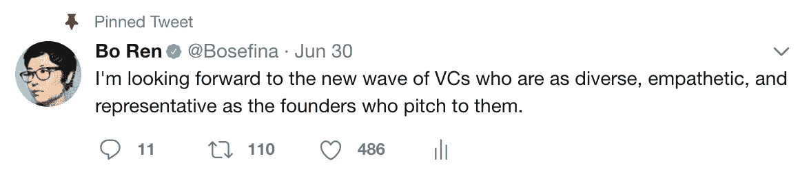

# 揭开风险投资的神秘面纱:我从与伟大投资者的交谈中学到了什么(上)

> 原文：<https://medium.com/hackernoon/demystifying-vc-what-i-have-learned-from-talking-to-great-investors-part-i-dfa1002da044>

我第一次听到“风险投资家”这个术语是在看伊万娜·马参加《学徒》比赛时。十二岁的我看着唐纳德·特朗普心血来潮地招聘和解雇员工，却没有意识到这个人有一天会成为我们的总统。我喜欢伊凡娜，因为她在《学徒》中的直言不讳和足智多谋。她不敬且大胆——这是我认同的两个特征。

在[七家科技公司](/@Bosefina/how-to-follow-your-heart-vs-data-c109453bc706)和深思熟虑之后，我决定踏上我的创业之旅。我这么做不是因为风投很性感或者很耀眼。如果说有什么不同的话，在创业公司工作教会了你所有闪光的东西都是 T4 而不是黄金。我想成为一名投资者，因为我想实施变革。作为一名多样性和包容性的倡导者，我认为在硅谷选择不同的赢家是很重要的。我认为，有一整个被边缘化的创业者阶层被忽视了，因为目前掌权的风投缺乏多样性和同情心，无法投资于与他们不同的人。因此，我们有一整类创业者和服务不足的市场，它们已经到了被颠覆的时候了。

我希望写下我的创业之旅将有助于综合我的知识和经验。最重要的是，我希望分享这些信息将有助于降低进入风险投资的门槛，因为知识就是力量。

## **1。什么是风险投资？**

当我第一次尝试进入文科专业的产品管理领域时，我每天下午都去 Sunrun 吃午饭，喝咖啡。我问他们对项目经理的定义和解释是什么。每个人都给了我不同的解释。由我来从这些会议中收集共同的线索、技能和模式。像 PM 一样，venture 是一个非常模糊的空间，甚至比 PM 更模糊。

Floodgate 的创始合伙人安·米乌拉-科告诉我，作为一名风险投资人，你需要发展自己的信念。为了脱颖而出，你需要建立自己的投资者形象和定义。

## 2.投资者简介——经营还是不经营？

与你交谈的每一位投资者都会对操作型风投和战略型风投流派有自己的看法。成为投资者的前经营者和创始人会告诉你，运营经验至关重要。弗雷德·威尔逊(Fred Wilson)等非运营人员谈到，运营角色并不完全是成为投资者的必要条件。与少数风险投资合伙人交谈，你会发现没有成为投资者的条件。像 Hunter Walk、Megan Quinn 和 Ken Norton 这样建立了伟大公司的经营者将告诉你，作为建设者，亲自参与到你的公司并培养一定程度的同理心是非常重要的。

在我看来，风险投资没有单一的路径或轮廓，但所有好的风险投资都有共同的特征。

[光速创投的合伙人亚伦·巴塔利昂](http://lsvp.com/team/aaron-batalion/)，提炼了风险投资的四大核心技能:

1.  **采购/网络:**生成入站交易流的能力。拥有一个引人注目的品牌或网络，让外来公司和创始人向你伸出援手。
2.  **过滤(尽职调查):**能够凭借良好的判断力和财务、市场分析来评估交易和公司。这就是 MBA/分析思维派上用场的地方。根据早期收集的财务数据(LTV)和指标(CAC，DAU ),决定一家公司是否值得投资
3.  **赢得交易:**这是一项必要的技能，尤其是在合作伙伴级别。你如何向创始人证明他们应该选择你而不是其他公司，从而赢得一笔交易？除了提供一张支票，你还能增加什么价值？
4.  **治理:**运营技能派上用场的地方。通过招聘、建议和专家网络，观察董事会并亲自帮助建立公司。

大多数优秀的风投都具备四种特质中的两种。对一个投资者来说，同时具备这四种特质是非常罕见的。

## 3.风险投资框架

因为风险投资是一个非常捆绑的技能组合，所以为企业开发自己的框架非常重要。我一直喜欢系统层面的思考，并且自然地被框架和哲学所吸引。

安·米乌拉·柯关于创始人和投资者应该真正关心什么的早期框架因其简单明了而吸引了我。早期投资可以归结为三个互相拉动的重要杠杆。

1.  作为一个创始人，确定你的大竞争优势。这种产品、服务、商业模式的专有权力/护城河有多长久、持久和独特？
2.  谁在乎你的产品/公司的竞争优势？这有助于你确定你的目标用户。
3.  创建一个伟大的组织，创始人关注团队建设、多样性和包容性等。这不仅仅是雇佣女性和未被充分代表的少数族裔，也是对人生阶段多样性的思考。你们公司有多少人是单身？有多少人信教？谁通勤去上班？谁不喝酒？

种子投资者为创始人及其早期想法和产品创造高扭矩。好的投资者能够带领他们的创始人走过精神迷宫，完成他们的第一次产品市场适应和 100 万美元销售额的旅程。

## 4.追踪你作为投资者的成功

作为一名投资者，你要知道的一件事是，这是一项独狼式的工作。你很少在一个团队中工作，而是与你的合伙人和创始人并行工作。与产品发布不同，作为投资者，你需要数年时间才能获得反馈。

[Hunter Walk](https://hunterwalk.com/about/) 从以下五个方面衡量他作为投资者的成功:

1.  **幸存:**X 年后，你们有多少公司还活着？把你的投资看作一个舰队。
2.  **基础业务的质量:**业务在增长、收入、参与度等方面表现如何？
3.  **后续投资的质量:**谁领导/投资了你的投资组合公司的后续轮次？
4.  **交易流程统计:**你会比其他人先看到交易吗？你是领投还是共同投资？
5.  **创始人 NPS 评分:**创始人在说你什么？你如何衡量你的净推广分数？这是你作为投资人的商誉和品牌资产。作为投资者，你的品牌直接反映了你与创始人共事的经历。你认为创始人评估投资人的模式是什么？Refactor Capital 的管理合伙人 Zal Bilimoria 利用 delighted.com 来管理创始人 NPS 分数。

# ❤如果你学到了什么，请点击推荐！

> ✨在 [**Twitter**](https://twitter.com/Bosefina) 上关注我，订阅我的 [**个人简讯**](http://tinyletter.com/bosefina) 当我发布我的下一篇作品——揭秘 VC 第二部时会得到通知。我们一边爬一边举！ *✊🏽*

*巨大的感谢* [*蒂伦钟*](/startup-grind/55-things-learned-as-a-19-year-old-vc-6c54af2f0f89)*[*安米乌拉-柯*](https://medium.com/u/7462afb1f663?source=post_page-----dfa1002da044--------------------------------)*[*猎人走*](https://medium.com/u/209207e81261?source=post_page-----dfa1002da044--------------------------------)*[*肯诺顿*](https://medium.com/u/990da511b420?source=post_page-----dfa1002da044--------------------------------)*[*伦巴塔里昂*](https://medium.com/u/6969c2e67361?source=post_page-----dfa1002da044--------------------------------)******