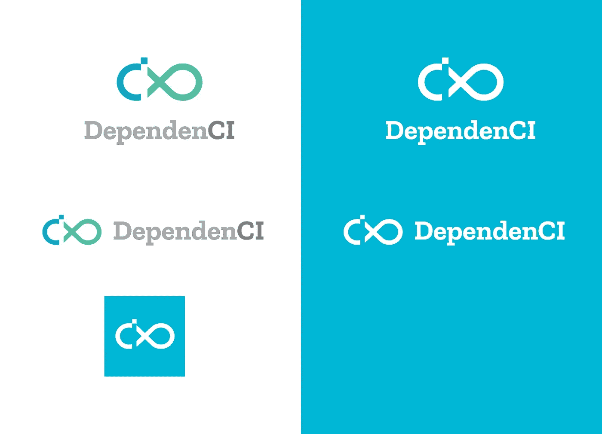
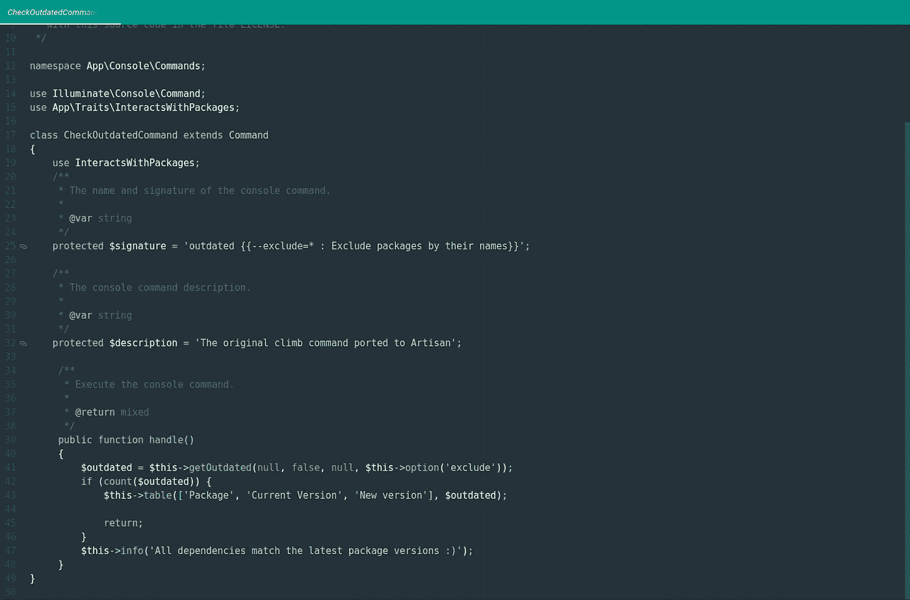

# dependency I:免费更新您的 Composer 依赖项！

> 原文：<https://medium.com/hackernoon/dependenci-launch-31469016788c>

*原载于* [*我的博客*](https://miguelpiedrafita.com/dependenci/)

The DependenCI Branding

DependenCI 于 2017 年 5 月 12 日下午 3:26 推出公测。在撰写本文时，已经有超过 2k 人访问了它，并且已经有超过 100 名用户尝试了它。那么，这一切是怎么开始的呢？

# T 何的想法

这个想法是在收到来自[果岭管理员](https://greenkeeper.io/?ref=dependenci)的拉请求后产生的。对于那些不知道的人来说，Greenkeeper 是一个监控你的项目的 npm 依赖项的服务，每次发布新版本的时候都会发送一个 pull 请求。我问自己:*为什么作曲家没有这样的东西？我决定建一个。*

# T 何开发:

我开始重用[攀登](https://github.com/vinkla/climb?ref=composerci)代码来开发它。此时，很容易在本地检查过时的依赖项。当我说非常容易的时候，我的意思是用了 7 行代码来检查它并返回一个漂亮的表。

The code that checks for outdated dependencies locally

然后，我开始修改代码，使用 GitHub API 代替本地 composer.json 文件，最终的实现也用了 7 行代码来检查 GitHub API 并对一个 pull 请求进行排队。

The code that checks for outdated dependencies using the GitHub API and queues a Pull Request

在对允许依赖排除和实现雄辩模型做了一些调整后，后端就准备好了！

使用 AdminLTE 作为仪表板的模板，使用 Pratt 登录页面作为登录页面的模板来创建前端。我对结果很满意，但我可能会开源前端，或者在不久的将来找一个合作伙伴来帮我。

# T 何推出:

现在，测试时间到了。我上传了带有早期访问表单的登录页面，并在 Reddit 和 HackerNews 上进行推广。两天后，当我决定推出公测版时，已经有 80 多个用户填写了提前获取表格！

我发了发布邮件([你可以在这里查看](http://mailchi.mp/e894fecd0251/composerci-public-beta?ref=dependenci))第二天就有了 30 个用户！

# 反馈、错误修复和新功能:

他的反馈几乎立刻就来了。我收到一些关于用户在添加回购时遇到问题的电子邮件。我发现了问题并部署了解决方案。前两天还解决了其他小(也没那么小)的。根据 Composer 团队的要求，我还更改了名称以删除 Composer from(旧名称为 ComposerCI)。我给所有订阅者发了另一封邮件，告诉他们这些变化([你可以在这里查看](http://mailchi.mp/56dc6ca10f38/dependenci-news-1?ref=dependenci))。

我还创建了一个路线图库，所以用户可以建议新功能，并得到一些有趣的功能。你可以在这里找到它[，它对检查即将推出的功能也很有用。](https://github.com/dependenci/roadmap/issues?ref=dependenci)

# 结论:

我创建了 [DependenCI](https://dependenci.miguelpiedrafita.com?ref=medium-launch) 来解决个人需求和学习更多的东西，并最终构建了一个似乎对全世界 PHP 开发人员都有用的工具。在接下来的几周，我计划添加更多的功能，比如使用 GitHub 集成，与 GitLab 集成或改进前端(正如我所说，我可能会欢迎另一位开发人员加入这个项目，敬请关注！).

dependency I 目前对公共和私有库都是免费的，如果你在测试结束前注册，你将永远保持这个价格！

最后，如果你想接收新闻、促销和其他有趣的事情，你会想要订阅 DependenCI 时事通讯。有两种方法可以做到这一点。第一个是在[dependency I](https://dependenci.miguelpiedrafita.com?ref=medium-launch)注册，你会自动被添加。另一个是填写下面的表格:

另外，如果你能花点时间喜欢这篇文章，我会很感激，看到你喜欢这篇文章真的对我很有帮助，以后我可能会写更多这样的文章。希望我的产品帮助你成长为一名 PHP 开发人员，让我们再次让 PHP 变得伟大(更好)！

> [黑客中午](http://bit.ly/Hackernoon)是黑客如何开始他们的下午。我们是 [@AMI](http://bit.ly/atAMIatAMI) 家庭的一员。我们现在[接受投稿](http://bit.ly/hackernoonsubmission)，并乐意[讨论广告&赞助](mailto:partners@amipublications.com)机会。
> 
> 如果你喜欢这个故事，我们推荐你阅读我们的[最新科技故事](http://bit.ly/hackernoonlatestt)和[趋势科技故事](https://hackernoon.com/trending)。直到下一次，不要把世界的现实想当然！

