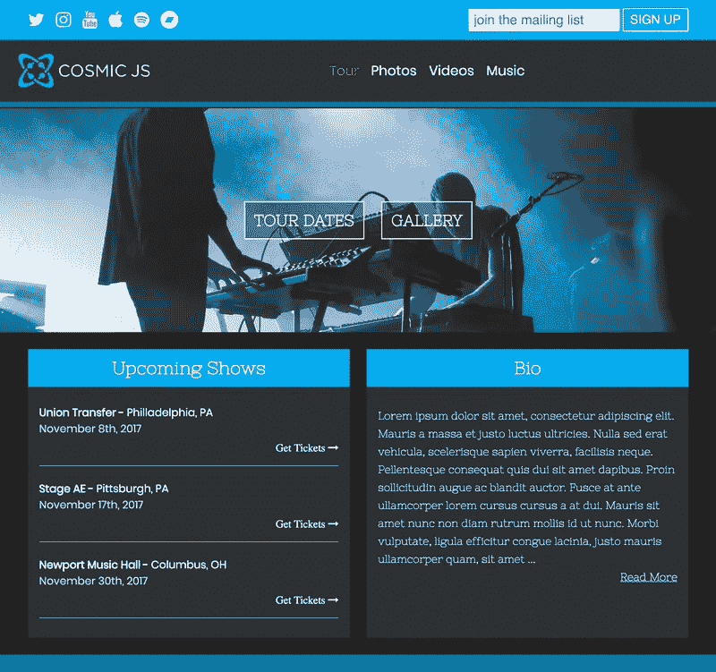
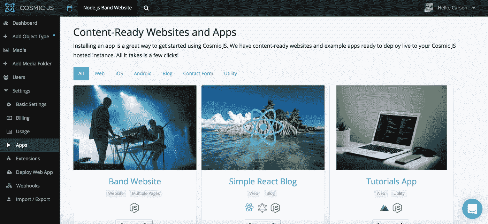
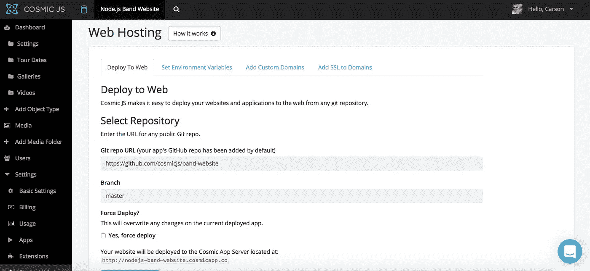
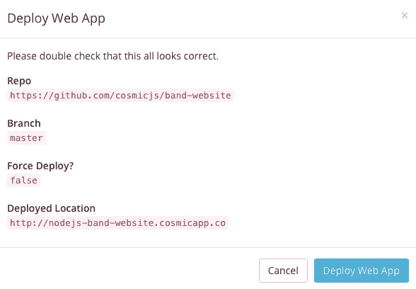
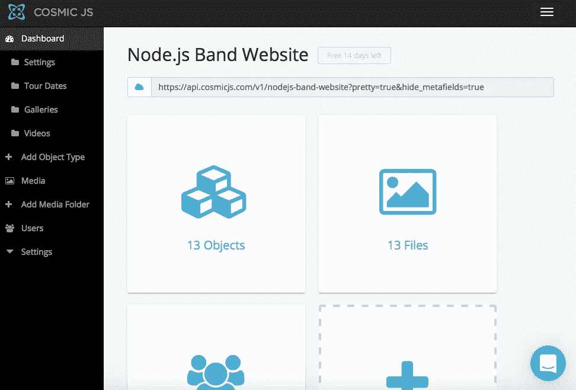

# 分三步部署 Node.js Band 网站

> 原文：<https://medium.com/hackernoon/deploy-a-node-js-band-website-in-3-steps-95aa445d6aec>

在这篇博客中，我将分三步演示如何部署 Node.js Band 网站。这个 Express 应用程序可以让你在 Cosmic JS 中存储关于你的乐队、你的乐队的巡演日期和你的乐队的照片的信息，并以传统乐队网站的形式呈现给你的粉丝。这个网站是作为一个快速应用程序建立的，并与 MailChimp 集成在一起处理电子邮件注册。它的所有数据完全由 Cosmic JS 提供。它也将通过 Cosmic 部署。如果你想了解这个应用程序是如何从头开始构建的，你可以参考下面的原始教程，或者继续阅读，通过 3 个简单的步骤简单地部署 Node.js Band 网站。

在这个示例博客中，我将使用 [Cosmic JS](https://cosmicjs.com/) 。Cosmic JS 是一个 [API 优先的 CMS](https://cosmicjs.com/) ，它使得管理和构建网站和应用程序更加快速和直观。通过将内容与代码分离， [Cosmic JS](https://cosmicjs.com/) 赋予开发者灵活性，同时确保内容编辑能够以最适合他们的方式规划和部署内容。Cosmic JS 允许开发人员使用他们喜欢的工具，如 Node.js、GitHub、Docker 等等。我们将使用 [Cosmic JS](https://cosmicjs.com/) 来安装我们的示例应用程序，部署和更新来自[基于云的内容管理平台](https://cosmicjs.com/)的内容。

如果你还没有，那就从[注册](https://cosmicjs.com/signup)参加[宇宙 JS](https://cosmicjs.com/) 开始吧。下面提供了有用的资源来简化您的开发操作。

 [## 乐队网站|宇宙 JS App 演示

### Cosmic JS 是一个云托管的内容平台，提供了一个灵活而直观的 CMS API。建立网站和…

cosmicjs.com](https://cosmicjs.com/apps/band-website/demo)  [## cosmicjs/band-网站

### 一个使用 Express 和 Cosmic JS 建立的乐队网站。

github.com](https://github.com/cosmicjs/band-website) 

# 1.创建新的存储桶

您的 bucket 的名称是您正在构建的网站、项目、客户端或 web 应用程序的名称。

# 2.安装 Node.js 波段网站

[Cosmic JS](https://cosmicjs.com/) 让你能够在 Node.js、Vue.js、React、AngularJS 等编程语言之间进行筛选。

# 3.部署到 Web

我点击了“部署到 Web”。然后，我可以在部署 web 应用程序时编辑对象。您将收到一封电子邮件，确认您的 web 应用程序的部署。如果您在部署过程中遇到任何问题，您可能会被转到 [Cosmic JS 故障排除页面](https://cosmicjs.com/troubleshooting)。

# 确认部署位置和分支

# 部署分支机构确认模式

现在，您的应用程序已部署到 Cosmic JS 应用程序服务器，您可以自由地从一个位置完全管理 Node.js Band 网站及其所有内容。

[Cosmic JS](https://cosmicjs.com/) 是一个 API 第一的基于云的内容管理平台，使管理应用程序和内容变得容易。如果你对 Cosmic JS API 有任何疑问，请通过 [Twitter](https://twitter.com/cosmic_js) 或 [Slack](https://cosmicjs.com/community) 联系创始人。

[卡森·吉本斯](https://twitter.com/carsoncgibbons)是[宇宙 JS](https://cosmicjs.com/) 的联合创始人& CMO，宇宙 JS 是一个 API 第一的基于云的[内容管理平台](https://cosmicjs.com/)，它将内容与代码分离，允许开发人员用他们想要的任何编程语言构建流畅的应用程序和网站。