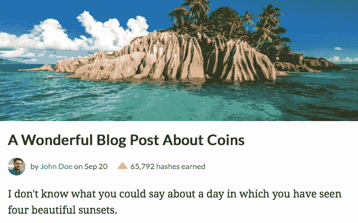
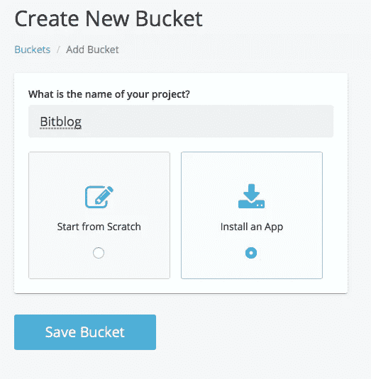
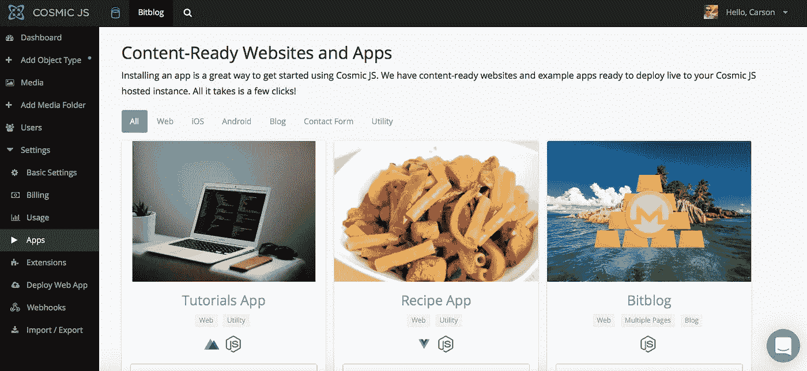
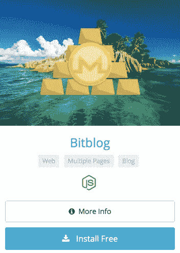
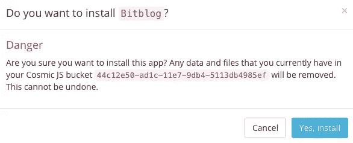
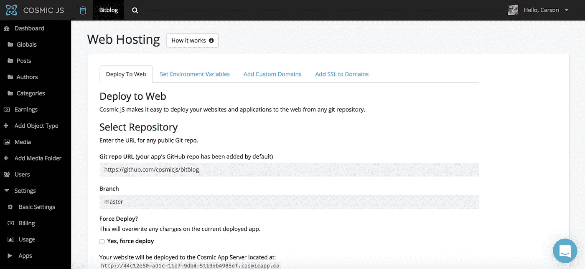
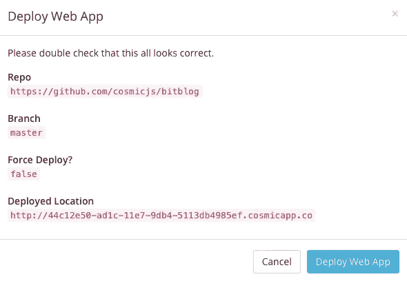

# 分三步部署 Node.js Bitblog

> 原文：<https://medium.com/hackernoon/deploy-a-node-js-bitblog-in-3-steps-db1d5d624bad>

Install and deploy a Node.js Bitblog that mines cryptocurrency in 3 steps.

在这篇博客中，我将向您展示如何安装和部署基于 Node.js 构建的 Bitblog 应用程序。安装这篇博客并通过众包加密货币挖掘将您的内容货币化。把它当成广告的替代品，今天就开始写博客吧。Bitblog 从简单的博客中分出来，将你的博客读者变成加密货币矿工。它使用[硬币蜂巢](https://coin-hive.com/)直接在读者浏览器中挖掘 [Monero](https://getmonero.org/) 硬币(当然要征得他们的同意)。来自 Coin Hive 网站:“Coin Hive 为 Monero 区块链提供了一个 JavaScript miner，你可以将其嵌入到你的网站中。你的用户直接在他们的浏览器中运行 miner，并为你挖掘 XMR，进而获得无广告体验、游戏内货币或你能想到的任何激励措施。”在 Bitblog [GitHub 页面](https://github.com/cosmicjs/bitblog)上阅读更多内容，或者继续阅读 3 步部署应用程序。

 [## cosmicjs/bitblog

### bitblog -通过众包加密货币挖掘将您的内容货币化。把它当成广告的替代品。

github.com](https://github.com/cosmicjs/bitblog) 

我将使用 Cosmic JS CMS API 来管理我的博客内容。Cosmic JS 是一个 API 优先的 CMS，使管理和构建网站和应用程序更快、更直观。通过将内容从代码中分离出来，Cosmic JS 增强了开发人员的灵活性，同时确保内容编辑人员能够以最适合他们的方式规划和部署内容。我们将使用 Cosmic JS 来安装我们的示例应用程序，部署和更新基于云的内容管理平台的内容。

**资源**

 [## Bitblog |宇宙 JS 应用程序演示

### Cosmic JS 是一个云托管的内容平台，提供了一个灵活而直观的 CMS API。建立网站和…

cosmicjs.com](https://cosmicjs.com/apps/bitblog/demo)  [## 如何使用 Node.js 构建一个简单的博客

### 在本教程中，我将向你展示如何使用 Node.js 和 Cosmic JS 创建一个简单的博客。这将是…

hackernoon.com](https://hackernoon.com/how-to-build-a-simple-blog-using-node-js-4ccdce39e78f) 

# 1.创建新的存储桶

# 2.安装 Node.js Bitblog

注册并命名您的存储桶后，系统会提示您从头开始或安装应用程序。对于这个博客，我正在安装构建在 Node.js 上的 Bitblog 应用程序。

# 3.部署到 Web

我点击了“部署到 Web”。然后，我可以在部署 web 应用程序时编辑对象。您将收到一封电子邮件，确认您的 web 应用程序的部署。如果您在部署过程中遇到任何问题，您可能会被转到 [Cosmic JS 故障排除页面](https://cosmicjs.com/troubleshooting)。

# 确认部署位置和分支

现在您的应用程序已经部署到了 Cosmic JS 应用程序服务器，您可以自由地从一个位置完全管理 Node.js Bitblog 应用程序及其所有内容。

[Cosmic JS](https://cosmicjs.com/) 是一个 API 首创的基于云的内容管理平台，可以轻松管理应用和内容。如果你对 Cosmic JS API 有任何疑问，请通过 [Twitter](https://twitter.com/cosmic_js) 或 [Slack](https://cosmicjs.com/community) 联系创始人。

[卡森·吉本斯](https://twitter.com/carsoncgibbons)是 [Cosmic JS](https://cosmicjs.com/) 的联合创始人& CMO，这是一个 API 第一的基于云的[内容管理平台](https://cosmicjs.com/)，它将内容从代码中分离出来，允许开发人员用他们想要的任何编程语言构建流畅的应用程序和网站。