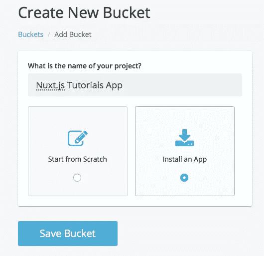
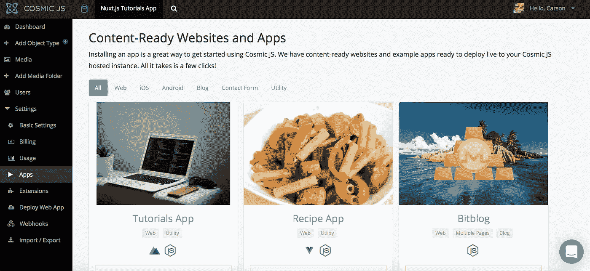
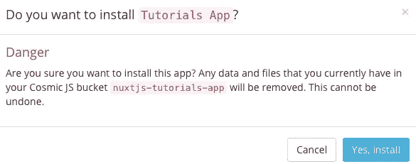
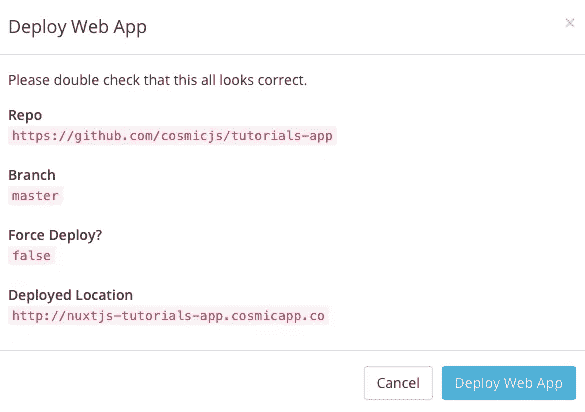

# 分 3 步部署 Nuxt.js 教程应用程序

> 原文：<https://medium.com/hackernoon/deploy-a-nuxt-js-tutorials-app-in-3-steps-20962ed7e74c>

在这篇博客中，我将向您展示如何安装基于 Nuxt.js 和 Node.js 构建的部署教程应用程序。该教程应用程序允许用户注册、添加教程以及浏览其他用户提交的教程。该应用的内容由 [Cosmic JS CMS API](https://cosmicjs.com/) 提供支持。查看下面的完整教程，或者继续阅读 3 步部署应用程序。

 [## 如何使用 Nuxt.js 构建教程应用程序

### 在本教程中，我将向你展示如何使用 Nuxt.js 和 Cosmic JS 创建一个“教程组合”应用程序。为了…

hackernoon.com](https://hackernoon.com/how-to-build-a-tutorials-app-using-nuxt-js-e377ec9c4a8) 

[Cosmic JS](https://cosmicjs.com/) 是一个 API 优先的 CMS，使得管理和构建网站和应用程序更快更直观。通过将内容从代码中分离出来，Cosmic JS 增强了开发人员的灵活性，同时确保内容编辑人员能够以最适合他们的方式规划和部署内容。我们将使用 Cosmic JS 来安装我们的示例应用程序，部署和更新基于云的内容管理平台的内容。

**资源**

 [## 教程应用程序|宇宙 JS 应用程序演示

### Cosmic JS 是一个云托管的内容平台，提供了一个灵活而直观的 CMS API。建立网站和…

cosmicjs.com](https://cosmicjs.com/apps/tutorials-app/demo)  [## cosmicjs/教程-应用程序

### tutorials-app -一个教育平台，允许用户注册、登录和添加教程。

github.com](https://github.com/cosmicjs/tutorials-app) 

# 1.创建新的存储桶

# 2.安装 Nuxt.js 教程应用程序

注册并命名您的存储桶后，系统会提示您从头开始或安装应用程序。对于这个博客，我正在安装基于 Nuxt.js 和 Node.js 的教程应用程序。

# 3.部署到 Web

我点击了“部署到 Web”。然后，我可以在部署 web 应用程序时编辑对象。您将收到一封电子邮件，确认您的 web 应用程序的部署。如果您在部署期间遇到任何问题，您可能会被转到 [Cosmic JS 故障排除页面](https://cosmicjs.com/troubleshooting)。

# 确认部署位置和分支

现在您的应用程序已经部署到了 Cosmic JS，您可以从一个地方完全管理您的 Nuxt.js Tutorials 应用程序及其所有内容。

[Cosmic JS](https://cosmicjs.com/) 是一个 API 第一的基于云的内容管理平台，可以轻松管理应用和内容。如果你对 Cosmic JS API 有任何疑问，请联系 Twitter 或 Slack 的创始人。

[卡森·吉本斯](https://twitter.com/carsoncgibbons)是[宇宙 JS](https://cosmicjs.com/) 的联合创始人& CMO，宇宙 JS 是一个 API 第一的基于云的[内容管理平台](https://cosmicjs.com/)，它将内容从代码中分离出来，允许开发人员用他们想要的任何编程语言来构建流畅的应用程序和网站。