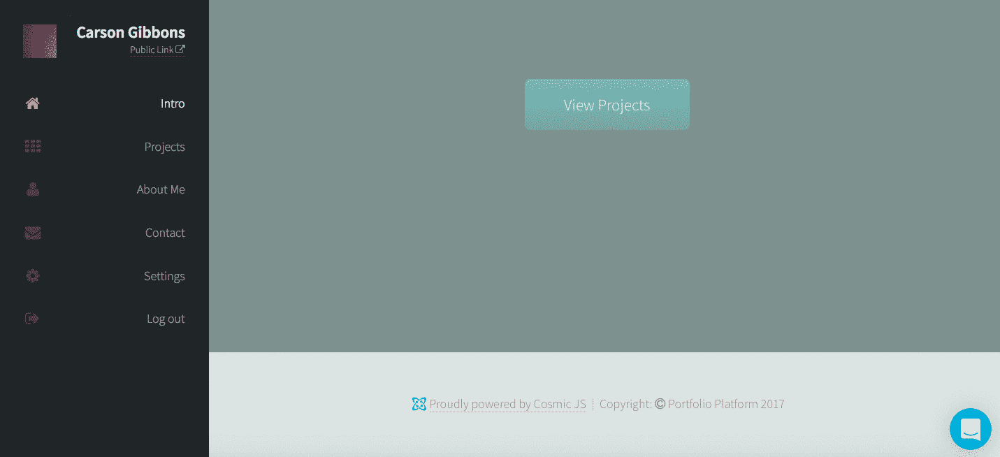
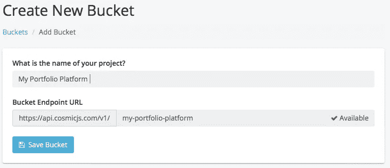
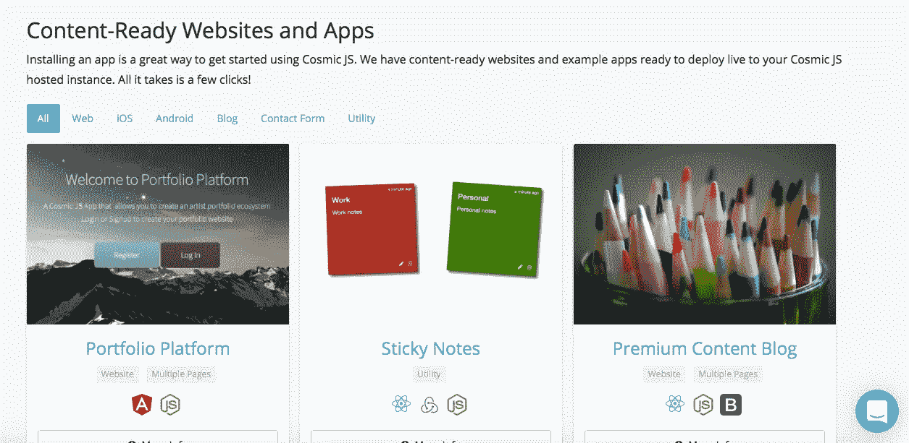
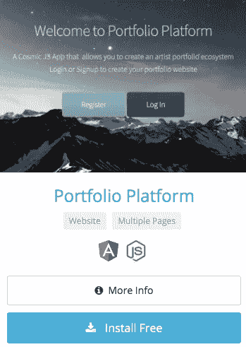
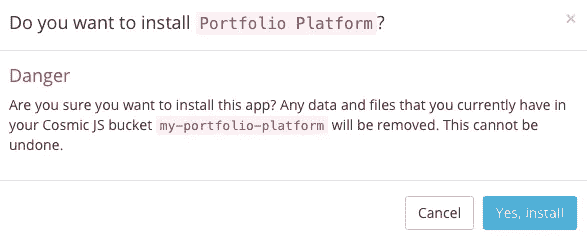
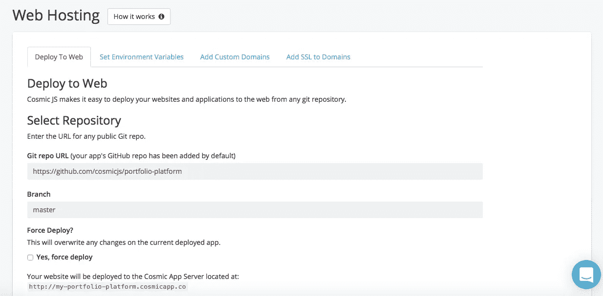
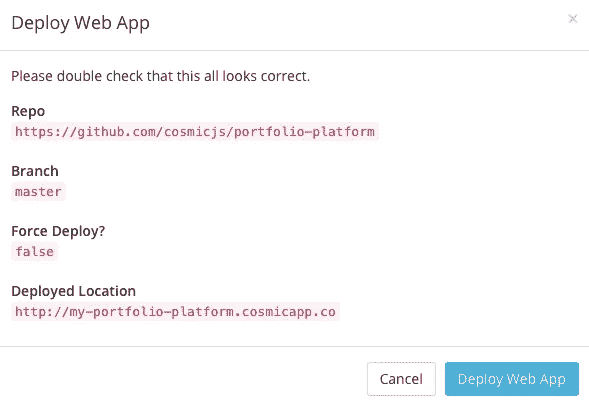

# 使用 Cosmic JS 分 3 步部署投资组合平台应用程序

> 原文：<https://medium.com/hackernoon/deploy-a-portfolio-platform-app-in-3-steps-using-cosmic-js-3f664f5bb82c>

在这篇博客中，我将向你展示如何安装和部署一个平台来管理多个组合网站。用户可以登录并管理他们的投资组合网站。管理员可以从 Cosmic JS 仪表板管理多个用户。该应用建立在 AngularJS 和 Node.js 之上，其内容由 [Cosmic JS CMS API](https://cosmicjs.com/) 提供支持。查看[如何使用 AngularJS](https://cosmicjs.com/blog/how-to-build-a-portfolio-platform-app-using-angularjs) 构建投资组合平台应用。请继续阅读，只需 3 个步骤即可部署投资组合平台应用。

[Cosmic JS](https://cosmicjs.com/) 是一个 API 优先的 CMS，使得管理和构建网站和应用程序更快更直观。通过将内容从代码中分离出来，Cosmic JS 增强了开发人员的灵活性，同时确保内容编辑人员能够以最适合他们的方式规划和部署内容。我们将使用 Cosmic JS 来安装我们的示例应用程序，部署和更新基于云的内容管理平台的内容。

> [如何使用 AngularJS](https://cosmicjs.com/blog/how-to-build-a-portfolio-platform-app-using-angularjs)
> [投资组合平台 App 页面](https://cosmicjs.com/apps/portfolio-platform)
> [投资组合平台 App 演示](https://cosmicjs.com/apps/portfolio-platform/demo)
> [GitHub 上的投资组合平台 App 代码库](https://github.com/cosmicjs/portfolio-platform)

# 1.创建新的存储桶

# 2.安装投资组合平台应用程序

注册并命名您的存储桶后，系统会提示您从头开始或安装应用程序。对于这个博客，我只需点击应用程序按钮，开始投资组合平台应用程序的安装过程。

Cosmic JS 让你能够在 Node.js、PHP、React、AngularJS 等编程语言之间进行筛选。

# 3.部署到 Web

我点击了“部署到 Web”。然后，我可以在部署 web 应用程序时编辑对象。您将收到一封电子邮件，确认您的 web 应用程序的部署。如果您在部署过程中遇到任何问题，您可能会被转到 [Cosmic JS 故障排除页面](https://cosmicjs.com/troubleshooting)。

# 确认部署位置和分支

现在，您的应用程序已部署到 Cosmic JS，您可以从一个位置完全管理您的投资组合平台应用程序及其所有内容。

[Cosmic JS](https://cosmicjs.com/) 是一个 API 首创的基于云的内容管理平台，可以轻松管理应用和内容。如果你对 Cosmic JS API 有任何疑问，请通过 [Twitter](https://twitter.com/cosmic_js) 或 [Slack](https://cosmicjs.com/community) 联系创始人。

[卡森·吉本斯](https://twitter.com/carsoncgibbons)是 [Cosmic JS](https://cosmicjs.com/) 的联合创始人& CMO，这是一个 API 第一的基于云的[内容管理平台](https://cosmicjs.com/)，它将内容从代码中分离出来，允许开发人员用他们想要的任何编程语言构建流畅的应用程序和网站。