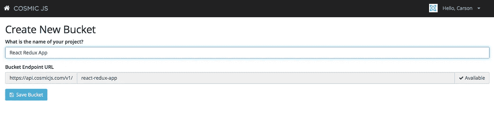
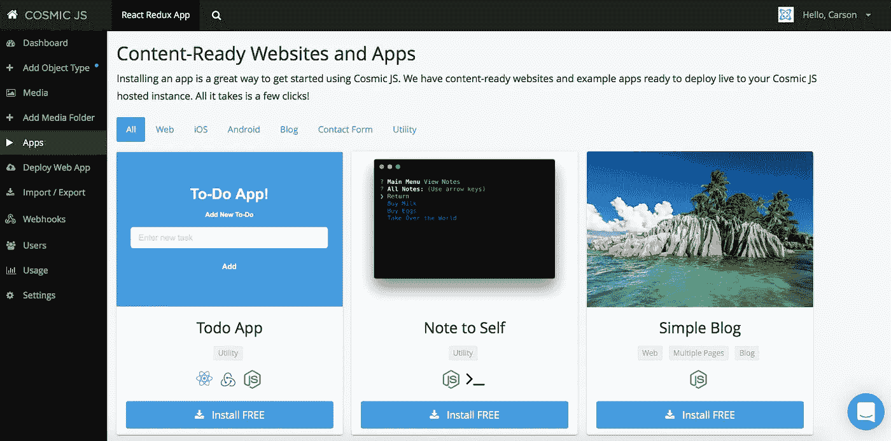
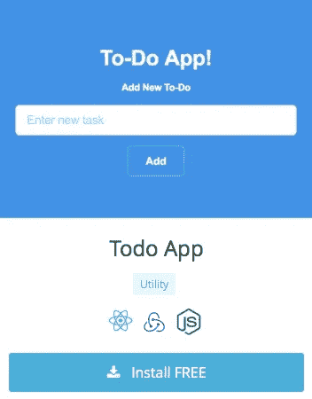
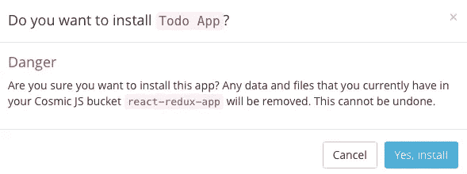
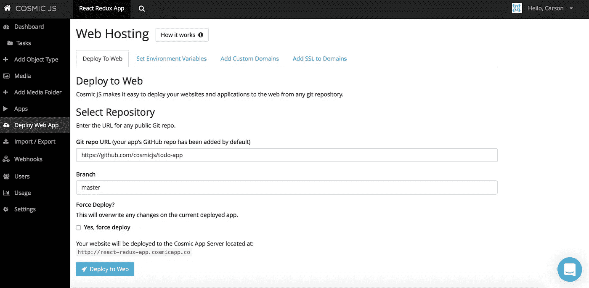
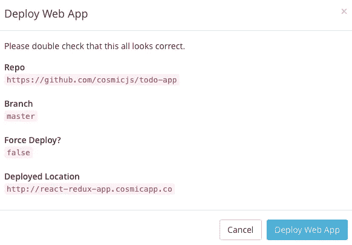

# 通过 3 个简单的步骤在 Cosmic JS 上部署 React 应用程序

> 原文：<https://medium.com/hackernoon/deploy-a-react-app-on-cosmic-js-in-3-easy-steps-d73b1da3556>

在这篇博客中，我将演示如何在 Cosmic JS 上安装和部署 React | Redux | Node.js 应用程序。该应用程序是一个简单的 ToDo 应用程序，使用 Cosmic JS CMS API。

在这个部署过程中，我将使用 [Cosmic JS](https://cosmicjs.com/) 。Cosmic JS 是一个 [API 优先的 CMS](https://cosmicjs.com/) ，它使得管理和构建网站和应用程序更加快速和直观。通过将内容与代码分离， [Cosmic JS](https://cosmicjs.com/) 赋予开发者灵活性，同时确保内容编辑能够以最适合他们的方式规划和部署内容。Cosmic JS 允许开发人员使用他们喜欢的工具，如 Node.js、GitHub、Docker 等等。

从[报名](https://cosmicjs.com/signup)参加[宇宙 JS](https://cosmicjs.com/) 开始。下面提供了有用的资源。

> [如何使用 React、Redux 和 Webpack 构建 ToDo App](https://cosmicjs.com/blog/how-to-build-a-todo-app-using-react-redux-and-webpack)
> [React App](https://cosmicjs.com/apps/todo-app)
> [React App Demo](https://cosmicjs.com/apps/todo-app/demo)
> [React App code base on GitHub](https://github.com/cosmicjs/todo-app)

# 1.创建新的存储桶

# 2.安装 React | Redux 应用程序

[Cosmic JS](https://cosmicjs.com/) 给你在实用程序和编程语言之间过滤的能力。

# 3.部署到 Web

您将收到一封电子邮件，确认您的 web 应用程序的部署。如果您在部署过程中遇到任何问题，您可能会被转到 [Cosmic JS 故障排除页面](https://cosmicjs.com/troubleshooting)。

# 确认部署位置和分支

# 部署分支机构确认模式

编辑是在宇宙 JS 仪表盘中实现的梦想。要了解更多关于如何在考虑编辑内容的情况下构建 [Cosmic JS](https://cosmicjs.com/) 的信息，请阅读[在考虑内容编辑器的情况下构建](https://cosmicjs.com/blog/building-with-the-content-editor-in-mind)。

就像注册、创建新的存储桶、安装 web 应用程序、编辑对象和部署一样简单！我收到了访问我的 web 应用程序的确认电子邮件，还看到了我的桶升级选项，如[自定义域、一键式 SSL、webhooks 和本地化](https://cosmicjs.com/features)。

[Cosmic JS](https://cosmicjs.com/) 是一个 API 第一的基于云的内容管理平台，使管理应用程序和内容变得容易。如果你对 Cosmic JS API 有任何疑问，请通过 [Twitter](https://twitter.com/cosmic_js) 或 [Slack](https://cosmicjs.com/community) 联系创始人。

[卡森·吉本斯](https://twitter.com/carsoncgibbons)是 [Cosmic JS](https://cosmicjs.com/) 的联合创始人& CMO，这是一个 API 第一的基于云的[内容管理平台](https://cosmicjs.com/)，它将内容与代码分离，允许开发人员用他们想要的任何编程语言构建流畅的应用程序和网站。

> [黑客中午](http://bit.ly/Hackernoon)是黑客如何开始他们的下午。我们是阿妹家庭的一员。我们现在[接受投稿](http://bit.ly/hackernoonsubmission)并乐意[讨论广告&赞助](mailto:partners@amipublications.com)的机会。
> 
> 如果你喜欢这个故事，我们推荐你阅读我们的[最新科技故事](http://bit.ly/hackernoonlatestt)和[趋势科技故事](https://hackernoon.com/trending)。直到下一次，不要把世界的现实想当然！

