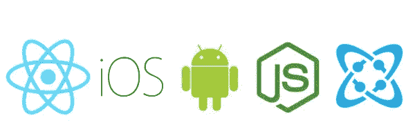
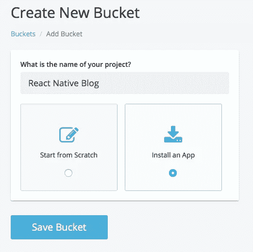
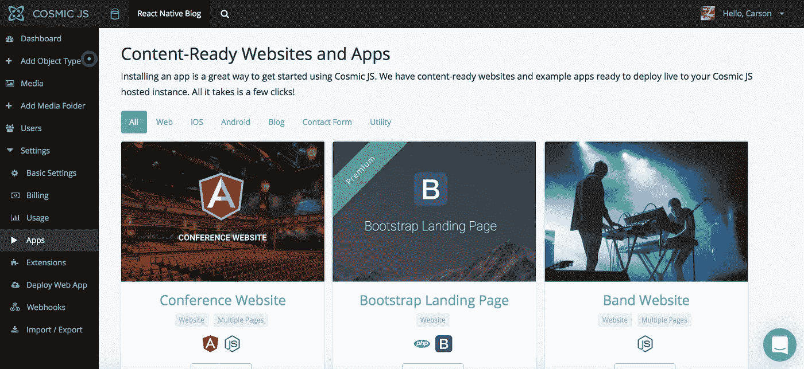
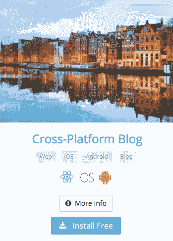
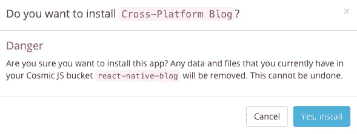
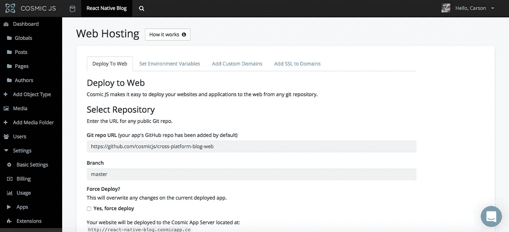
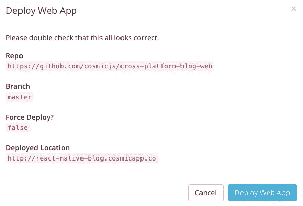

# 分三步部署 React 原生跨平台博客

> 原文：<https://medium.com/hackernoon/deploy-a-react-native-cross-platform-blog-in-3-steps-4aa518cab90e>

在这篇博客中，我将分三步演示如何部署一个跨平台的博客。这款应用集三个应用于一身:Web、iOS 和 Android 应用，所有内容都由 [Cosmic JS](https://cosmicjs.com/) 提供支持。前往 [GitHub repo](https://github.com/cosmicjs/cross-platform-blog) 查看 iOS 和 Android 应用如何共享相同的 React 原生代码库，从而将开发时间缩短一半。web 版本运行在 light Node.js 服务器上。从你的宇宙 JS 桶仪表板安装和管理你的博客内容。简单。😎

# TL；速度三角形定位法(dead reckoning)

如果你想了解这个应用是如何从零开始构建的，你可以参考下面的原始教程，或者继续阅读简单地通过 3 个简单的步骤部署 React Native 跨平台博客。

1.  原生 iOS 和 Android 应用共享相同的 React 原生代码库。学一次，随处写。
2.  Web 完全响应移动 w/ [Bootstrap](http://getbootstrap.com/) 前端。
3.  通过 Cosmic JS 提供的 [Imgix](https://www.imgix.com/) 集成，可以针对不同的设备/浏览器需求轻松处理图像。

 [## 如何使用 React Native 和 Node.js 构建跨平台博客

### 托尼·斯皮罗是 Cosmic JS 的联合创始人，这是一个 API 优先的内容管理平台，用于构建内容驱动的应用程序。

medium.com](/cosmicjs/how-to-build-a-cross-platform-blog-using-react-native-and-node-js-c57fceeeeb44) 

我们将使用 [Cosmic JS](https://cosmicjs.com/) 来安装我们的示例应用程序，部署并进行内容更新。

如果你还没有，那就从[注册](https://cosmicjs.com/signup)宇宙 JS 开始吧。下面提供了有用的资源来简化您的开发操作。

 [## 跨平台博客|宇宙 JS 应用

### 这款应用集三个应用于一身:Web、iOS 和 Android 应用，所有内容都由 Cosmic JS 提供。转到 GitHub repo 以…

cosmicjs.com](https://cosmicjs.com/apps/cross-platform-blog)  [## cosmicjs/跨平台-博客

### 跨平台-博客 iOS、Android 和 web 的跨平台博客。由 Cosmic JS 提供支持的内容。

github.com](https://github.com/cosmicjs/cross-platform-blog) 

# 1.创建新的存储桶

您的 bucket 的名称是您正在构建的网站、项目、客户端或 web 应用程序的名称。

# 2.安装 React 本机跨平台博客

[Cosmic JS](https://cosmicjs.com/) 让你能够在 Node.js、Vue.js、React、AngularJS 等编程语言之间进行筛选。

# 3.部署到 Web

我点击了“部署到 Web”。然后，我可以在部署 web 应用程序时编辑对象。您将收到一封电子邮件，确认您的 web 应用程序的部署。如果您在部署过程中遇到任何问题，您可能会被转到 [Cosmic JS 故障排除页面](https://cosmicjs.com/troubleshooting)。

# 确认部署位置和分支

# 部署分支机构确认模式

现在你的应用已经部署到了 Cosmic JS 应用服务器上，你可以自由地从一个地方完全管理你的跨平台博客及其所有内容。

[Cosmic JS](https://cosmicjs.com/) 是一个 API 第一的基于云的内容管理平台，使管理应用程序和内容变得容易。如果你对 Cosmic JS API 有任何疑问，请通过 [Twitter](https://twitter.com/cosmic_js) 或 [Slack](https://cosmicjs.com/community) 联系创始人。

[卡森·吉本斯](https://twitter.com/carsoncgibbons)是[宇宙 JS](https://cosmicjs.com/) 的联合创始人& CMO，宇宙 JS 是一个 API 第一的基于云的[内容管理平台](https://cosmicjs.com/)，它将内容与代码分离，允许开发人员用他们想要的任何编程语言构建流畅的应用程序和网站。