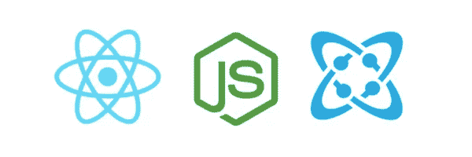
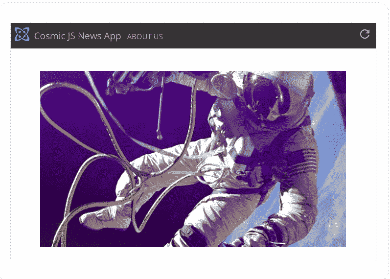
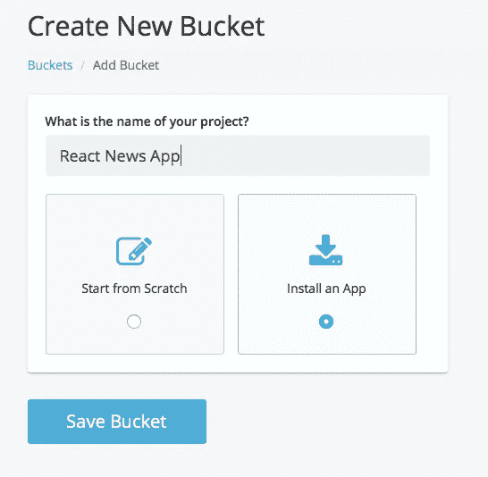
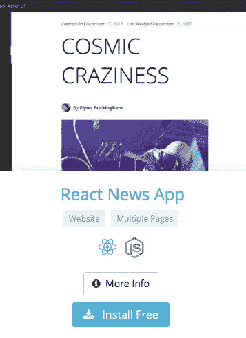
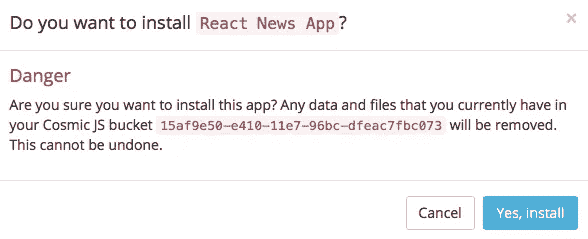
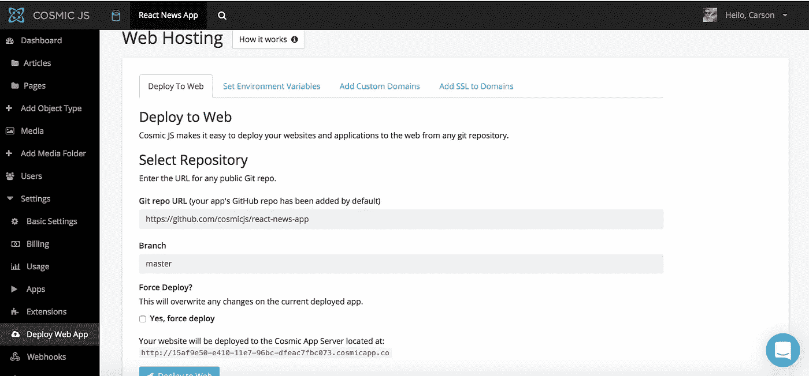
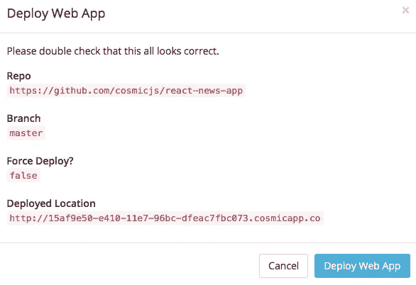

# 分三步部署 React 新闻应用

> 原文：<https://medium.com/hackernoon/deploy-a-react-news-app-in-3-steps-ec2369706db3>

在这篇博客中，我将分三步演示如何部署一个 [React 新闻应用](https://cosmicjs.com/apps/react-news-app)。这是一个最小的新闻博客样板，由 React 和[宇宙 API](https://cosmicjs.com) 提供支持。页面和文章被远程存储，并根据需要显示在博客上。从你的 [Cosmic JS](https://cosmicjs.com) Bucket Dashboard 安装并管理你的 [React 新闻博客应用](https://cosmicjs.com/apps/react-news-app)。简单。😎可以参考下面的[原创教程](https://cosmicjs.com/articles/building-your-own-news-blog-with-cosmic-js-react-jba337s5)从头构建 app，也可以继续阅读简单 3 步部署 [React 新闻博客](https://cosmicjs.com/apps/react-news-app)。

# TL；速度三角形定位法(dead reckoning)

[React 新闻 App](https://cosmicjs.com/apps/react-news-app)
[React 新闻 App 演示](https://cosmicjs.com/apps/react-news-app/demo)
[React 新闻 App 代码库](https://github.com/cosmicjs/react-news-app)
[用宇宙 JS + React 构建自己的新闻博客](https://cosmicjs.com/articles/building-your-own-news-blog-with-cosmic-js-react-jba337s5)

我们将使用 [Cosmic JS](https://cosmicjs.com/) 来安装我们的示例应用程序，部署并进行内容更新。 [Cosmic JS](https://cosmicjs.com) 是一个 API 优先的内容管理平台，允许开发人员以任何编程语言构建应用程序，同时为内容编辑人员提供一个熟悉的内容编辑器来管理来自云的动态内容。如果你还没有，那就从[注册](https://cosmicjs.com/signup)Cosmic JS 开始吧。

# 1.创建新的存储桶

您的 bucket 的名称是您正在构建的网站、项目、客户端或 web 应用程序的名称。

# 2.安装 React 新闻博客

[Cosmic JS](https://cosmicjs.com/) 让你能够在 Node.js、Vue.js、React、AngularJS 等编程语言之间进行筛选。

# 3.部署到 Web

我点击了“部署到 Web”。然后，我可以在部署 web 应用程序时编辑对象。您将收到一封电子邮件，确认您的 web 应用程序的部署。如果您在部署过程中遇到任何问题，您可能会被转到 [Cosmic JS 故障排除页面](https://cosmicjs.com/troubleshooting)。

# 确认部署位置和分支

# 部署分支机构确认模式

现在你的应用已经部署到了 [Cosmic JS](https://cosmicjs.com) 应用服务器上，你可以自由地从一个地方完全管理你的 [React 新闻博客](https://cosmicjs.com/apps/react-news-app)及其所有内容。

[Cosmic JS](https://cosmicjs.com/) 是一个 API 首创的基于云的内容管理平台，可以轻松管理应用和内容。如果你有关于 Cosmic JS API 的问题，请在 [Twitter](https://twitter.com/cosmic_js) 或 [Slack](https://cosmicjs.com/community) 上联系创始人。

[卡森·吉本斯](https://twitter.com/carsoncgibbons)是[宇宙 JS](https://cosmicjs.com/) 的联合创始人& CMO，宇宙 JS 是一个 API 第一的基于云的[内容管理平台](https://cosmicjs.com/)，它将内容从代码中分离出来，允许开发人员用他们想要的任何编程语言构建流畅的应用程序和网站。