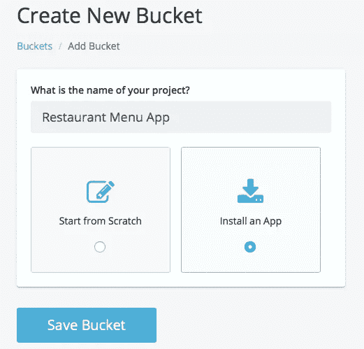
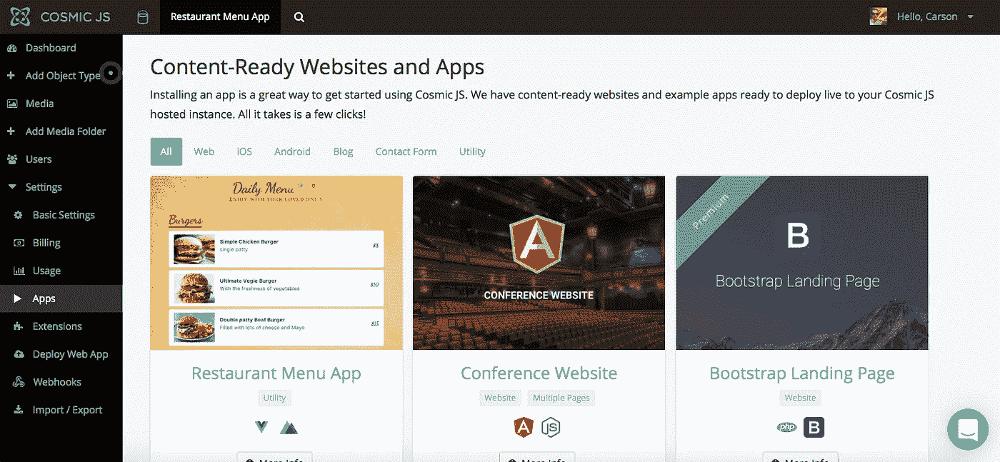
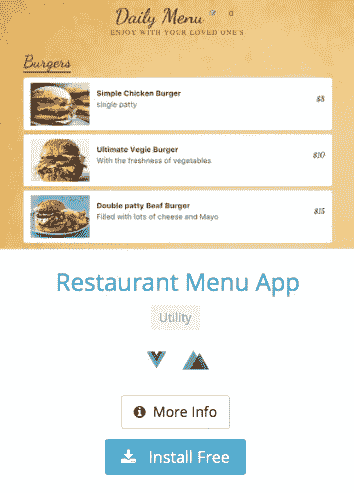
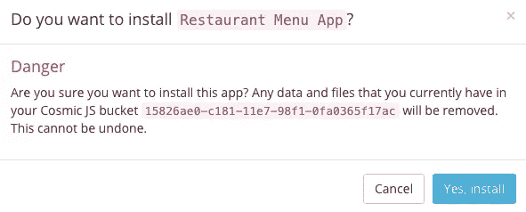
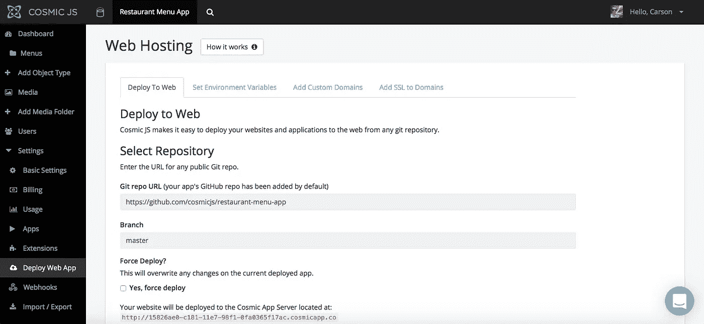
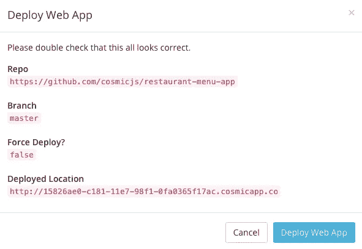

# 分 3 步部署餐厅菜单应用

> 原文：<https://medium.com/hackernoon/deploy-a-restaurant-menu-app-in-3-steps-ca7dd7d6771f>

在这篇博客中，我将分三步演示如何部署一个[餐馆菜单应用程序](https://cosmicjs.com/apps/restaurant-menu-app)。这个餐厅菜单应用程序是使用 Nuxt、Vue.js 和 Vuex 构建的，内容由[宇宙 JS](https://cosmicjs.com/) 提供。它连接到 Cosmic JS API 来添加/编辑/删除菜单、菜单项及其附加媒体。安装和管理您自己的餐厅菜单应用程序，并从您的 Cosmic JS Bucket 仪表盘管理其内容。简单。😎你可以参考下面的[原创教程](https://cosmicjs.com/articles/how-to-build-a-restaurant-menu-app-in-nuxt-vuex-using-cosmic-js)从头构建 app，或者继续阅读简单 3 步部署餐厅菜单 App。

# TL；速度三角形定位法(dead reckoning)

 [## cosmicjs/餐厅-菜单-应用程序

### 这是一个使用 Nuxt，Vue，Vuex 构建的餐厅菜单应用程序，由 Cosmic JS 提供支持。它连接到…

github.com](https://github.com/cosmicjs/restaurant-menu-app)  [## 如何使用 Cosmic JS 在 Nuxt & Vuex 中构建餐厅菜单 App

### 在本教程中，我将向您展示如何使用 Vue2、Vuex、Buefy 和 Cosmic JS 创建一个餐厅菜单应用程序。它…

hackernoon.com](https://hackernoon.com/how-to-build-a-restaurant-menu-app-in-nuxt-vuex-using-cosmic-js-a311fb877907) 

我们将使用 [Cosmic JS](https://cosmicjs.com/) 来安装我们的示例应用程序，部署并进行内容更新。Cosmic JS 是一个 API 优先的内容管理平台，允许开发人员以任何编程语言构建应用程序，同时为内容编辑器提供一个熟悉的内容编辑器来管理来自云的动态内容。

如果你还没有，那就从[注册](https://cosmicjs.com/signup)参加宇宙 JS 开始吧。

# 1.创建新的存储桶

您的 bucket 的名称是您正在构建的网站、项目、客户端或 web 应用程序的名称。

# 2.安装餐厅菜单应用程序

[Cosmic JS](https://cosmicjs.com/) 让你能够在 Node.js、Vue.js、React、AngularJS 等编程语言之间进行筛选。

# 3.部署到 Web

我点击了“部署到 Web”。然后，我可以在部署 web 应用程序时编辑对象。您将收到一封电子邮件，确认您的 web 应用程序的部署。如果您在部署过程中遇到任何问题，您可能会被转到 [Cosmic JS 故障排除页面](https://cosmicjs.com/troubleshooting)。

# 确认部署位置和分支

# 部署分支机构确认模式

现在您的应用程序已经部署到了 Cosmic JS 应用程序服务器，您可以从一个位置自由地完全管理您的餐厅菜单应用程序及其所有内容。

[卡森·吉本斯](https://twitter.com/carsoncgibbons)是[宇宙 JS](https://cosmicjs.com/) 的联合创始人& CMO，宇宙 JS 是一个 API 第一的基于云的[内容管理平台](https://cosmicjs.com/)，它将内容从代码中分离出来，允许开发人员用他们想要的任何编程语言构建流畅的应用程序和网站。在推特上关注我。