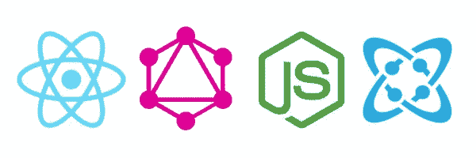
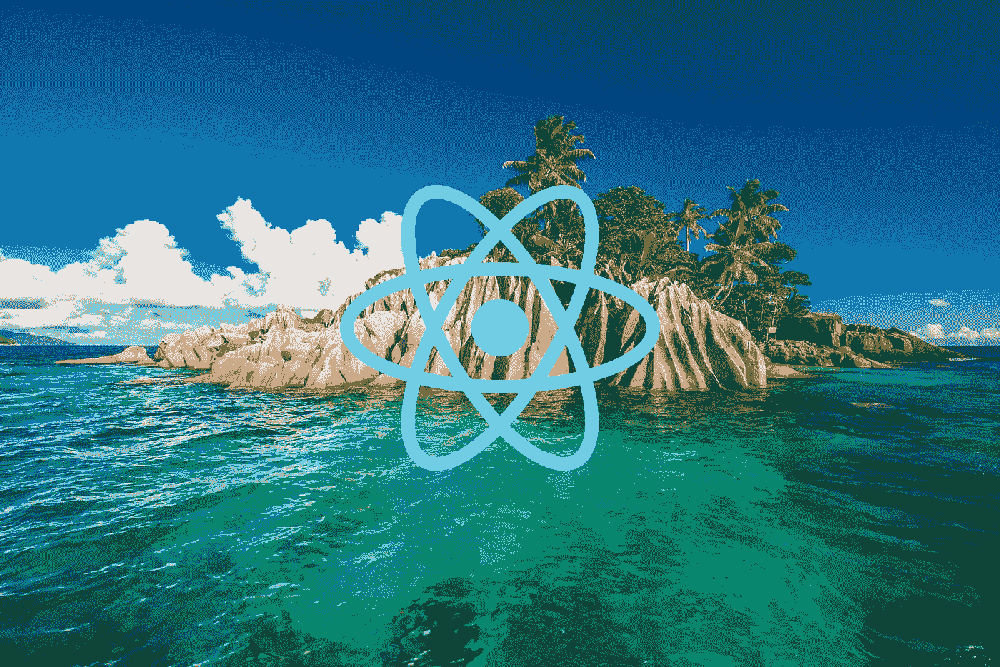
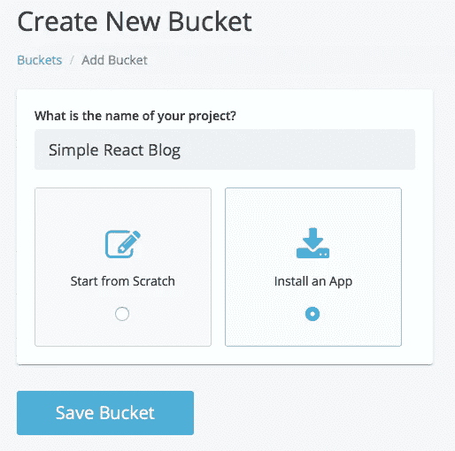
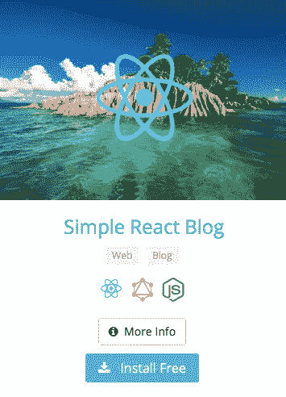
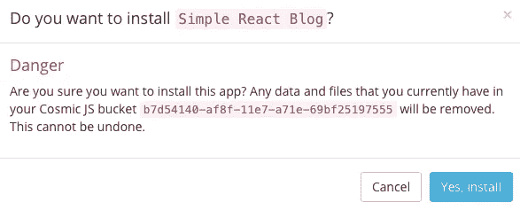
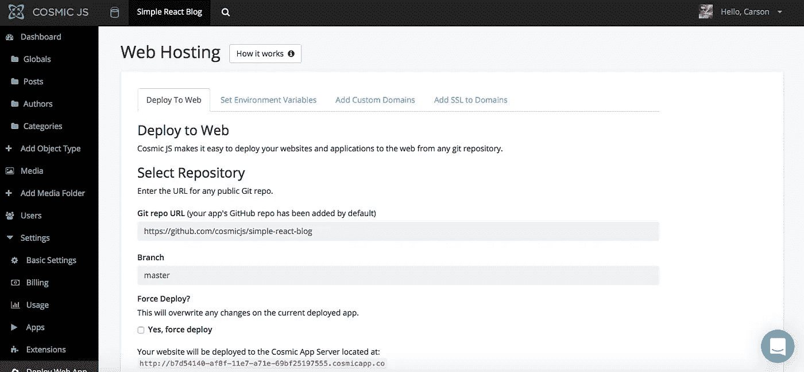
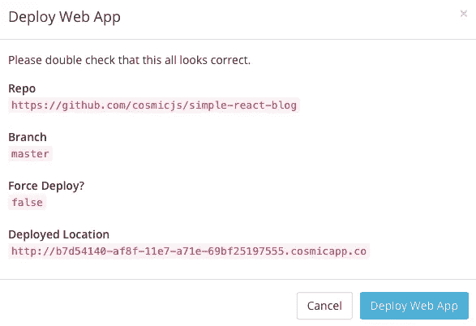

# 分三步部署一个简单的 React 博客

> 原文：<https://medium.com/hackernoon/deploy-a-simple-react-blog-in-3-steps-71adfd28763b>

在这篇博客中，我将分三步演示如何部署一个简单的 React 博客。这个博客是使用 React、Next.js 和 GraphQL 创建的一个通用 React 网站。它通过 GraphQL 连接到 Cosmic JS API。从你的宇宙 JS 桶仪表板安装和管理你的博客内容。简单。😎如果你想了解这个应用是如何从零开始构建的，你可以参考下面的原始教程，或者继续阅读，只需简单地用 3 个简单的步骤部署 React 博客。

 [## 如何使用 React 和 GraphQL | Cosmic JS 构建一个简单的博客

### Cosmic JS 是一个云托管的内容平台，提供了一个灵活而直观的 CMS API。建立网站和…

cosmicjs.com](https://cosmicjs.com/articles/how-to-build-a-simple-blog-using-react-and-graphql-j8ouwjvh) 

在这个示例博客中，我将使用 [Cosmic JS](https://cosmicjs.com/) 。Cosmic JS 是一个 [API 优先的 CMS](https://cosmicjs.com/) ，它使得管理和构建网站和应用程序更加快速和直观。通过将内容与代码分离， [Cosmic JS](https://cosmicjs.com/) 赋予开发者灵活性，同时确保内容编辑能够以最适合他们的方式规划和部署内容。Cosmic JS 允许开发人员使用他们喜欢的工具，如 Node.js、GitHub、Docker 等等。我们将使用 [Cosmic JS](https://cosmicjs.com/) 来安装我们的示例应用程序，部署和更新来自[基于云的内容管理平台](https://cosmicjs.com/)的内容。

如果你还没有，那就从[注册](https://cosmicjs.com/signup)参加[宇宙 JS](https://cosmicjs.com/) 开始吧。下面提供了有用的资源来简化您的开发操作。

 [## 简单反应博客|宇宙 JS 应用程序演示

### Cosmic JS 是一个云托管的内容平台，提供了一个灵活而直观的 CMS API。建立网站和…

cosmicjs.com](https://cosmicjs.com/apps/simple-react-blog/demo)  [## cosmicjs/simple-react-blog

### 一个简单的博客网站，由 Next.js 和 Cosmic JS GraphQL API 提供支持

github.com](https://github.com/cosmicjs/simple-react-blog) 

# 1.创建新的存储桶

您的 bucket 的名称是您正在构建的网站、项目、客户端或 web 应用程序的名称。

# 2.安装简单的 React 博客

[Cosmic JS](https://cosmicjs.com/) 让你能够在 Node.js、Vue.js、React、AngularJS 等编程语言之间进行筛选。

# 3.部署到 Web

我点击了“部署到 Web”。然后，我可以在部署 web 应用程序时编辑对象。您将收到一封电子邮件，确认您的 web 应用程序的部署。如果您在部署过程中遇到任何问题，您可能会被转到 [Cosmic JS 故障排除页面](https://cosmicjs.com/troubleshooting)。

# 确认部署位置和分支

# 部署分支机构确认模式

现在您的应用程序已经部署到了 Cosmic JS 应用程序服务器，您可以从一个地方自由地完全管理您的 Simple React 博客及其所有内容。

[Cosmic JS](https://cosmicjs.com/) 是一个 API 第一的基于云的内容管理平台，使管理应用程序和内容变得容易。如果你对 Cosmic JS API 有任何疑问，请通过 [Twitter](https://twitter.com/cosmic_js) 或 [Slack](https://cosmicjs.com/community) 联系创始人。

## 附加阅读