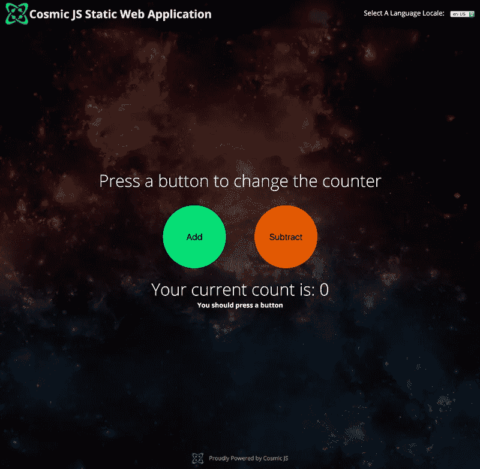
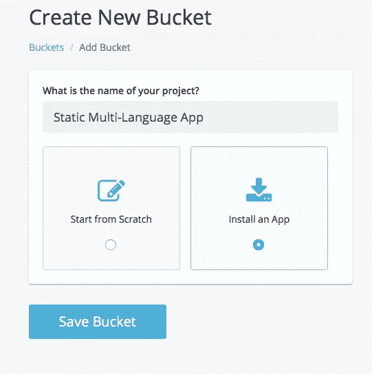
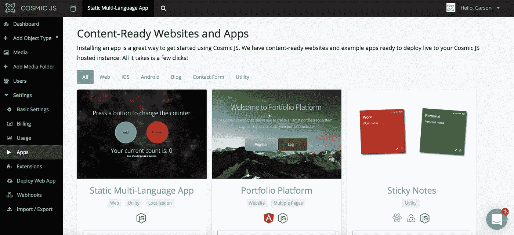
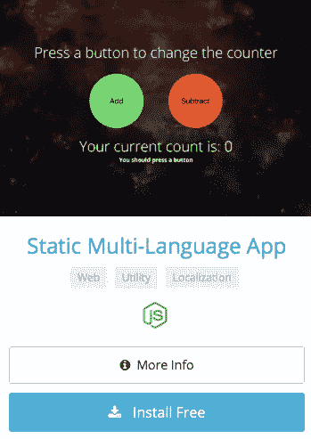
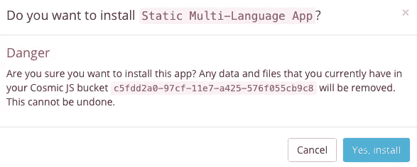
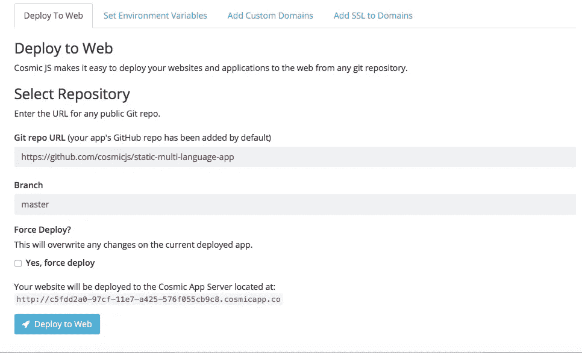
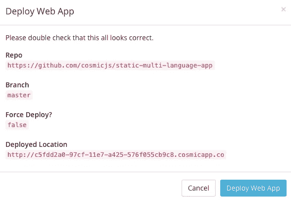

# 分 3 步部署静态 Node.js 多语言应用程序

> 原文：<https://medium.com/hackernoon/deploy-a-static-node-js-multi-language-app-in-3-steps-f57456f1bbb6>

在这篇博客中，我将向您展示如何安装和部署基于 Node.js 构建的静态多语言应用程序。这个轻量级应用程序允许您轻松管理不同语言的内容。内容在构建时存储在 JS 文件中，以最大限度地减少 API 的使用。该应用的内容由 [Cosmic JS CMS API](https://cosmicjs.com/) 提供支持。查看[如何建立多语言静态网站](https://cosmicjs.com/blog/how-to-build-a-multi-language-static-website-without-ajax)。请继续阅读，只需 3 个步骤即可部署静态多语言应用程序。

[Cosmic JS](https://cosmicjs.com/) 是一个 API 优先的 CMS，让管理和构建网站和应用程序变得更快更直观。通过将内容从代码中分离出来，Cosmic JS 增强了开发人员的灵活性，同时确保内容编辑人员能够以最适合他们的方式规划和部署内容。我们将使用 Cosmic JS 来安装我们的示例应用程序，部署和更新基于云的内容管理平台的内容。

> [如何搭建多语言静态网站](https://cosmicjs.com/blog/how-to-build-a-multi-language-static-website-without-ajax)
> [静态多语言 App 页面](https://cosmicjs.com/apps/static-multi-language-app)
> [静态多语言 App 演示](https://cosmicjs.com/apps/static-multi-language-app/demo)
> [GitHub 上的静态多语言 App 代码库](https://github.com/cosmicjs/static-multi-language-app)

# 1.创建新的存储桶

# 2.安装静态多语言应用程序

注册并命名您的存储桶后，系统会提示您从头开始或安装应用程序。在这篇博客中，我简单地点击了应用程序按钮，开始安装静态多语言应用程序。

Cosmic JS 让你能够在 Node.js、PHP、React、AngularJS 等编程语言之间进行筛选。

# 3.部署到 Web

我点击了“部署到 Web”。然后，我可以在部署 web 应用程序时编辑对象。您将收到一封电子邮件，确认您的 web 应用程序的部署。如果您在部署过程中遇到任何问题，您可能会被转到 [Cosmic JS 故障排除页面](https://cosmicjs.com/troubleshooting)。

# 确认部署位置和分支

现在你的应用程序已经部署到了 Cosmic JS，你可以从一个地方完全管理你的静态多语言应用程序及其所有内容。

[Cosmic JS](https://cosmicjs.com/) 是一个 API 首创的基于云的内容管理平台，可以轻松管理应用和内容。如果你对 Cosmic JS API 有任何疑问，请通过 [Twitter](https://twitter.com/cosmic_js) 或 [Slack](https://cosmicjs.com/community) 联系创始人。

[卡森·吉本斯](https://twitter.com/carsoncgibbons)是 [Cosmic JS](https://cosmicjs.com/) 的联合创始人& CMO，这是一个 API 第一的基于云的[内容管理平台](https://cosmicjs.com/)，它将内容从代码中分离出来，允许开发人员用他们想要的任何编程语言构建流畅的应用程序和网站。