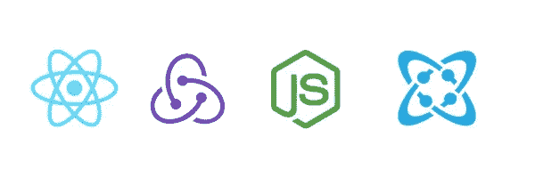
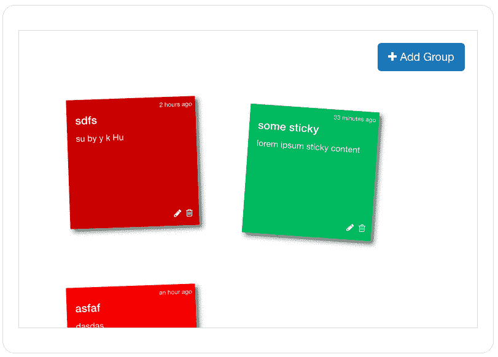
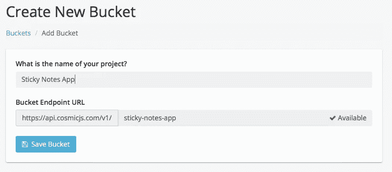
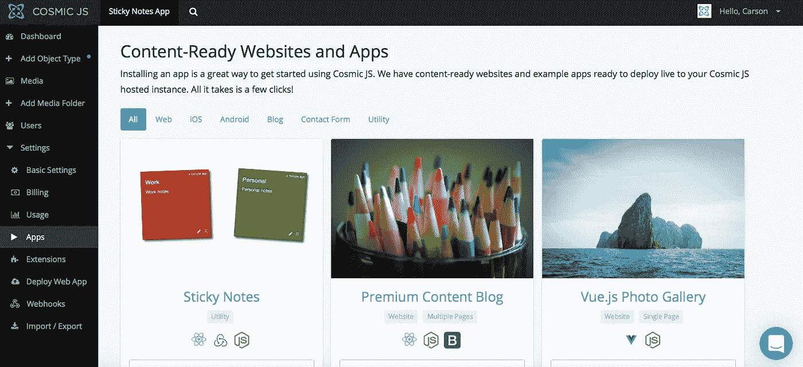
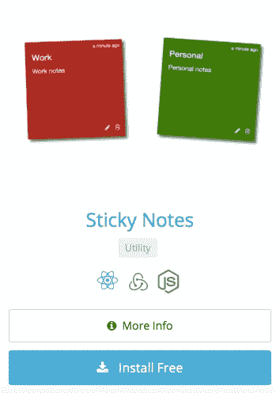
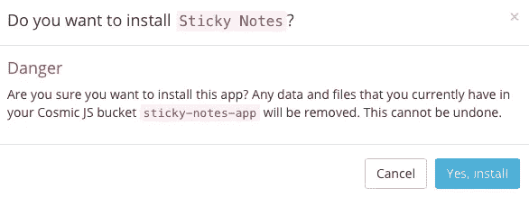
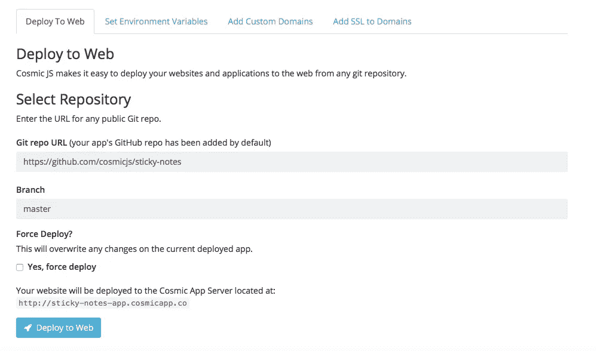
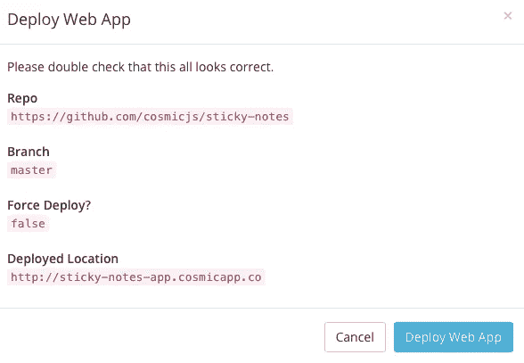

# 部署基于 React | Redux | Node.js 构建的便笺应用程序

> 原文：<https://medium.com/hackernoon/deploy-a-sticky-notes-app-built-on-react-redux-node-js-cde5b9b158c9>

在 2017 年，提醒对于保持日程安排有序至关重要。传统的便利贴已经成为过去，直到现在。我们的 [Cosmic JS](https://cosmicjs.com/) 贡献者之一使用 React、Redux 和 Node.js 构建了一个便签应用，由 [Cosmic JS CMS API](https://cosmicjs.com/) 提供支持。查看[如何使用 React 和 Redux](https://cosmicjs.com/blog/how-to-build-a-sticky-notes-app-using-react-and-redux) 构建便签应用。请继续阅读，只需 3 个步骤即可部署便签应用程序。

在这篇博客中，我将演示如何安装和部署使用 React、Redux、Node.js 和 [Cosmic JS CMS API](https://cosmicjs.com/) 构建的便笺应用程序。该应用程序连接到 Cosmic JS API 来添加/编辑/删除笔记以及附加媒体。所有内容对象都在 [Cosmic JS 仪表板](https://cosmicjs.com/)中进行管理。

[Cosmic JS](https://cosmicjs.com/) 是一个 API 优先的 CMS，使得管理和构建网站和应用程序更加快速和直观。通过将内容从代码中分离出来，Cosmic JS 增强了开发人员的灵活性，同时确保内容编辑人员能够以最适合他们的方式规划和部署内容。我们将使用 Cosmic JS 来安装我们的示例应用程序，部署和更新基于云的内容管理平台的内容。

[如何使用 React 和 Redux 构建便签 App](https://cosmicjs.com/blog/how-to-build-a-sticky-notes-app-using-react-and-redux)
[便签 App 页面](https://cosmicjs.com/apps/sticky-notes)
[便签 App 演示](https://cosmicjs.com/apps/sticky-notes/demo)
[GitHub 上的便签 App 代码库](https://github.com/cosmicjs/sticky-notes)

# 1.创建新的存储桶

# 2.安装便笺应用程序

注册并命名您的存储桶后，系统会提示您从头开始或安装应用程序。对于这篇博客，我只是点击了应用程序按钮，开始安装便签应用程序。

Cosmic JS 让你能够在 Node.js、PHP、React、AngularJS 等编程语言之间进行筛选。

# 3.部署到 Web

我点击了“部署到 Web”。然后，我可以在部署 web 应用程序时编辑对象。您将收到一封电子邮件，确认您的 web 应用程序的部署。如果您在部署过程中遇到任何问题，您可能会被转到 [Cosmic JS 故障排除页面](https://cosmicjs.com/troubleshooting)。

# 确认部署位置和分支

现在你的应用程序已经部署到了 Cosmic JS，你可以从一个地方完全管理你的便笺应用程序及其所有内容。

[Cosmic JS](https://cosmicjs.com/) 是一个 API 第一的基于云的内容管理平台，使管理应用程序和内容变得容易。如果你对 Cosmic JS API 有任何疑问，请通过 [Twitter](https://twitter.com/cosmic_js) 或 [Slack](https://cosmicjs.com/community) 联系创始人。

[卡森·吉本斯](https://twitter.com/carsoncgibbons)是[宇宙 JS](https://cosmicjs.com/) 的联合创始人& CMO，宇宙 JS 是一个 API 第一的基于云的[内容管理平台](https://cosmicjs.com/)，它将内容与代码分离，允许开发人员用他们想要的任何编程语言构建流畅的应用程序和网站。