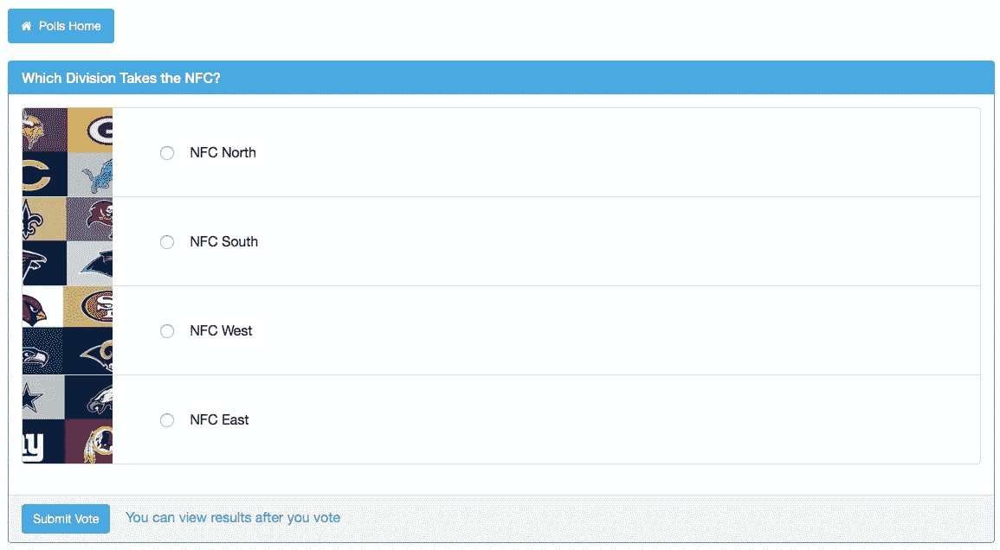
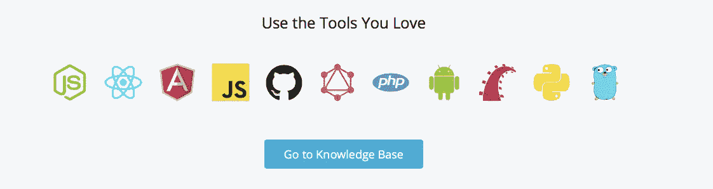
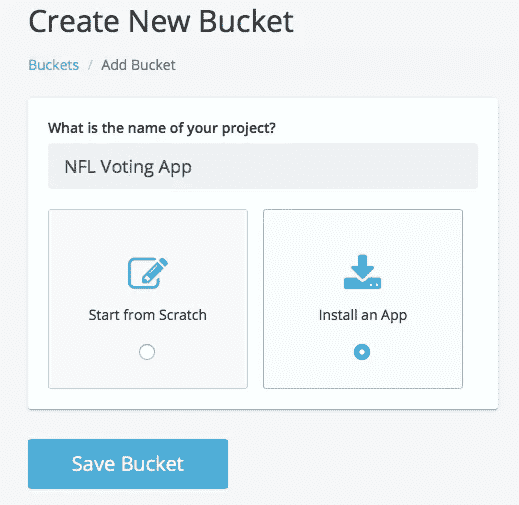
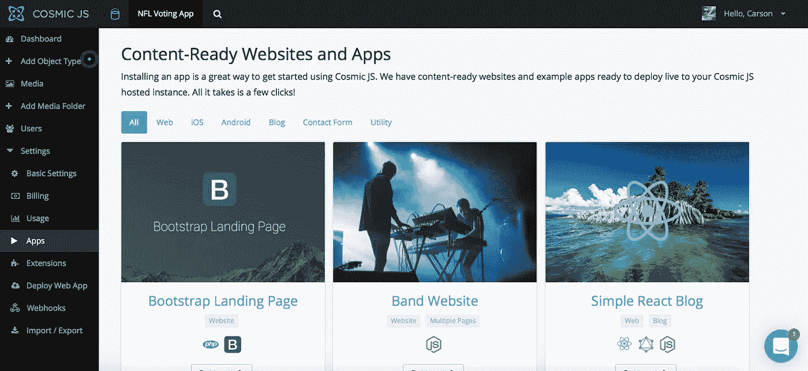
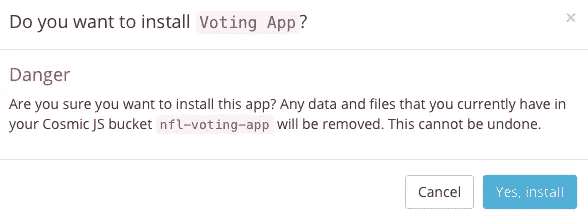
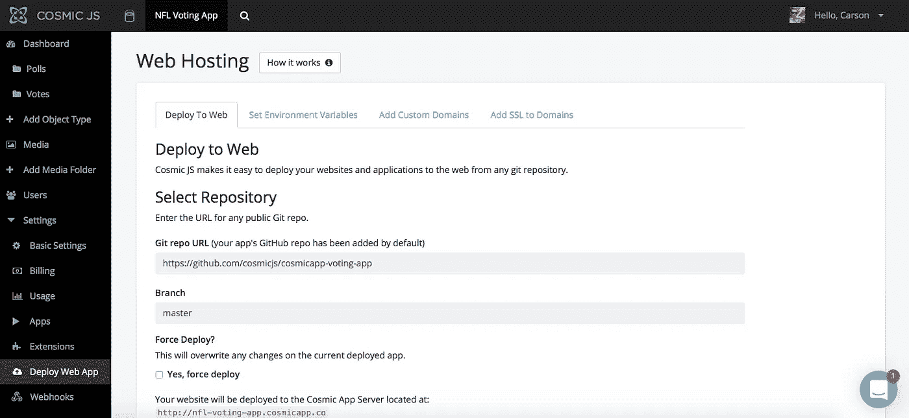
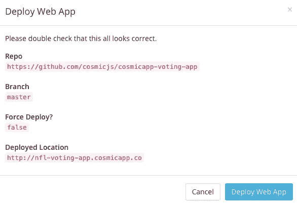
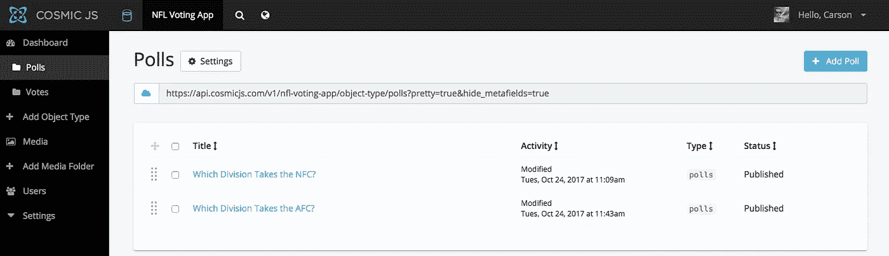

# 分 3 步部署投票应用程序

> 原文：<https://medium.com/hackernoon/deploy-a-voting-app-in-3-steps-a80c0e6c869a>

在这篇博客中，我将分三步演示如何部署一个投票应用程序。我正在部署的投票应用程序使用 [React](https://cosmicjs.com/knowledge-base/react-cms) 用于 UI，MobX 用于状态管理，React [Bootstrap](https://cosmicjs.com/knowledge-base/bootstrap-cms) 用于前端框架。添加无限的投票，上传每个选项的图像，每个投票都有自己独特的链接。我选择为 NFL 做我的调查[,但是你可以在任何你想做的事情上调查用户。](http://nfl-voting-app.cosmicapp.co)

我将使用 [Cosmic JS](https://cosmicjs.com/) 来部署这个投票应用程序。Cosmic JS 是一个 [API 优先的 CMS](https://cosmicjs.com/) ，它使得管理和构建网站和应用程序更加快速和直观。通过将内容与代码分离， [Cosmic JS](https://cosmicjs.com/) 允许开发人员用任何编程语言构建应用程序，从而赋予开发人员灵活性。内容编辑可以按照最适合自己的方式规划和部署内容。

如果你还没有，那就从[注册](https://cosmicjs.com/signup)参加[宇宙 JS](https://cosmicjs.com/) 开始吧。下面提供了有用的资源来简化您的开发操作。

 [## cosmicjs/cosmicapp-投票-应用程序

### cosmicapp-voting-app -一个使用 React、MobX 和 Cosmic JS 构建的投票应用程序

github.com](https://github.com/cosmicjs/cosmicapp-voting-app) 

# 1.创建新的存储桶

您的 bucket 的名称是您正在构建的网站、项目、客户端或 web 应用程序的名称。

# 2.安装投票应用程序

[Cosmic JS](https://cosmicjs.com/) 让你能够在 Node.js、Vue.js、React、AngularJS 等编程语言之间进行筛选。

# 3.部署到 Web

我点击了“部署到 Web”。然后，我可以在部署 web 应用程序时编辑对象。您将收到一封电子邮件，确认您的 web 应用程序的部署。如果您在部署过程中遇到任何问题，您可能会被转到 [Cosmic JS 故障排除页面](https://cosmicjs.com/troubleshooting)。

# 确认部署位置和分支

# 部署分支机构确认模式

现在你的应用已经部署到了 Cosmic JS 应用服务器上，你可以自由地从一个地方完全管理你的投票应用、它的用户和它的所有内容。

[Cosmic JS](https://cosmicjs.com/) 是一个 API 首创的基于云的内容管理平台，可以轻松管理应用和内容。如果你对 Cosmic JS API 有任何疑问，请通过 [Twitter](https://twitter.com/cosmic_js) 或 [Slack](https://cosmicjs.com/community) 联系创始人。

[卡森·吉本斯](https://twitter.com/carsoncgibbons)是 [Cosmic JS](https://cosmicjs.com/) 的联合创始人& CMO，这是一个 API 第一的基于云的[内容管理平台](https://cosmicjs.com/)，它将内容从代码中分离出来，允许开发人员用他们想要的任何编程语言构建流畅的应用程序和网站。