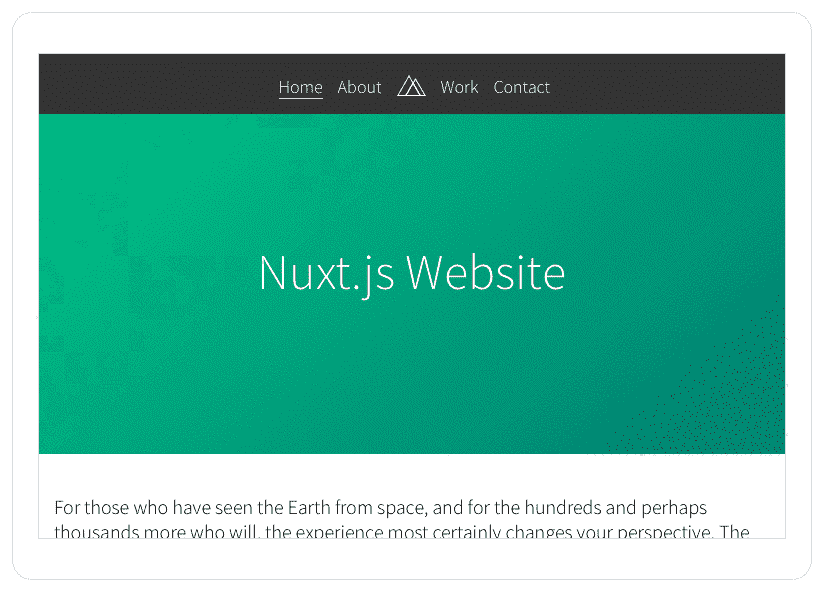
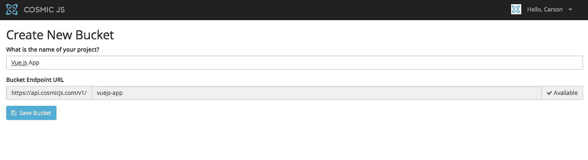
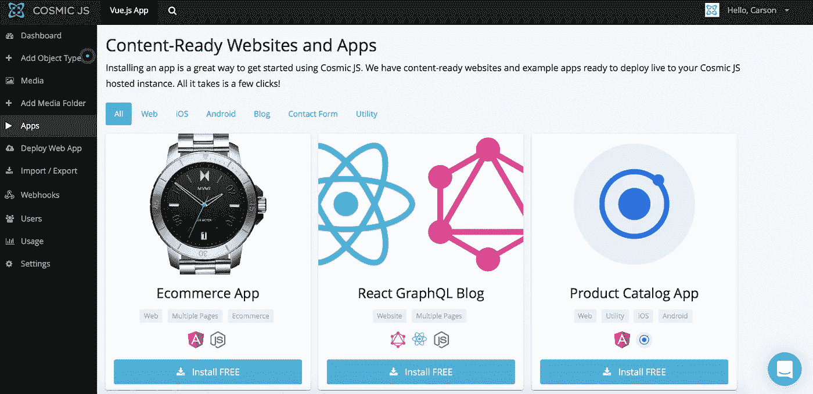
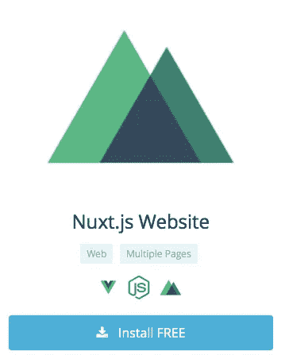
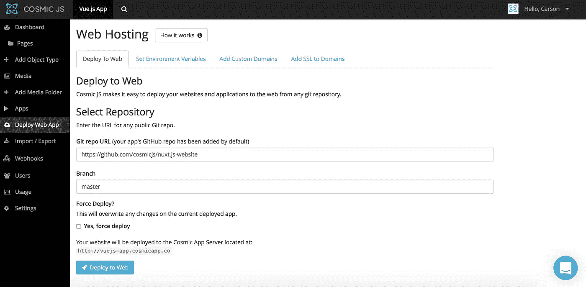

# 使用 Cosmic JS 分 3 步部署 Vue.js 应用程序

> 原文：<https://medium.com/hackernoon/deploy-a-vue-js-app-in-3-steps-using-cosmic-js-465244850e90>

与 AngularJS 类似，Vue.js 不是一个“成熟的框架”，它旨在成为一个简单灵活的视图层，适用于数据模型简单的应用程序和网站，并与应用程序的表示层更加匹配。

Vue.js App Demo

在这篇博客中，我将演示如何安装和部署一个 Vue.js 网站，该网站是使用 Nuxt.js、Node.js 和 [Cosmic JS](https://cosmicjs.com) 构建的。该应用由塞巴斯蒂安·肖邦从[宇宙 JS](https://cosmicjs.com) 的 Next.js 网站改编而来。代码在客户机和服务器之间共享，使得开发变得轻而易举。添加 Cosmic JS 驱动的内容，你就把你的网站提升到了 Nuxt.js 的水平。

我将使用[宇宙 JS](https://cosmicjs.com/) 作为这个博客的例子。Cosmic JS 是一个 [API 优先的 CMS](https://cosmicjs.com/) ，它使得管理和构建网站和应用程序更加快速和直观。通过将内容从代码中分离出来，Cosmic JS 增强了开发人员的灵活性，同时确保内容编辑人员能够以最适合他们的方式规划和部署内容。我们将使用 Cosmic JS 来安装我们的示例应用程序，部署和更新来自[基于云的内容管理平台](https://cosmicjs.com/)的内容。

[Nuxt.js 网站页面](https://cosmicjs.com/apps/nuxtjs-website)
[Nuxt.js 网站演示](https://cosmicjs.com/apps/nuxtjs-website/demo)
[Nuxt.js 网站代码库在 GitHub 上](https://github.com/cosmicjs/nuxt.js-website)

# 1.创建新的存储桶

您的 bucket 的名称是您正在构建的网站、项目、客户端或 web 应用程序的名称。

# 2.安装 Cosmic JS Nuxt.js 网站

注册并命名您的存储桶后，系统会提示您从头开始或安装应用程序。在这篇博客中，我简单地点击了应用程序按钮，开始安装 Nuxt.js 网站。

Cosmic JS 让你能够在 Node.js、PHP、React、AngularJS 等编程语言之间进行筛选。

# 3.部署到 Web

我点击了“部署到 Web”。然后，我可以在部署 web 应用程序时编辑对象。您将收到一封电子邮件，确认您的 web 应用程序的部署。如果您在部署过程中遇到任何问题，您可能会被转到 [Cosmic JS 故障排除页面](https://cosmicjs.com/troubleshooting)。

# 确认部署位置和分支

就像注册、创建新的存储桶、安装 web 应用程序、编辑对象和部署一样简单！我收到了访问我的 web 应用程序的确认电子邮件，还看到了我的桶升级选项，如[自定义域、一键式 SSL、webhooks 和本地化](https://cosmicjs.com/features)。

[Cosmic JS](https://cosmicjs.com/) 是一个 API 第一的基于云的内容管理平台，使管理应用程序和内容变得容易。如果你对 Cosmic JS API 有任何疑问，请通过 [Twitter](https://twitter.com/cosmic_js) 或 [Slack](https://cosmicjs.com/community) 联系创始人。

[卡森·吉本斯](https://twitter.com/carsoncgibbons)是 [Cosmic JS](https://cosmicjs.com/) 的联合创始人& CMO，这是一个 API 第一的基于云的[内容管理平台](https://cosmicjs.com/)，它将内容与代码分离，允许开发人员用他们想要的任何编程语言构建流畅的应用程序和网站。

> [黑客中午](http://bit.ly/Hackernoon)是黑客如何开始他们的下午。我们是阿妹家庭的一员。我们现在[接受投稿](http://bit.ly/hackernoonsubmission)并乐意[讨论广告&赞助](mailto:partners@amipublications.com)的机会。
> 
> 如果你喜欢这个故事，我们推荐你阅读我们的[最新科技故事](http://bit.ly/hackernoonlatestt)和[趋势科技故事](https://hackernoon.com/trending)。直到下一次，不要把世界的现实想当然！

