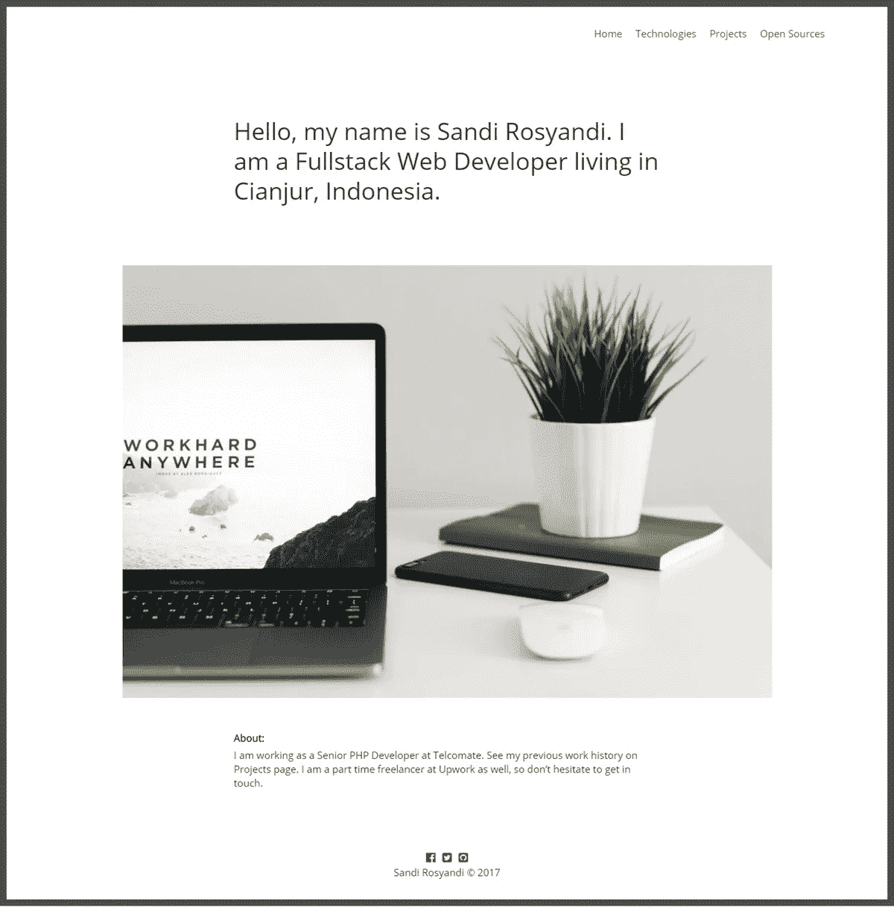
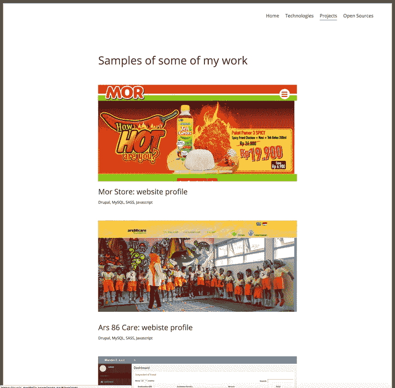
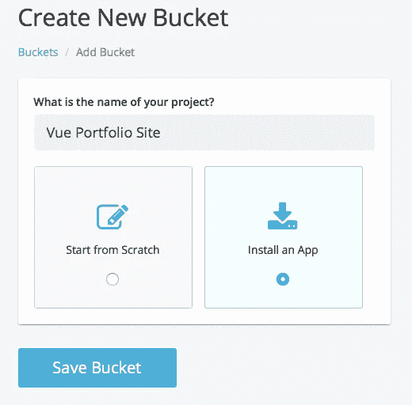
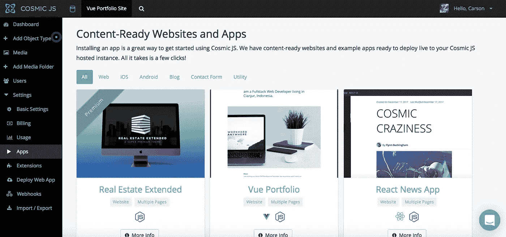
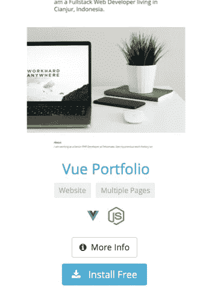
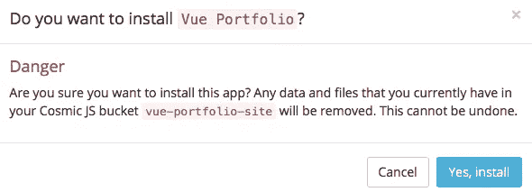
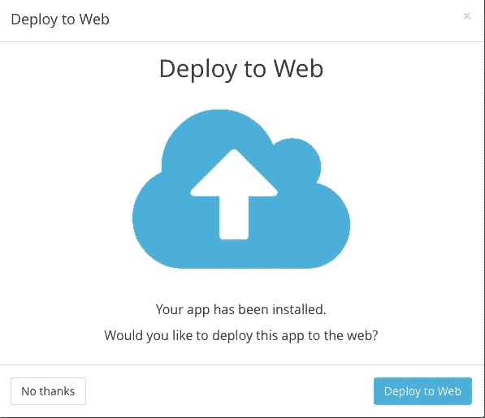
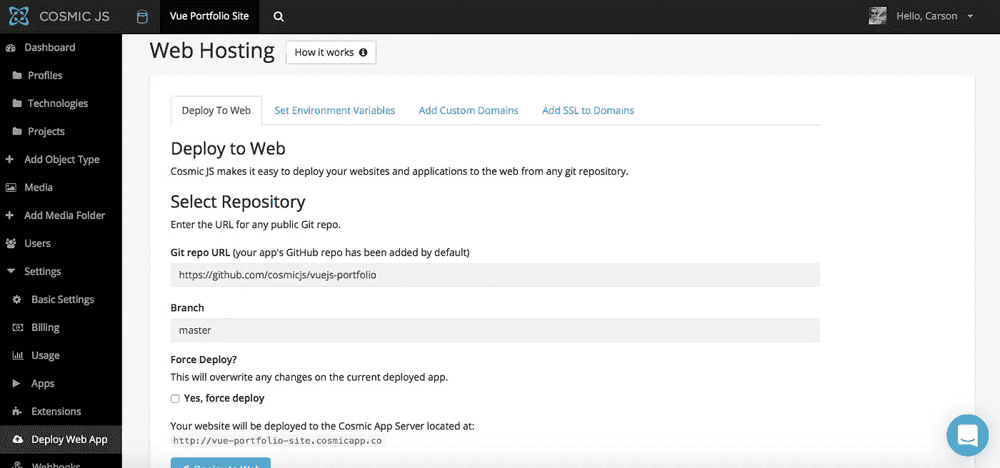
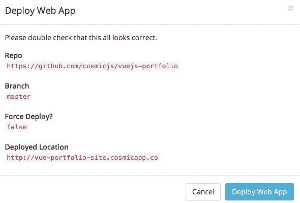

# 分 3 步部署 Vue 产品组合网站

> 原文：<https://medium.com/hackernoon/deploy-a-vue-portfolio-site-in-3-steps-b9210b3c91c3>

在这篇博客中，我将分三步演示如何部署一个 Vue 组合网站。这个应用程序使用 Vue.js 和 Node.js 构建，并连接到[宇宙 JS API](https://cosmicjs.com) 。从你的 [Cosmic JS](https://cosmicjs.com) Bucket Dashboard 安装并管理你的 [Vue 组合网站](https://cosmicjs.com/apps/vue-portfolio)及其所有内容。简单。😎你可以参考下面的[原创教程](https://cosmicjs.com/articles/how-to-build-a-portfolio-site-using-vue-and-cosmic-js)从头构建 app，或者继续阅读简单 3 步部署 Vue Portfolio 站点。

 [## 如何使用 Vue 和 Cosmic JS 建立作品集网站

### 在本教程中，我将向你展示如何使用 Vue 和 Cosmic JS 创建一个作品集网站。

hackernoon.com](https://hackernoon.com/how-to-build-portfolio-site-using-vue-and-cosmic-js-5832bce7e7dc) 

# TL；速度三角形定位法(dead reckoning)

[Vue Portfolio Site](https://cosmicjs.com/apps/vue-portfolio)
[Vue Portfolio Site Demo](https://cosmicjs.com/apps/vue-portfolio/demo)
[Vue Portfolio Site code base](https://github.com/cosmicjs/vuejs-portfolio)
[如何使用 Vue 和 Cosmic JS 构建 Portfolio Site](https://cosmicjs.com/articles/how-to-build-a-portfolio-site-using-vue-and-cosmic-js)

我们将使用 [Cosmic JS](https://cosmicjs.com/) 来安装我们的示例应用程序，部署并进行内容更新。 [Cosmic JS](https://cosmicjs.com) 是一个 API 优先的内容管理平台，允许开发人员以任何编程语言构建应用程序，同时为内容编辑人员提供一个熟悉的内容编辑器来管理来自云的动态内容。如果你还没有，那就从[报名](https://cosmicjs.com/signup)参加[宇宙 JS](https://cosmicjs.com) 开始吧。

# 1.创建新的存储桶

您的 bucket 的名称是您正在构建的网站、项目、客户端或 web 应用程序的名称。

# 2.安装 Vue 组合网站

[Cosmic JS](https://cosmicjs.com/) 让你能够在 Node.js、Vue.js、React、AngularJS 等编程语言之间进行筛选。

# 3.部署到 Web

导航至位于 Bucket Dashboard 左侧导航栏设置下方的“部署 Web 应用程序”。我点击了“部署到 Web”。然后，我可以在部署 web 应用程序时编辑对象。您将收到一封电子邮件，确认您的 web 应用程序的部署。如果您在部署过程中遇到任何问题，您可能会被转到 [Cosmic JS 故障排除页面](https://cosmicjs.com/troubleshooting)。

# 确认部署位置和分支

# 部署分支机构确认模式

现在你的应用已经部署到 [Cosmic JS](https://cosmicjs.com) 应用服务器，你可以从一个地方自由地管理你的 Vue 组合网站及其所有内容。

[Cosmic JS](https://cosmicjs.com/) 是一个 API 第一的基于云的内容管理平台，使管理应用和内容变得容易。如果你有关于 Cosmic JS API 的问题，请在 [Twitter](https://twitter.com/cosmic_js) 或 [Slack](https://cosmicjs.com/community) 上联系创始人。

[卡森·吉本斯](https://twitter.com/carsoncgibbons)是[宇宙 JS](https://cosmicjs.com/) 的联合创始人& CMO，宇宙 JS 是一个 API 第一的基于云的[内容管理平台](https://cosmicjs.com/)，它将内容与代码分离，允许开发者用他们想要的任何编程语言构建流畅的应用和网站。