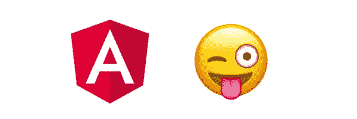
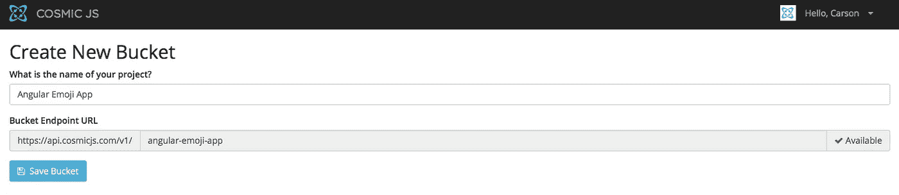
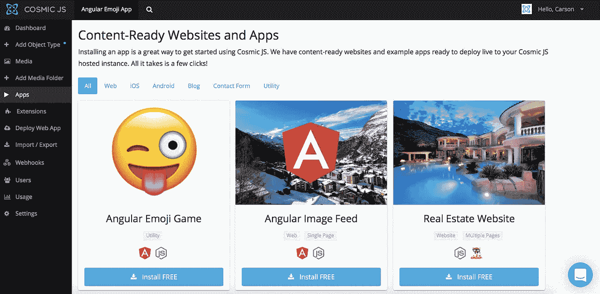
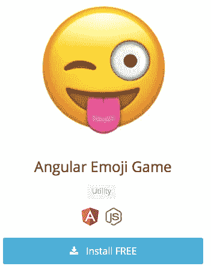
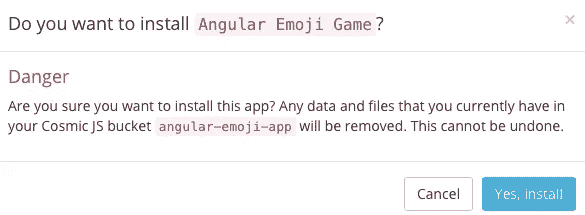
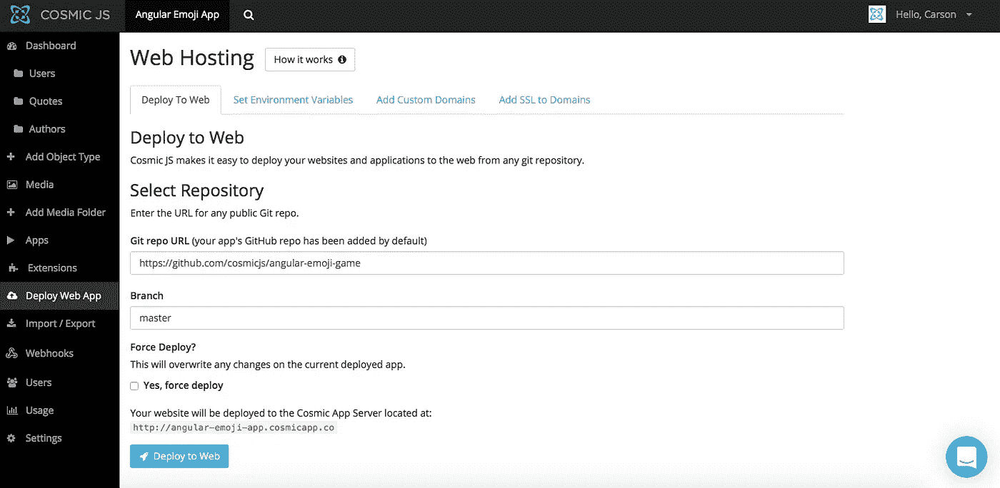
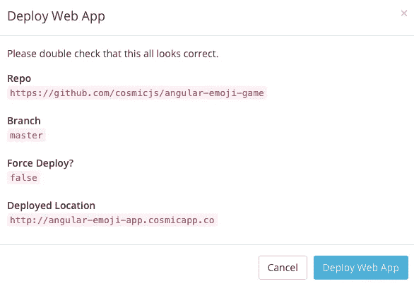

# 分 3 步部署一款棱角分明的表情游戏

> 原文：<https://medium.com/hackernoon/deploy-an-angular-emoji-game-in-3-steps-bdbc4d9f98d>

在这篇博客中，我将演示如何安装和部署使用 Node.js 和 [Cosmic JS CMS API](https://cosmicjs.com/) 构建的 Angular JS 表情符号游戏应用程序。这是一个问问题的游戏，“你对你的名言和表情符号了解多少？”通过这个使用 Angular JS 构建的表情符号游戏来了解一下吧。

**说明:拖放表情符号来完成报价。在** [**宇宙 JS 仪表盘**](https://cosmicjs.com/) **内管理游戏内容。**

Angular JS 使应用程序开发更具表现力、可读性和开发速度。这个应用程序来自我们的[宇宙 JS](https://cosmicjs.com/) 贡献者之一。查看[如何使用 AngularJS 构建表情游戏](https://cosmicjs.com/blog/how-to-build-an-emoji-game-using-angularjs)。继续阅读，只需 3 个步骤即可部署表情符号游戏。

[Cosmic JS](https://cosmicjs.com/) 是一个 API 优先的 CMS，使管理和构建网站和应用程序更快更直观。通过将内容从代码中分离出来，Cosmic JS 增强了开发人员的灵活性，同时确保内容编辑人员能够以最适合他们的方式规划和部署内容。我们将使用 Cosmic JS 来安装我们的示例应用程序，部署和更新基于云的内容管理平台的内容。

[如何使用 Angular js](https://cosmicjs.com/blog/how-to-build-an-emoji-game-using-angularjs)
[Angular Emoji 游戏页面](https://cosmicjs.com/apps/angular-emoji-game)
[Angular Emoji 游戏演示](https://cosmicjs.com/apps/angular-emoji-game/demo)
[GitHub 上的 Angular e moji 游戏代码库](https://github.com/cosmicjs/angular-emoji-game)

# 1.创建新的存储桶

# 2.安装角表情游戏

注册并命名您的存储桶后，系统会提示您从头开始或安装应用程序。在这篇博客中，我简单地点击了应用程序按钮，开始安装 Angular 表情符号游戏。

Cosmic JS 让你能够在 Node.js、PHP、React、AngularJS 等编程语言之间进行筛选。

# 3.部署到 Web

我点击了“部署到 Web”。然后，我可以在部署 web 应用程序时编辑对象。您将收到一封电子邮件，确认您的 web 应用程序的部署。如果您在部署过程中遇到任何问题，您可能会被转到 [Cosmic JS 故障排除页面](https://cosmicjs.com/troubleshooting)。

# 确认部署位置和分支

现在你的应用已经部署到 Cosmic JS，你可以从一个地方完全管理你的 Angular Emoji 游戏及其所有内容。

[Cosmic JS](https://cosmicjs.com/) 是一个 API 第一的基于云的内容管理平台，使管理应用程序和内容变得容易。如果你对 Cosmic JS API 有任何疑问，请通过 [Twitter](https://twitter.com/cosmic_js) 或 [Slack](https://cosmicjs.com/community) 联系创始人。

[卡森·吉本斯](https://twitter.com/carsoncgibbons)是[宇宙 JS](https://cosmicjs.com/) 的联合创始人& CMO，宇宙 JS 是一个 API 第一的基于云的[内容管理平台](https://cosmicjs.com/)，它将内容与代码分离，允许开发人员用他们想要的任何编程语言构建流畅的应用程序和网站。