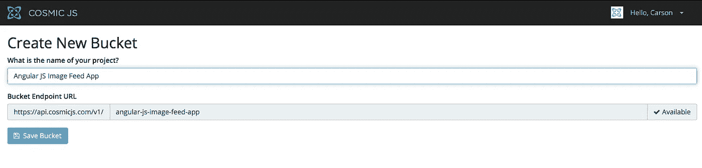
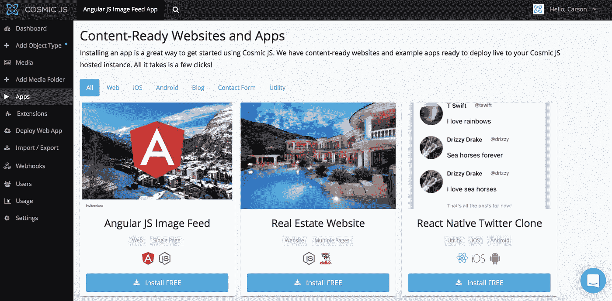
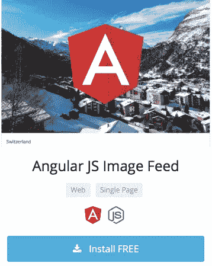
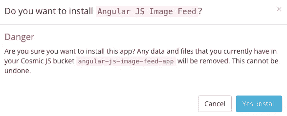
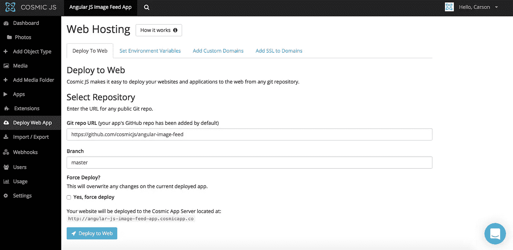
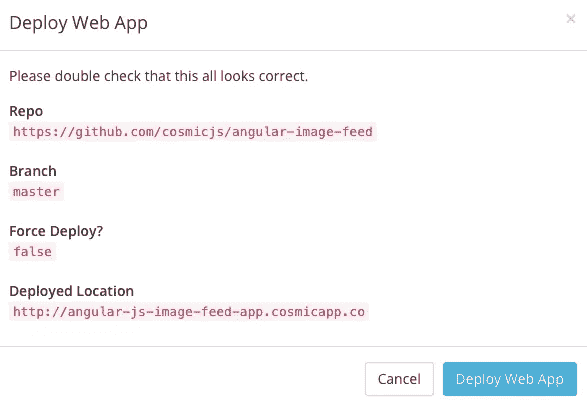

# 分 3 步部署 Angular JS 图像馈送应用程序

> 原文：<https://medium.com/hackernoon/deploy-an-angular-js-image-feed-app-in-3-steps-bfeb8a29f7de>

Node.js | Angular JS | Cosmic JS

Angular JS 允许你为你的应用程序扩展 HTML 词汇，使应用程序真正具有表现力、可读性和简单/快速的开发。因此，使用 Angular 来构建我们最新的应用程序是很自然的。Cosmic JS 的贡献者之一使用 Angular JS 和 Node.js 构建了一个图像馈送应用程序，由 T2 Cosmic JS CMS API T3 提供支持。查看[如何建立一个有角度的 JS 图像馈送](https://cosmicjs.com/blog/how-to-build-an-angular-js-image-feed)。继续阅读，只需 3 个步骤即可部署图像馈送应用程序。

在这篇博客中，我将演示如何安装和部署使用 Node.js 和 [Cosmic JS CMS API](https://cosmicjs.com/) 构建的 Angular JS Image Feed 应用程序。这是一个用户驱动的照片库应用程序，包括在无限滚动提要中添加图像的能力，所有这些都是从 [Cosmic JS 仪表板](https://cosmicjs.com/)中管理的。

[Cosmic JS](https://cosmicjs.com/) 是一个 API 优先的 CMS，使得管理和构建网站和应用程序更加快速和直观。通过将内容从代码中分离出来，Cosmic JS 增强了开发人员的灵活性，同时确保内容编辑人员能够以最适合他们的方式规划和部署内容。我们将使用 Cosmic JS 来安装我们的示例应用程序，部署和更新基于云的内容管理平台的内容。

[如何构建 Angular JS 图片 Feed](https://cosmicjs.com/blog/how-to-build-an-angular-js-image-feed)
[Angular JS 图片 Feed App 页面](https://cosmicjs.com/apps/angular-js-image-feed)
[Angular JS 图片 Feed App 演示](https://cosmicjs.com/apps/angular-js-image-feed/demo)
[Angular JS 图片 Feed App Codebase on GitHub](https://github.com/cosmicjs/angular-image-feed)

# 1.创建新的存储桶

# 2.安装 Angular JS 图像馈送应用程序

注册并命名您的存储桶后，系统会提示您从头开始或安装应用程序。在这篇博客中，我简单地点击了应用程序按钮，开始安装 Angular JS Image Feed 应用程序。

Cosmic JS 让你能够在 Node.js、PHP、React、AngularJS 等编程语言之间进行筛选。

# 3.部署到 Web

我点击了“部署到 Web”。然后，我可以在部署 web 应用程序时编辑对象。您将收到一封电子邮件，确认您的 web 应用程序的部署。如果您在部署过程中遇到任何问题，您可能会被转到 [Cosmic JS 故障排除页面](https://cosmicjs.com/troubleshooting)。

# 确认部署位置和分支

现在你的应用程序已经部署到了 Cosmic JS，你可以从一个地方完全管理你的图片订阅应用程序及其所有内容。

[Cosmic JS](https://cosmicjs.com/) 是一个 API 第一的基于云的内容管理平台，使管理应用程序和内容变得容易。如果你对 Cosmic JS API 有任何疑问，请通过 [Twitter](https://twitter.com/cosmic_js) 或 [Slack](https://cosmicjs.com/community) 联系创始人。

[卡森·吉本斯](https://twitter.com/carsoncgibbons)是[宇宙 JS](https://cosmicjs.com/) 的联合创始人& CMO，宇宙 JS 是一个 API 第一的基于云的[内容管理平台](https://cosmicjs.com/)，它将内容与代码分离，允许开发人员用他们想要的任何编程语言构建流畅的应用程序和网站。