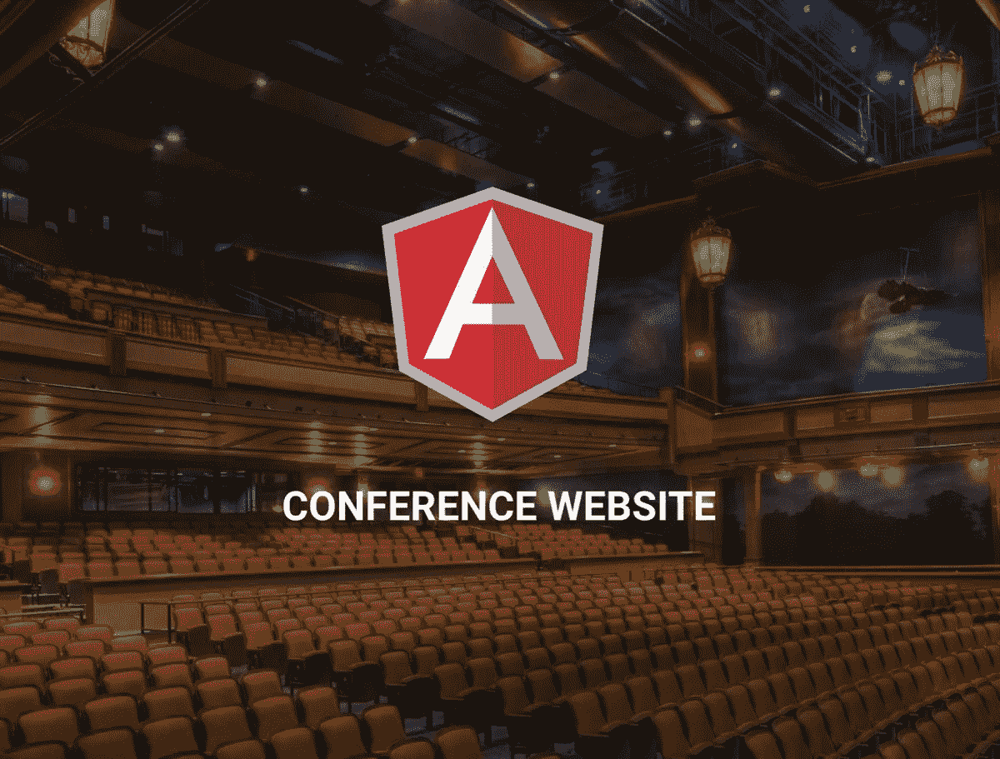
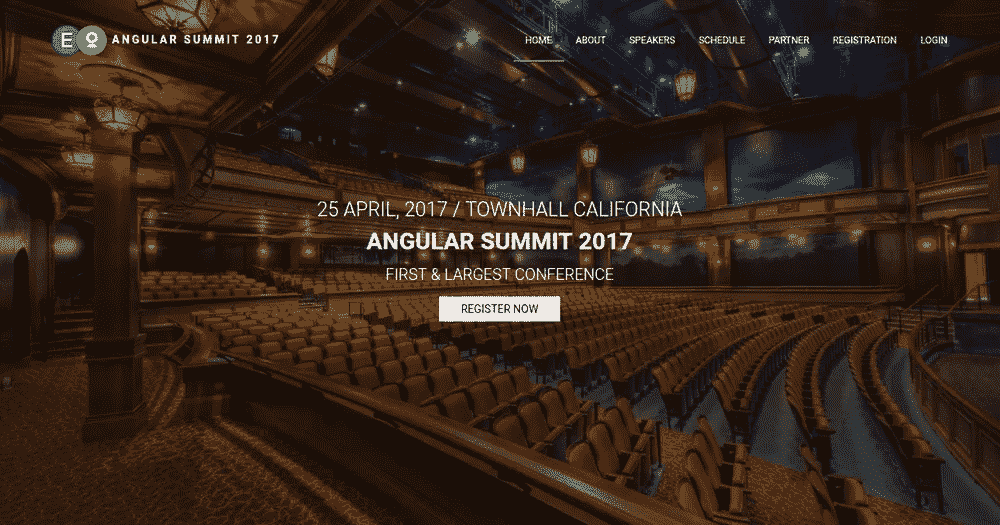
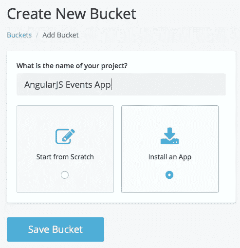
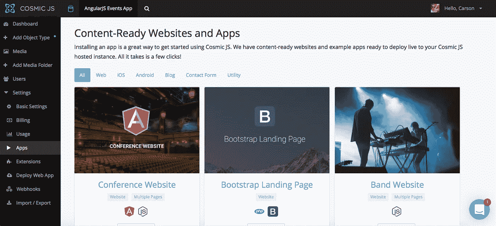
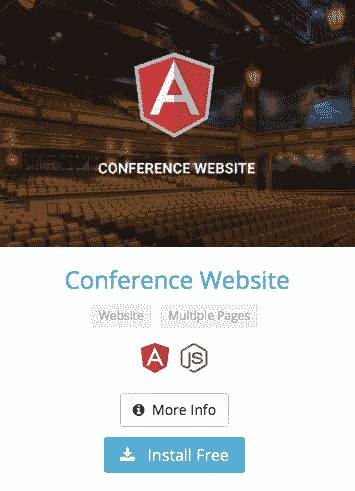
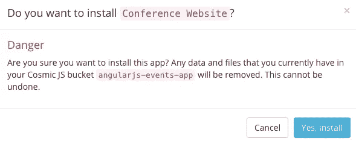
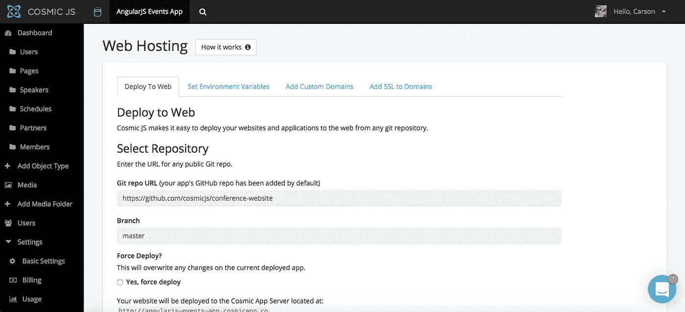
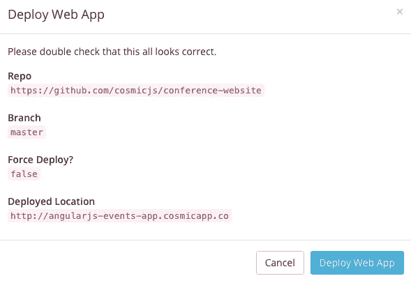

# 分 3 步部署 AngularJS 会议应用

> 原文：<https://medium.com/hackernoon/deploy-an-angularjs-conference-app-in-3-steps-4928fa84bf6b>

在这篇博客中，我将分三步演示如何部署 AngularJS 会议/活动应用程序。这个[会议网站](https://cosmicjs.com/apps/conference-website)是用 AngularJS，Node.js 和[宇宙 JS](https://cosmicjs.com) 搭建的。用户可以更新内容，添加演讲者和赞助商。它包括一个直接管理网站内容的管理区。如果您想了解该应用程序是如何从头开始构建的，可以参考下面的原始教程，或者继续阅读，通过 3 个简单的步骤简单地部署 AngularJS 会议应用程序。

 [## 如何使用 AngularJS 搭建会议 App

### 在本教程中，我将向你展示如何创建一个“会议”应用程序使用 AngularJS，一点点的节点，和…

medium.com](/@tonyspiro/how-to-build-a-conference-app-using-angularjs-5a3d80f226c6) 

我将使用[宇宙 JS](https://cosmicjs.com/) 作为这个博客的例子。Cosmic JS 是一个 [API 优先的 CMS](https://cosmicjs.com/) ，它使得管理和构建网站和应用程序更加快速和直观。Cosmic JS 提供了一个直观的 API，可以向任何网站或应用程序提供内容。这使您可以自由地使用任何编程语言来构建应用程序，并允许在您的开发团队中更容易地扩展。

如果你还没有，那就从[注册](https://cosmicjs.com/signup)参加[宇宙 JS](https://cosmicjs.com/) 开始吧。下面提供了有用的资源来简化您的开发操作。

 [## 会议网站|宇宙 JS App 演示

### Cosmic JS 是一个云托管的内容平台，提供了一个灵活而直观的 CMS API。建立网站和…

cosmicjs.com](https://cosmicjs.com/apps/conference-website/demo)  [## kutsanuk/cosmicapp-会议

### 在 GitHub 上创建一个帐户，为 cosmicapp-conference 的发展做出贡献。

github.com](https://github.com/kutsaniuk/cosmicapp-conference) 

# 1.创建新的存储桶

您的 bucket 的名称是您正在构建的网站、项目、客户端或 web 应用程序的名称。

# 2.安装 AngularJS 会议应用程序

[Cosmic JS](https://cosmicjs.com/) 让你能够在 Node.js、Vue.js、React、AngularJS 等编程语言之间进行筛选。

# 3.部署到 Web

我点击了“部署到 Web”。然后，我可以在部署 web 应用程序时编辑对象。您将收到一封电子邮件，确认您的 web 应用程序的部署。如果您在部署过程中遇到任何问题，您可能会被转到 [Cosmic JS 故障排除页面](https://cosmicjs.com/troubleshooting)。

# 确认部署位置和分支

# 部署分支机构确认模式

现在你的应用已经部署到了 Cosmic JS 应用服务器上，你可以自由地从一个地方完全管理你的 AngularJS 会议应用及其所有内容。

[Cosmic JS](https://cosmicjs.com/) 是一个 API 首创的基于云的内容管理平台，可以轻松管理应用和内容。如果你对 Cosmic JS API 有任何疑问，请通过 [Twitter](https://twitter.com/cosmic_js) 或 [Slack](https://cosmicjs.com/community) 联系创始人。

[卡森·吉本斯](https://twitter.com/carsoncgibbons)是 [Cosmic JS](https://cosmicjs.com/) 的联合创始人& CMO，这是一个 API 第一的基于云的[内容管理平台](https://cosmicjs.com/)，它将内容从代码中分离出来，允许开发人员用他们想要的任何编程语言构建流畅的应用程序和网站。