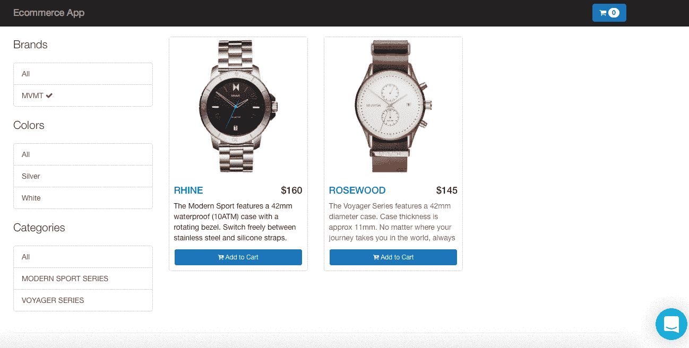
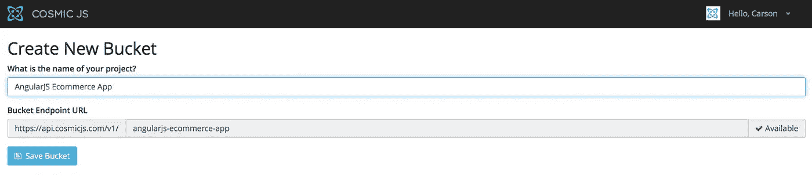
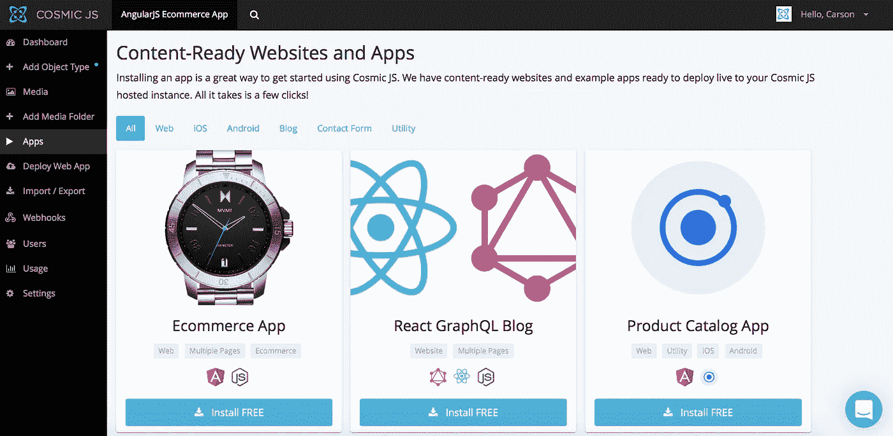
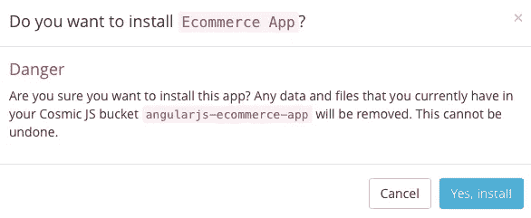
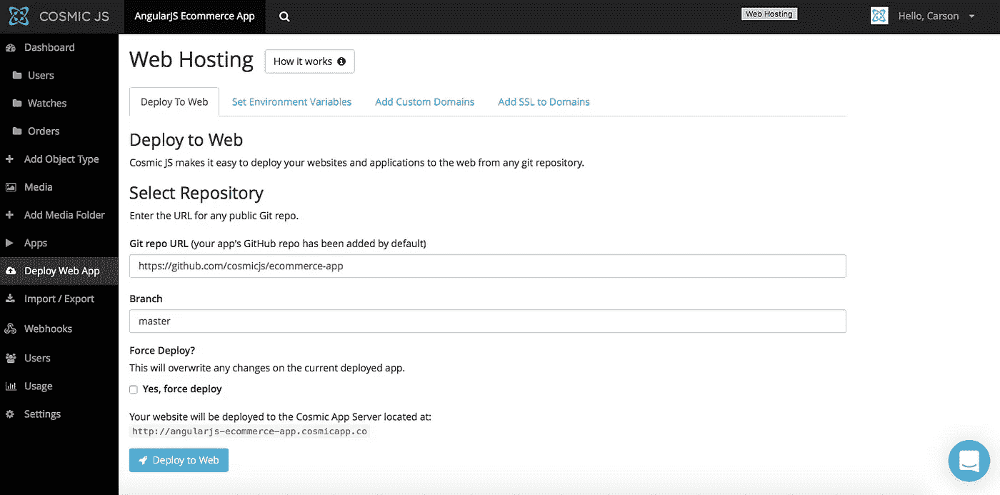
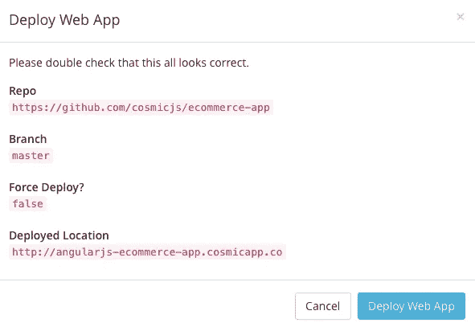
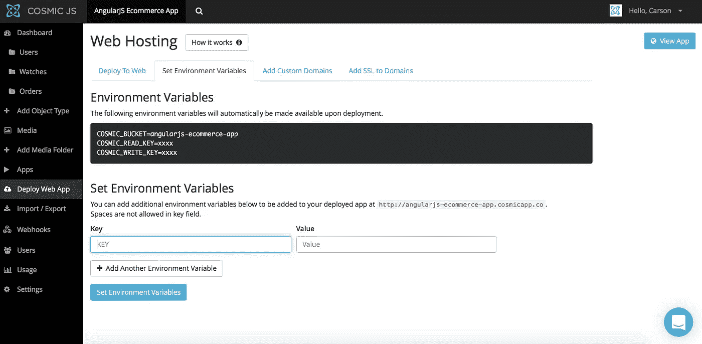
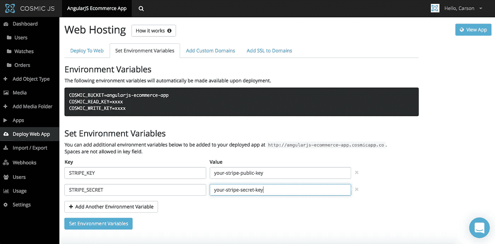

# 分 4 步部署 AngularJS 电子商务应用

> 原文：<https://medium.com/hackernoon/deploy-an-angularjs-ecommerce-app-in-4-steps-7fba760f22df>

This Ecommerce App is built using AngularJS, Node.js and Cosmic JS.

在这篇博客中，我将演示如何安装和部署一个使用 AngularJS、 [Node.js](https://cosmicjs.com/carson-gibbons/edit-object/Node.js) 和 [Cosmic JS](https://cosmicjs.com) 构建的 AngularJS 电子商务应用程序。这个电子商务应用程序允许您处理来自客户的订单，并接受商品和服务的条纹付款。在你的 [Cosmic JS](https://cosmicjs.com) 仪表盘或网站的管理区管理库存。

建立一个电子商务解决方案从未如此之快。只需安装和部署该应用程序，只需点击两下，您就可以将您的 Stripe keys 设置为环境变量，开始接受订单并使用您的新 AngularJS 电子商务应用程序处理交易。

我将在部署过程中使用 [Cosmic JS](https://cosmicjs.com/) 。Cosmic JS 是一个 [API 优先的 CMS](https://cosmicjs.com/) ，使得管理和构建网站和应用程序更快。通过分离内容和代码， [Cosmic JS](https://cosmicjs.com/) 增强了开发者的能力，同时允许内容编辑者自己规划和部署内容。Cosmic JS 允许开发人员使用他们喜欢的工具，如 Node.js、GitHub、Docker 等等。

> [如何在 GitHub 上构建 AngularJS 电商 App](https://cosmicjs.com/blog/how-to-build-an-angular-js-ecommerce-app)
> [AngularJS 电商 App](https://cosmicjs.com/apps/ecommerce-app)
> [AngularJS 电商 App 代码库](https://github.com/cosmicjs/ecommerce-app)

# 1.创建新的存储桶

# 2.安装 AngularJS 电子商务应用程序

宇宙 JS 给你在实用程序和编程语言之间过滤的能力。

Cosmic JS Ecommerce App

# 3.部署到 Web

您将收到一封电子邮件，确认您的 web 应用程序的部署。如果您在部署过程中遇到任何问题，您可能会被转到 [Cosmic JS 故障排除页面](https://cosmicjs.com/troubleshooting)。

# 确认部署位置和分支

# 部署分支机构确认模式

# 4.连接条带键

部署后，您可以通过转到 Bucket > Deploy Web App > Set Environment Variables 将条带键设置为环境变量。

[Cosmic JS](https://cosmicjs.com/) 是一个 API 首创的基于云的内容管理平台，可以轻松管理应用和内容。如果你对 Cosmic JS API 有任何疑问，请通过 [Twitter](https://twitter.com/cosmic_js) 或 [Slack](https://cosmicjs.com/community) 联系创始人。

[卡森·吉本斯](https://twitter.com/carsoncgibbons)是[宇宙 JS](https://cosmicjs.com/) 的联合创始人& CMO，宇宙 JS 是一个 API 第一的基于云的[内容管理平台](https://cosmicjs.com/)，它将内容与代码分离，允许开发者用他们想要的任何编程语言构建流畅的应用和网站。

> [黑客中午](http://bit.ly/Hackernoon)是黑客如何开始他们的下午。我们是 AMI 家庭的一员。我们现在[接受投稿](http://bit.ly/hackernoonsubmission)并乐意[讨论广告&赞助](mailto:partners@amipublications.com)机会。
> 
> 如果你喜欢这个故事，我们推荐你阅读我们的[最新科技故事](http://bit.ly/hackernoonlatestt)和[趋势科技故事](https://hackernoon.com/trending)。直到下一次，不要把世界的现实想当然！

