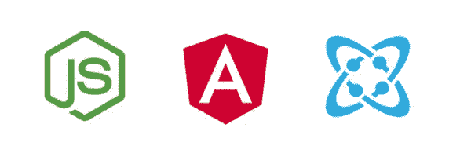
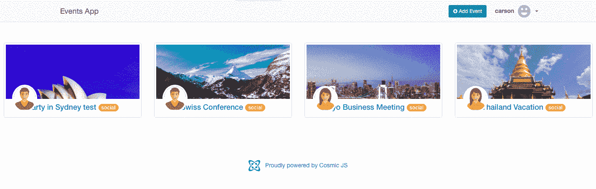
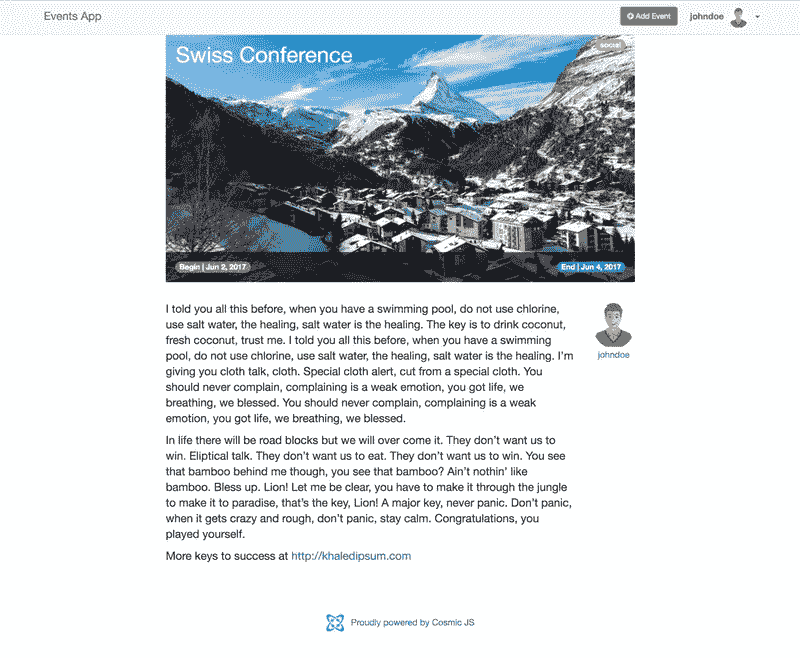
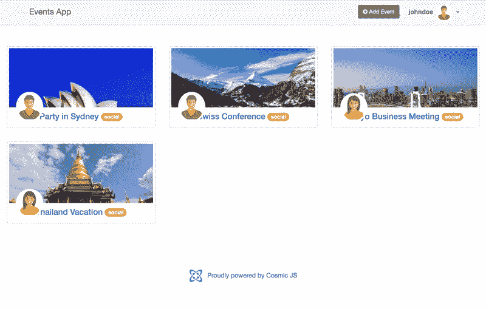
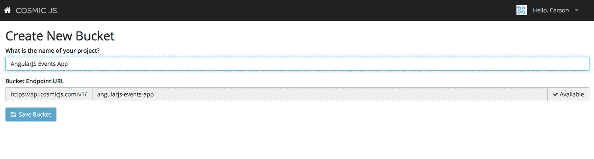
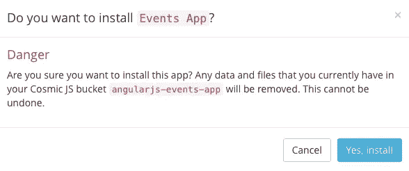
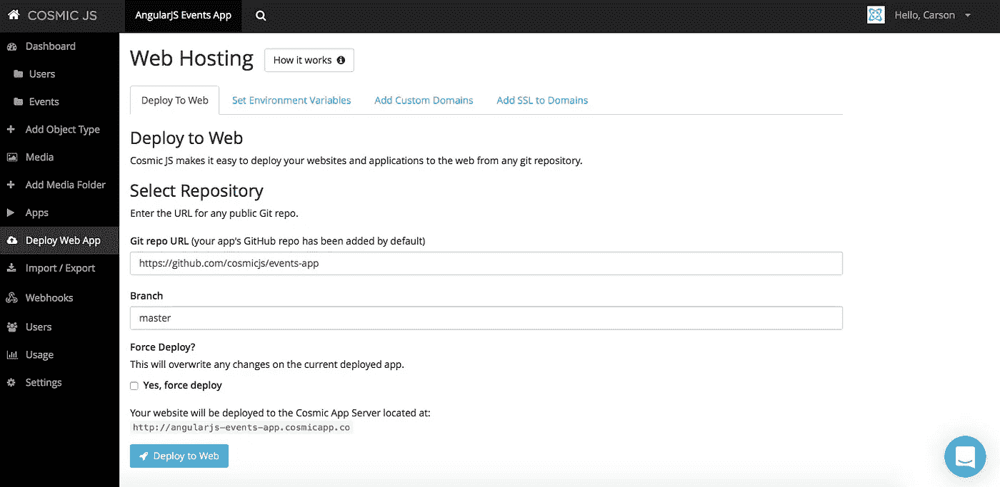
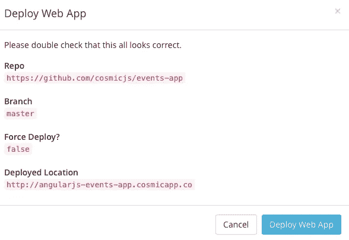

# 使用 Cosmic JS 分 3 步部署 AngularJS 事件应用程序

> 原文：<https://medium.com/hackernoon/deploy-an-angularjs-events-app-in-3-steps-using-cosmic-js-fe903b888d35>

This events app was built using AngularJS, Node.js and Cosmic JS.

在这篇博客中，我将演示如何使用 Cosmic JS 安装和部署 AngularJS 事件应用程序。这个事件管理应用程序是使用 AngularJS 和 Cosmic JS 构建的。用户可以注册、添加活动和浏览其他用户提交的活动。

在这个部署过程中，我将使用 [Cosmic JS](https://cosmicjs.com/) 。Cosmic JS 是一个 [API 优先的 CMS](https://cosmicjs.com/) ，它使得管理和构建网站和应用程序更加快速和直观。通过将内容与代码分离， [Cosmic JS](https://cosmicjs.com/) 赋予开发者灵活性，同时确保内容编辑能够以最适合他们的方式规划和部署内容。Cosmic JS 允许开发人员使用他们喜欢的工具，如 Node.js、GitHub、Docker 等等。

Event Detail Page

Event Thread Page

从[报名](https://cosmicjs.com/signup)参加[宇宙 JS](https://cosmicjs.com/) 开始。下面提供了有用的资源。

> [如何在 GitHub 上构建 AngularJS 事件 App](https://cosmicjs.com/blog/how-to-build-an-angularjs-events-app)
> [AngularJS 事件 App](https://cosmicjs.com/apps/events-app)
> [AngularJS 事件 App 演示](https://cosmicjs.com/apps/events-app/demo)
> [AngularJS 事件 App 代码库](https://github.com/cosmicjs/events-app)

# 1.创建新的存储桶

# 2.安装 AngularJS 事件应用程序

[Cosmic JS](https://cosmicjs.com/) 给你在实用程序和编程语言之间过滤的能力。

# 3.部署到 Web

您将收到一封电子邮件，确认您的 web 应用程序的部署。如果您在部署过程中遇到任何问题，您可能会被转到 [Cosmic JS 故障排除页面](https://cosmicjs.com/troubleshooting)。

# 确认部署位置和分支

# 部署分支机构确认模式

就像注册、创建新的存储桶、安装 web 应用程序、编辑对象和部署一样简单！我收到了访问我的 web 应用程序的确认电子邮件，还看到了我的桶升级选项，如[自定义域、一键式 SSL、webhooks 和本地化](https://cosmicjs.com/features)。

[Cosmic JS](https://cosmicjs.com/) 是一个 API 首创的基于云的内容管理平台，可以轻松管理应用和内容。如果你对 Cosmic JS API 有任何疑问，请通过 [Twitter](https://twitter.com/cosmic_js) 或 [Slack](https://cosmicjs.com/community) 联系创始人。

[卡森·吉本斯](https://twitter.com/carsoncgibbons)是[宇宙 JS](https://cosmicjs.com/) 的联合创始人& CMO，宇宙 JS 是一个 API 第一的基于云的[内容管理平台](https://cosmicjs.com/)，它将内容与代码分离，允许开发者用他们想要的任何编程语言构建流畅的应用和网站。

> [黑客中午](http://bit.ly/Hackernoon)是黑客如何开始他们的下午。我们是 AMI 家庭的一员。我们现在[接受投稿](http://bit.ly/hackernoonsubmission)并乐意[讨论广告&赞助](mailto:partners@amipublications.com)机会。
> 
> 如果你喜欢这个故事，我们推荐你阅读我们的[最新科技故事](http://bit.ly/hackernoonlatestt)和[趋势科技故事](https://hackernoon.com/trending)。直到下一次，不要把世界的现实想当然！

