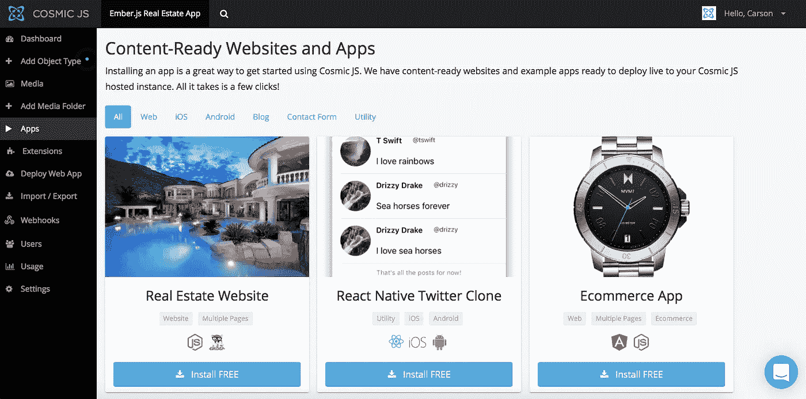
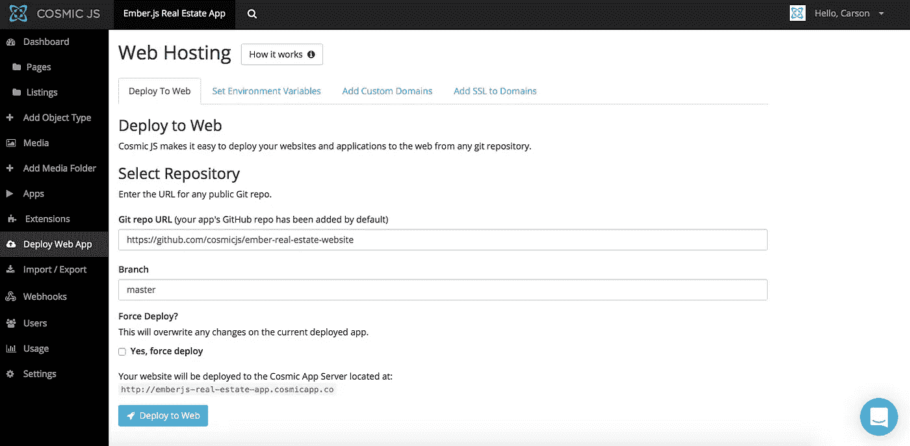
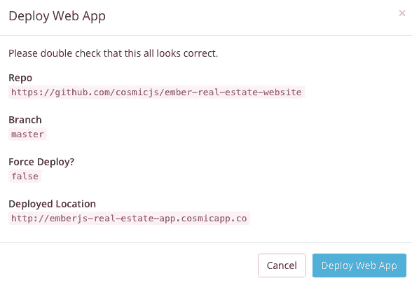

# 分三步部署 Ember.js 清单应用程序

> 原文：<https://medium.com/hackernoon/deploy-an-ember-js-listings-app-in-3-steps-8a29e787804d>

Node.js, Ember.js and Cosmic JS

js 是一个新的框架，自称是一个生产力框架:在强大的模板中编写更少的代码，并利用已经内置的 API。我们的 [Cosmic JS](https://cosmicjs.com/) 贡献者之一用 Ember.js 建立了一个网站，由 [Cosmic JS](https://cosmicjs.com/) CMS API 提供支持。查看他的博客[如何使用 Ember.js](https://cosmicjs.com/blog/how-to-build-a-real-estate-website-using-emberjs) 建立一个房地产网站，或者继续阅读只需 3 个步骤即可部署应用程序。

在这篇博客中，我将演示如何安装和部署一个使用 Node.js 和 [Cosmic JS CMS API](https://cosmicjs.com/) 构建的 [Ember.js 房地产列表应用程序](https://cosmicjs.com/apps/real-estate-website)。房地产列表应用程序包括添加和编辑列表，以及一个对列表进行向上投票和向下投票的排名系统。管理属性和媒体以及管理列表，所有这些都可以在 [Cosmic JS 仪表板](https://cosmicjs.com/)中完成。

[Cosmic JS](https://cosmicjs.com/) 是一个 API 优先的 CMS，使管理和构建网站和应用程序更快更直观。通过将内容从代码中分离出来， [Cosmic JS](https://cosmicjs.com/) 增强了开发人员的灵活性，同时确保内容编辑能够以最适合他们的方式规划和部署内容。我们将使用 [Cosmic JS](https://cosmicjs.com/) 来安装我们的示例应用程序，部署和更新基于云的内容管理平台的内容。

> [Ember.js 网站页面](https://cosmicjs.com/apps/real-estate-website)
> 
> [Ember.js 网站演示](https://cosmicjs.com/apps/real-estate-website/demo)
> 
> [基于 GitHub 的 Ember.js 网站代码库](https://github.com/cosmicjs/ember-real-estate-website)

# 1.创建新的存储桶

# 2.安装 Ember.js 房地产网站

注册并命名您的存储桶后，系统会提示您从头开始或安装应用程序。对于这个博客，我只需点击应用程序按钮，开始 Ember.js 房地产网站的安装过程。

[Cosmic JS](https://cosmicjs.com/) 让你能够在 Node.js、PHP、React、AngularJS 等编程语言之间进行筛选。

# 3.部署到 Web

我点击了“部署到 Web”。然后，我可以在部署 web 应用程序时编辑对象。您将收到一封电子邮件，确认您的 web 应用程序的部署。如果您在部署过程中遇到任何问题，您可能会被转到[宇宙 JS 故障排除页面](https://cosmicjs.com/troubleshooting)。

# 确认部署位置和分支

现在你的应用已经部署到[宇宙 JS](https://cosmicjs.com/) ，你可以从一个地方完全管理你的网站和它的所有内容。

[Cosmic JS](https://cosmicjs.com/) 是一个 API 首创的基于云的内容管理平台，可以轻松管理应用和内容。如果你有关于 Cosmic JS API 的问题，请在 [Twitter](https://twitter.com/cosmic_js) 或 [Slack](https://cosmicjs.com/community) 上联系创始人。

[卡森·吉本斯](https://twitter.com/carsoncgibbons)是[宇宙 JS](https://cosmicjs.com/) 的联合创始人& CMO，宇宙 JS 是一个 API 第一的基于云的[内容管理平台](https://cosmicjs.com/)，它将内容从代码中分离出来，允许开发人员用他们想要的任何编程语言来构建流畅的应用和网站。

> [黑客中午](http://bit.ly/Hackernoon)是黑客如何开始他们的下午。我们是 T21 家庭的一员。我们现在[接受投稿](http://bit.ly/hackernoonsubmission)并乐意[讨论广告&赞助](mailto:partners@amipublications.com)机会。
> 
> 如果你喜欢这个故事，我们推荐你阅读我们的[最新科技故事](http://bit.ly/hackernoonlatestt)和[趋势科技故事](https://hackernoon.com/trending)。直到下一次，不要把世界的现实想当然！

