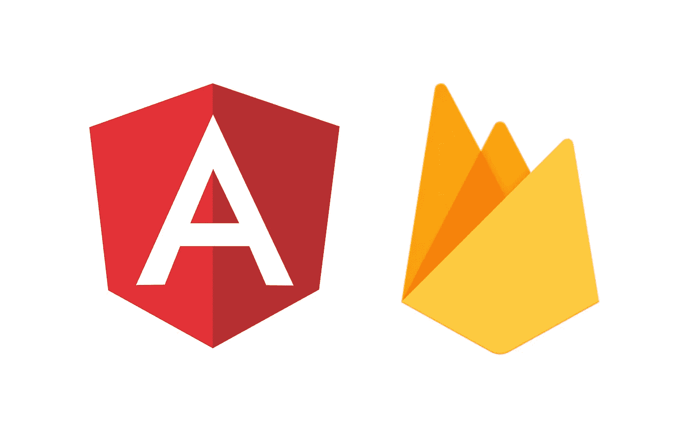
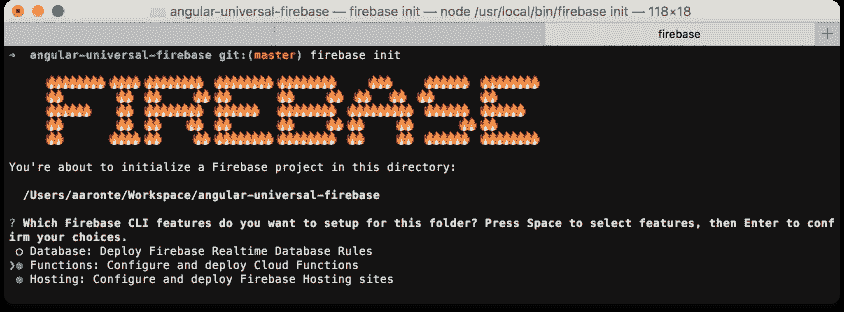
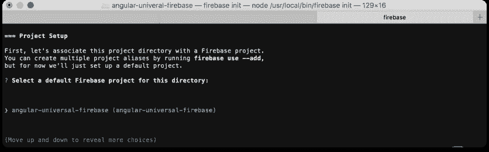
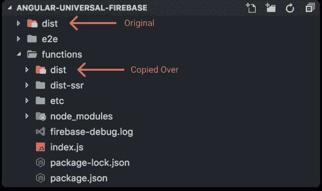

# 部署带火焰基座的角形通用🚀🔥

> 原文：<https://medium.com/hackernoon/deploy-angular-universal-w-firebase-ad70ea2413a1>



免责声明:这篇博客文章将一步一步地讲述如何使用 [Firebase](https://hackernoon.com/tagged/firebase) 主机部署一个通用的 [Angular](https://hackernoon.com/tagged/angular) 应用程序。对于任何关于角度通用和服务器端渲染的解释，这里有一些有用的资源:

*   [角度通用](https://github.com/angular/universal)
*   [服务器端渲染](https://medium.freecodecamp.org/what-exactly-is-client-side-rendering-and-hows-it-different-from-server-side-rendering-bd5c786b340d)

如果你想继续下去，你可以在这里找到源代码。

# 要求

*   [node.js](https://github.com/nodejs/node) (本教程我用的是 v8.3.0)

# 第一部分:构建 angular 应用程序(浏览器和服务器版本)🔨

## 1.安装全局依赖项

我们将在命令行中使用`@angular/cli`和`firebase-tools`来构建和部署您的应用程序。

*   [@angular/cli ≥ v1.3.0](https://github.com/angular/angular-cli)
*   [firebase-tools 3 . 9 . 2 版](https://github.com/firebase/firebase-tools)

```
**$ npm install --global @angular/cli firebase-tools**
```

## 2.创建新的角度项目

使用`@angular/cli`，我们将创建一个新的`angular`应用程序。既然这样，我就把它命名为`angular-universal-firebase`。

```
**$ ng new angular-universal-firebase
$ cd angular-universal-firebase**
```

## 3.安装`@angular/platform-server`

为了构建和呈现您的`universal`应用程序，我们需要安装`@angular/platform-server`。

```
**$ npm install --save @angular/platform-server**
```

## 4.一种 **dd** S `erver Side Rendering` 配置

我们基本上是复制默认的`app`配置，并针对服务器端渲染(SSR)配置对其进行修改。对于 SSR 配置，我们不需要添加`polyfill`(因为代码将在`node`服务器而不是浏览器中运行)和`styles`(因为这将在我们通过`@angular/platform-server`构建服务器 HTML 时引用主`index.html`时添加)。**还要注意**，我们添加了`"platform": "server"`，这是`@angular/cli#v1.3.0`中引入的一个特性。这将允许我们使用`@angular/cli`构建您的应用程序的 SSR 版本。

```
// .angular-cli.json
{
    ...
    apps: [
        { /* default config */ },
        **{
            "name": "ssr",
            "root": "src",
            "outDir": "functions/dist-ssr",
            "assets": ["assets", "favicon.ico"],
            "index": "index.html",
            "main": "main-ssr.ts",
            "test": "test.ts",
            "tsconfig": "tsconfig.app-ssr.json",
            "prefix": "app",
            "scripts": [],
            "environmentSource": "environments/environment.ts",
            "environments": {
                "dev": "environments/environment.ts",
                "prod": "environments/environment.prod.ts"
            },
            "platform": "server"
        }   ** 
    ],
    ...
}
```

## 5.为应用服务器版本创建必要的文件

*   `src/app/app.server.module.ts`
    为 app 的`server`版本创建新模块。

```
// src/app/app.server.module.ts**import { NgModule } from '@angular/core';
import { ServerModule } from '@angular/platform-server';
import { AppModule } from './app.module';
import { AppComponent } from './app.component';****@NgModule({
    imports: [
        ServerModule,
        AppModule
    ],
    bootstrap: [AppComponent]
})****export class AppServerModule { }**
```

*   `src/main-ssr.ts` 为`server`模块创建入口点。这是我们在`.angular-cli.json`中应用的服务器版本中引用的`main`文件。

```
// src/main-ssr.ts**export { AppServerModule } from './app/app.server.module';**
```

*   `src/tsconfig.app-ssr.json`
    为服务器版本创建`tsconfig`。类似于浏览器版本，除了`angularCompilerOptions.entryModule`将引用我们刚刚创建的服务器版本的入口模块。这在`.angular-cli.json`配置中也被称为`tsconfig`。

```
// src/tsconfig.app-ssr.json**{
    "extends": "../tsconfig.json",
    "compilerOptions": {
        "outDir": "../out-tsc/app",
        "baseUrl": "./",
        "module": "commonjs",
        "types": []
    },
    "exclude": [
        "test.ts",
        "**/*.spec.ts"
    ],
    "angularCompilerOptions": {
        "entryModule": "app/app.server.module#AppServerModule"
    }
}**
```

## 6.在应用程序的浏览器模块中包含服务器转换

由于我们是在浏览器版本之前将您的应用的服务器版本发送到浏览器，所以当在应用的浏览器模块的`imports`中添加`BrowserModule`时，我们需要添加调用`.withServerTransition()`。

```
// src/app/app.module.tsimport { BrowserModule } from '@angular/platform-browser';
import { NgModule } from '@angular/core';
import { AppComponent } from './app.component';**const APP_ID = 'angular-universal-firebase';**@NgModule({
    declarations: [
        AppComponent
    ],
    imports: [
        **BrowserModule.withServerTransition({ appId: APP_ID })**
    ],
    providers: [],
    bootstrap: [AppComponent]
})export class AppModule { }
```

现在我们已经准备好构建应用程序的服务器和浏览器版本了！

## 7.构建应用程序的浏览器和服务器版本

使用`@angular/cli`，我们将构建应用程序的两个版本。
`ng build -prod`:将使用`prod`配置构建浏览器版本(即缩小的 html/js/css、aot 等)。)
`ng build -aot -app ssr`:将构建服务器版本。它将生成一个`ngFactory`文件，我们可以用它来渲染`node`中的应用程序。

```
**$ ng build -prod
$ ng build -aot -app ssr**
```

当两个构建都完成时，现在你应该在你的`root`目录中有一个`dist`文件夹，在你的`functions`目录中有一个`dist-ssr`。万岁！🎉

# 第二部分:使用 Firebase 部署🚀

[1] *在继续之前，您应该已经创建了一个 firebase 项目* [*这里是*](https://console.firebase.google.com) *。我为这个案例命名我的* `*angular-universal-firebase*` *。*

## 1.在命令行中登录到``firebase`'

在命令行中使用您在[1]中创建 firebase 项目时使用的 google 帐户登录 firebase。

```
**$ firebase login**
```

## 2.在“angular”项目中初始化 Firebase

通过命令行初始化 firebase 配置:

```
**$ firebase init**
```

*   选择`Functions`和`Hosting`进行功能设置



Firebase setup configuration

*   选择您在[1]中创建的 firebase 项目。(我的情况是`angular-universal-firebase`。



*   接受此阶段的所有默认值；我们将在后面的步骤中配置其余部分。

## 3.将包依赖项添加到“函数”

因为我们通过`firebase-functions`使用节点服务器，所以我们需要在`functions/package.json`中包含`angular`依赖项来呈现应用程序的服务器版本。

*先不说:目前，我不知道有什么方法可以减轻这种依赖声明的重复，因为据我所知，你不能在任何* `*firebase-functions*` *javascript 文件中访问* `*functions*` *目录之外的文件。但是如果你知道一个方法，请让我知道！*

```
// functions/package.json
{
    "name": "functions",
    "description": "Cloud Functions for Firebase",
    "dependencies": {
        **"@angular/animations": "^4.3.5",
        "@angular/common": "^4.3.5",
        "@angular/compiler": "^4.3.5",
        "@angular/core": "^4.3.5",
        "@angular/forms": "^4.3.5",
        "@angular/http": "^4.3.5",
        "@angular/platform-browser": "^4.3.5",
        "@angular/platform-server": "^4.3.5",
        "express": "^4.15.4",**
        "firebase-admin": "~4.2.1",
        "firebase-functions": "^0.5.7",
        **"rxjs": "^5.4.3",
        "zone.js": "^0.8.16"**
    },
    "private": true
}
```

## 4.在``functions`'目录下安装包

安装 da 依赖项！

```
# in project root
**$ npm --prefix functions install**or # in `functions` directory
**$ npm install**
```

## 5.将``dist`文件夹复制到``functions/dist``中

由于您不能在`firebase-functions`中访问`functions`目录之外的文件，我们必须将`dist`目录复制到`functions`目录中，这样我们才能在`firebase-functions`中访问它。



dist should now exist in root folder AND functions folder

## 6.创建 Firebase 函数以服务于应用程序

我们将使用`functions.https.onRequest` Firebase 函数类型从 express 服务器发送响应。该文件中有许多内容，但最值得注意的是:

*   导入从**第一部分生成的`AppServerModuleNgFactory`:步骤 7——服务器版本**。
*   创建一个`index`变量，该变量获取我们从**第一部分生成的`index.html`文件:步骤 7 —浏览器版本。**
*   使用`renderModuleFactory`生成一个`html`文件，我们用`url`和`document`参数作为响应发送该文件。
    `url`参数决定了 app 要渲染的路线。指定这一点允许`renderModuleFactory`构建该路线的`html`。
    `document`是要呈现的页面的完整文档 HTML。在这种情况下，它将是应用程序的浏览器版本`index.html`。

```
// functions/index.js**require('zone.js/dist/zone-node');****const functions = require('firebase-functions');
const express = require('express');
const path = require('path');
const { enableProdMode } = require('@angular/core');
const { renderModuleFactory } = require('@angular/platform-server');****const { AppServerModuleNgFactory } = require('./dist-ssr/main.bundle');****enableProdMode();****const index = require('fs')
    .readFileSync(path.resolve(__dirname, './dist/index.html'), 'utf8')
    .toString();****let app = express();****app.get('**', function(*req*, *res*) {
    renderModuleFactory(AppServerModuleNgFactory, {
        url: req.path,
        document: index
    }).then(*html* => res.status(200).send(html));
});****exports.ssr = functions.https.onRequest(app);**
```

## 7.配置 Firebase 托管

现在我们已经构建了呈现页面的函数，我们需要更改 firebase 主机配置来使用这个函数。我们还需要更改`public`目录，以便使用`dist`目录来访问您的资产。

```
// firebase.json
{ "hosting": {
        **"public": "dist",
        "rewrites": [{
            "source": "**",
            "function": "ssr"
        }]**
    }
}
```

## 8.从根目录中删除``dist/index.html`'

*   这是因为 Firebase 不会服务于`html`文件，而是运行`ssr`函数。**注**:从`root`目录中删除`dist/index.html`。**不删除** `functions/dist/index.html`。

```
**$ rm dist/index.html**
```

## 9.部署到火力基地🚀 🔥

如果一切顺利，您应该能够将您的应用程序部署到 Firebase:

```
**$ firebase deploy**
```

# 就是这样！👍

你可以在这里查看源代码。

我希望这篇教程在某些方面有所帮助！如果你有任何反馈或问题，我很乐意听到！

**其他有用的资源** [使用 Angular CLI 创建 Angular Universal app](/@feloy/creating-an-angular-universal-app-with-the-angular-cli-5ef26c9fd9a5)
[Angular Universal with Firebase Dynamic Hosting](/@cdeniz/angular-universal-on-firebase-dynamic-hosting-4fdd034af3db)(只有一个路径处理)