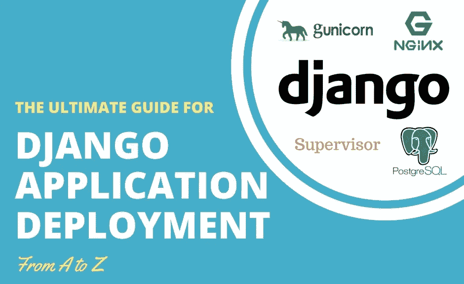
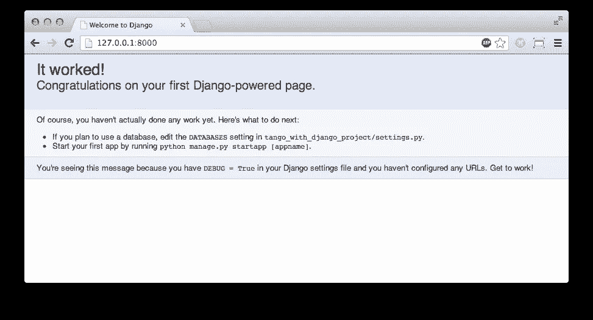
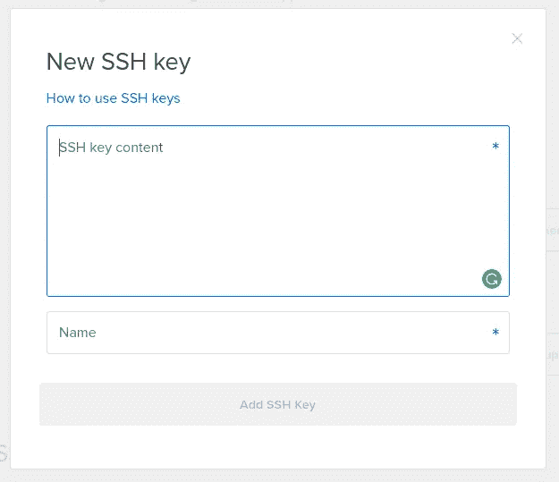
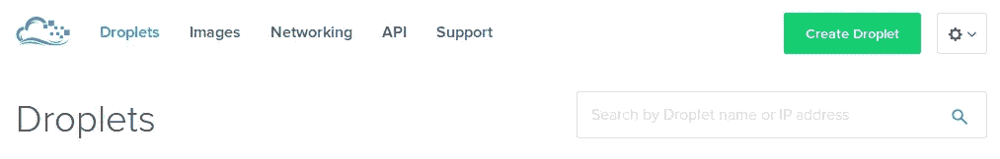
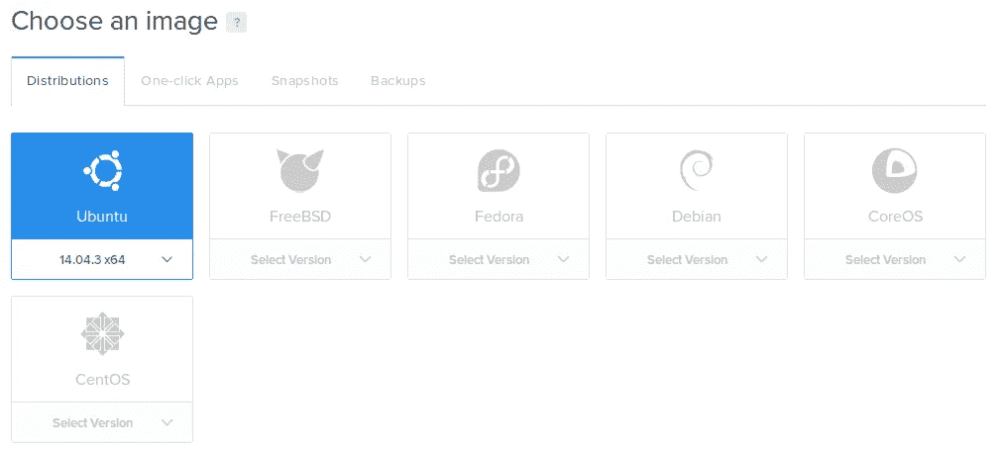
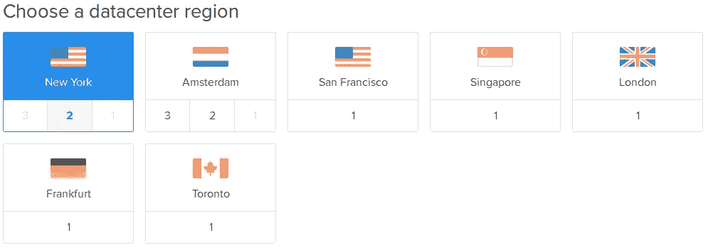
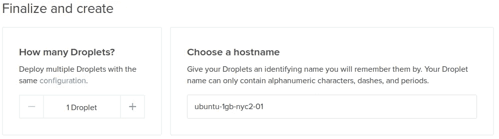

# 使用 Nginx、Gunicorn、PostgreSQL 和 Supervisor 部署 Django 应用程序

> 原文：<https://medium.com/hackernoon/deploy-django-app-with-nginx-gunicorn-postgresql-supervisor-9c6d556a25ac>



Django 是目前最流行的基于 Python 的 web 框架。Django 是强大的，健壮的，充满能力的，被一个支持的社区所包围。Django 基于模型、视图和模板，类似于其他 MVC 框架。

一旦您使用以下命令开始一个新项目，Django 将为您提供一个现成的开发服务器:

```
$ django-admin startproject my_project
$ python ./manage.py runserver 8000
```

通过终端中的两行代码，您可以在本地机器上拥有一个工作的开发服务器，这样您就可以开始编码了。对于 Django 来说，一个棘手的部分是部署项目，以便它可以在全球不同的设备上使用。作为技术企业家，我们不仅需要开发具有后端和前端的应用程序，还需要将它们部署到生产环境中，这种环境必须是模块化的、可维护的，当然也是安全的。



Django 应用程序的部署需要不同的机制，下面将列出这些机制。在我们开始之前，我们需要对我们将在本文中使用的工具进行调整:

1.  Python 版本 2.7.6
2.  Django 版本 1.11
3.  在[数字海洋云提供商](https://m.do.co/c/f441a74808c9)上托管的 Linux Ubuntu 服务器
4.  [Linux Ubuntu 本地机](https://codingstartups.com/moved-windows-linux-lessons-learned/)
5.  包含代码库的 Git 存储库

我假设你已经在用 1，2，4，5 了。关于 Linux 服务器，我们将在部署教程的第一步中一起创建它。请注意，这篇文章讨论了在单个 Ubuntu 服务器上的部署。这种配置非常适合小型项目，但是为了扩展您的资源以支持更大的流量，您应该考虑使用负载平衡器、浮动 IP 地址、冗余等[高可用性服务器基础设施](https://codingstartups.com/scaling-saas-product-infrastructure-high-availability/)。

在提供网络应用方面，Linux 比 Windows 更受欢迎。此外，Python 和 Django 在 Linux 上配合得很好，而在 Windows 上[就不那么好了。](https://codingstartups.com/moved-windows-linux-lessons-learned/)

选择 DigitalOcean 作为云提供商有很多原因，特别是对于将部署在单个 droplet(digital ocean 术语中的虚拟服务器)上的小项目。DigitalOcean 是软件项目和初创公司的一个很好的解决方案，它们从小规模起步，逐步扩大规模。阅读更多关于[我对数字海洋和亚马逊网络服务](https://codingstartups.com/choose-cloud-computing-technology-startup/)在早期启动软件项目方面的比较。

在开始部署过程之前，我强烈建议您遵循一些设置 Django 项目的最佳实践。最佳实践包括使用虚拟环境、导出 requirements.txt 文件以及配置 settings.py 文件以用于多种环境。


这篇文章将涵盖 Django 项目在全新的 Linux Ubuntu 服务器上从头到尾的部署过程。除了 DigitalOcean 之外，您可以自由选择您最喜欢的云提供商进行部署。

如前所述，Django 的内置开发服务器很弱，不是为规模化而建的。您可以用它来开发您自己的 Django 项目，或者与您的同事分享，但仅此而已。为了在生产环境中为您的应用提供服务，我们需要使用几个组件，这些组件将相互通信并创造奇迹。托管 web 应用程序通常需要协调三个角色:

1.  网络服务器
2.  门
3.  应用

# 网络服务器

web 服务器从客户端(浏览器)接收 HTTP 请求，通常负责负载平衡、将请求代理给其他进程、提供静态文件、缓存等。web 服务器通常解释请求并将其发送给网关。常见的 web 服务器和 Apache 和 Nginx。在本教程中，我们将使用 Nginx(这也是我最喜欢的)。

# 网关

网关翻译从 web 服务器收到的请求，以便应用程序能够处理它。网关通常还负责日志记录和报告。我们将使用 Gunicorn 作为本教程的网关。

# 应用程序

您可能已经猜到，这个应用程序指的是您的 Django 应用程序。应用程序接受解释后的请求，使用您作为开发人员实现的逻辑对其进行处理，并返回响应。

假设您已经有了一个可以部署的 Django 项目，我们将按照以下步骤来部署您的项目:

1.  创造新的数字海洋微滴
2.  安装先决条件:pip、虚拟环境和 git
3.  从 Git 中提取 Django 应用程序
4.  设置 PostgreSQL
5.  使用 Supervisor 配置 Gunicorn
6.  配置 Nginx 监听请求
7.  保护您部署的应用程序:设置防火墙

# 创建一个液滴

[DigitalOcean](https://m.do.co/c/f441a74808c9) 中的一个水滴，指的是一个虚拟的 Linux 服务器，拥有 CPU、RAM 和磁盘空间。本教程的第一步是创建一个新的 droplet 并通过 SSH 连接到它。假设您的本地机器运行的是 Ubuntu，我们将创建一个新的 SSH 密钥对，以便在创建 droplet 后轻松安全地连接到它。使用 SSH 密钥(而不是密码)的连接更加简单和安全。如果您已经有一个 SSH 密钥对，那么您可以跳过创建过程。在本地计算机上，在终端中输入:

`$ ssh-keygen -t rsa`

您应该会得到另外两个问题，在哪里找到密钥(缺省值就可以了)以及是否要设置密码(不是必需的)。

现在，密钥对位于:

`/home/user/.ssh/`

其中`id_rsa.pub`是你的公钥，`id_rsa`是你的私钥。为了使用密钥对连接到远程服务器，公钥应该位于远程服务器上，私钥应该位于您的本地计算机上。

请注意，公钥可以位于您希望连接的每个远程服务器上。但是，私钥必须只保存在您的本地计算机上！共享私钥将使其他用户能够连接到您的服务器。

在与 [DigitalOcean](https://m.do.co/c/f441a74808c9) 注册后，打开 [SSH 页面](https://cloud.digitalocean.com/settings/security)并点击 Add SSH Key 按钮。在您的终端中复制新创建的公钥:

`$ cat /home/user/.ssh/id_rsa.pub`

输入您生成的新公钥，并随意命名。



现在，一旦密钥储存在您的帐户中，您就可以将它分配给您创建的每个 droplet。droplet 将包含密钥，因此您可以从本地机器连接到它，而默认情况下密码验证将被禁用，这是强烈建议的。

现在我们准备创建我们的水滴。点击数字海洋仪表盘顶部的“创建 Droplet”。



选择 Ubuntu 16.04 64 位作为您的图像，液滴大小为 512MB RAM 或 1GB，任何对您有意义的区域。



您可以选择专用网络功能(这对于本教程并不重要)。确保选择您刚刚添加到帐户的 SSH 密钥。给你的新 droplet 命名，然后点击“创建”。



一旦创建了新的 droplet，您应该能够使用您创建的 SSH 密钥轻松地连接到它。为此，请从仪表板内的 droplet 页面复制您的 droplet 的 IP 地址，转到您的本地终端并键入:

`$ ssh root@IP_ADDRESS_COPIED`

确保用`IP_ADDRESS_COPIED`替换您的 droplet 的 IP 地址。你现在应该已经连接上了。

给高级用户的提示:如果您想要配置更简单的连接方式，请通过编辑文件为您的 droplet 添加一个替身:

`$ nano /home/user/.ssh/config`

并补充道:

```
Host remote-server-name
    Hostname DROPLET_IP_ADDRESS
    User root
```

确保用您选择的名称替换`remote-server-name`，用服务器的 IP 地址替换`DROPLET_IP_ADDRESS`。

点击`Ctrl+O`保存文件，然后用`Ctrl+X`关闭。现在，为了连接到您的 droplet，您只需键入:

`$ ssh remote-server-name`

就这么简单。

# 安装先决条件

一旦连接到您的 droplet，我们将安装一些软件，以便开始我们的部署过程。首先更新您的存储库并安装 pip 和 virtualenv。

```
$ sudo apt-get update $ sudo apt-get install python-pip python-dev build-essential libpq-dev postgresql postgresql-contrib nginx git virtualenv virtualenvwrapper
$ export LC_ALL="en_US.UTF-8"
$ pip install --upgrade pip
$ pip install --upgrade virtualenv
```

希望您在本地机器上使用虚拟环境。如果你不知道，我强烈推荐你阅读我的[关于建立 Django 项目的最佳实践的帖子](https://codingstartups.com/3-best-practices-better-setting-django-project/)，以便理解为什么使用虚拟环境是你的 Django 开发过程的重要部分。

让我们开始配置虚拟环境。用以下内容创建新文件夹:

```
$ mkdir ~/.virtualenvs
$ export WORKON_HOME=~/.virtualenvs
```

通过运行以下命令，配置虚拟环境包装器以便于访问:

`$ nano ~/.bashrc`

并将这一行添加到文件的末尾:

`. /usr/local/bin/virtualenvwrapper.sh`

提示:在 nano 编辑器中，使用`Ctrl+V`快速向下滚动，使用`Ctrl+Y`快速向上滚动。

点击`Ctrl+O`保存文件，点击`Ctrl+X`关闭文件。在您的终端中键入:

`$ . .bashrc`

现在，您应该能够为 Django 项目创建新的虚拟环境了:

`$ mkvirtualenv virtual-env-name`

从虚拟环境中安装:

`(virtual-env-name) $ pip install django gunicorn psycopg2`

提示:使用虚拟环境的有用命令:

```
$ workon virtual-env-name # activate the virtual environment
$ deactivate              # deactivate the virtual environment
```

从 Git 提取应用程序

首先创建一个持有 Django 应用程序的新用户:

```
$ adduser django
$ cd /home/django
$ git clone REPOSITORY_URL
```

假设您的代码库已经位于 Git 存储库中，只需输入您的密码，您的存储库就会被克隆到您的远程服务器中。您可能需要添加执行`manage.py`的权限，方法是导航到您的项目文件夹(您刚刚克隆的文件夹)并键入:

`$ chmod 755 ./manage.py`

为了进一步简化虚拟环境，请通过键入以下命令将项目主文件夹的路径复制到虚拟环境设置中:

`$ pwd > /root/.virtualenvs/virtual-env-name/.project`

确保用虚拟环境的真实名称替换`virtual-env-name`。现在，一旦您使用`workon`命令激活您的虚拟环境，您将被自动导航到您项目的主路径。

为了正确设置环境变量，请键入:

`$ nano /root/.virtualenvs/virtual-env-name/bin/postactivate # replace virtual-env-name with the real name`

并将这一行添加到文件中:

`export DJANGO_SETTINGS_MODULE=app.settings`

确保将`app.settings`替换为 Django 应用程序中设置模块的位置。保存并关闭文件。

假设您已经按照 [Django 最佳实践帖子](https://codingstartups.com/3-best-practices-better-setting-django-project/)中的描述设置了`requirements.txt file`，现在您可以通过导航到`requirements.txt`文件的路径并从您的虚拟环境中运行来一次安装您的所有需求:

`(virtual-env-name) $ pip install -r requirements.txt`

设置 PostgreSQL

假设您已经按照 [Django 最佳实践帖子](https://codingstartups.com/3-best-practices-better-setting-django-project/)中的描述设置了您的设置模块，那么您现在应该已经将开发和生产设置文件分开了。您的`production.py`设置文件也应该包含 PostgreSQL 连接设置。如果没有，请在文件中添加:

```
DATABASES = {
    'default': {
        'ENGINE': 'django.db.backends.postgresql',
        'NAME': 'app_db',
        'USER': 'app_user',
        'PASSWORD': 'password',
        'HOST': 'localhost',
        'PORT': '5432',
    }
}
```

我强烈建议在您的本地机器上更新和推送文件，并使用我们克隆的存储库从远程服务器上提取它。

让我们开始创建生产数据库。在终端内，键入:

`$ sudo -u postgres psql`

现在您应该在 PostgreSQL 终端内部了。使用以下内容创建您的数据库和用户:

```
> CREATE DATABASE app_db; 
> CREATE USER app_user WITH PASSWORD 'password'; 
> ALTER ROLE app_user SET client_encoding TO 'utf8'; 
> ALTER ROLE app_user SET default_transaction_isolation TO 'read committed'; 
> ALTER ROLE app_user SET timezone TO 'UTC'; 
> ALTER USER app_user CREATEDB; 
> GRANT ALL PRIVILEGES ON DATABASE app_db TO app_user;
```

确保您的详细信息与上述`production.py`设置文件数据库配置相匹配。通过键入`\q`退出 PostgreSQL shell。

现在，您应该准备好在新数据库上运行 migrations 命令了。假设您的所有迁移文件夹都在`.gitignore`文件中，这意味着它们没有被推送到存储库中，那么您的迁移文件夹应该是空的。因此，您可以通过使用以下命令导航到主项目路径来设置 DB:

`(virtual-env-name) $ cdproject`

然后运行:

【T2
`(virtual-env-name) $ python ./manage.py makemigrations`
`(virtual-env-name) $ python ./manage.py migrate`

不要忘记通过键入以下命令为自己创建一个超级用户:

`(virtual-env-name) $ python ./manage.py createsuperuser`

# 使用 Supervisor 配置 Gunicorn

现在，一旦应用程序设置正确，就该配置网关向 Django 应用程序发送请求了。我们将使用 Gunicorn 作为我们的网关，这是常用的。

首先，通过键入以下命令导航到项目的主路径:

`(virtual-env-name) $ cdproject`

首先，我们将通过键入以下命令来测试 gunicorn:

`(virtual-env-name) $ gunicorn --bind 0.0.0.0:8000 app.wsgi:application`

确保将`app`替换为您的应用名称。一旦 gunicorn 运行您的应用程序，您应该能够访问`http://IP_ADDRESS:8000`并看到您的应用程序在运行。

当你完成测试后，点击`Ctrl+C`停止 gunicorn 运行。

现在是时候从服务中操作 gunicorn 了，以确保它持续运行。与其建立一个`systemd`服务，我们不如用一种更健壮的方式来管理。顾名思义，Supervisor 是监视和控制流程的一个很好的工具。它帮助您更好地理解您的流程是如何运行的。

要安装 supervisor，请在虚拟环境外部键入:

`$ sudo apt-get install supervisor`

一旦 supervisor 运行，路径中包含的每个`.conf`文件:

`/etc/supervisor/conf.d`

表示受监控的进程。让我们添加一个新的`.conf`文件来监控 gunicorn:

`$ nano /etc/supervisor/conf.d/gunicorn.conf`

并添加到文件中:

```
[program:gunicorn] 
directory=/home/django/app-django/app command=/root/.virtualenvs/virtual-env-name/bin/gunicorn --workers 3 --bind unix:/home/django/app-django/app/app.sock app.wsgi:application 
autostart=true 
autorestart=true 
stderr_logfile=/var/log/gunicorn/gunicorn.out.log stdout_logfile=/var/log/gunicorn/gunicorn.err.log 
user=root 
group=www-data 
environment=LANG=en_US.UTF-8,LC_ALL=en_US.UTF-8[group:guni] 
programs:gunicorn
```

确保所有引用都已正确配置。保存并关闭文件。

现在，让我们通过运行以下命令来更新 supervisor，以监视我们刚刚创建的 gunicorn 进程:

```
$ supervisorctl reread $ supervisorctl update
```

为了验证流程的完整性，请使用以下命令:

`$ supervisorctl status`

到目前为止，gunicorn 作为一个内部进程运行，而不是一个可以被机器外部的用户访问的进程。为了开始向 gunicorn 和 Django 应用程序发送流量，我们将把 Nginx 设置为 web 服务器。

# 配置 Nginx

Nginx 是最流行的网络服务器之一。Nginx 和 Gunicorn 之间的集成是无缝的。在本节中，我们将设置 Nginx 向 Gunicorn 发送流量。为此，我们将创建一个新的配置文件(确保用您自己的应用名称替换`app`):

`$ nano /etc/nginx/site-available/app`

然后通过添加以下内容来编辑该文件:

```
server {
   listen 80; 
    server_name SERVER_DOMAIN_OR_IP; 
    location = /favicon.ico { access_log off; log_not_found off; } 
    location /static/ { 
        root /home/django/app-django/app; 
    } 
    location / { 
        include proxy_params; 
        proxy_pass http://unix:/home/django/app-django/app/app.sock; 
    } 
}
```

此配置会将请求代理到服务器中的适当路由。确保根据 Gunicorn 和您的应用配置正确设置所有参考。

启动与以下对象的链接:

`$ ln -s /etc/nginx/sites-available/app /etc/nginx/sites-enabled`

通过运行以下命令检查 Nginx 配置:

`$ nginx -t`

假设一切正常，通过运行以下命令重新启动 Nginx:

`$ systemctl restart nginx`

到目前为止，您应该只需在浏览器中键入您的 IP 地址就可以访问您的服务器，因为 Nginx 监听端口 80，这是浏览器使用的默认端口。

# 安全性

干得好！现在您应该已经部署了 Django 应用程序！现在是时候保护应用程序了，以确保它很难被破解。为了做到这一点，我们将使用`ufw`内置的 Linux 防火墙。

ufw 通过配置规则来工作。规则告诉防火墙应该接受或拒绝哪种流量。此时，我们希望接受两种流量，或者说，我们希望打开两个端口:

1.  端口 80，用于侦听通过浏览器传入的流量
2.  端口 22 能够通过 SSH 连接到服务器。

通过键入以下命令打开端口:

```
$ ufw allow 80 
$ ufw allow 22
```

然后通过键入以下命令启用`ufw`:

`$ ufw enable`

**提示:**在关闭终端之前，请确定您能够通过 SSH 从另一个终端连接到，这样您就不会因为防火墙的错误配置而被锁定在 droplet 之外。

# 下一步做什么？

这篇文章是在一台服务器上部署 Django 应用程序的终极指南。如果你正在开发一个应用程序来服务更大的流量，我建议你考虑高度可扩展的服务器架构。你可以从我关于如何设计高可用性服务器架构的帖子开始。

任何带有额外提示或新观点的评论都将受到高度赞赏！

更多关于具有企业家精神的程序员的真知灼见，请访问[https://codingstartups.com](https://codingstartups.com/)/

最初发表于[这里](https://codingstartups.com/deploy-django-nginx-gunicorn-postgresql-supervisor/)。