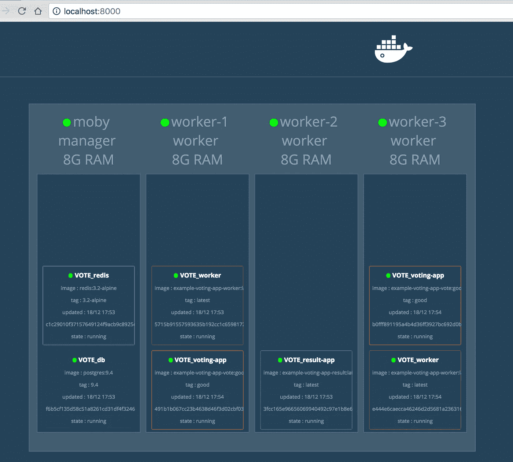

# 将 Docker Compose (v3)部署到 Swarm (mode)集群

> 原文：<https://medium.com/hackernoon/deploy-docker-compose-v3-to-swarm-mode-cluster-4159e9cca712>

> ***免责声明:*** *以下所有代码片段仅适用于****Docker 1.13+***

## TL；速度三角形定位法(dead reckoning)

**Docker 1.13** 将组合应用的部署简化为一个 [**swarm**](https://hackernoon.com/tagged/swarm) (mode)集群。而且你可以不用创建一个新的`dab` ( *发行版应用捆绑包*)文件，只需使用熟悉和众所周知的`docker-compose.yml`语法(有一些补充)和`--compose-file`选项。


## 群体集群

Docker 引擎 1.12 引入了一个新的**群模式**，用于本地管理一个名为**群**的 Docker 引擎集群。Docker **swarm mode** 实现 [Raft Consensus 算法](https://docs.docker.com/engine/swarm/raft/)，不再需要使用外部键值存储，如[consult](https://www.consul.io/)或 [etcd](https://github.com/coreos/etcd) 。

如果你想在开发者的机器上运行一个集群，有几种选择。

第一种选择，也是最广为人知的，是使用带有虚拟驱动程序的`docker-machine`工具(Virtualbox、Parallels 或其他)。

但是，在这篇文章中，我将使用另一种方法:使用[Docker-in-Docker](https://hub.docker.com/_/docker/)Docker 镜像和 Docker for Mac，更多细节请参见我的 [Docker Swarm cluster 和 docker-in-docker on MacOS](http://blog.terranillius.com/post/swarm_dind) 的文章。

# Docker 注册表镜像

当你在本地集群上部署一个新服务时，我建议设置本地 Docker 注册表镜像，并使用`--registry-mirror`选项运行所有集群节点，指向本地 Docker 注册表。通过运行本地 Docker 注册表镜像，您可以将大部分冗余图像获取流量保留在本地网络上，并加速服务部署。

# Docker 群集引导脚本

我准备了一个 shell 脚本，用 Docker 注册表镜像和非常好的 [swarm visualizer](https://github.com/ManoMarks/docker-swarm-visualizer) 应用程序来引导 4 节点 swarm 集群。

该脚本将 docker 引擎初始化为一个**群主机**，然后启动 3 个新的 docker-in-docker 容器，并将它们作为工作节点加入到**群**集群中。所有工作节点都使用`--registry-mirror`选项运行。

```
#!/bin/bash# vars
[ -z "$NUM_WORKERS" ] && NUM_WORKERS=3# init swarm (need for service command); if not created
docker node ls 2> /dev/null | grep "Leader"
if [ $? -ne 0 ]; then
  docker swarm init > /dev/null 2>&1
fi# get join token
SWARM_TOKEN=$(docker swarm join-token -q worker)# get Swarm master IP (Docker for Mac xhyve VM IP)
SWARM_MASTER=$(docker info --format "{{.Swarm.NodeAddr}}")
echo "Swarm master IP: ${SWARM_MASTER}"
sleep 10# start Docker registry mirror
docker run -d --restart=always -p 4000:5000 --name v2_mirror \
  -v $PWD/rdata:/var/lib/registry \
  -e REGISTRY_PROXY_REMOTEURL=[https://registry-1.docker.io](https://registry-1.docker.io) \
  registry:2.5# run NUM_WORKERS workers with SWARM_TOKEN
for i in $(seq "${NUM_WORKERS}"); do
  # remove node from cluster if exists
  docker node rm --force \
    $(docker node ls --filter "name=worker-${i}" -q) \
    > /dev/null 2>&1
  # remove worker container with same name if exists
  docker rm --force \
    $(docker ps -q --filter "name=worker-${i}") > /dev/null 2>&1
  # run new worker container
  docker run -d --privileged --name worker-${i} \
    --hostname=worker-${i} \
    -p ${i}2375:2375 \
    -p ${i}5000:5000 \
    -p ${i}5001:5001 \
    -p ${i}5601:5601 \
    docker:1.13-rc-dind \
      --registry-mirror [http://${SWARM_MASTER}:4000](http://${SWARM_MASTER}:4000)
  # add worker container to the cluster
  docker --host=localhost:${i}2375 swarm join \
    --token ${SWARM_TOKEN} ${SWARM_MASTER}:2377
done# show swarm cluster
printf "\nLocal Swarm Cluster\n===================\n"docker node ls# echo swarm visualizer
printf "\nLocal Swarm Visualizer\n===================\n"
docker run -it -d --name swarm_visualizer \
  -p 8000:8080 -e HOST=localhost \
  -v /var/run/docker.sock:/var/run/docker.sock \
  manomarks/visualizer:beta
```

# 部署多容器应用程序——“老”方法

Docker `compose`是一个用于定义和运行复合多容器 Docker 应用程序的工具(和部署规范格式)。在 Docker 1.12 之前，你可以使用`docker-compose`工具将这样的应用部署到 **swarm** 集群。在 1.12 版本中，这不再可能:`docker-compose`只能在单个 Docker 主机上部署您的应用程序。

为了将它部署到一个 **swarm** 集群，你需要创建一个`dab`格式的特殊部署规范文件(也称为*分发应用包*)(更多[见这里](https://github.com/docker/docker/blob/master/experimental/docker-stacks-and-bundles.md))。

创建这个文件的方法是运行`docker-compose bundle`命令。该命令的输出是一个 JSON 文件，它描述了多容器组合的应用程序，其 Docker 图像由`@sha256`引用，而不是标记。目前`dab`文件格式不支持来自`docker-compose.yml`的多个设置，也不允许使用来自`docker service create`命令的支持选项。

这是一个令人遗憾的故事:`dab` bundle 格式看起来很有前途，但是目前完全没有用(至少在 Docker 1.12 中)。

# 部署多容器应用程序——“新”方式

在 Docker 1.13 中，部署多容器组合应用程序的“新”方法是再次使用`docker-compose.yml`(*万岁！*)。向码头工人队致敬！

* **注意**:不需要`docker-compose`工具，只需要 **docker-compose** 格式的`yaml`文件(`version: "3"`)

```
$ docker deploy --compose-file docker-compose.yml
```

# Docker 编写 v3 ( `version: "3"`)

*那么，docker compose 版本 3 有什么新功能？*

首先，我建议你深入了解一下 [docker-compose schema](https://github.com/aanand/compose-file/blob/master/schema/data/config_schema_v3.0.json) 。它是众所周知的`docker-compose`格式的扩展。

**注意:** `docker-compose`工具(`ver. 1.9.0`)还不支持`docker-compose.yaml version: "3"`。

最明显的变化是围绕**蜂群**服务的部署。现在你可以指定`docker service create/update`命令支持的所有选项:

*   服务副本(或全局服务)的数量
*   服务标签
*   服务(容器)CPU 和内存的硬性和软性限制
*   服务重启策略
*   服务滚动更新策略
*   部署位置约束[链接](https://github.com/docker/docker/blob/master/docs/reference/commandline/service_create.md#specify-service-constraints---constraint)

# Docker 编写 v3 示例

我已经为经典的 ***“猫对狗”*** 例子创建了一个**“新的”**合成文件(v3)。该示例应用程序包含 5 个服务，部署配置如下:

1.  `voting-app` -一个 Python webapp，让你在两个选项之间投票；需要`redis`
2.  `redis` -收集新选票的 Redis 队列；部署在`swarm manager`节点上
3.  `db` -由 Docker 卷支持的 Postgres 数据库；部署在`swarm manager`节点上
4.  `result-app` - Node.js webapp，实时显示投票结果；2 个副本，部署在`swarm worker`节点上
5.  `worker`。消耗选票并将其存储在`db`中的网络工人；

*   **副本数量:** 2 个副本
*   **硬限制:**最大 25% CPU 和 512MB 内存
*   **软限制:**最大 25% CPU 和 256MB 内存
*   **位置:**仅在`swarm worker`节点上
*   **重启策略:**失败时重启，延迟 5 秒，最多尝试 3 次
*   **更新策略:**逐个更新，更新期间容许 10 秒延迟和 0.3 的故障率

```
version: "3"services:redis:
    image: redis:3.2-alpine
    ports:
      - "6379"
    networks:
      - voteapp
    deploy:
      placement:
        constraints: [node.role == manager]db:
    image: postgres:9.4
    volumes:
      - db-data:/var/lib/postgresql/data
    networks:
      - voteapp
    deploy:
      placement:
        constraints: [node.role == manager]voting-app:
    image: gaiadocker/example-voting-app-vote:good
    ports:
      - 5000:80
    networks:
      - voteapp
    depends_on:
      - redis
    deploy:
      mode: replicated
      replicas: 2
      labels: [APP=VOTING]
      placement:
        constraints: [node.role == worker]result-app:
    image: gaiadocker/example-voting-app-result:latest
    ports:
      - 5001:80
    networks:
      - voteapp
    depends_on:
      - dbworker:
    image: gaiadocker/example-voting-app-worker:latest
    networks:
      voteapp:
        aliases:
          - workers
    depends_on:
      - db
      - redis
    # service deployment
    deploy:
      mode: replicated
      replicas: 2
      labels: [APP=VOTING]
      # service resource management
      resources:
        # Hard limit - Docker does not allow to allocate more
        limits:
          cpus: '0.25'
          memory: 512M
        # Soft limit - Docker makes best effort to return to it
        reservations:
          cpus: '0.25'
          memory: 256M
      # service restart policy
      restart_policy:
        condition: on-failure
        delay: 5s
        max_attempts: 3
        window: 120s
      # service update configuration
      update_config:
        parallelism: 1
        delay: 10s
        failure_action: continue
        monitor: 60s
        max_failure_ratio: 0.3
      # placement constraint - in this case on 'worker' nodes only
      placement:
        constraints: [node.role == worker]networks:
    voteapp:volumes:
  db-data:
```

运行`docker deploy — compose-file docker-compose.yml VOTE`命令，在 **swarm** 集群上部署我版本的 ***【猫对狗】*** 应用程序。



Cats vs. Dogs on Swarm cluster

希望这篇文章对你有用。我期待您的评论和任何问题。

*最初发表于* [*Codefresh 博客*](https://codefresh.io/blog/deploy-docker-compose-v3-swarm-mode-cluster/) *。*

[](http://bit.ly/HackernoonFB)[](https://goo.gl/k7XYbx)[](https://goo.gl/4ofytp)

> [黑客中午](http://bit.ly/Hackernoon)是黑客如何开始他们的下午。我们是阿妹家庭的一员。我们现在[接受投稿](http://bit.ly/hackernoonsubmission)并乐意[讨论广告&赞助](mailto:partners@amipublications.com)机会。
> 
> 如果你喜欢这个故事，我们推荐你阅读我们的[最新科技故事](http://bit.ly/hackernoonlatestt)和[趋势科技故事](https://hackernoon.com/trending)。直到下一次，不要把世界的现实想当然！

