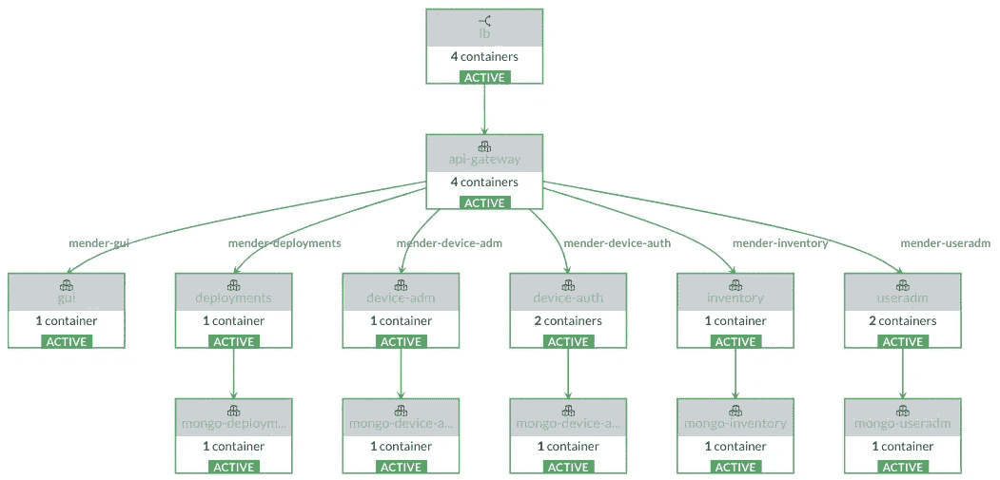
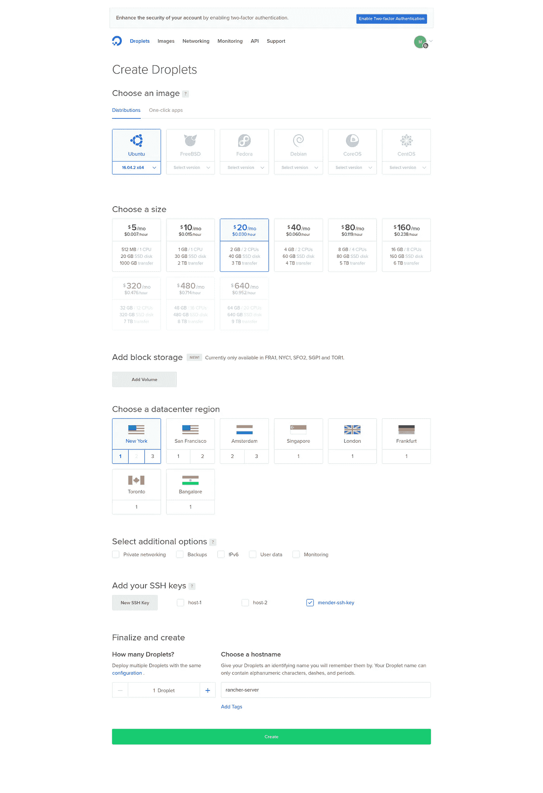
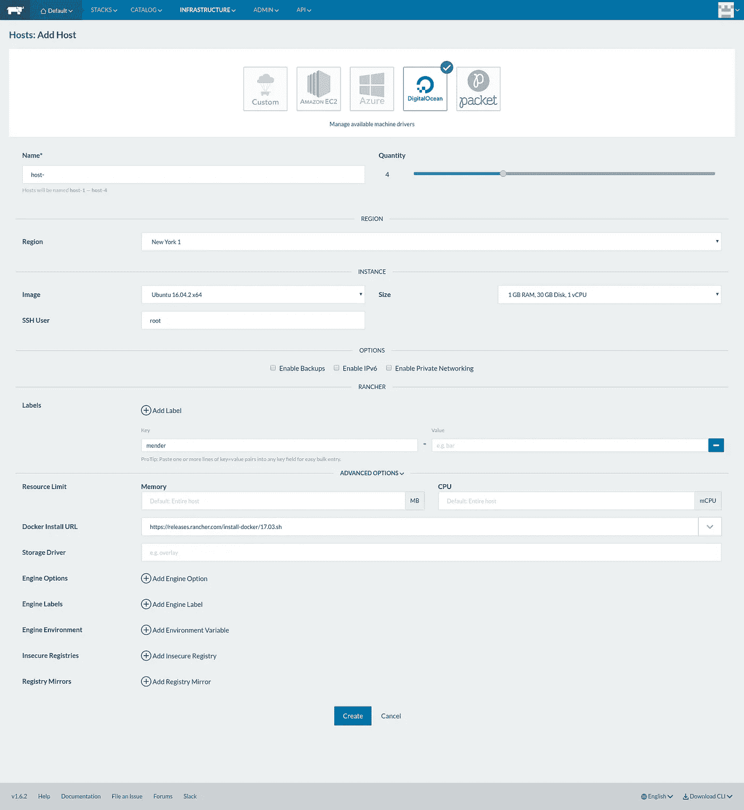
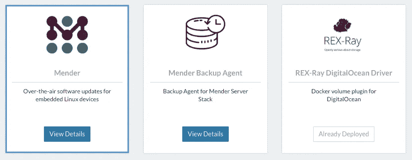
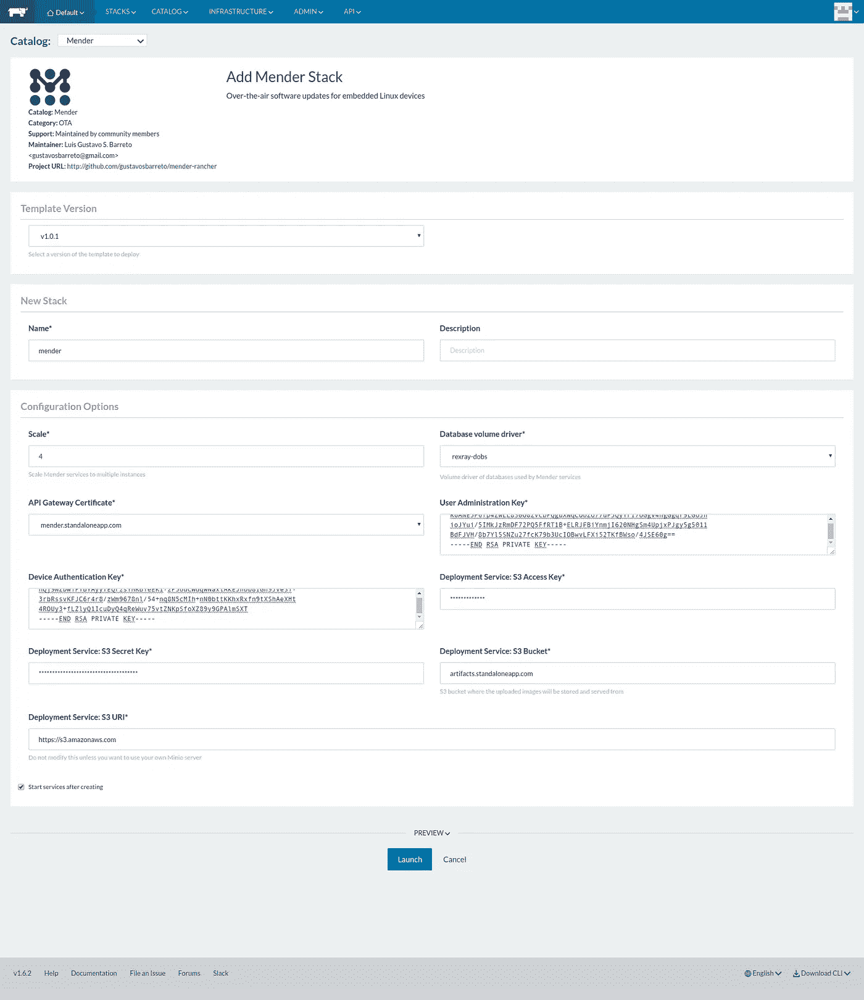

# 使用 Rancher 容器管理平台在数字海洋上部署修补程序

> 原文：<https://medium.com/hackernoon/deploy-mender-on-digitalocean-using-rancher-container-management-platform-5d844a8cdc95>

## 使用 Rancher 在数字海洋上部署修补服务器堆栈的交互式指南



Mender Server Containers Graph

# 什么是修理工？

  M   Mender 是一款针对嵌入式 Linux 设备的开源远程软件更新程序。

它支持通过无线或任何 TCP/IP 网络对远程连接设备的软件更新进行[管理](https://hackernoon.com/tagged/management)。您可以将基于映像的更新从修补程序服务器部署到您连接的一台或多台设备。

# 牧场主集装箱管理平台

正如您在“修补服务器容器图”中看到的，修补服务器有几个容器，很难维护一个运行所有修补服务器容器的主机集群，Rancher 使这变得容易。

# 先决条件

要完成本教程，您必须具备以下条件:

*   [数字海洋](https://hackernoon.com/tagged/digitalocean)账号创建**水滴**和**体积**
*   亚马逊 AWS 帐户创建一个 **S3 桶**用于存储**修补器工件**

# 每月成本估算

在准备生产的数字海洋上运行修补服务器有很多成本。下表描述了 DigitalOcean 在生产环境中维护和运行修补服务器实例的每月成本。

DigitalOcean monthly costs estimation

*   **第 1 项**:Rancher 服务器的 2GB RAM 的 1x Droplet 实例
*   **第 2 项**:4 个 1GB RAM 的小滴实例，用于维修服务
*   **第 3 项**:5x 10GB 容量，用于保存维修服务的数据库数据
*   **第 4 项** : 1x 数字海洋负载平衡器实例

# 步骤 1 —创建牧场主服务器 Droplet

首先，我们需要创建牧场主服务器 Droplet。Rancher Server 将负责在您的集群中创建和协调修补程序基础架构。

转到你的数字海洋仪表盘，创建一个名为**修理工**的新团队。切换到修补团队，使用以下配置创建一个新的 Droplet:



Rancher Server Droplet configuration

*   **发行版** : Ubuntu 16.04 x64
*   尺寸:20 美元/月
*   **数据中心区域**:纽约 1
*   添加您的公共 SSH 密钥(如果有)
*   将主机名设置为“牧场主服务器”

# 步骤 2 —启动 Rancher 服务器

完成 Rancher Server Droplet 供应后，您必须登录以启动 Rancher Server。

去你的**数字海洋仪表盘**复制牧场主服务器 Droplet 的 IP 地址。

现在，连接到 Rancher 服务器 Droplet，在您的计算机终端上运行以下命令:

```
$ ssh root@<RANCHER_SERVER_IP>
```

注意:将`<RANCHER_SERVER_IP>`替换为 Rancher 服务器 Droplet 的 IP 地址。

成功连接到 SSH 后，运行以下命令启动 Rancher 服务器:

```
$ curl [https://releases.rancher.com/install-docker/17.03.sh](https://releases.rancher.com/install-docker/17.03.sh) | sh
$ docker run -d -restart=unless-stopped \
             -p 8080:8080 \
             rancher/server:stable
```

Rancher 服务器启动只需要几分钟时间。

Rancher 服务器 UI 暴露在端口 8080 上，因此为了查看 UI，请转到 http:// `<RANCHER_SERVER_IP>` :8080

# 步骤 3 —配置牧场主服务器

默认情况下，Rancher Server 没有启用访问控制，这意味着**互联网上的任何人**都可以访问 Rancher Server UI。建议在启动 Rancher Server 后立即配置访问控制。

在“管理”选项卡中，单击“访问控制”。选择本地图标。通过提供**登录用户名**、**全名**和**密码**创建一个管理员用户。点击**启用本地认证**开启本地认证。

# 步骤 4 —添加牧场主主机

要添加 Rancher 主机，请访问 Rancher 服务器 UI 并单击**基础设施**，这将立即将您带到**主机**页面。点击**添加主机**。Rancher 将提示您选择一个主机注册 URL。这个 URL 是 Rancher server 运行的地方，并且必须可以从您将要添加的所有主机上访问。点击**保存**即可。

默认情况下，将选择**自定义**选项，选择**数字海洋**图标，输入您的数字海洋**访问令牌**，点击**配置 Droplet。**

> 您可以在控制面板的[应用程序& API 部分](https://cloud.digitalocean.com/settings/api/tokens/new)生成数字海洋**访问令牌**。

在下一页中，为主机设置以下配置:



Rancher Host configuration

*   **名称**:主机-
*   **数量** : 4
*   **地区**:纽约 1
*   **标签**:修理者
*   **(高级选项)Docker 安装 URL:** v17.03.x

保留所有其他选项的默认值。点击**创建**，等待 Rancher 为您提供主机。

# 步骤 5-为牧场主安装修理工目录

[牧场主的修补程序目录](https://github.com/gustavosbarreto/mender-rancher)提供了模板，可以轻松部署修补程序服务器堆栈。



Templates of Mender Catalog for Rancher

在 Rancher Server UI 中，进入**管理** / **设置**并添加一个新的自定义目录:

*   **姓名**:修理工
*   **网址**:[https://github.com/gustavosbarreto/mender-rancher.git](https://github.com/gustavosbarreto/mender-rancher.git)
*   **分支**:主

# 步骤 6 —生成证书和密钥

有关生成证书和密钥的信息，请参见修补程序文档网站的[生成新密钥和证书部分](https://docs.mender.io/1.0/administration/certificates-and-keys#generating-new-keys-and-certificates)。

[](https://docs.mender.io/1.0/administration/certificates-and-keys#generating-new-keys-and-certificates) [## 证书和密钥|修补程序文档

### 修理工文件

mender documentation docs . mender . io](https://docs.mender.io/1.0/administration/certificates-and-keys#generating-new-keys-and-certificates) 

# 步骤 7 —部署修补服务器堆栈

在这一步中，我们将跨您在第 4 步中创建的 Rancher 主机部署一个修补服务器堆栈。

## 添加修补程序服务器证书

Mender 通过 HTTPS 使用安全的客户端-服务器通信。为了在 Rancher 负载均衡器中启用 HTTPS，您需要上传**私钥**和**证书**文件。

在 Rancher Server UI 中，转至**基础设施/证书**页面。要添加新证书，点击**添加证书**。

为证书提供一个**名称**和**描述**。如果您按照步骤 6 中的说明生成了证书，您必须上传`*keys-generated/certs/api-gateway/private.key*`作为**私钥**和`*keys-generated/certs/api-gateway/cert.crt*`作为**证书**。

## 为数字海洋块存储安装 Docker 卷插件

要为 Mender Server 的所有 MongoDB 实例启用持久存储，我们需要为 DigitalOcean 块存储安装 Docker 卷插件。Rancher 的修补程序目录还提供了一个基础结构模板，用于在所有 Rancher 主机上安装该插件。

在 Rancher Server UI 中，转到**目录/修补程序**并选择**雷克斯-雷数字海洋驱动程序**。在下一页中，输入以下配置:

*   **您的数字海洋访问令牌**
*   **DigitalOcean 默认音量大小** : 10

## 添加修补程序服务器堆栈

在牧场主服务器界面，转到**目录/修理工**，选择**修理工服务器**。在下一页中，输入以下配置:



Mender Stack configuration

1.  **刻度** : 4
2.  **数据库卷驱动**:保留默认值，除非你知道自己在做什么。
3.  **API 网关证书**:选择您之前添加的修补服务器证书。
4.  **用户管理键**:粘贴`keys-generated/keys/useradm/private.key`文件的内容。
5.  **设备认证 Ke** y:粘贴`keys-generated/keys/deviceauth/private.key`文件内容。
6.  **S3 访问键**:您的 AWS 访问键。
7.  **S3 秘钥**:你的 AWS 秘钥。
8.  S3·巴克 t:S3·巴克的名字，上传的修补器工件将在这里存储和提供服务。
9.  **S3·URI**:如果您想使用 AWS 的 S3，请保留默认值(推荐)。

> 要创建您的 AWS 访问和密钥，请参见 AWS 文档网站上的[管理您的 AWS 帐户的访问密钥](http://docs.aws.amazon.com/general/latest/gr/managing-aws-access-keys.html)。

# 步骤 8-设置数字海洋负载平衡器

在**数字海洋控制面板**中，从顶部导航栏中选择**网络**进入负载平衡器页面，然后点击**负载平衡器**。这将把我们带到负载平衡器页面。点击**创建负载平衡器**。在“创建负载平衡器”页中:


Load Balancer configuration

1.  给负载平衡器一个**名**。
2.  在**添加水滴**搜索“修理者”标签。
3.  选择 NYC1 作为**地区**。
4.  添加 **HTTPS** 转发规则

将所有其他选项保留默认值，并点击**创建负载平衡器**。

一旦创建了负载平衡器，其 IP 地址将自动出现在**负载平衡器**概述页面上。复制 IP 地址，并简单地在您的网络浏览器中打开它。

第一次访问 UI 时，会要求您创建初始用户。只需输入您的电子邮件和所需的密码，如下所示:


Mender initial screen

# 支持

Rancher 的修补程序目录还为 Rancher 备份代理提供了一个模板，使您能够备份修补程序服务器堆栈。

在牧场主服务器 UI 中，转到**目录/修补程序**并选择**修补程序备份代理**。在下一页中，输入以下配置:

1.  **S3 访问键**:您的 AWS 访问键。
2.  **S3 秘钥**:你的 AWS 秘钥。
3.  S3 桶:S3 桶名，备份工件将被上传到那里。
4.  **S3·URI**:如果想使用 AWS 的 S3，保留默认值(推荐)。
5.  **备份时间**:默认值为每天 00:00 一次。使用 crontab 语法更改备份时间。

# 就是这样

请随意浏览和贡献给牧场主补缀目录。

[](https://github.com/gustavosbarreto/mender-rancher) [## 古斯塔沃斯·巴雷托/修理工-牧场主

### 修补者-牧场主-修补者平台的牧场主模板

github.com](https://github.com/gustavosbarreto/mender-rancher) [](http://bit.ly/HackernoonFB)[](https://goo.gl/k7XYbx)[](https://goo.gl/4ofytp)

> [黑客中午](http://bit.ly/Hackernoon)是黑客如何开始他们的下午。我们是 [@AMI](http://bit.ly/atAMIatAMI) 家庭的一员。我们现在[接受投稿](http://bit.ly/hackernoonsubmission)并乐意[讨论广告&赞助](mailto:partners@amipublications.com)机会。
> 
> 如果你喜欢这个故事，我们推荐你阅读我们的[最新科技故事](http://bit.ly/hackernoonlatestt)和[趋势科技故事](https://hackernoon.com/trending)。直到下一次，不要把世界的现实想当然！

