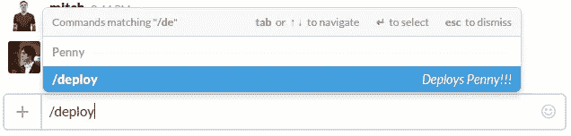
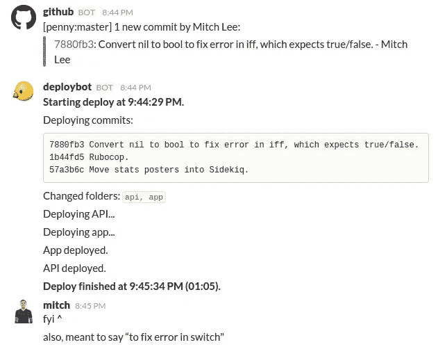

# /使用 Slack 部署您的系统

> 原文：<https://medium.com/hackernoon/deploy-your-system-with-slack-8cc1fdd2489f>



我们在 Penny 的两人团队每天部署超过五次。因为我们很小，我们缺少大多数成熟系统所拥有的安全措施，比如广泛的测试和特性分支。事实上，我们直接向 master 提交，并使用 CI 对 master 运行我们的一些端到端测试。我们的目标不是捕捉所有的 bug 或者测试我们所有的代码，而是用最少的努力保持高稳定性。对于我们的产品来说，投资复杂的工具链或者坚持 100%的测试覆盖率是适得其反的。

因此，快速轻松地部署比平时更加重要。通过更积极地部署来弥补更少的安全措施听起来可能不太直观，但这实际上比不频繁地部署要好得多，因为它加速了编写和测试代码之间的反馈循环——毕竟，您的代码将一直在生产环境中运行。如果出现错误，您将在编写代码后立即知道，而不是在以后进行其他工作时进行部署。它还减少了遇到 bug 时要搜索的提交集，因为任何 bug 都可能是由最近部署的一两个提交引起的。尽管小型和大型团队的具体工作流程可能有所不同，但是拥有一个简单的部署总是一个优势，因为它消除了[开发](https://hackernoon.com/tagged/development)的摩擦。



我们已经使用 Slack 的[定制命令集成](https://api.slack.com/slash-commands)实现了我们的部署系统。 [Slack](https://hackernoon.com/tagged/slack) 是一个让部署变得容易的绝妙渠道，因为它总是开放的，易于使用，并且不需要构建一个带有按钮的仪表板。您甚至可以将结果发布回 Slack，在那里它们会被自动记录。我们是这样做的:

## 1.配置斜线命令

[到这里为/deploy](https://my.slack.com/services/new/slash-commands/) 配置斜线命令。您将需要一个可公开访问的 HTTP(S)端点，这将取决于您的系统是如何配置的。您还将收到一个令牌，Slack 使用它向您验证自己，这样随机的人就不能调用您的部署端点。

## 2.创建 HTTP 端点

这将取决于您的系统和设置。我们在机架上运行 Sinatra，所以我们在部署路线上安装了一个监听器。

```
class DeployListener  
  def call(env)
    begin
      req = Rack::Request.new(env)
      if req.params['token'] != '<Slack token from configuration>'
        raise 'Not allowed.'
      end

      # Deploy code goes here.
      # For a Ruby deployment, it may be as easy as system('git pull && bundle install && <restart webserver>')

      [200, {}, 'Deploy started.']
    rescue StandardError => e
      [500, {}, e.inspect]
    end
  end
end

map '/api/deploy' do  
  run DeployListener.new
end
```

所以我们 Slack 的端点是[https://<server>/API/deploy。](https://%3Cserver%3E/api/deploy.)

## 3.运行您的部署

此时，您将向您的侦听器添加部署代码，或者如果您已经编写了部署脚本，则从侦听器中调用它。这里有一个问题:如果您在与系统代码的其余部分相同的进程中运行监听器，并在部署期间重新启动系统，您可能会意外地让监听器终止它自己的进程，从而阻止它自己重新启动。我们通过分叉流程并在子流程中运行部署脚本来解决这个问题。当孩子重启系统时，父代会被杀死重启，通常不会影响到孩子。然后孩子会安静的退出。

我们的最终整合:

```
class DeployListener  
  def call(env)
    begin
      req = Rack::Request.new(env)
      if req.params['token'] != '<Slack token from configuration>'        raise 'Not allowed.'
      end

      fork do
        system('(cd /home/ubuntu/penny && ruby deploy.rb) >> /home/ubuntu/slack-deploy.log 2>&1')
      end

      [200, {}, 'Deploy started.']
    rescue StandardError => e
      [500, {}, e.inspect]
    end
  end
end

map '/api/deploy' do  
  run DeployListener.new
end
```

其中 deploy.rb 是我们的自定义部署脚本。请注意，如果通过 shell 运行，您的部署脚本可能会工作，但是如果在侦听器进程的上下文中运行，可能会出错，因为它有不同的路径和环境。将输出通过管道传输到文件对于调试此问题非常有用。

## 4.利润

这种集成是原始的，有点粗糙，但是它做了我们需要它做的事情。作为一个两人团队，我们渴望像这样的工作放大工具，以简化我们的工作并更快地移动。更不用说你可以从你的手机上**部署，这已经帮我们省了好几次了。如果你对我们正在部署的东西感兴趣，请点击[这里](https://www.pennyapp.io/?utm_medium=Medium&utm_source=Deploy Your System With Slack&utm_campaign=bottom)来看看:)**

[](http://bit.ly/HackernoonFB)[](https://goo.gl/k7XYbx)[](https://goo.gl/4ofytp)

> [黑客中午](http://bit.ly/Hackernoon)是黑客如何开始他们的下午。我们是 [@AMI](http://bit.ly/atAMIatAMI) 家庭的一员。我们现在[接受投稿](http://bit.ly/hackernoonsubmission)并乐意[讨论广告&赞助](mailto:partners@amipublications.com)机会。
> 
> 如果你喜欢这个故事，我们推荐你阅读我们的[最新科技故事](http://bit.ly/hackernoonlatestt)和[趋势科技故事](https://hackernoon.com/trending)。直到下一次，不要把世界的现实想当然！

[](https://goo.gl/Ahtev1)