# 在 AWS EC2 上部署 Go 应用程序

> 原文：<https://medium.com/hackernoon/deploying-a-go-application-on-aws-ec2-76390c09c2c5>

在本教程中，我将向您展示如何将 **Golang** app 部署到**亚马逊 EC2** 。你需要一个 AWS 账户。[你可以免费报名](http://aws.amazon.com/free)。

**1 —设置 EC2 实例**

创建帐户后，打开 [AWS 管理控制台](https://console.aws.amazon.com/)并点击 **EC2** :

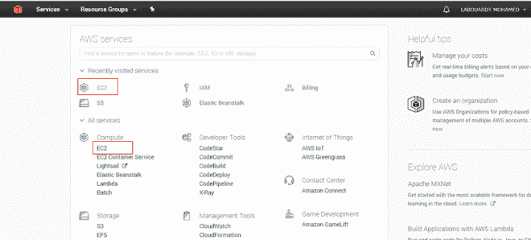

然后，点击**启动实例**:

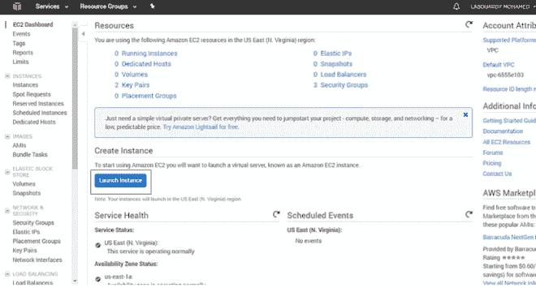

选择一个 **AMI** ( **亚马逊机器镜像**)。我们准备选择“**亚马逊 Linux AMI 2017.03.1 5 (HVM)，SSD 卷类型**”。确切的版本可能会随着时间的推移而改变。

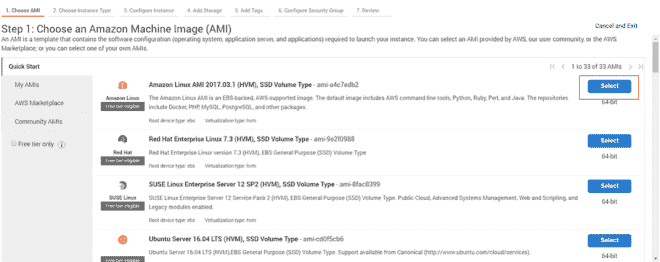

*注意*:还有其他的 Linux **AMI** 可以用，里面预装了 **Go** 等软件，以后可以作为快捷方式使用。但是对于我们的目的来说，如果您从一个干净的安装开始并自己配置一切，您将能够更好地理解将来如何管理和维护您的实例。

接下来，我们将为我们的实例选择硬件配置。因此，我们将使用最低规格和最便宜的配置“ **t2.micro** ”，这对于本教程来说已经足够了:

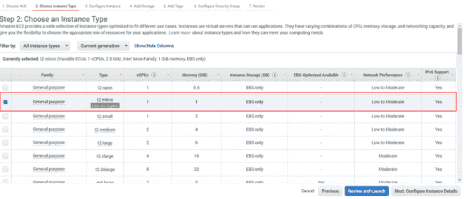

然后点击**配置实例详情**。我们将所有内容保留为默认设置，然后单击“**添加存储**

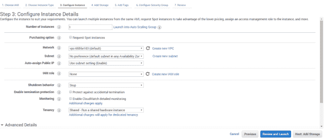

接下来，点击“**添加标签**”为我们的实例指定一个名称:

点击**配置安全组**。然后公开服务器将监听的端口号。对于这个演示，我制作了一个监听端口 3000 的应用程序，因此，我启用了 **HTTP 端口 3000** ，并将**源**列设置为“ **Anywhere 0.0.0.0/0** ”。

以上设置允许从**任何地方**访问端口 **3000** ，并且 **SSH 只能从**任何地方访问**。**

现在，点击“**审查并启动**”，然后点击“**启动**”。

当提示输入**密钥对**时，您可以选择现有的密钥对或创建新的密钥对。将**私钥文件**保存在安全的地方。稍后您需要通过 **SSH** 连接到您的实例。

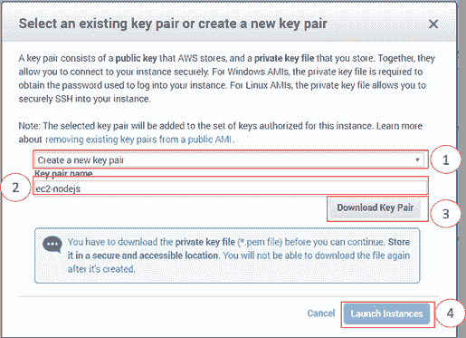

准备好后，选择“**启动实例**”:

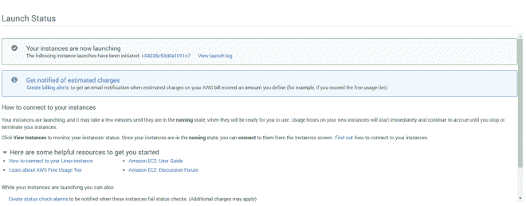

您的实例正在启动，这可能需要几分钟时间。单击实例页面上的 [**查看实例**](https://console.aws.amazon.com/ec2/home?#s=Instances) 链接，您将被重定向到您的“**我的实例**”页面，在这里您可以监视和配置您的 EC2 实例:

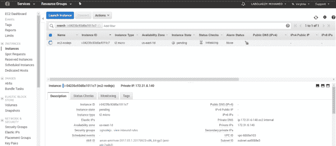

等到实例状态变为"**运行**，然后使用**公共 DNS** 通过 **SSH** 连接到您的服务。

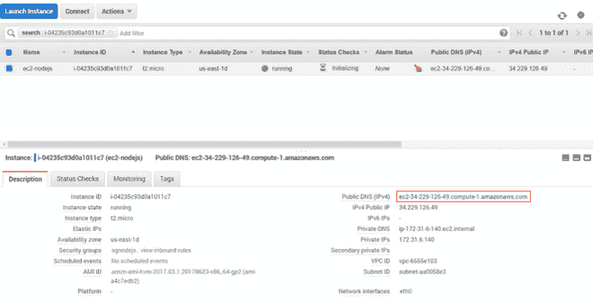

**2 —通过 SSH 连接到 AWS EC2**

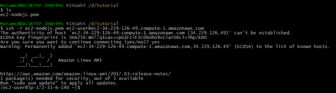

现在我们已经连接到实例，是时候安装 **Golang** 了。

**3 —在 EC2 上安装 Golang**

一旦连接到实例，使用 **yum** 配置管理器安装 **Go** :

> sudo yum 更新-y
> 
> sudo yum install -y golang

现在您需要为您的项目设置 **Go 环境变量**。通常需要设置 3 个环境变量，分别为 **GOROOT** 、 **GOPATH** 和 **PATH**

注意:以上所有命令将只为当前会话设置环境变量。为使其永久化，在 **'~/中添加上述命令。bash_profile'** 文件

在这一步，您已经成功地在系统上安装并配置了 go language。

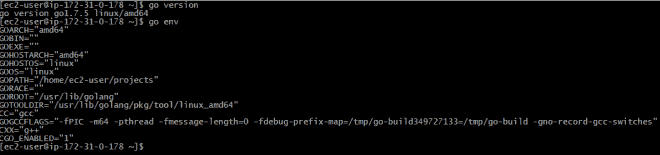

恭喜你！您有一个带有 Go 的工作 EC2 实例。

**4—Go 应用程序**

注意:如果您已经准备好部署自己的 Go 应用程序，则可以跳过这一步。

将以下内容放入名为“ **app.go** ”的文件中:

使用以下命令运行应用程序:

> 去运行 app.go

最后，如果您将您最喜欢的 web 浏览器(不是您的 IE)指向您实例的**公共 DNS 名称**，您应该会看到:

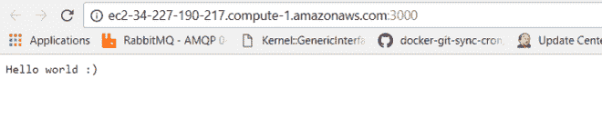

恭喜你！您已经将第一个 **Go** 应用程序部署到 **AWS EC2** 实例。

*注意*:如果你的应用监听的端口不是 3000，你可以把它添加到分配给 EC2 实例的安全组中。只需进入 EC2 菜单，然后点击“**安全组**”

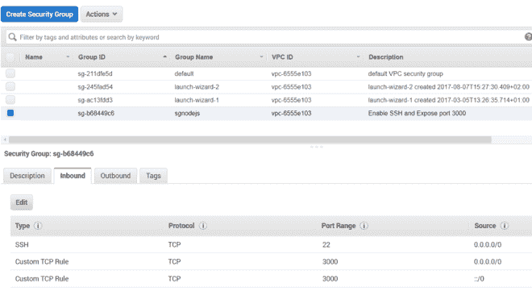

点击**编辑**，并遵循本教程**第一部分**中描述的相同步骤。

**5 —清理您的实例**

在您完成了为本教程创建的实例之后，您应该通过终止该实例来进行清理。

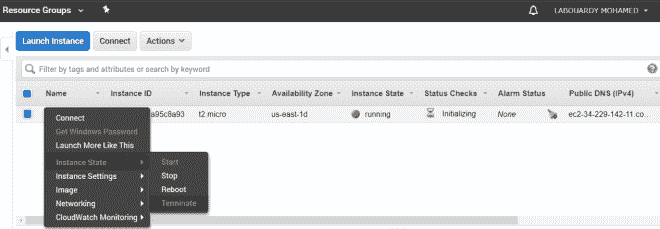