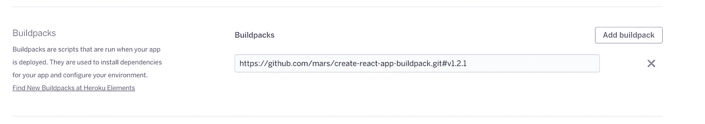
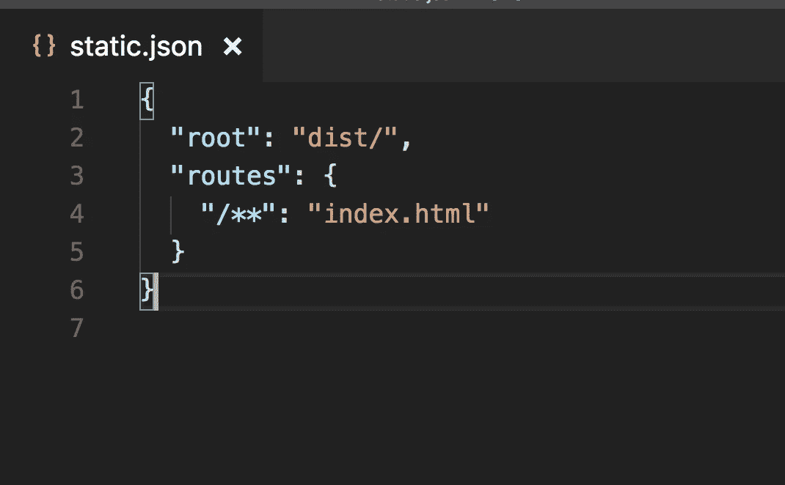
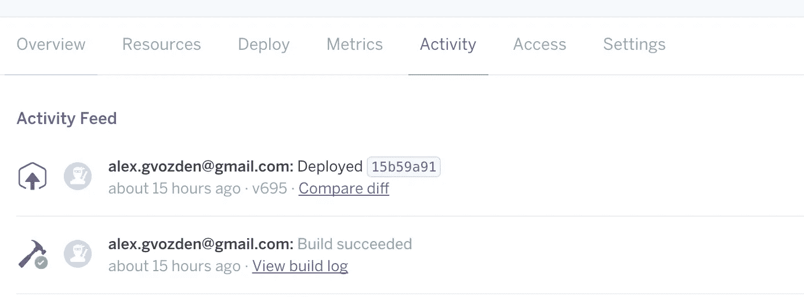

# 在 Heroku 上部署任何 React 应用

> 原文：<https://medium.com/hackernoon/deploying-any-react-app-to-heroku-1ee6db9b97d3>

毫无疑问，Heroku 是受欢迎的基础设施平台。运行自己的专用服务器的时代还没有过去，但是对于开发和低容量的目的，使用像 Heroku 这样的服务确实很有意义。

最近我在酷玩游戏[初创公司](https://hackernoon.com/tagged/startup)的 React 前端工作，是的，他们用 Heroku 做服务器。探索 Heroku 很有趣，因为我的经验主要是关于 Amazon AWS 和专用服务器。

在那里部署静态应用应该很容易，对吗？
至少他们是这么说的。

下面是文章[https://blog . heroku . com/deploying-react-with-ZERO-CONFIGURATION](https://blog.heroku.com/deploying-react-with-zero-configuration)
我没有使用 create-react-app，所以看起来我不能使用零配置部署选项:)

但是，作为一名开发者，我在引擎盖下挖掘了一下，下面是我的发现。

# 什么都有 JSON

首先，Heroku 使用一种叫做 [Buildpacks](https://devcenter.heroku.com/articles/buildpacks) 的东西在服务器上构建你的应用。

创建 react 应用程序 buildpack 被配置为构建服务 React 应用程序的静态节点服务器。它是基于[静态构建包](https://github.com/heroku/heroku-buildpack-static#configuration)的，这给了我一个提示，我们可以如何配置我们自己的库来支持 Create React App buildpack。

静态 buildpack 使用 static.json JSON 配置文件来指示服务器如何为您的应用程序提供服务。

所以基本上，在 Heroku 服务器上运行 React 应用程序所要做的就是…

## 1.配置 Heroku 以使用 Create React App buildpack

## 2.将 static.json 文件添加到我的项目存储库的根目录

就是这样。下次您推送连接到 Heroku 的 repo 时，app 将使用 Create React App buildpack 进行构建，并且它将基于 static.json 文件启动。

在这个基本示例中，我们设置了服务器的根目录，在我的例子中是 dist/

有关更多配置选项，请参考[静态构建包配置文件。](https://github.com/heroku/heroku-buildpack-static#configuration)

# 如果它在构建时被破坏…

在您的活动窗口中，您可以跟踪构建的进度。

构建可能会中断…就像这样:(

您可以查看构建日志，看看它是什么。我只在安装了一些新的依赖项后遇到了问题，可能是因为你使用了 Yarn，而我确实使用了 Yarn。

要解决此问题，请从您的回购中删除 yarn.lock，然后再次推送。然后 Heroku 将从头开始构建一个项目，它将会成功。

希望对你有所帮助，请关注我 [Alex Gvozden](https://medium.com/u/bf179e2f37a0?source=post_page-----1ee6db9b97d3--------------------------------) 了解更多 React 和 webdev 的内容。

我也可以按小时或全职工作。如果你想讨论，请随时打电话到 alex.gvozden@gmail.com[和我联系。](mailto:alex.gvozden@gmail.com)