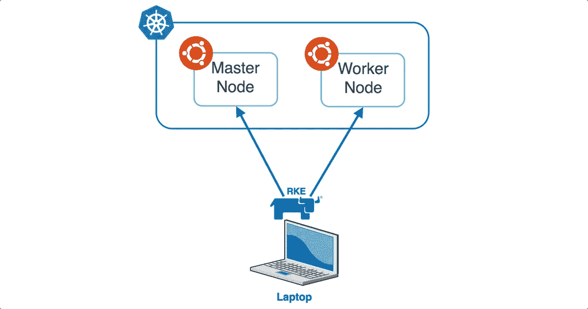
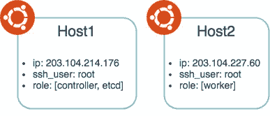

# 使用 RKE 在本地部署 Kubernetes 并在其上部署 OpenFaaS 第 1 部分

> 原文：<https://medium.com/hackernoon/deploying-kubernetes-on-premise-with-rke-and-deploying-openfaas-on-it-part-1-69a35ddfa507>

我是 Rancher 的忠实粉丝，对他们的 RKE (Rancher Kubernetes 引擎)将如何发展并简化我部署 Kubernetes 的方式感到非常兴奋。由于我在 OpenFaaS(一个开源的无服务器平台)上投入了大量的时间，我希望能够轻松地将它部署在 RKE 的 kubernetes 集群之上。在这篇文章中，我想展示:

*   如何使用 RKE 部署具有 2 个节点(1 个主节点和 1 个工作节点)的 kubernetes 集群
*   如何在通过 Helm 部署的 kubernetes 集群上部署 OpenFaaS

下图显示了组件的简单关系:



rke

# 先决条件

*   2 台可以运行 docker(版本。1.12 到 17.03)
    (我将使用 2 台 docker 17.03-ce 的 Ubuntu 16.04 主机)
*   我的每台主机都有 1 个 CPU 内核和 1GB RAM

# 使用 RKE 部署 Kubernetes 集群

如果你还没有读过“[宣布 RKE，一个轻量级的 Kubernetes 安装程序](http://rancher.com/announcing-rke-lightweight-kubernetes-installer/)”这本书，那就来看看吧。此外，如果您有时间，您应该观看“[使用 Rancher 2.0 管理 Kubernetes 集群—2017 年 11 月在线会议](https://www.youtube.com/watch?v=yanBgR7sOlI&t=332s)”，因为它解释了 Rancher 2.0 的最新功能以及关于 RKE 的信息。

**下载 RKE**

你可以从[这里](https://github.com/rancher/rke/releases)下载 RKE。这是一个简单的 CLI 工具来部署 Kubernetes。如果你用的是 OSX，你会下载`rke_darwin-amd64`。将其重命名为`rke`，不要忘记通过`chmod +x rke`给它执行权限。从这里开始，我假设您将`rke`添加到了`PATH`中。确认可以执行`rke`。您应该会看到类似这样的内容:

```
NAME:
   rke - Rancher Kubernetes Engine, Running kubernetes cluster in the cloudUSAGE:
   rke [global options] command [command options] [arguments...]VERSION:
   v0.0.8-devAUTHOR(S):
   Rancher Labs, Inc.COMMANDS:
     up              Bring the cluster up
     remove          Teardown the cluster and clean cluster nodes
     version         Show cluster Kubernetes version
     config, config  Setup cluster configuration
     help, h         Shows a list of commands or help for one commandGLOBAL OPTIONS:
   --debug, -d    Debug logging
   --help, -h     show help
   --version, -v  print the version
```

**创建 RKE 配置**

现在我们可以使用`rke`，让我们创建一个配置，以便将 Kubernetes 部署到我们的主机上。执行`rke config`，应该会提示你回答一些问题。下图描述了我的主机以及它们在 Kubernetes 中的角色。基本上，主机 1 将是主节点，主机 2 将是工作节点。



Host Description

考虑到这一点，我的`rke config`答案如下:

```
Cluster Level SSH Private Key Path [~/.ssh/id_rsa]:
Number of Hosts [3]: 2
SSH Address of host (1) [none]: 203.104.214.176
SSH Private Key Path of host (203.104.214.176) [none]:
SSH Private Key of host (203.104.214.176) [none]:
SSH User of host (203.104.214.176) [ubuntu]: root
Is host (203.104.214.176) a control host (y/n)? [y]: y
Is host (203.104.214.176) a worker host (y/n)? [n]: n
Is host (203.104.214.176) an Etcd host (y/n)? [n]: y
Override Hostname of host (203.104.214.176) [none]:
Internal IP of host (203.104.214.176) [none]:
Docker socket path on host (203.104.214.176) [/var/run/docker.sock]:
SSH Address of host (2) [none]: 203.104.227.60
SSH Private Key Path of host (203.104.227.60) [none]:
SSH Private Key of host (203.104.227.60) [none]:
SSH User of host (203.104.227.60) [ubuntu]: root
Is host (203.104.227.60) a control host (y/n)? [y]: n
Is host (203.104.227.60) a worker host (y/n)? [n]: y
Is host (203.104.227.60) an Etcd host (y/n)? [n]: n
Override Hostname of host (203.104.227.60) [none]:
Internal IP of host (203.104.227.60) [none]:
Docker socket path on host (203.104.227.60) [/var/run/docker.sock]:
Network Plugin Type [flannel]: calico
Authentication Strategy [x509]:
Etcd Docker Image [quay.io/coreos/etcd:latest]:
Kubernetes Docker image [rancher/k8s:v1.8.3-rancher2]:
Cluster domain [cluster.local]:
Service Cluster IP Range [10.233.0.0/18]:
Cluster Network CIDR [10.233.64.0/18]:
Cluster DNS Service IP [10.233.0.3]:
Infra Container image [gcr.io/google_containers/pause-amd64:3.0]:
```

快速提示:我的主机只有根用户，所以我使用`root`但是任何可以使用`docker`的用户都可以设置。此外，我正在使用`calico`进行网络连接，但是`flannel`和`canal`也受到支持(基于我同事的这个 PR[`weave`可能会在下一个版本中发布)。](https://github.com/rancher/rke/pull/81)

这会生成一个`cluster.yml`文件，内容应该是这样的:

```
nodes:
- address: 203.104.214.176
  internal_address: ""
  role:
  - controlplane
  - etcd
  hostname_override: ""
  user: root
  docker_socket: /var/run/docker.sock
  ssh_key: ""
  ssh_key_path: ""
- address: 203.104.227.60
  internal_address: ""
  role:
  - worker
  hostname_override: ""
  user: root
  docker_socket: /var/run/docker.sock
  ssh_key: ""
  ssh_key_path: ""
services:
  etcd:
    image: quay.io/coreos/etcd:latest
    extra_args: {}
  kube-api:
    image: rancher/k8s:v1.8.3-rancher2
    extra_args: {}
    service_cluster_ip_range: 10.233.0.0/18
  kube-controller:
    image: rancher/k8s:v1.8.3-rancher2
    extra_args: {}
    cluster_cidr: 10.233.64.0/18
    service_cluster_ip_range: 10.233.0.0/18
  scheduler:
    image: rancher/k8s:v1.8.3-rancher2
    extra_args: {}
  kubelet:
    image: rancher/k8s:v1.8.3-rancher2
    extra_args: {}
    cluster_domain: cluster.local
    infra_container_image: gcr.io/google_containers/pause-amd64:3.0
    cluster_dns_server: 10.233.0.3
  kubeproxy:
    image: rancher/k8s:v1.8.3-rancher2
    extra_args: {}
network:
  plugin: calico
  options: {}
auth:
  strategy: x509
  options: {}
addons: ""
system_images: {}
ssh_key_path: ~/.ssh/id_rsa
```

**将码头工人安装到主机上**

我将使用 Docker 17.03-ce 发布此帖子。Kubernetes 支持的任何版本都应该可以工作(本文将部署 Kubernetes 1.8.3)。安装 Docker 的简单方法之一是通过以下链接从 Rancher Labs 提供的外壳中安装:

[](http://rancher.com/docs/rancher/latest/en/hosts/) [## 牧场主

### 牧场主文件

rancher.com](http://rancher.com/docs/rancher/latest/en/hosts/) 

以下命令应适用于码头工人 17.03-ce:

```
curl [https://releases.rancher.com/install-docker/17.03.sh](https://releases.rancher.com/install-docker/17.03.sh) | sh
```

确认您的码头工人版本正确:

```
Client:
 Version:      17.03.2-ce
 API version:  1.27
 Go version:   go1.7.5
 Git commit:   f5ec1e2
 Built:        Tue Jun 27 03:35:14 2017
 OS/Arch:      linux/amd64Server:
 Version:      17.03.2-ce
 API version:  1.27 (minimum version 1.12)
 Go version:   go1.7.5
 Git commit:   f5ec1e2
 Built:        Tue Jun 27 03:35:14 2017
 OS/Arch:      linux/amd64
 Experimental: false
```

**注册授权 _ 密钥**

请确保您可以通过`ssh key`访问您的主机。假设您将使用私钥`~/.ssh/id_rsa`访问主机。您可能会在`~/.ssh/id_rsa.pub`拥有您的公钥，因此`cat`会复制内容。在每台主机中，将内容粘贴到`~/.ssh/authorized_keys`中。确认您可以通过`ssh`访问您的主机。

**关闭主机中的交换**

如果您正在使用自己的内部机器，很可能您的交换已经开启。Kubelet 将无法激活，比如说:

```
error: failed to run Kubelet: Running with swap on is not supported, please disable swap! or set --fail-swap-on flag to false. /proc/swaps contained:
```

禁用交换:

```
sudo swapoff -a
```

或者像这样用`fail-swap-on: false`设定您的`cluster.yml`:

```
kubelet:
  image: rancher/k8s:v1.8.3-rancher2
  extra_args:
    fail-swap-on: false
```

**部署库本内特斯！**

你们都准备好了！确认您在`cluster.yml`目录下，执行`rke up`。是的，就是这样！您应该看到`rke`为 Kubernetes 部署组件以在指定的主机上工作。

```
INFO[0000] Building Kubernetes cluster
INFO[0000] [ssh] Setup tunnel for host [203.104.214.176]
INFO[0000] [ssh] Setup tunnel for host [203.104.214.176]
INFO[0001] [ssh] Setup tunnel for host [203.104.227.60]
INFO[0002] [certificates] Generating kubernetes certificates
INFO[0002] [certificates] Generating CA kubernetes certificates
INFO[0002] [certificates] Generating Kubernetes API server certificates
INFO[0002] [certificates] Generating Kube Controller certificates
INFO[0002] [certificates] Generating Kube Scheduler certificates
INFO[0003] [certificates] Generating Kube Proxy certificates
INFO[0003] [certificates] Generating Node certificate
INFO[0004] [certificates] Generating admin certificates and kubeconfig
INFO[0004] [reconcile] Reconciling cluster state
INFO[0004] [reconcile] This is newly generated cluster
INFO[0004] [certificates] Deploying kubernetes certificates to Cluster nodes
INFO[0023] Successfully Deployed local admin kubeconfig at [./.kube_config_cluster.yml]
INFO[0023] [certificates] Successfully deployed kubernetes certificates to Cluster nodes
INFO[0023] [etcd] Building up Etcd Plane..
INFO[0023] [etcd] Pulling Image on host [203.104.214.176]
INFO[0028] [etcd] Successfully pulled [etcd] image on host [203.104.214.176]
INFO[0028] [etcd] Successfully started [etcd] container on host [203.104.214.176]
INFO[0028] [etcd] Successfully started Etcd Plane..
INFO[0028] [controlplane] Building up Controller Plane..
INFO[0028] [controlplane] Pulling Image on host [203.104.214.176]
INFO[0086] [controlplane] Successfully pulled [kube-api] image on host [203.104.214.176]
INFO[0087] [controlplane] Successfully started [kube-api] container on host [203.104.214.176]
INFO[0087] [controlplane] Pulling Image on host [203.104.214.176]
INFO[0089] [controlplane] Successfully pulled [kube-controller] image on host [203.104.214.176]
INFO[0089] [controlplane] Successfully started [kube-controller] container on host [203.104.214.176]
INFO[0090] [controlplane] Pulling Image on host [203.104.214.176]
INFO[0092] [controlplane] Successfully pulled [scheduler] image on host [203.104.214.176]
INFO[0092] [controlplane] Successfully started [scheduler] container on host [203.104.214.176]
INFO[0092] [controlplane] Successfully started Controller Plane..
INFO[0092] [worker] Building up Worker Plane..
INFO[0092] [worker] Pulling Image on host [203.104.214.176]
INFO[0095] [worker] Successfully pulled [kubelet] image on host [203.104.214.176]
INFO[0095] [worker] Successfully started [kubelet] container on host [203.104.214.176]
INFO[0095] [worker] Pulling Image on host [203.104.214.176]
INFO[0097] [worker] Successfully pulled [kube-proxy] image on host [203.104.214.176]
INFO[0098] [worker] Successfully started [kube-proxy] container on host [203.104.214.176]
INFO[0098] [worker] Pulling Image on host [203.104.227.60]
INFO[0103] [worker] Successfully pulled [nginx-proxy] image on host [203.104.227.60]
INFO[0103] [worker] Successfully started [nginx-proxy] container on host [203.104.227.60]
INFO[0103] [worker] Pulling Image on host [203.104.227.60]
INFO[0156] [worker] Successfully pulled [kubelet] image on host [203.104.227.60]
INFO[0156] [worker] Successfully started [kubelet] container on host [203.104.227.60]
INFO[0156] [worker] Pulling Image on host [203.104.227.60]
INFO[0159] [worker] Successfully pulled [kube-proxy] image on host [203.104.227.60]
INFO[0159] [worker] Successfully started [kube-proxy] container on host [203.104.227.60]
INFO[0159] [worker] Successfully started Worker Plane..
INFO[0159] [certificates] Save kubernetes certificates as secrets
INFO[0177] [certificates] Successfuly saved certificates as kubernetes secret [k8s-certs]
INFO[0177] [state] Saving cluster state to Kubernetes
INFO[0177] [state] Successfully Saved cluster state to Kubernetes ConfigMap: cluster-state
INFO[0177] [network] Setting up network plugin: calico
INFO[0177] [addons] Saving addon ConfigMap to Kubernetes
INFO[0177] [addons] Successfully Saved addon to Kubernetes ConfigMap: rke-network-plugin
INFO[0177] [addons] Executing deploy job..
INFO[0183] [addons] Setting up KubeDNS
INFO[0183] [addons] Saving addon ConfigMap to Kubernetes
INFO[0183] [addons] Successfully Saved addon to Kubernetes ConfigMap: rke-kubedns-addon
INFO[0183] [addons] Executing deploy job..
INFO[0188] [addons] KubeDNS deployed successfully..
INFO[0188] [addons] Setting up user addons..
INFO[0188] [addons] No user addons configured..
INFO[0188] Finished building Kubernetes cluster successfully
```

初始部署需要多长时间将取决于您的网络连接，因为`rke`需要获取 docker 映像，但如果没有，它将在几分钟内结束。在你看到`Finished building Kubernetes cluster successfully`之后，你应该会看到一个叫做`.kube_config_cluster.yml`的文件。您可以在这个配置中使用`kubectl`。使用以下命令确认您的节点正在工作:

```
kubectl --kubeconfig .kube_config_cluster.yml get all --all-namespaces
```

您应该可以获得关于您的 kubernetes 集群的所有信息。

# 包裹

很简单，不是吗？你可以很容易地创建一个 kubernetes 集群，即使是在你家的环境中(我就是这么做的)。第 1 部分着重于创建一个 kubernetes 集群。在[第二部分](/@kenfdev/deploying-kubernetes-with-rke-and-deploying-openfaas-on-it-part-2-cc14004e7007)中，我想在它上面部署 OpenFaaS。