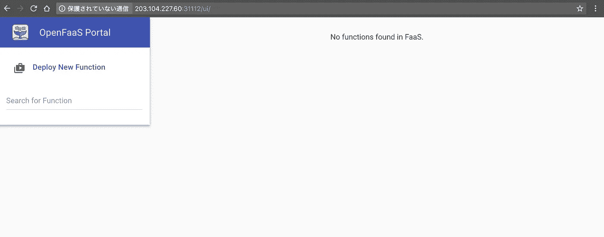
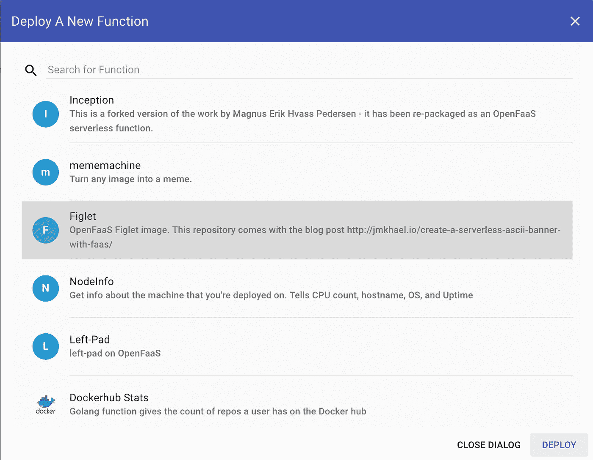
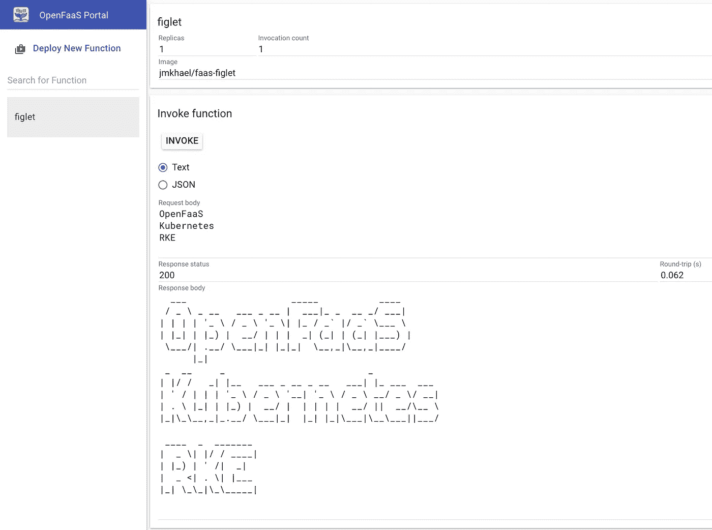

# 使用 RKE 在本地部署 Kubernetes 并在其上部署 OpenFaaS 第 2 部分

> 原文：<https://medium.com/hackernoon/deploying-kubernetes-on-premise-with-rke-and-deploying-openfaas-on-it-part-2-cc14004e7007>

在第 1 部分[中，我们使用 RKE (Rancher Kubernetes 引擎)部署了一个 Kubernetes 集群。现在我们有了一个工作的 Kubernetes 集群，让我们在其上部署](/@kenfdev/deploying-kubernetes-with-rke-and-deploying-openfaas-on-it-part-1-69a35ddfa507) [OpenFaaS](https://www.openfaas.com/) (一个开源的无服务器平台)！

这篇文章不会详细介绍 OpenFaaS。关于 Kubernetes 上 OpenFaaS 的相关介绍，你应该去看看[Alex Ellis](/devopslinks/getting-started-with-openfaas-on-minikube-634502c7acdf)(OpenFaaS 的创建者)写的《minikube 上 open FAAS 入门》。

# 先决条件

我假设:

*   您已经阅读了第 1 部分，并且拥有一个正在运行的 Kubernetes 集群
*   您的`kubectl`被设置为针对您在[第 1 部分](/@kenfdev/deploying-kubernetes-with-rke-and-deploying-openfaas-on-it-part-1-69a35ddfa507)上构建的 Kubernetes 集群
*   您的客户机上安装了 Helm

# 通过 Helm 部署 OpenFaaS

首先，让我们设置 Helm，首先为 tiller 创建一个服务帐户:

```
kubectl -n kube-system create sa tiller \
 && kubectl create clusterrolebinding tiller \
 --clusterrole cluster-admin \
 --serviceaccount=kube-system:tiller# serviceaccount “tiller” created
# clusterrolebinding “tiller” created
```

然后，安装舵杆:

```
helm init —-skip-refresh --upgrade --service-account tiller# $HELM_HOME has been configured at /Users/fukuyamaken/.helm.# Tiller (the Helm server-side component) has been installed into your Kubernetes Cluster.
# Happy Helming!
```

之后，让我们将名为`faas-netes`和`cd`的用于 OpenFaaS 的 kubernetes 扩展库克隆到那个目录中。Helm 所需的资源包含在该存储库中。

```
git clone https://github.com/openfaas/faas-netes && \
cd faas-netes
```

最后，将 OpenFaaS 部署到集群中。请注意，我们正在禁用 rbac，因为该群集的 rbac 配置不正确。

```
helm upgrade --install --debug --reset-values --set rbac=false --set async=false openfaas openfaas/
```

确认 Kubernetes 服务和部署正在使用`kubectl get svc,deployments`运行:

```
NAME                        TYPE        CLUSTER-IP      EXTERNAL-IP   PORT(S)          AGE
svc/alertmanager            ClusterIP   10.233.18.46    <none>        9093/TCP         4m
svc/alertmanager-external   NodePort    10.233.1.242    <none>        9093:31113/TCP   4m
svc/faas-netesd             ClusterIP   10.233.37.207   <none>        8080/TCP         4m
svc/faas-netesd-external    NodePort    10.233.26.167   <none>        8080:31111/TCP   4m
svc/gateway                 ClusterIP   10.233.55.73    <none>        8080/TCP         4m
svc/gateway-external        NodePort    10.233.57.162   <none>        8080:31112/TCP   4m
svc/kubernetes              ClusterIP   10.233.0.1      <none>        443/TCP          2h
svc/prometheus              ClusterIP   10.233.46.236   <none>        9090/TCP         4m
svc/prometheus-external     NodePort    10.233.15.159   <none>        9090:31119/TCP   4mNAME                  DESIRED   CURRENT   UP-TO-DATE   AVAILABLE   AGE
deploy/alertmanager   1         1         1            1           4m
deploy/faas-netesd    1         1         1            1           4m
deploy/gateway        1         1         1            1           4m
deploy/prometheus     1         1         1            1           4m
```

# 测试一下！

现在 OpenFaaS 已经在 Kubernetes 上运行了，让我们来测试一下吧！转到您的 worker 节点的端口`31112`(在我的例子中是`203.104.227.60:31112`)。您应该会看到类似以下截图的网关 UI:



OpenFaaS Gateway UI

让我们通过函数商店部署一个新函数。我喜欢约翰尼·姆哈尔制作的`Figlet`功能。让我们选择它并点击`Deploy`。



OpenFaaS Function Store

部署并刷新 UI 后，您应该会在函数列表中看到`figlet`。我们来输入一些很酷的单词和`INVOKE`功能。



Invoking the Figlet Function

厉害！OpenFaaS 运行在 RKE 部署的 Kubernetes 上(牧场主 Kubernetes 引擎)。2 个节点只有 1 个内核和 1GB RAM！请注意，由于缺乏资源，内存密集型和 cpu 密集型功能可能无法工作。在这种情况下，您应该添加更多具有资源的主机。

# 包裹

这篇由两部分组成的博客文章展示了通过 RKE 创建 Kubernetes 集群有多容易，以及在其上部署 OpenFaaS 有多容易。从这里开始，您也可以用 OpenFaaS 集成其他组件，这应该是一个很好的起点！