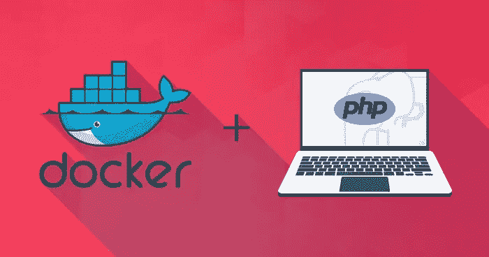
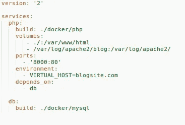
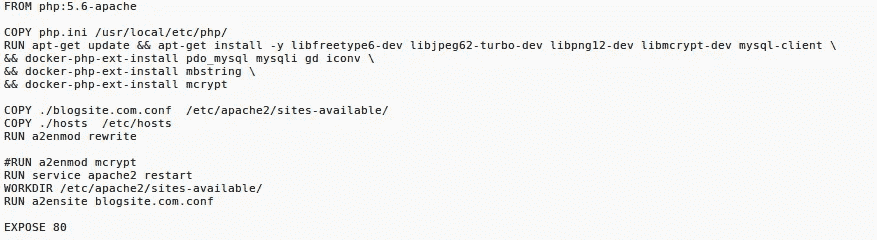
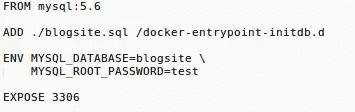
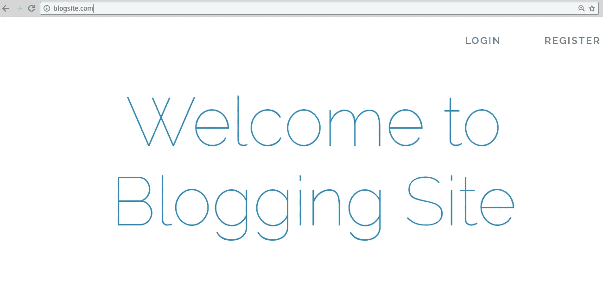
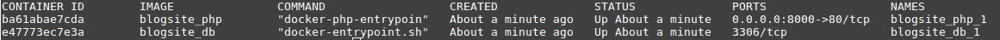

# 用 Docker 部署 PHP 应用程序

> 原文：<https://medium.com/hackernoon/deploying-php-apps-with-docker-8bccae5a33f7>

现代软件开发中的许多挑战之一是确保应用程序在所有环境中一致地执行。



> 最初发布于 2017 年 8 月 1 日[www.cloudways.com](https://www.cloudways.com/blog/docker-php-application/)

这就是码头工人来救援的地方！它为任何所需的服务提供了构建和运行容器的统一方式。该平台确保无论目标环境如何，您的应用程序都执行相同的操作。

为了说明 Dockerize PHP 应用程序的过程，我将 Dockerize 一个博客网站，最初是在 Laravel 5.4 中开发的。

为此，请确保您在机器上安装了 Docker。我将使用 docker-compose，它通过在单个文件中定义多容器应用程序并执行一个简单命令，使部署多容器应用程序变得容易。

在项目的根目录下，创建一个文件并命名为 **docker-compose.yml** 。文件中的代码如下所示:



# Docker-compose.yml 解释

在这段代码中，定义了两个名为 **php** 和 **db** 的服务，这两个服务将连接起来运行最终的应用程序。

**‘build’**定义相关服务的 Dockerfile 文件的位置。

“volume”将项目目录作为一个卷挂载到容器的 **/var/www/html** 中。日志目录也安装在相应的目录中。

**php** 容器暴露机器的端口 **8000** 并绑定到容器的端口 **80** 。这将允许访问应用程序

**环境**用于注入环境变量。

请记住，我可以通过指定 depends on 选项来强制 Docker 先构建一个容器，然后再构建另一个容器。然而，在这种情况下，将首先构建 **db** 容器，因为 **php** 容器依赖于它。

一旦创建了 docker-compose 文件，接下来我将创建各自的 docker 文件，其中包含构建容器映像的所有指令。

转到 Docker 目录，为 **php** 和 **db** 容器创建两个文件夹。

这两个 docker 文件如下所示:

# php Dockerfile



该文件以基础映像的定义开始(在本例中，是一个 PHP 5.6 基础映像)。您可以根据应用程序的需要，轻松地设置您想要的基本映像。接下来，我将几个文件复制到容器中。

# 数据库文档文件



在这个 dockerfile 文件中，我使用了 MySQL 5.6 作为基础映像。启动容器时，会创建一个具有指定名称的新数据库。我还包含了数据库 SQL 转储文件，该文件将在服务器创建后立即执行(因为它位于**/docker-entry point-initdb . d**)。

创建完所有文件后，转到应用程序的根目录，运行以下命令:

```
docker-compose up -d
```

该命令将在后台启动容器。第一次启动可能会很慢，因为必须下载所有的基本映像。然而，所有后续的发射都要快得多。

请注意，我还复制了容器中的 hosts 文件(包含以下文本)。

```
127.0.0.1 blogsite.com
```

现在，您可以通过访问 http://localhost:8000 来访问该应用程序。因为我也在容器中复制了 hosts 文件，所以我也可以通过访问 URL http://blogsite.com 来访问应用程序。



您可以通过以下命令查看活动容器:

```
docker ps
```

下面是一个输出示例:



您还可以通过以下方式访问容器

```
docker exec -it <container_name> bash
```

看吧！对 PHP 应用程序进行 Dockerize 是多么简单。由于其重量轻，它可以很容易地被摧毁，并在短短几分钟内再次创造。