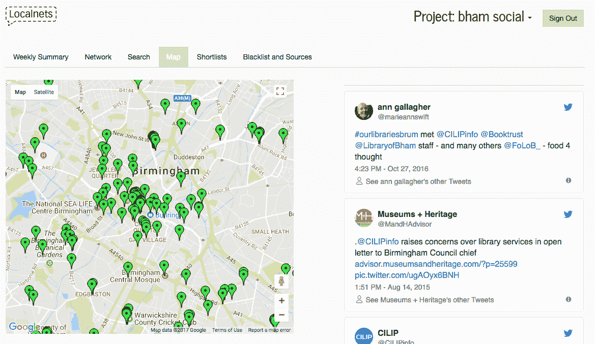
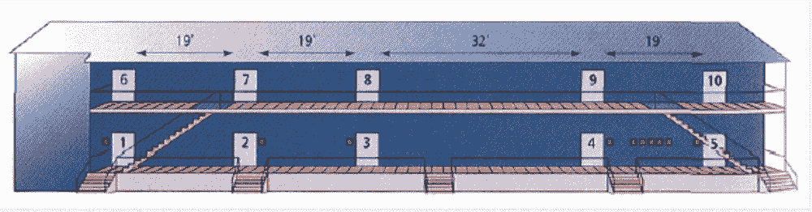
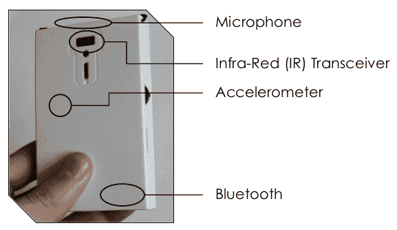

# 技术正在塑造我们的社会联系。设计师需要承担责任。

> 原文：<https://medium.com/hackernoon/design-choices-are-shaping-our-social-connections-designers-need-to-take-responsibility-f9526201eb49>

简要总结我的博士研究，设计更好的在线和离线社交网络。

[这是三篇文章之一，看看你的社交网络有多重要。第二个着眼于[社交网络的设计策略](/@jimmytidey/design-strategies-for-better-social-networks-276398ea1fe)，第三个着眼于[社交网络数据的政治](/@jimmytidey/social-network-data-twitter-vs-fb-vs-google-vs-everyone-else-830ea0291c86)。]

以下是宇宙中最令人打哈欠的陈述之一:这是我从博士学位中学到的。如果你能在关闭浏览器标签前给我两秒钟时间，我保证我会爬出我小小的博士天地，做你在论文中不被允许做的事情——切入有趣的部分。我的研究着眼于数字技术如何让我们以前所未有的细节测量我们的社交网络成为可能，数字技术如何塑造我们的社交关系，以及我们如何在考虑这些事实的情况下做出[设计](https://hackernoon.com/tagged/design)决策。

这篇文章探讨了你应该关注社交网络的一些原因——我指的是人与人之间的社交网络，无论是数字还是离线的。社会关系有力地塑造了我们的生活——快乐或悲伤，肥胖或消瘦，甚至健康或生病。我还将强调许多历史社交网络研究所依赖的相对低质量的数据，以及事情是如何开始改变的。我将继续发表两篇博文:第二篇是关于如何设计更好的社交网络的研究；第三个是关于社交网络数据的政治。

我博士学位的一个发现是，一个人所能从事的研究数量之少令人羞愧——甚至超过四年( *4 年！*)。我原以为会是我研究的主要部分——构建和测试社交网络分析软件的实际工作——实际上只起到了[麦高芬](https://en.wikipedia.org/wiki/MacGuffin)的作用，它是一个情节装置，为我在庞大而分散的现有社交网络文献中的旅程提供动力。

我将在下一段概述我的实际工作，然后转向更广阔的图景，尽管发生了一切( *4 年！*)，我还是觉得刺激。

*Localnets.org project in Birmingham (With NHS Birmingham Clinical Commissioning Group) showing a map based visualisation of Twitter activity*

我开发并测试了软件([localnets.org](http://www.localnets.org/))，该软件分析并可视化 Twitter 数据，以了解当地社区问题:人们对垃圾箱何时(未)被收集感到不安，对犯罪的看法，规划问题等。它还有助于识别“社区影响者”，即积极参与公民活动的当地个人。构建一个原型作为一种途径，可以深入到公共部门如何使用[社交媒体](https://hackernoon.com/tagged/social-media)数据的更广泛的政治和伦理问题。

完成了。

我的实际工作是关于地方政府的社交媒体数据，但我想扩大范围来谈谈社交关系的重要性。简而言之，人们的社会交往极其重要。我们凭直觉知道这一点，我们说有一个“老男孩网络”，它是“你认识的人”，以及许多类似的格言。我们知道相似的人会形成网络——“物以类聚……”。在中国文化中，术语[关系](https://en.wikipedia.org/wiki/Guanxi)反映了同样的概念，指的是一个特定个体的联系有多紧密。

数字技术使得衡量社交网络变得更加容易。它还会修改它们。也许技术改变社会联系的最明显的例子是在线约会——在原本不会相遇的人之间形成亲密的联系。约会应用程序从根本上改变了人们遇见生活伴侣的方式，导致不同种族间的婚姻增加——也就是说，从长远来看，改变了人口统计学。

如果约会应用程序强化了一种模式，即富人倾向于与另一个人约会，而不太富裕的人也不成比例地彼此约会，这将增加家庭不平等，因为富人成双成对，形成双富家庭。如果约会应用程序使人们在基于收入的社交圈之外相遇，它可能会减少收入不平等。谁最终与谁结婚的变化很容易导致收入不平等，就像高管薪酬这样的头条话题一样。据我所知，没有关于收入和网上约会的研究。

# 社会网络研究的历史

观察社交网络既重要又容易被改变并不是什么新鲜事。有影响力的心理学家利昂·费斯汀格在 1950 年发表了抓住这两种观点的研究。270 名麻省理工学院的学生被随机分配到 10 栋大楼的宿舍。一项后续调查询问学生们他们最亲密的三个朋友是谁。65%来自同一栋楼，41%来自相邻的宿舍。即使在身体上稍微接近某人，也会大大增加他们之间的社交联系。这可能是显而易见的，但相关性的强度是惊人的。许多人在大学里建立了终生的友谊。宿舍分配的意外，塑造了多少人生？

Diagram of a dorm building used in Festinger’s research.

1967 年，斯坦利·米尔格拉姆做了一个实验来测试“六度分离”概念，即任何随机的一对人类都可以通过一些朋友的朋友的朋友联系起来。在 1967 年，测量朋友之间的平均路径长度的唯一方法是发送随机地址的明信片，解释实验并要求收件人将信转发给指定的目标(提供了姓名和大致地址)。在(极有可能)他们不知道目标的情况下，收件人被指示将信转发给他们认识的人，他们认为这个人更有可能知道目标。

通过检查到达目标地址的信件，米尔格拉姆可以看到明信片平均被转发了 5.7 次，因此得出结论，任何两个美国人之间平均有 5.7 次社会联系。这种方法存在一些问题。大多数信件丢失了，降低了结果的统计有效性，而且人们不知道将明信片转发到目的地的最佳人选。我们的社会联系结构是人类社会的一个基本事实，然而，直到网络时代，它仍然几乎完全不透明。2012 年，研究非常精确地表明，在脸书用户背景下，相当于米尔格拉姆数的[为 4.74——这是全世界的数据。](https://arxiv.org/pdf/1111.4570.pdf)

“社会资本”的概念——粗略地说，就是你从社会关系中获得的总收益——可以追溯到 19 世纪 50 年代社会学的起源。关于我们的社会联系结构以及与其他现象的相关性，我们现在有了广泛的证据。我想强调一些最引人注目的结果，但也要指出它们大多基于薄弱的数据。自从米尔格拉姆的研究以来，我们还没有走这么远。尽管大型科技公司几乎肯定拥有极其详细的数据，但让这些数据变得可用却是一个很大的问题。

# 当代社会网络研究

我们所掌握的证据显示了社会关系的重要性。孤独经常被认为是发达国家的一个长期问题，根据一些分析，它正在[增加。说自己孤独的人](http://happierhuman.wpengine.netdna-cdn.com/wp-content/uploads/2014/06/P13.-Social-Isolation-in-America-Changes-in-Core-Discussion-Networks-over-Two-Decades.pdf)[死得更早](http://www.pnas.org/content/110/15/5797.long)，心理健康状况更差。在某种程度上，孤独是贫穷的社交网络等价物。

社会资本与健康和幸福相关。调查还显示，我们对幸福的主观体验植根于我们的社会关系:更富有并不会让你幸福(超过某一点)，但比你的朋友更富有会让你幸福。研究人员还利用这些数据来测试社会资本与 GDP 增长之间的联系，并发现了微小的正相关。

负面属性也通过网络传播。和肥胖的人做朋友[会让你更容易胖](http://www.sciencemag.org/news/2017/02/should-we-treat-obesity-contagious-disease)。如果你的朋友变得肥胖，他们会像传染病一样把肥胖传给你，就好像他们的体重增加给了你效仿的社会许可。

但围绕社交网络的经验数据往往很薄弱。我们之所以知道肥胖会“传染”,是因为弗雷明汉心脏研究，这是有史以来最大的医学研究之一，从 1948 年开始，有超过 5000 名参与者。这种数据来之不易。

研究主要依赖于社会资本的替代指标，例如“公民参与”——体育俱乐部的会员资格或国家选举的参与率。或者，调查会问这样的问题:“一般来说，你会说大多数人是可以信任的，还是说你在与人交往时越小心越好？”被认为反映了人们的社会关系。(此问题来自流行世界价值观调查)。

A sociometric badge, worn on a lanyard (from [Ben Waber](https://www.slideshare.net/MassTLC/ben-waber-people-analytics))

社交徽章是收集社交网络数据的另一种方式。社交徽章是挂在脖子上的电子设备。它们收集诸如语音模式(通过麦克风)以及佩戴者在何时何地进行面对面接触(通过红外收发器)等指标。这些徽章可以衡量办公室的离线、非数字社交网络。利用这些数据，研究人员能够识别办公室网络中缺失的高价值社会关系。研究人员随后进行干预，通过介绍人们相互认识来增加这些社会联系。他们的干预减少了发送电子邮件的数量，并使员工形容他们的工作场所“联系更好”。或者，你可以使用这些数据来观察[男性和女性如何形成不同的网络](https://hbr.org/2017/10/a-study-used-sensors-to-show-that-men-and-women-are-treated-differently-at-work)，这反过来可以为可能促进性别平等的干预措施提供信息。这些研究强调了高质量数据的好处，以及新技术如何越来越多地提供高质量数据。社交徽章可能很容易成为智能手机应用程序。

这给我们带来了巨大的隐私问题，复杂的伦理领域，以及研究社交网络固有的政治困难。同时，这也不是一个可以忽视的课题——技术越让我们理解网络的形成，我们的责任就越大。技术越改变社交网络，设计者的责任就越大。

# 社交网络驱动的设计

Sunstein 和 Thaler 的有影响力的书 *Nudge* 也主张那些做设计决定的人要承担道德责任，但是是在行为改变的背景下。他们在书的开头做了一个关于学校食堂的思维实验:水果应该放在哪里，巧克力应该放在哪里？在他们的书中，他们提供了实证证据，表明“选择架构”可以有多么强大——将苹果放在收银台旁边，并隐藏巧克力棒可以极大地改变健康结果。一旦有了水果摆放的经验证据，责任随之而来。没有中立的设定:营销决策是驱动行为。同样，随着我们越来越详细地了解社交网络是如何形成的，责任确保了这一点。

当然，有风险，但也有好处。在我关于 LocalNets 的工作中，一个意想不到的发现是本地非连锁商店在社交媒体生态中的重要性。Costa coffee outlet 不会运营自己的 Twitter 账户，但本地咖啡馆通常会，当它这样做时，它通常会催化周围的社区社交媒体活动。Twitter 数据为我们提供了一个我们一直怀疑的实证窗口——Costa 在生产咖啡方面可能非常高效，但本地商店也有社会价值。这些社会网络结构的证据越充分，反对侵蚀社区的市场力量的论点就越有力。

桑斯坦和泰勒的建议已经被应用于假想的学校食堂、[器官捐赠法](https://en.wikipedia.org/wiki/Nudge_(book))、[让你缴税](http://www.telegraph.co.uk/finance/personalfinance/tax/11147321/Five-tricks-or-nudges-HMRC-uses-to-make-you-pay-210m-extra.html)以及在摩洛哥提供[干净的饮用水](https://www.povertyactionlab.org/evaluation/household-water-connections-tangier-morocco)。社交网络的形成也有类似的应用多样性，从你的约会应用背后的算法到假新闻的传播，从日益加剧的政治极化到促进创新——即使社交网络的角度是一个比成熟的推动“行业”更有争议、更不发达的领域。

我的下一篇文章[将着眼于一些可以帮助设计师思考社交网络结构的设计策略](/@jimmytidey/design-strategies-for-better-social-networks-276398ea1fe)。最后一篇文章着眼于[社交网络数据](/@jimmytidey/design-strategies-for-better-social-networks-276398ea1fe)的政治。我想让比尔·威瑟斯告诉我们社交网络的重要性。