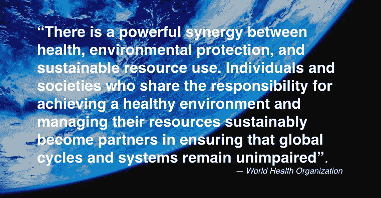
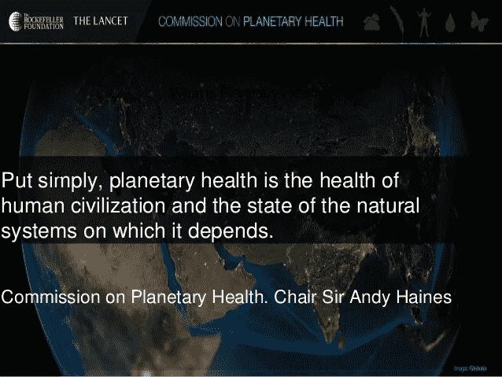

# 为人类和地球健康而设计:可持续性的跨学科方法

> 原文：<https://medium.com/hackernoon/design-for-human-and-planetary-health-a-transdisciplinary-approach-to-sustainability-e83ed741c63d>

## 《世界信息传输机构生态与环境汇刊》，2006 年第 99 卷，世界信息传输机构出版社[，](http://www.witpress.com,)ISSN 1743–3541([在线](https://www.witpress.com/Secure/elibrary/papers/RAV06/RAV06028FU1.pdf)

D.C. Wahl，英国苏格兰邓迪大学自然设计研究中心

## 摘要

本文探讨了各种综合框架，有助于一个新兴的跨学科的可持续发展的元观点。它为人类和地球健康提出了一个基于规模关联设计的整体/综合战略:

首先，简要回顾了“整体理论”、“螺旋动力学”和“整体生态学”作为动态映射方法，以构建、促进和调解不同价值体系和多个利益相关者和学科的观点。世界观、价值体系和意向性的改变对可持续文明的出现至关重要。

第二，设计被描述为跨学科的整合者和面对不确定性时明智决策的促进者。系统性健康设计可以促进可持续性转变。

第三，论文概述了复杂性理论如何与健康的整体概念相结合，为可持续设计提供了一种尺度关联的方法。系统健康是复杂动态系统中健康相互作用和关系的一种规模关联的、突现的性质。人类、社会、生态系统和地球生命支持系统的健康从根本上说是相互关联和相互依存的。

可持续性，作为一个基于社区的学习过程，是通过设计来表达的，它遵循生态原则，并适应当地、区域和全球的限制和机会。总的来说，可持续设计是协同的、共生的、规模相关的、有益健康的和神圣的。有必要将生态、社会、文化、经济和心理(精神)方面的考虑纳入一个灵活的应对战略，以促进可持续性过渡。人类和地球健康的设计需要跨学科的对话，旨在找到适当的解决方案和基于社区的可持续性愿景。

*关键词:尺度关联设计、复杂性、整体生态、健康设计、跨学科整合、健康、可持续文明、视觉。*

## 1 导言

> “随着工业文化的兴起，设计成为了一种职业实践，但更根本的是，作为思维的基本要素，它现在是，而且一直是，人类的标志之一。在这个框架中，每个人都是设计师”[1]。
> 
> —托尼·弗莱

相互关联的心理、社会和生态问题错综复杂，它们动态地相互作用，驱动着不可持续的人类文明的日益增长的危机，这些问题无法通过分隔化、专业化、零敲碎打的思维来理解或适当地应对。显然需要广泛整合的框架，以帮助创建一个元级的综合，从各种不同的学科和世界观中汲取见解，并将理论和实践联系起来。分析的、简化的、客观的和注重数量的观点必须通过综合的、整体的、参与的和注重质量的观点来考虑。

比我们的能源和资源使用、定居模式、生产和运输系统以及当地和全球经济的必要变化更深刻地影响向可持续人类文明过渡的是世界观、价值体系、生活方式和意图的根本变化。引导我们走向可持续发展的根本变化既有物质层面(生物物理和生态层面)，也有非物质层面(心理社会和意识层面)。

这篇论文只能提供作者在博士研究中尝试的跨学科综合的最模糊的轮廓。这只是一篇两卷本论文的简短总结，题目是《为人类和地球健康而设计:一种对复杂性和可持续性的整体/综合方法》。

本文介绍了这项研究回顾、发展和整合的一些核心概念和策略。它勾画了一个工具和蓝图，以促进和组织关于可持续发展的跨学科对话，并参与创建可持续人类文明的集体愿景。

## 2 绘制和整合不同利益相关者的观点

> “简而言之，我的建议是，成熟人类的心理是一个展开的、涌现的、振荡的、螺旋上升的过程，其特征是随着个人存在问题的变化，较老的、较低层次的行为系统逐渐从属于较新的、较高层次的系统。每一个连续的阶段、波动或存在水平都是一种状态，人们通过它走向存在的其他阶段。当人集中于一种存在状态时，他或她就有了这种状态所特有的心理。他或她的感觉、动机、伦理和价值观、生物化学、神经激活程度、学习系统、信仰系统、心理健康的概念、对精神疾病是什么和如何治疗的想法、对管理、教育、经济学、政治理论和实践的概念和偏好都适合那个阶段”[2，第 5-6 页]。
> 
> —克莱尔·格雷夫斯

心理学家克莱尔·格雷夫斯(Clare Graves)在 20 世纪 50 年代首次开始绘制人类观点、世界观或心理发展动态的复杂性。他提出了一个粗略但非常有用的不同人类“生物心理社会系统”的地图[3]。格雷夫斯的人类意识地图的基本有效性已经在国际上通过无数涉及 50，000 多人的独立研究得到了检验[2，第 6 页]。

他的学生 Don Beck 和 Christopher Cowan [3]将 Graves' map 进一步发展为一种框架和方法，用于在观点和价值体系截然不同的不同利益相关方之间进行调解和冲突解决。“螺旋动力学”方法被广泛应用于各种情况，包括南非后种族隔离时期的和解进程。这是一个经过测试的工具，用于整合和调解不同的利益相关者和观点。贝克和考恩认为:

> “螺旋动力适用于个人、组织或整个社会。因为它在一个普遍的意义上描述了人性，而不是通过性格类型或种族、性别和民族特征，该模型为解决当地和全球问题提供了一个共同的语言。它提供了一个统一的框架，使真正的整体思维和行动成为可能”(第 30 页)。
> 
> —唐·贝克和克里斯托弗·考恩

哲学家肯·威尔伯将螺旋动力学方法纳入并发展成一个更全面、更详细的综合框架，命名为“积分理论”。根据 Wilber 的说法，整体方法旨在“包括物质、身体、思想、灵魂和精神，因为它们出现在自我、文化和自然中”[2，第 xii 页]。

威尔伯的“整体理论”试图理解个人和集体，以及外部和内部，人类有意识和共同创造性地参与不断变化的宇宙。

就像简化论、二元论、唯物主义的地图定义了现代占主导地位的科学和机械论世界观一样，威尔伯完整的“万物理论”只是一张地图，尽管它更加包罗万象。只要我们不把地图和领土混淆，地图仍然非常有用。整合理论可以有效地用于定位不同的世界观、价值体系和学科视角，并承认它们的有效性和各自对可持续性对话的贡献。

> “整体生态学将自然界的无数方法编织在一起，努力尽可能有效和及时地应对我们自己、我们的社区和我们在不断演变的宇宙中的世界所面临的复杂生态问题。实际上，整体生态学将意识、文化和自然结合在一起，为可持续发展服务。利用整体生态学框架的人们认识到，仅仅整合生态系统和社会系统是不够的。相反，我们需要的是主观(如心理学、艺术、现象学)、主体间性(如宗教、伦理、哲学)和客观(如行为、科学、系统分析)现实的整合[5]。
> 
> 肖恩·埃斯比约恩-哈尔根斯和迈克尔·齐默尔曼

跨学科学者 Sean es bjrn-Hargens 和 Michael E. Zimmermann [6]是这一新兴跨学科研究倡议的发起人之一，该倡议将积分理论应用于可持续性过渡。在科罗拉多州建立了一所综合学院和一所综合大学。整体理论和整体生态学是很有前途的新兴研究议程，与本文总结的研究描述的规模关联、系统健康促进、设计和元设计框架互补并显著重叠。

> “整体生态学通过认识到生态现象是知者、已知事物和已知方式之间相互作用的结果，对环境采取一种参与性的方法。通过承认和尊重我们自己、我们的社区和我们的环境的多样性，我们可以作为融入当地生态社会系统的全球公民，有效地共同努力寻求可持续的解决方案。重视基于不同观点和理解之间相互理解的解决方案。通过培养容纳其他观点和持有多样性的能力，我们将能够比目前更充分地应对我们的生物区域目前面临的复杂问题的不太全面的方法”[7]。
> 
> 肖恩·埃斯比约恩-哈尔根斯和迈克尔·齐默尔曼

在社会科学、生态科学、艺术和人文科学内部，跨学科整合的呼声越来越高。气候变化、资源枯竭、环境和社会解体以及国家和国际不平等的严峻挑战正在汇聚成一场全人类面临的全球危机。在充分认识到全球和地方相互依存的情况下，健康和福祉的共同目标将促进跨学科和跨国合作，创造更具包容性、基于多视角的决策过程，引导我们实现可持续人类文明的愿景。

## 3 设计作为跨学科的整合者和促进者

设计发生在理论和实践的结合点。它可以用来整合不同的价值体系和世界观。如何在地球生命支持系统的生态限度内满足人类的真正需求是一个适当设计的问题。广义地说，设计是通过互动和关系表达意图。

设计，作为跨学科的整合者和推动者，将在 21 世纪发挥主导作用，在地方、区域和全球范围内构想可持续性的背景下构建合作。有了这种多层面、多尺度的可持续未来愿景，我们就能共同创造出实现这种未来的战略。

诺贝尔奖获得者在其开创性著作《人工科学》[8]中提出,“对人类的恰当研究是设计科学，不仅作为技术教育的专业组成部分，而且作为每个受过自由教育的人的核心学科”(第 138 页)。

西蒙认为设计是一门特殊的科学，它受到自然科学的启发，处理人类创造的人工制品和过程。他做了一个重要的区分，即自然科学“关注事物是怎样的”(第 114 页)，并试图使自然更容易理解，而大多数“设计解决方案是导致满足特定约束的可能世界的一系列行动”(第 124 页)。设计基于人类的意图和目标，因此“关注事物应该如何”(第 114 页)。正是设计的这种远见卓识和创造性，赋予了设计在展望和创造一个更健康、更可持续的未来中的核心作用。

系统健康的尺度连接设计提供了对复杂动态系统中不断变化的环境的整体知情反应，该系统将自然和文化以及精神和物质结合在一起。它有助于在相互关联和相互依存的复杂现实世界中，建立与不断变化的环境相关和相适应的政治、社会和经济体制。

气候变化、贫困、资源枯竭、恐怖主义、不平等和全球环境恶化等问题只有通过这种协同应对才能得到解决。理查德·布坎南[9]写道:

> “在当代生活的任何领域，设计——在有意操作中构成‘意图’的计划、项目或工作假设——都不是塑造人类体验的重要因素。设计甚至延伸到传统科学活动的核心，在那里它被用来培养科学好奇心的焦点的主题”(第 6 页)。
> 
> 理查德·布坎南

在物质层面，设计背后的意图通过产品、运输系统、经济、管理系统、居住模式、资源和能源使用以及复杂的社会和生态过程形成的相互作用和关系来表达。

在非物质层面，我们的组织理念、世界观和价值体系影响着我们如何通过元设计来理解我们对现实的体验。元设计是影响人类体验的设计的心理学、认识论和本体论方面，必须被视为向可持续人类文明过渡的重要催化剂。布坎南[10]认为:

> “设计是一门学科，其中主题、方法和目的的概念是活动和结果不可分割的一部分。在专业实践的层面上，设计学科必须融合相互竞争的兴趣和价值观、不同的想法和不同的知识体系”。
> 
> 理查德·布坎南

在理论和实践之间，在世界观、价值体系和不同利益相关者利益之间，以及面对维持一个有效的地球生命支持系统的需要，设计可以完全进入其作为跨学科整合者和促进者的关键角色。可持续的决策和设计过程必须对来自不同学科和视角的贡献开放，同时，意识到定义每个学科视角的认识论和本体论元设计。

设计中有一个重要的视觉元素影响着我们如何体验和塑造我们的环境。“设计师处理可能的世界，以及关于人类环境的部分和整体应该是什么的观点”[10]。创建一个全球可持续人类文明的包容性愿景，通过多样化的适应当地情况的社区来表达，需要整合多种世界观和价值体系。这种融合可以通过基于对话的跨学科进程来促进，这一进程将未来国家愿景方法应用于地方、区域和全球范围的可持续人类文明的集体设计。约翰·托德(John Todd)是可持续发展综合设计的先驱之一，他认为生态设计可以帮助我们创造这样一种文明:

> “……通过生态设计，从理论上讲，只用工业社会今天使用的世界资源的十分之一就能拥有高度文明是可能的。我们可以减少百分之九十的负面人类足迹，并作为一种文化繁荣发展。我们不必毁灭地球。生态设计允许我们以共生的方式将人类生命支持系统与生物圈的其余部分联系起来”[11]。
> 
> 约翰·托德

## 4 全身健康的尺度关联设计

我们是一个从根本上相互联系的物理、化学、生物、生态、社会和心理过程的参与者。不同主体之间相互作用和关系的复杂性使得这一过程从根本上说是不可预测和可控的。

解决这种根本的不可预测性和不可控制性的适当方式是保持不断的灵活性，并在整体层次结构(或 holarchy [12])或网络中的网络中增加弹性、适应性和健康。通过适当的设计，人类对地球生命支持系统的负面影响可以大大减少，生态和社会的完整性、复原力和健康可以得到恢复。

《世界卫生组织组织法》(世卫组织)将健康的概念定义为“一种完整的身体、精神和社会福祉的状态，而不仅仅是没有疾病或虚弱。”1986 年，世卫组织的《渥太华宪章》增加了以下“健康的基本条件和资源:和平、住所、教育、食物、收入、一个[动态]稳定的生态系统、可持续的资源、社会正义和公平。”

1991 年，世卫组织的“松兹瓦尔声明”强调“前进的道路在于使环境——物理环境、社会和经济环境以及政治环境——支持健康而不是损害健康”[13]。这意味着一种有益健康的设计方法，将个人、社区、社会和生态系统的健康联系在一起并加以促进。

人类和地球健康设计旨在探索将人类可持续地融入生物圈的健康维持和生命支持过程的策略。它回应了世卫组织健康与环境委员会报告[14]中提到的挑战和机遇:

> “健康、环境保护和可持续资源利用之间存在强大的协同作用。分担实现健康环境和可持续管理其资源的责任的个人和社会成为确保全球循环和系统不受损害的伙伴”(第 xxx 页)。
> 
> 世界卫生组织

从广义上讲，如果所有设计行为背后都有一个更有益健康的意图，人类可以极大地改善社区、社会、生态系统和地球健康，从而推动可持续发展转型。该报告认为:“健康取决于我们理解和管理人类活动与物理和生物环境之间相互作用的能力。”报告的结论是:“我们有这方面的知识，但未能采取行动，尽管我们有资源可持续地满足当前和未来的需求”(第十四页)。

迄今为止，人类未能参与旨在创造可持续文明的全球和地方合作有益健康的设计，主要是由于不适当的文化元设计。我们在文化上陷入了一种思维定势，这种思维定势关注的是个人而不是集体，竞争而不是合作，数量增长而不是质量增长，对我们在复杂的动态过程中的参与性和共同创造性的理解是简化的而不是整体的，这种复杂的动态过程将自然和文化结合成一个全球社区，从事阿尔弗雷德·诺斯·怀特海所说的“生命对新奇事物的不断探索”。

> “复杂性理论正在成为一门承认和赞美自然创造力的科学。…它打开了一扇新的观察世界的大门，认识到这些复杂的动态系统对初始条件很敏感，并具有涌现的特性。从微生物生态系统到生物圈，我们必须学会小心翼翼地与这些我们生活质量所依赖的复杂系统打交道，因为我们虽然不能控制它们，但却能影响它们。这种知识对我们西方的科学心态来说是新的……”[15]。
> 
> —布莱恩·古德温

布赖恩·古德温解释说:“涌现性是意想不到的有序类型，产生于其独立行为已被理解的组件之间的相互作用。集体中会出现新的东西——这是自然界不可预测性的另一个来源。”他继续说:“我们生活所依赖的复杂系统——生态系统、社区、经济系统、我们的身体——都有涌现的特性，其中最主要的是健康和幸福”(第 27 页)。

最广义地说，可持续设计可以定义为对社会和生态过程的适当(有益健康的)参与。适当性应该通过某个设计在多大程度上保持了系统作为一个整体的整体动态稳定性、弹性、灵活性、适应性或健康性来判断。为了创造可持续的设计，我们必须学会重新整合社会和生态过程。这将要求我们通过跨学科的合作和对话来考虑来自许多不同学科的见解。设计师还必须更加意识到一个特定的设计可能同时参与不同的、相互关联的自然过程。此外，概念元设计(认识论和本体论假设)的作用必须明确考虑。

复杂性理论、健康、共生、协同、适当参与和整合设计是相关的尺度链接概念和框架。它们可以帮助构建一个综合战略，以维护人类和地球的健康并实现可持续性。Bryan Norton 从人类、社区、生态系统和地球健康的角度给出了可持续发展的定义:

> “可持续性是动态的人类经济系统与更大的、动态的、但通常变化较慢的生态系统之间的关系，这样人类生命可以无限延续，人类个体可以繁荣，人类文化可以发展——但也是一种人类活动的影响保持在一定范围内的关系，以便不破坏为这些活动提供环境背景的自组织系统的健康和完整性”[16]。
> 
> —布莱恩·诺顿

从旨在将社会和经济现实纳入其更广泛的生态背景的角度来看，可持续性的概念与在社区、生态系统和全球范围内维护和恢复健康且因此具有复原力的环境的概念是不可分割地联系在一起的。生态和社会健康作为全系统的新兴财产，促进健康的人类发展，并允许健康和多样的文化表达。当适应当地的社区学会在全球背景下，在当地生物区域的生态和社会条件所设定的限制和机会范围内，共同创造可持续的互动和关系模式时，系统性健康就出现了。在一个不断变化的复杂系统中，促进健康和可持续性需要不断学习，以便适当适应这种变化。

Haskell 等人[17]强调，生态系统健康“不能简单地用生物学、伦理学、美学或历史术语来定义或理解。在阐明环境保护的目标时，必须使用许多方法。”生态系统健康的概念最好从“多元的、多学科的观点集合……涵盖哲学、科学和管理的广泛思想”中理解(第 3 页)。

“保护和恢复各级生态过程的健康”的概念可能有助于我们保持“自然的自主、自我整合过程，作为可持续性新伦理的一个基本要素”(第 4 页)。哈斯克尔和他的合著者将生态系统健康理解为复杂自然系统的一个特征。他们解释说:“由于快速变化的人类文化嵌入到更大规模、缓慢变化的生态系统中，我们必须制定政策，允许人类文化繁荣发展，而不改变生态系统的生命支持功能、多样性和复杂性”(第 4 页)。

Robert Costanza [18]回顾了基于健康的“生态系统健康”的一些概念定义:体内平衡、无疾病、多样性或复杂性、稳定性或弹性、活力或增长范围，以及系统组件之间的平衡(第 239 页)。所有这些关于健康的概念都有一个有效的视角，可以提供信息，但它们也有其局限性。

克斯坦萨称它们为“拼图的碎片”他提出，生态系统健康应该被理解为“对系统弹性、组织和活力的全面、多尺度、动态、分层次的衡量”，并认为:“这些概念体现在术语‘可持续性’中，这意味着系统在面对外部压力(弹性)时保持其结构(组织)和功能(活力)的能力。”克斯坦萨强调了健康的重要的整体性和尺度联系方面:“健康的系统还必须根据其背景(它是其中的一部分的较大系统)及其组成部分(组成它的较小系统)来界定”(第 240 页)。

联合国教科文组织生物区域资源管理研究所所长 David Brunckhorst [19]强调，“复原力和可持续性一样，具有多方面的因素，通过空间和时间的尺度对其产生影响——它不仅仅发生在局部或全球范围内。”他解释说:“为了保持和恢复生态和社会系统的长期可持续性，我们必须开始整合我们的规划，并在多个尺度上运作我们的管理……”。根据 Brunckhorst 的说法，我们可以通过“为持久的未来嵌套生态系统和社会系统的功能要求”来做到这一点。他写道:

> “可持续性意味着不在时间和空间尺度上挑战生态阈值，因为这会对社会和生态系统的复原力或适应能力产生负面影响。……系统内和系统间的复原力在多个时间和空间尺度上发挥作用。复原力的丧失破坏了生态系统在各种环境条件下继续为人类提供生命支持和其他生态服务的能力”(第 15 页)。
> 
> —大卫·布伦克霍斯特

正如设计可以作为跨学科合作创造更可持续解决方案的综合概念一样，健康可以提供整合概念，将所有规模(和文化)的社会、生态和经济需求结合起来！).这种综合概念对于激励个人、社会、文化和人类集体合作创造更全面、更可持续的解决方案至关重要。

在过去的一个世纪里，通过生态知情、有益健康和规模关联的设计方法整合可持续发展的新兴跨学科战略已被一些先驱的工作所预示，如帕特里克·盖迪斯、刘易斯·芒福德、伊恩·麦克哈格、约翰和南希·托德、比尔·麦克拉尼、比尔·莫里森、约翰·蒂尔曼·莱尔、格雷戈里·贝特森、维克多·帕帕内克、西顿·巴克斯特、西姆·范德莱恩、斯图尔特·考恩、大卫·万、丹尼尔·奇拉斯、罗伯特·克斯坦萨、詹尼斯·伯克兰、保罗·霍肯、亨特和阿莫里·洛文斯、威廉·麦唐纳、迈克尔·布朗加特

通过这些人的重要工作推广的许多方法，但不是全部，都明确地将改善个人、社区、生态系统和地球健康作为他们的中心目标。它们的最基本的共同点是通过设计和元设计来促进更可持续的人类文明的创建，从而适当地参与社会、经济和生态过程。奥尔教授写道:

> “单词‘health’的词源揭示了它与其他单词的联系，如治愈、完整和神圣。生态设计是一门艺术，通过这门艺术，我们的目标是恢复和保持整个生命结构的完整性，这个结构由于专业化、科学还原论和官僚主义的分裂而越来越支离破碎。……生态设计的标准既不是效率，也不是生产力，而是健康，从土壤开始，向上延伸到植物、动物和人类。……在任何层面损害健康而不影响其他层面是不可能的”[21]。
> 
> 大卫·奥尔

这种观点认为，健康的复杂性是复杂动态系统中一种与规模相关的新兴属性，它将生态和社会过程结合成一个不断共同进化和转变的整体。它将一种协同、共生、规模关联、有益健康和神圣的可持续设计方法融入其中。

在一个从根本上相互联系的复杂整体中，设计是一种影响所有生活的共同创造行为。作为人类，我们都在塑造生命的进化过程，也被生命的进化过程所塑造。在这个框架中，生命和意识的进化是我们存在的圣地。因此，所有维护生命共同体和地球生命支持系统的健康和完整性的可持续设计行为也是适当参与赋予我们身份和意义的更广泛进程的神圣行为。

## 5 可持续发展的整体/综合方法

> “新科学不断提醒我们，在这个参与的宇宙中，没有什么是孤独的。一切都因为关系而形成。我们不断被召唤到关系中——信息、人、事件、想法和生活。甚至现实也是通过我们对关系的参与而创造的。我们选择我们注意到的东西；我们只关心某些事情，而忽略其他事情。通过这些选择的关系，我们共同创造了我们的世界。如果我们对影响变化感兴趣，关键是要记住我们是在关系网中工作，而不是和机器一起工作”[22]。
> 
> —玛格丽特·惠特利

最终，向可持续人类文明和增强人类及地球健康的转变将需要大多数全球公民为他们共同创造性地参与塑造人类和地球的未来承担全部责任。或多或少，我们都是这个未来的设计者。作者的博士研究得出结论，如果所有人类设计背后的基本意图是健康发生——在包含我们的更广泛的系统中改善健康——我们将能够在地方、区域、国家和国际范围内促进向更可持续实践的急剧转变。

有益健康的设计旨在促进整体所有层面的健康出现。它认识到人类、生态系统和地球健康之间不可分割的联系。这种方法不是主要关注疾病或不健康症状的缓解，而是试图通过改变潜在的关系和相互作用来促进积极的健康和整体的繁荣，以这种方式，健康可以在整体的所有尺度上作为系统属性出现。换句话说，有益健康的设计的目标是在健康的社区创造健康的个体，在健康的社会[23]、生态系统、生物区域以及最终健康的生物圈和智力圈里扮演负责任的参与者。

瓦莱丽·布朗和她的同事列出了两个应该指导人类行为的标准，如果我们希望避免对生物圈和维持其健康的自然过程的严重破坏。第一个策略是“消耗自然的流量，同时保存存量(也就是说，在保存自然资本的同时依靠‘利息’生活。”第二个策略是“增加社会存量(人力资源、民间机构)，限制物质和能量的流动”[24]。

自然界的过程从根本上是将纳米尺度的光合作用与宏观尺度的大气成分和气候变化联系在一起的。在这一动态整体的所有尺度上保持和改善全身健康，需要一种有意的有益健康的态度在全社会广泛传播。全球向改善健康和可持续性的转变涉及到任何地方的任何人。为了将多元化、可持续发展的社区和文化以及可持续发展的人类文明的愿景变为现实，不仅仅是专业设计师，每个人都需要自觉负责地行动。可持续发展取决于通过日常互动和我们在人类和生态社区中形成的关系，集体设想和创造可持续发展未来的意图。

这种关于可持续性的整体和参与性观点提出，在不确定和不可控的通往可持续未来的旅程中，指导我们的基本意图应该是改善整个系统的整体健康。通过对生态系统、生物圈和人类健康之间关系的深入理解，一个对可持续性和复杂性采取整体/综合方法的综合框架正在形成。

如果从短期和长期来看，我们的所有行动都可能影响当地和全球环境的健康以及人类社区和个人的健康，那么适当的参与以及可持续性将不再是一个难以捉摸的概念，而将成为一项切实的战略。事实上，每个人都是设计师，无论我们是专业从事设计行业，还是通过我们与自然和文化的联系以及通过我们的行动和生活方式表达这些态度来促进文化、社会和生物进化。有益健康的、共生的、协同的、规模关联的和神圣的设计可以促进可持续发展，并有助于在全球和地方合作努力中构建跨学科的整合，以创造可持续的人类文明。

## 参考

[1]t .弗莱，《改造:生态学、设计、哲学》,环境图书:悉尼，第 113 页，1994 年。

[2]k . Wilber,《万物理论:对商业、政治、科学和精神的整体看法》,吉尔&麦克米伦出版社，伦敦，2001 年。

[3]d . Beck 和 c . Cowan,《螺旋动力:掌握价值观、领导力和变革》,布莱克威尔商业出版社，1996 年。

[4]g .巴特森，《走向心灵生态学:人类学、精神病学、进化论和认识论文集》，杰森·阿伦出版社，1972 年。

[5]es bjrn-Hargens，s .,“客座编辑介绍”，《世界未来》，第 61 卷，第 1-2 期，整体生态学特刊，第 1 页，2005 年。

[6]齐默尔曼，M.E .,“整体生态学:环境问题的透视、发展和协调方法”，载于《世界未来:普通进化杂志》,第 61 卷，第 1-2 期，第 50-62 页，2005 年。

[7]es bjrn-harg ens，s .,“整体生态:环境现象的内容、对象和方式”，《世界未来》，第 61 卷，第 1-2 期，整体生态特刊，第 36 页，2005 年。

[8]h .西蒙，《人工科学》，第 3 版，麻省理工学院出版社，1996 年。

[9]布坎南，“设计思维中的邪恶问题”，马戈林&布坎南编辑，《设计的理念》，麻省理工学院出版社。1995.

[10]布坎南，r .“修辞，人文主义和设计”，在布坎南和马戈林编辑。《发现设计》，芝加哥大学出版社，第 26 页，1995 年。

[11]j . Todd，“21 世纪的生态设计”，年度舒马赫讲座，舒马赫学会，英国，(见 [www.oceanarks.org)，](http://www.oceanarks.org),)第 3 页，2000 年。

[12]科斯勒，a，《机器中的幽灵》，阿尔卡纳图书公司，1967 年。

[13] Waltner-Toews，d.《生态系统可持续性和健康:实用方法》,剑桥大学出版社，第 90 页，2004 年。

14 世界卫生组织，《我们的星球，我们的健康:世卫组织健康与环境委员会的报告》，世卫组织，1992 年。

[15] Goodwin，b .等人，“参与生活世界”，载于修订版:意识与转变杂志，第 23 卷，第 3 期，第 27 页，2001 年。

[16]诺顿，B.G .，《环境管理的新范例》，克斯坦萨，诺顿&哈斯克尔编辑。生态系统健康，岛屿出版社，第 25 页，1992 年。

[17] Haskell，B.D .等人，“什么是生态系统健康，我们为什么要担心它？”克斯坦萨等人编辑。生态系统健康，岛屿出版社，1992 年。

[18]克斯坦萨，r .,“生态系统健康的操作定义”，克斯坦萨等人编辑。生态系统健康，岛屿出版社，第 239-256 页，1992 年。

[19]d . j . Brunckhorst，“生物区域规划:新千年之后的资源管理”，Routledge:伦敦，2002 年。

[20] Wahl，D.C,“为人类和地球健康而设计:复杂性和可持续性的整体/综合方法”,苏格兰邓迪大学设计学院博士论文，2006 年。

[21] Orr，D.W.《设计的本质:生态、文化和人类意图》,牛津大学出版社，第 29 页，2002 年。

[22] Wheatley，M.J,《领导与新科学:在混乱的世界中发现秩序》, Berrett-Koehler 出版社，第 145 页，1999 年。

[23]r . g . Wilkinson,《不平等的影响:如何使病态社会更加健康》, Routledge:伦敦，2005 年。

[24] Brown，V.A .等人，“可持续性与健康:支持全球公共健康的生态完整性”，Earthscan:伦敦，第 45 页，2005 年。

In more recent years the Rockefeller Foundation has picked up on the theme of Planetary Health and new funding is flowing into this all important research field (see [more](https://www.rockefellerfoundation.org/our-work/initiatives/transforming-health-systems/))

—

如果你喜欢这个帖子，**请鼓掌**记住，如果你非常喜欢，你可以鼓掌**多达 50 次**；-)!

**Daniel Christian Wahl**——在面临多重危机的情况下催化变革性创新，为可再生整体系统设计、可再生领导力以及可再生发展和生物区域再生教育提供建议。

国际知名书籍[设计再生文化](https://www.triarchypress.net/drc.html?source=post_page---------------------------)的作者

 [## 丹尼尔·克里斯蒂安·沃尔正在创造支持再生文化和区域再生的内容…

### 亲爱的潜在支持者，自从《设计再生文化》在 2016 年初出版以来，我一直在分享它…

www.patreon.com](https://www.patreon.com/DanielChristianWahl?fan_landing=true)