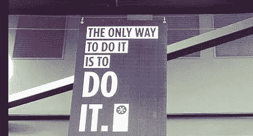

# 为边做边学而设计

> 原文：<https://medium.com/hackernoon/design-for-learning-by-doing-644c01b2bd83>

T.S .艾略特曾写道“四月是最残酷的月份。”当我进入我在骑士道 655 号的最后一个季度的开始时，我想起了 T2·艾略特关于希望和渴望的二重性的话，这是通过我上一篇关于 T4 恢复力的帖子来实现的。弹性的核心是接受失败和从错误中学习的能力，这种技能需要实践以及对世界的平衡看法，即成功和失败之间的阴影——这些概念是设计思维的基础。

d.school 的教学[方法论](https://hackernoon.com/tagged/methodology)模仿了设计思维的论点:**“做这件事的唯一方法就是去做。”**我有幸在 d.school 上的每一门体验式课程都有意迫使学生进入不舒服的情境，以鼓励快速行动(在你认为自己准备好之前)、对模糊性的适应以及快速迭代原型制作。这是对我们人类学习能力最强的时候的支持:

*   当我们尝试新事物时
*   当我们失败时
*   当我们掌控了这个过程

这是第三个最难做到的，作为一个还没有准备好移交权力的管理者，或者作为一个对自己的能力还没有信心的崭露头角的领导者。然而，这往往是奇迹发生的地方——对于经理来说，看到创新成果的出现，对于崭露头角的领导者来说，认识到行动是形成遵循行为的态度的最佳实践。

**设计思维是弹性的同义词**,用于建立弹性。就像有时候[不如放弃](http://freakonomics.com/podcast/new-freakonomics-radio-podcast-the-upside-of-quitting/)一样，设计思维并不适合每一个场合。有时优化是最好的，例如在处理可重复的过程(例如化学过程或机器驱动的制造)时用于描述或预测目的。但是当你的目的是指令性的，比如处理随机过程时(比如以人为中心)，设计思维规则。

通常在商业世界中，我们认为问题就是问题——有一个可以并且应该优化的单一解决方案，并且我们寻求原则(通常是科学的)来证明我们的决策和事后偏见。通常情况下，我们的问题实际上是进退两难——需要不断管理的权衡。正如纳西姆·塔勒布在 [*抗脆弱*](https://www.amazon.com/Antifragile-Things-That-Disorder-Incerto/dp/0812979680) 中描述的那样，企业采用的大多数框架和流程都是追溯解释成功创新的结果。那些根据科学方法预先理论化的东西，随着时间的推移不断得到完善。在这方面，*优化*就像是对智能设计的信仰——一个全知全能的创造者对一个单一的结果及其所有事先意想不到的结果负责。而 ***设计思维* *是进化***——一个持续的快速实验和学习的元过程，其中工作变得有粘性，并随着时间的推移建立了弹性。

正如“做”是认识到结果很少是成功/失败的两极分布的最佳方式一样，“做”也是认识到我们人类总是处于希望和渴望之间、未来和过去之间的最佳方式。正如 C.S .刘易斯所写的:“现在是时间触及永恒的点。”为了建立弹性，拥抱设计思维的原则。**专注做好当下**。

*本文为* [*原载*](https://www.linkedin.com/pulse/design-learning-doing-jonathan-lu)*2017 年 4 月 3 日。*