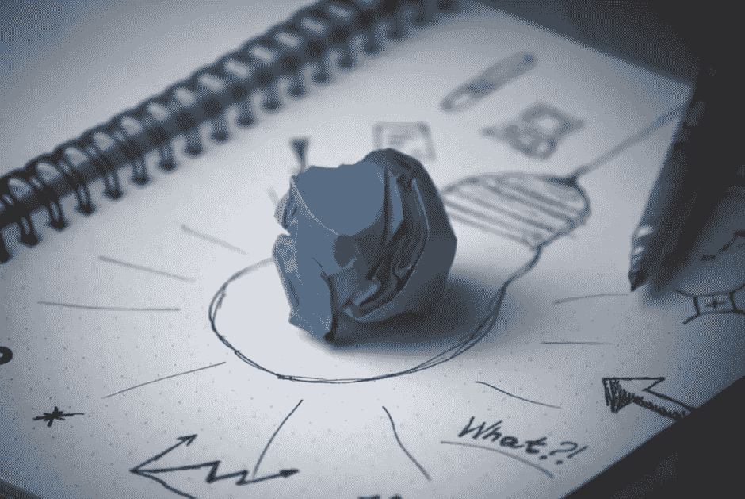
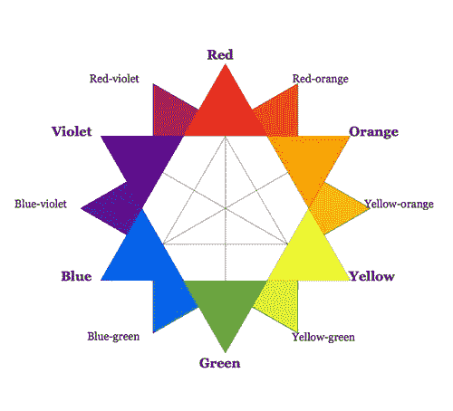

# 非设计师的设计灵感

> 原文：<https://medium.com/hackernoon/design-inspirations-for-non-designers-1ba96ae09643>

十年前，我给自己定了一个目标，每四年做一份不同的工作。我是一名训练有素的工程师，所以我开始了我的软件开发职业生涯。四年后，我创办了第一家风险投资公司。在接下来的四年里，我花了很多时间来建立优秀的工程团队。在你猜我的下一步是什么之前，我不会尝试做下一步的产品设计。但是对于我在这里的设计师朋友，感谢对我们的[网络](https://meetnucleus.com/arunagrahri)和移动[应用](https://itunes.apple.com/us/app/nucleus-discuss-articles-your/id1122661249?mt=8)的任何反馈。

大约一年前，我离开之前的公司，开始了我的第二次创业。这一次，我将作为首席执行官领导公司的产品和业务。为了讲述这个故事，我为我们的愿景准备了一个幻灯片，并制作了初步的产品草图。我总是对伟大的产品和设计情有独钟。但是我知道我的草图并没有接近我希望它们在最终产品中的样子。所以，我开始和设计师见面，让它更上一层楼。

在几次咖啡会议后，我从那些谈话中学到了很多。我还意识到，当一周只有几个小时的合作时间时，很难传达我的愿景。我有两个选择，雇用专门的设计资源或者自己学习做早期设计。我选择了后者。在我网络中的设计朋友的帮助下，我能够开始使用基本的设计流程和工具。在几次谈话中，我们强烈建议使用素描工具。我玩了它，发现它比 Photoshop 或 Illustrator 少了许多令人生畏的工具。Sketch 的功能较少，但它几乎是创建高保真产品设计所需的全部。

从产品的角度来看，好的产品设计不再是核心优势，而是一项要求。构建伟大的产品是一个迭代的过程。该流程包括研究、用户研究和实施最佳实践。通常，他们会受到其他优秀产品设计的启发。

这篇文章的其余部分概述了我构建产品早期版本的设计过程。这是一个指南，让非设计人员用良好的用户体验来构建他们的早期原型。

# [风格指南](https://meetnucleus.com/topics/color-palette-tools-resources-f76fdaf2ba185990bcf0d290a39c1332)

[http://en.wikipedia.org/wiki/File:Color_star-en.svg](http://en.wikipedia.org/wiki/File:Color_star-en.svg)

一旦你准备好你的产品草图，你将需要定义一个调色板并选择一个字体系列。设计中的色彩是非常主观的。在一个人身上引起一种反应的东西，可能会在另一个人身上引起非常不同的反应。有时候这是因为个人喜好或者文化背景。了解颜色会有所帮助。这是一个关于如何用例子为你的创业选择颜色的[好资源](https://www.smashingmagazine.com/2010/01/color-theory-for-designers-part-1-the-meaning-of-color/)。

[色彩理论](https://designschool.canva.com/color-theory/)本身就是一门科学，如果你没有设计背景，它可能会让人不知所措。一个更简单的方法是遵循 60-30-10 法则。也就是说，你选择三种不同的颜色，并以 60%、30%和 10%的比例使用它们。这个规则提供了一个简单的方法来为你的品牌创造一个专业的配色方案。

接下来是字体。选择字体对你的品牌很重要，但是不要太担心。如果你决定改变你的字体，这是一个简单的产品变化。选择字体取决于你的产品，但一个易于阅读的字体，如机器人，Helvetica 新，开放的 Sans 是一个好的开始。

接下来是排版——文本的风格和外观。您需要为产品中的每种文本定义字体大小、字体粗细和颜色。例如，一篇中型文章有一个标题，引用和突出显示的文本，每一个都有不同的样式指南。

# [设计灵感工具](https://meetnucleus.com/topics/tools-for-design-inspiration-2fc7347b358652a687ed439d87153556)

完成样式指南后，您就可以开始创建高保真屏幕了。我推荐草图设计工具。如果你认识一个设计师，从他们那里获得一个快速入门。这是学习最佳实践和避免常见错误的最佳方式。否则，你可以自己开始。有大量的在线指南和博客文章。如果你不确定从哪里开始，看看这个[简介](https://meetnucleus.com/gjestice)。

对于任何应用程序屏幕设计，我都从产品规格开始。然后，我对类似的、鼓舞人心的产品设计进行市场调查。为此，我使用[工具组合](https://meetnucleus.com/topics/tools-for-design-inspiration-2fc7347b358652a687ed439d87153556)来寻找其他应用如何解决类似的设计挑战。从你的研究中收集相关的设计灵感。最后，把你的想法放到一个打磨过的用户界面里，交给开发者。

不要浪费时间使用草图插件创建设计规范，这仍然需要时间。使用像[泽普林](https://zeplin.io/)这样的工具。该工具使协作和发布设计规格变得容易。

# [每日灵感简讯](https://meetnucleus.com/topics/design-newsletters-4aa5905ecc7854749646d314defa4145)

不缺新内容。每天都有数以千计的新设计博文被写出来。我们都熟悉时事通讯。时事通讯是迷你出版物，由专家和爱好者针对某一主题策划。我喜欢时事通讯，这是我了解重要话题的方式。所以，我在网上搜索了一下，为每天的学习和灵感建立了一个伟大设计博客的列表。

花点时间复习，订阅你喜欢的。如果你想让它们有条理，不要错过本文的最后一部分。你可以看看我在 Nucleus 上的[简介](https://meetnucleus.com/arunagrahri)作为例子。

我希望这个列表对你有用，能帮助你获得日常设计灵感。以下是名单，没有特别的顺序。

[网页设计师新闻](http://www.webdesignernews.com/) : 网页设计师新闻——每日设计师最佳新闻精选。

[网页设计简讯:](http://www.webdesignerdepot.com/newsletter/) 为设计师提供快速的新闻、灵感资源以及超酷的新产品和服务。

[UX 时事通讯](http://www.theuxnewsletter.com/) : 来自 Mailchimp 的研究、设计和建造的故事。

[UX 周刊](http://uxwkly.com/) : 关于用户体验设计、游戏设计和科技行业评论的每周用户体验时事通讯。

[侧边栏:](http://sidebar.io/) 获取 5 个最佳设计链接，每天。

[穆兹利](https://muz.li/subscribe/) : 上周最受欢迎的&鼓舞人心的东西。

[设计周刊](http://designweekly.atomic.io/) : 数码产品设计新闻、文章、展示和资源。

[视觉](http://blog.invisionapp.com/) : 关于用户、体验和设计的思考——视觉博客

[Designmodo](http://designmodo.com/subscribe/) :比别人更早得到我们的产品/消息。

设计创业文摘:UX、策略和设计文章的每周列表，帮助你创造更聪明、更成功的产品。

仅此而已！我错过了什么好的设计简讯吗？让我知道。

## ❤如果你觉得这篇文章有用，请点击推荐。

> ✨在 Twitter 上关注我，当我发布我的下一个故事——“非设计师的设计工具”等等时，我会通知你。

> [黑客中午](http://bit.ly/Hackernoon)是黑客如何开始他们的下午。我们是阿妹家庭的一员。我们现在[接受投稿](http://bit.ly/hackernoonsubmission)并乐意[讨论广告&赞助](mailto:partners@amipublications.com)机会。
> 
> 如果你喜欢这个故事，我们推荐你阅读我们的[最新科技故事](http://bit.ly/hackernoonlatestt)和[趋势科技故事](https://hackernoon.com/trending)。直到下一次，不要把世界的现实想当然！

