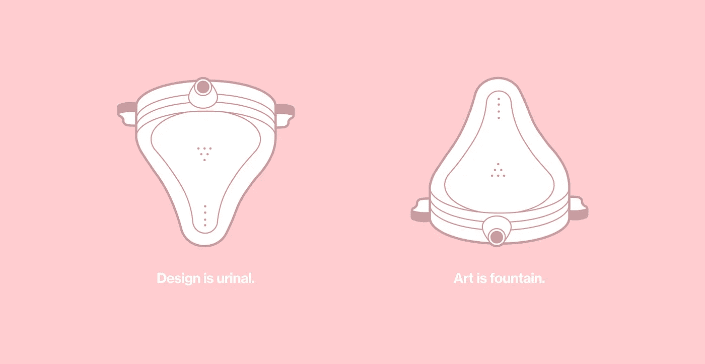
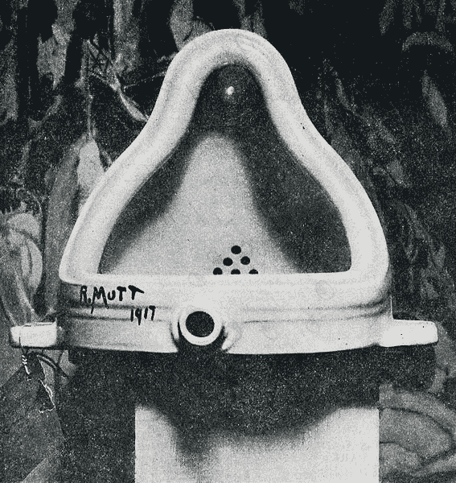

# 什么是设计？

> 原文：<https://medium.com/hackernoon/design-is-urinal-art-is-fountain-b1d051cfadf1>

## 设计师对话

# 你好。这篇文章诞生于一个“视频记录”，你可以播放，也可以阅读。你做出选择。

**文字版** —作为设计师，我们会问自己一些常见的问题，比如:

> 什么是[设计](https://hackernoon.com/tagged/design)，设计和艺术有什么区别？
> 大多数人认为设计是一种艺术吗？

看，这些问题总是引起设计师和其他人的讨论。如果我们分析导致一些人将设计视为一种艺术形式的原因，我们可能会这样开始:*“设计师和艺术家都创造视觉构成。”*

然后，我们可以继续谈论许多主观的解释，并捍卫我们自己的个人观点，但我们无意寻找共同点，因此我们永远不会停止争论。

那是因为我们太重视单词了。

当我们试图通过限制来定义某样东西时，我们就产生了分裂。众所周知，分歧往往会引发冲突。每次有人试图回答这个问题:*“什么是设计？”这不是偶然的。*并由此含蓄地回答*“设计不是什么”，*我们见证了漫长争论的诞生。

在古代，似乎有些人通常很难区分单词和事物。他们最终认为任何定义都是现实的代表，而不是交流的工具，分享的工具。

好吧，我今天不是来找分手的好理由的。相反，通过鼓励一种超越文字的观点，我想强调关于设计的真实本质的事实。

所以，让我们从一个我们都能认识到的事实开始，不管我们认为什么是设计。

# **有意图的设计**

日常物品根据我们的需要，把我们团结在一起实现一个目标(一个目的)。

如果我们觉得累了，椅子可以让我们坐下来。如果下着倾盆大雨，雨伞可以保护我们免受雨淋。如果我们需要做笔记，笔可以让我们在纸上书写。
和以此类推*。*

任何旨在解决问题的设计都属于这一类。

当然，您可以决定以不同的方式使用前面列出的对象。这将是你个人的决定，背离了最初的目的。或者，如果你从未见过这些物品，你可能不知道如何使用它们。清楚地理解引用的例子意味着我们共享相同的技术环境。

无论如何，一个设计开始于为最大数量的相关人员创建一个可理解和可共享的解决方案的意图。

# **设计团结人**

我可能认为我现在坐的椅子在美学上不舒服，但这并没有阻止我理解和利用它的功能。与此同时，其他人可能会决定坐在同一把椅子上，他们可能会争辩说这是他们用过的最漂亮、最舒适的椅子。

我们都认识到，不管个人用户体验如何，这款椅子仍然是一款[产品](https://hackernoon.com/tagged/product)，其设计意图是让尽可能多的人了解如何使用它来坐下。

但是，如果大多数站在椅子前面的人不明白这是一把椅子，那该怎么办呢？或者更糟糕的是，他们明白这是一把椅子，但他们不知道如何使用它来坐下？

在那种情况下，我们将不再面对一件设计作品，而只会站在一件艺术作品面前，一件基于创作者纯粹的自我肯定而创作出来的东西；无论如何，这并不意味着所讨论的艺术创作没有目的(尽管许多艺术支持者更愿意相信艺术没有目的)。

但是当我们谈论一件作品的目的时，我们应该强调艺术和设计行为的意图和目的是不同的。这种创作意图的差异是一个基本原则，有助于理解和解释设计与艺术的区别。

# **设计 vs 艺术**

那么，设计可以被视为艺术形式吗？这个问题的答案在于我们能够共同认识和观察到的事实，而不在于我们使用的语言。

你个人可以认为任何设计对象都是艺术的。

例如，你可能会把一部*的 iPhone* ，或者任何你脑海中闪现的其他物体，视为一件艺术品

但是——如果一个设计师开始他的过程的目的是创造一个艺术品，而不是理解和寻求一个事实，而不是意见，来解决一个影响人们的问题——他就不会实施一个设计过程。不管他生出什么，都不会是设计。

设计者有责任和角色去弄清楚如何产生一个解决方案，让别人而不仅仅是他自己可以理解；通过遵循一个不需要任何自我肯定的设计过程来完成的责任。

现在让我们考虑最后一个例子来彻底理解艺术和设计之间的区别。

# 设计是便池

1917 年，艺术家马塞尔·杜尚拿了一个普通的陶瓷小便池，并在上面签上了 r .马特的名字。然后，他将这个小便池作为一种艺术尝试，命名为 ***【喷泉】*** 。

Fountain by R. Mutt, Photograph by Alfred Stieglitz, THE EXHIBIT REFUSED BY THE INDEPENDENTS — via [Wikipedia](https://en.wikipedia.org/wiki/File:Duchamp_Fountaine.jpg#filelinks)

这件艺术品从未向公众展示过，它引起了一场激烈的争论。

> 如果你研究过上个世纪的艺术史，你可能知道杜尚，你可能也知道这幅概念艺术作品被认为是二十世纪最伟大的艺术作品之一。自从最初的一件丢失后，今天世界上有 16 件这种物品的复制品。但是如果你不知道杜尚，达达运动，现成的什么的，我建议你去跑个搜，因为你可能会觉得挺有意思的。

杜尚使用的小便池在当时很常见——一种卫生设备，旨在让男性在特定情况下快速小便，同时保持高水平的卫生。与传统马桶相比，该产品还能节约用水，因此是一种对环境负面影响最小的解决方案。

便池已经是一件艺术品了吗？不，小便池过去是，现在也是，一个普通的日常物品，是通过设计过程创造出来的，一个为特定受众解决特定问题的产品。

然而，杜尚断章取义地把小便池放在一个标题和个人观点之下，掩盖了它的实际意义。他把自己的纯粹个人意义赋予了一个原本被设计成对很多人都有同样意义的物体。

正如你以前听说过的，艺术和设计本身一样受其背景的影响，这并不是巧合。

因此，我们可以认识到，杜尚创造了一件艺术作品，并用它来促进许多主观的解释。

以哲学家 Stephen Hicks 为例，他将杜尚的*喷泉*解释为一个挑衅性的声明:*“艺术是你撒尿的东西”。*

因此，我们得出结论，任何东西，甚至是一个设计对象，都可以被视为艺术形式。

但我们也认识到，后一种艺术是作为一种个人意图，一种自我表达的行为(仅仅是主观的，因为艺术家通过表达来寻求自我肯定)。

自我表达行为的主要目的是邀请人们进行反思，或者通过表达个人观点来激励他们。因此，通过发出反思的邀请，艺术塑造了辩论，而辩论往往以人们意见的分歧而告终。

然而，设计的意图恰恰相反；它是通过对一个共同的问题产生一个清晰易懂的解决方案来协调和联系最大数量的相关人员。

这也意味着，与艺术不同，任何一种设计过程都不会简单地随着一个人的想法而结束。相反，它是持续研究的结果，这些研究试图通过相关人员直接验证任何假设和潜在的解决方案。在整个设计过程中，通过不断的迭代，设计将尽可能地继续这样做。

在这一点上，我可以讽刺地结束这个漫长的想法，说*设计是便池*和*艺术是喷泉:-)*

> [黑客中午](http://bit.ly/Hackernoon)是黑客如何开始他们的下午。我们是 [@AMI](http://bit.ly/atAMIatAMI) 家庭的一员。我们现在[接受投稿](http://bit.ly/hackernoonsubmission)并乐意[讨论广告&赞助](mailto:partners@amipublications.com)机会。
> 
> 如果你喜欢这个故事，我们推荐你阅读我们的[最新科技故事](http://bit.ly/hackernoonlatestt)和[趋势科技故事](https://hackernoon.com/trending)。直到下一次，不要把世界的现实想当然！

