# 设计报告—2017 年 11 月

> 原文：<https://medium.com/hackernoon/design-report-november-2017-5ac1331f710b>

回到八月，我决定挑战我的 UI/UX [设计](https://hackernoon.com/tagged/design)技能，每周至少留出 2-3 个小时做个人项目。这个实验的目标是尝试新技术、插件、原型[工具](https://hackernoon.com/tagged/tools)并解决我感兴趣的设计挑战。

从工作的角度来看，11 月是不可思议的一个月。就客户工作而言，这个月是全年最忙的一个月，所以为我的个人项目寻找时间也是一件非常忙碌的事情。

本文是我在 2017 年 11 月结合自己喜欢的设计灵感创作的设计作品合集。

# iPhone X 网络导航理念

[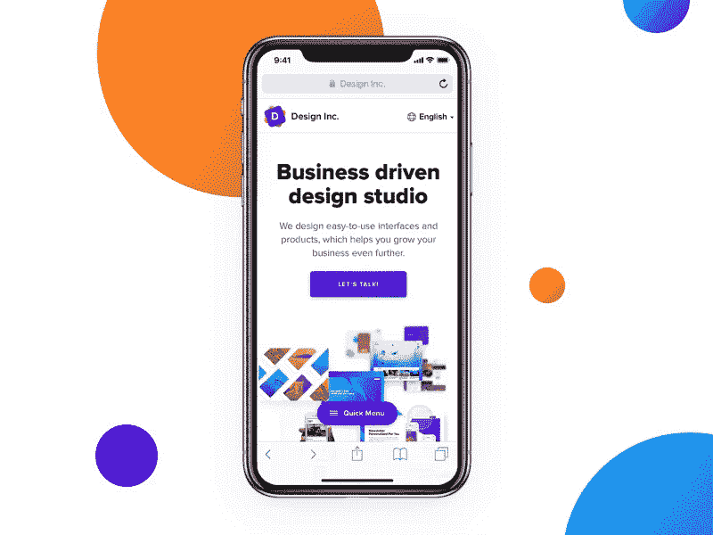](https://dribbble.com/shots/3851367-iPhone-X-Web-Navigation-Idea)

[https://dribbble.com/shots/3851367-iPhone-X-Web-Navigation-Idea](https://dribbble.com/shots/3851367-iPhone-X-Web-Navigation-Idea)

十月份，我在 Dribbble 上首次发表了 iPhone X 网络导航的想法。因为我看到了对这个帖子的巨大兴趣，我决定写一篇关于我的工作流程和对这个概念的想法的更详细的文章。

你可以在这里阅读我的文章:

 [## iPhone X 网络导航概念

### 选择汉堡菜单按钮还是标签栏导航是移动应用程序设计中的一个老争论。目前，它…

medium.muz.li](https://medium.muz.li/iphone-x-web-navigation-concept-c06efc0e0c50) 

几天之内，这篇文章就登上了《Muzli 设计灵感》杂志[和最好的设计时事通讯之一的](https://medium.muz.li)[侧栏。](https://sidebar.io/?after=2017-11-07&before=2017-11-07)

[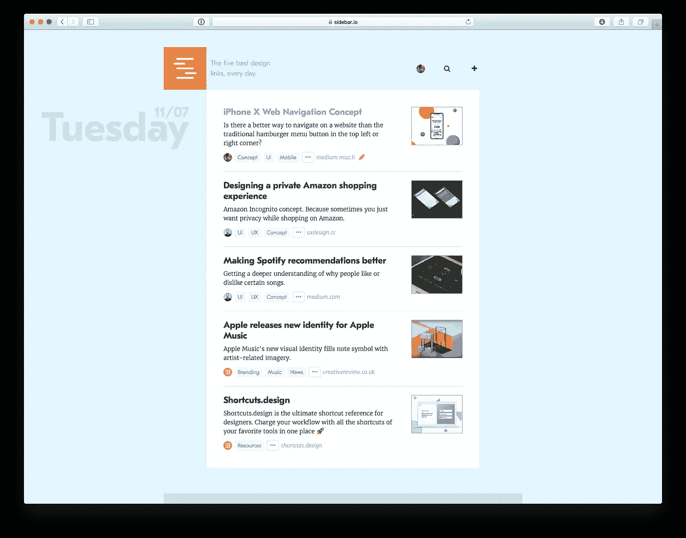](https://sidebar.io/?after=2017-11-07&before=2017-11-07)

这篇文章也在 Twitter 上被了不起的人和团队转发，比如 [HeyDesigner](https://twitter.com/HeyDesigner) 或 [ZURB](https://twitter.com/ZURB) 。

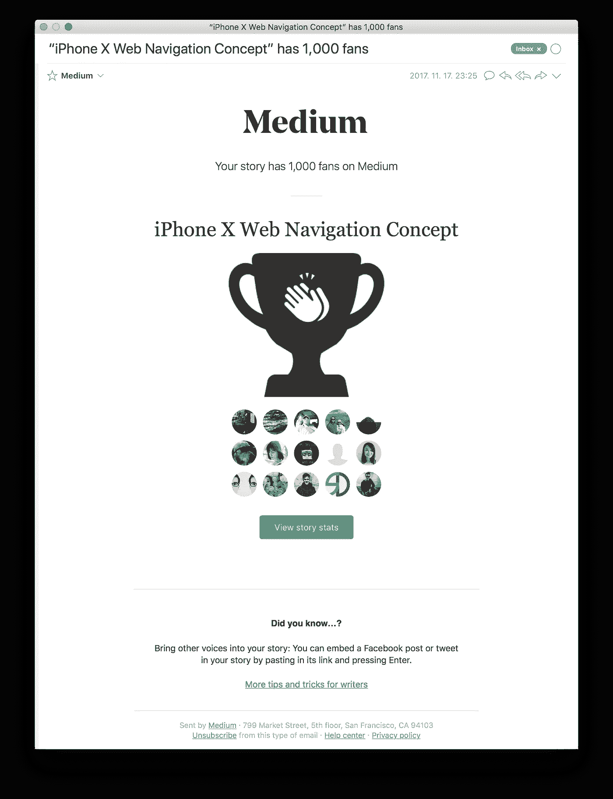

直到今天，超过 26000 人阅读了这篇文章，总共给了 6800 个掌声。毫无疑问，这是我写过的最成功的文章，我非常感谢每个喜欢/分享/评论这个故事的人。

这绝对是继续写作和分享我的设计方法和工作流程的最好动力。

# 品牌识别指南 2.0 —黑暗模式

[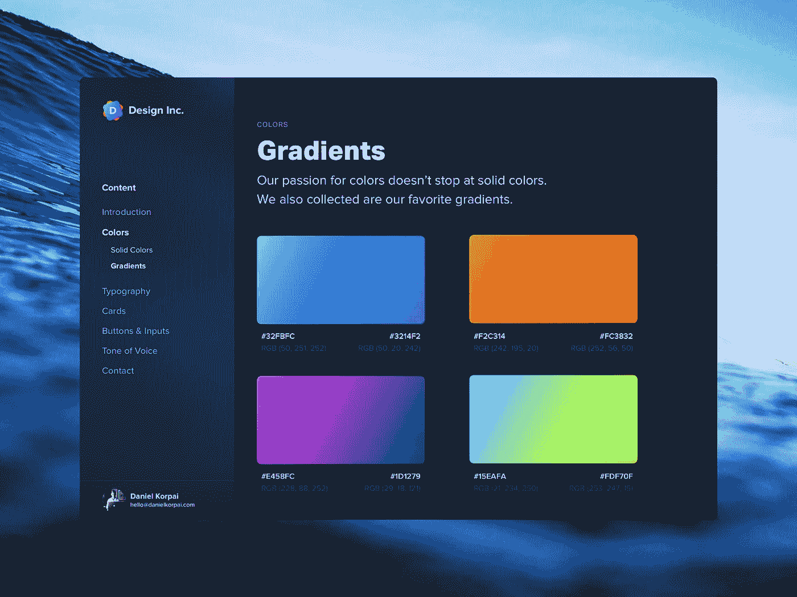](https://dribbble.com/shots/3916565-Brand-Identity-Guidelines-2-0-Dark-Mode)

[https://dribbble.com/shots/3916565-Brand-Identity-Guidelines-2-0-Dark-Mode](https://dribbble.com/shots/3916565-Brand-Identity-Guidelines-2-0-Dark-Mode)

我在 10 月份发布了新的[品牌标识指南 2.0](https://dribbble.com/shots/3907511-Brand-Identity-Guidelines-2-0) ，一些人要求我也创建一个黑暗版。

我目前正在尝试不同的黑暗版版本，但在那之前，请务必免费下载 [**光明版**](https://dribbble.com/shots/3907511-Brand-Identity-Guidelines-2-0) 。👊

# Looper 壁纸—黑暗版

[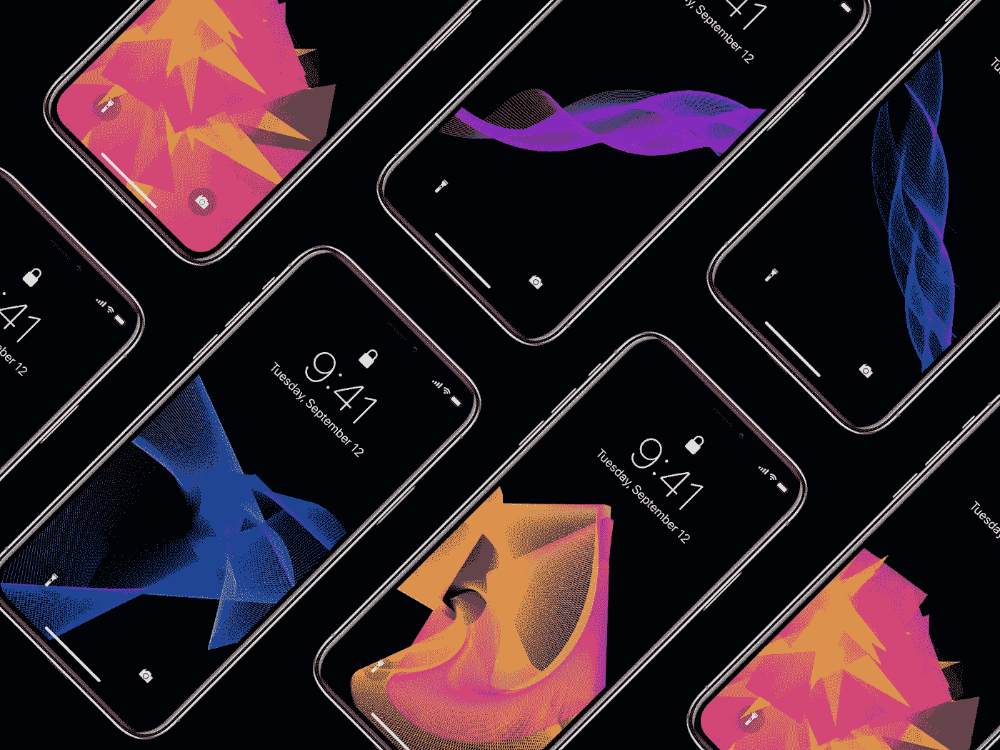](https://dribbble.com/shots/3924406-Looper-Wallpapers-Dark-Edition)

[https://dribbble.com/shots/3924406-Looper-Wallpapers-Dark-Edition](https://dribbble.com/shots/3924406-Looper-Wallpapers-Dark-Edition)

在最初的 [Looper 壁纸](https://dribbble.com/shots/3717682-Looper-Wallpapers)得到惊人的反响后，我决定也创作一个新的黑暗版。

由于 iPhone X 的超级视网膜(有机发光二极管)显示屏，深色背景和彩色图案在新的 iPhone X 设备上看起来会很惊艳。🎉

你可以免费获取壁纸(包括草图文件)，只需输入“0”作为价格或支付任何费用。:)

# 新闻应用概念

[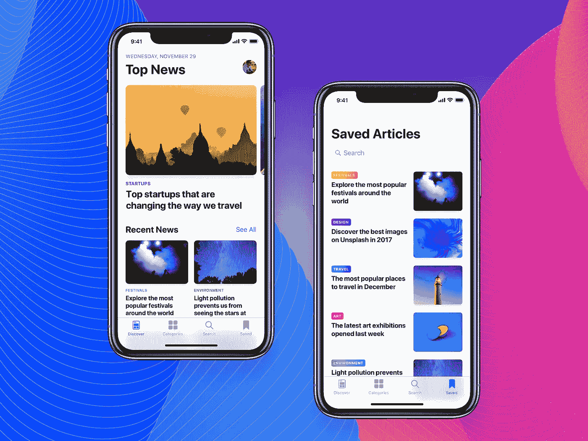](https://dribbble.com/shots/3978222-News-App-Concept)

[https://dribbble.com/shots/3978222-News-App-Concept](https://dribbble.com/shots/3978222-News-App-Concept)

我在 11 月完成了对一个新闻应用概念的试验，这将是 1 月份进一步原型概念的基础。

对我来说，一个伟大的新闻应用程序使我能够快速浏览顶部和最近的新闻，确保我不会错过任何重要的事情。

为了发现新内容，我通常会用手机，但大多数时候，我不会在手机上阅读文章，而是简单地标记并保存下来，以便以后在 iPad 或 Mac 上以更舒适的方式阅读。📖

我真的很兴奋能在一个新闻应用中体验更多可定制的排版和阅读体验。

# 2017 年 11 月 5 大设计灵感

# 1.WIP —医疗提醒应用程序第 2 部分

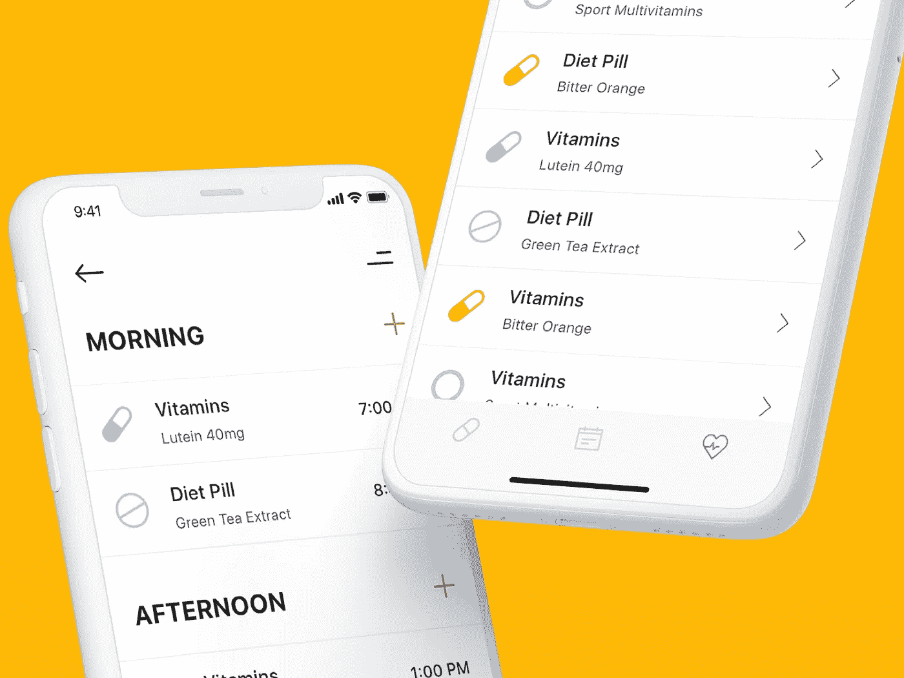

[https://dribbble.com/shots/3940094-WIP-Medical-Reminder-App-Pt-2](https://dribbble.com/shots/3940094-WIP-Medical-Reminder-App-Pt-2)

# 2.生活博客

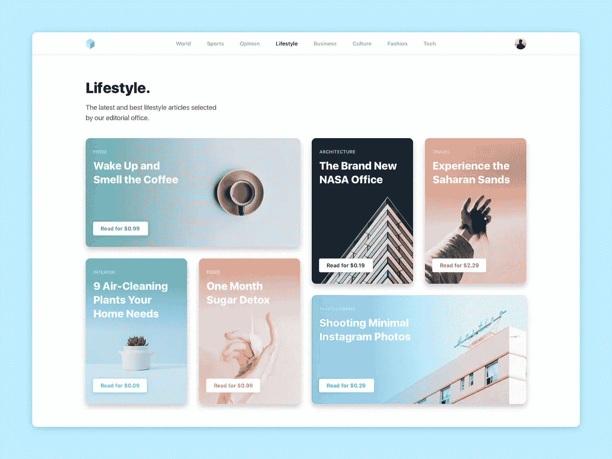

[https://dribbble.com/shots/3912289-Lifestyle-Blog](https://dribbble.com/shots/3912289-Lifestyle-Blog)

# 3.我的日历|日视图

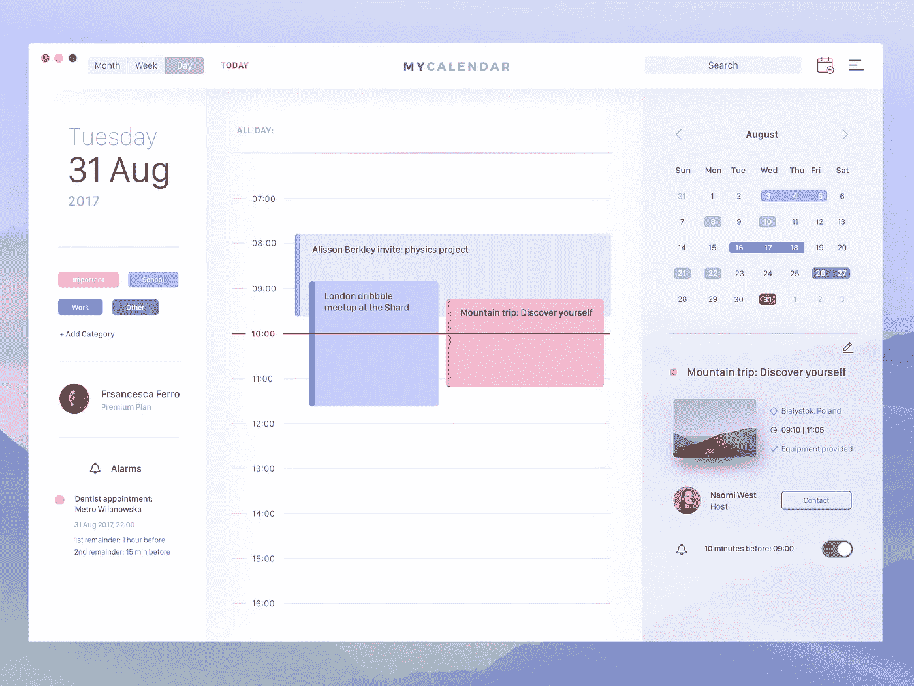

[https://dribbble.com/shots/3964156-My-Calendar-Day-View](https://dribbble.com/shots/3964156-My-Calendar-Day-View)

# 4.松弛特征

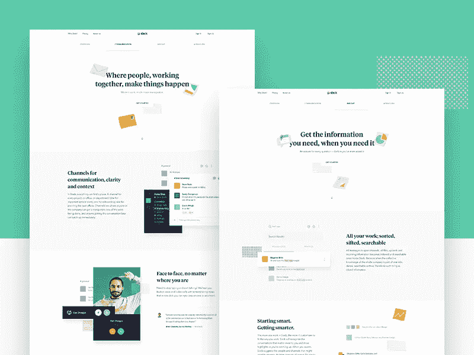

[https://dribbble.com/shots/3833019-Slack-Features](https://dribbble.com/shots/3833019-Slack-Features)

# 5.卡片互动

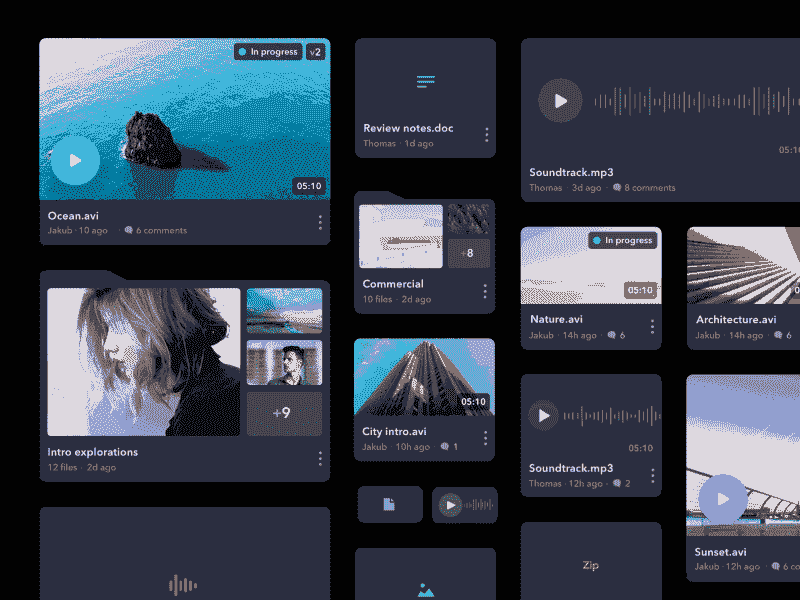

[https://dribbble.com/shots/3949985-Cards-interactions](https://dribbble.com/shots/3949985-Cards-interactions)

# 一个月后见👋

我希望你能从这篇文章中学到一些东西，并获得新的设计灵感。

## 每一次鼓掌、分享、推文和回复都是我继续写作和与大家分享更多幕后技巧的巨大动力！

## 你可以在这里阅读以前的设计报告:

 [## 设计报告

### 2017 年 10 月

blog.usejournal.com](https://blog.usejournal.com/design-report-october-2017-b4f1e44aec63)  [## 设计报告—2017 年 9 月

### 八月份，我决定每周至少抽出 2-3 个小时来提高我的设计技能，尝试新技术…

medium.com](/@danielkorpai/design-report-september-2017-c3c8817e737e)  [## 设计报告—2017 年 8 月

### 作为一名用户界面/UX 设计师，你可能很熟悉这种感觉，当你有很多客户工作要做，而你没有…

medium.com](/@danielkorpai/design-report-august-2017-7e527eb784cf) [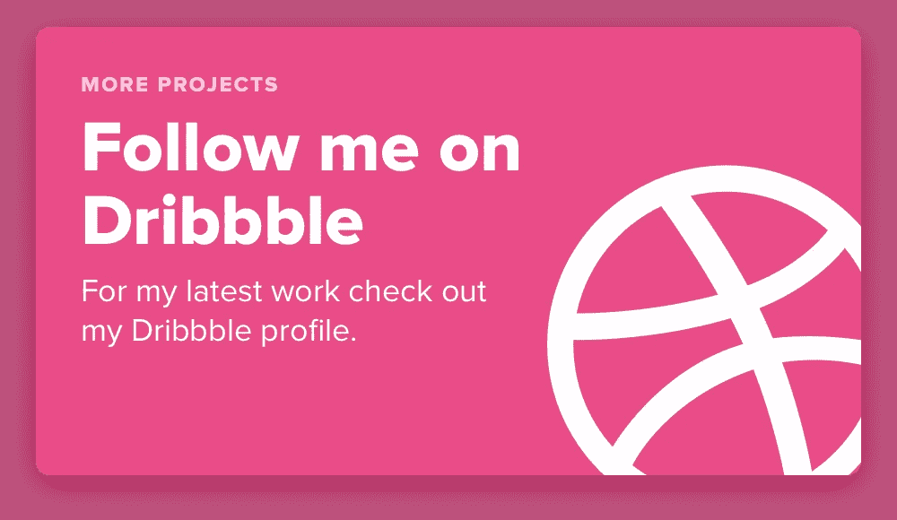](https://dribbble.com/danielkorpai)[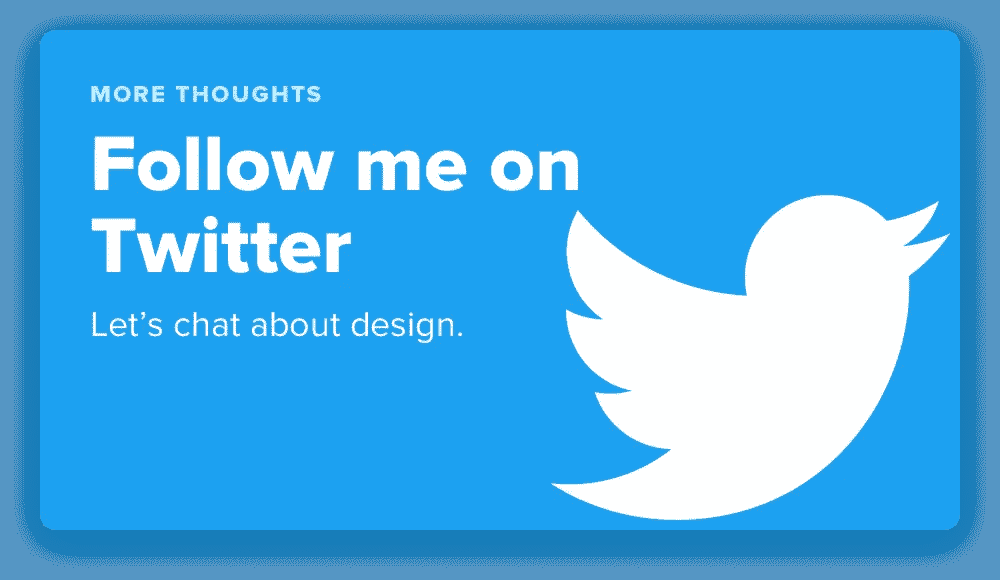](http://twitter.com/danielkorpai)