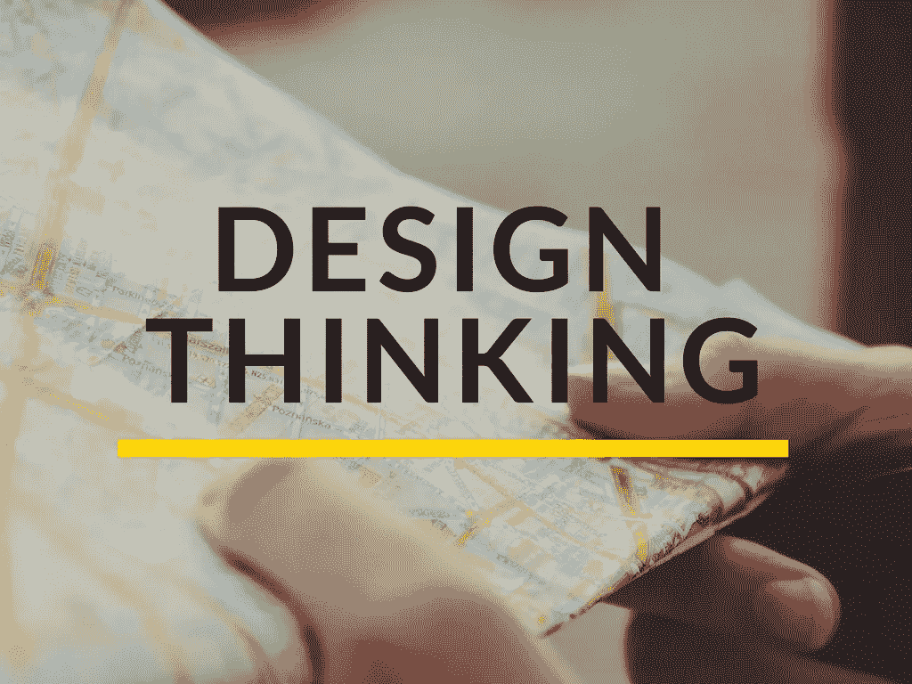

# 设计思维和棘手问题

> 原文：<https://medium.com/hackernoon/design-thinking-and-wicked-problems-9265c14fe8e4>

设计和思考是两个简单的英文单词。把它们放在一起，你最终会得到一个术语。术语把简单的概念和人们的理解复杂化了。

首先，让我们看看设计。当大多数人想到设计时，他们想到的是艺术或美学。然而，设计是一个非常宽泛的术语。在现实世界中，设计师是问题的解决者。好的设计处理并解决问题。第二个词“思考”可能是为了比较设计思考和其他解决问题的方法，如系统思考和工程思考。设计思维与其他问题解决方法的区别在于它所处理的问题的性质。

设计思维是一种用于解决“棘手问题”的问题解决方法。什么是缺德问题？一个邪恶的问题意味着问题的本质是高度不明确的。把它想象成一个高度复杂的问题，其中有许多已知和未知。“下棋是一个复杂的问题。第一次请你的姻亲过来吃饭是一个棘手的问题。你在吃晚餐，但还有许多其他问题在发生。”Jump Associates 的创始人 Udaya Patnaik。棘手的问题没有明确的是或否的解决方案。对于棘手的问题，只有更好或更差的解决方案。更好的解决方案通常会带来更多的设计挑战。今天有效的解决方案可能在未来无效。适用于一个市场的解决方案可能不适用于另一个市场(现在或将来)。这是设计思维在商业和战略中如此流行的主要原因之一。有些人把棘手的问题称为设计问题。

另一个区别是设计思维本质上是发散的。其他大多数问题的解决过程都是收敛的。在设计思维过程的初始阶段，非常强调尽可能多地提出创造性的想法。一个好的设计主持人会创造一个环境，让参与者想出尽可能多的点子。创造这种环境的一个方法是确保参与者不对最初的想法做出判断。

如果你已经到了这一步，谢谢你。我正试着更有规律地写作，所以任何建议或反馈都是最受欢迎的(即使是负面的)。

在我的下一篇文章中，我会写设计思维过程的不同阶段。

> [黑客中午](http://bit.ly/Hackernoon)是黑客如何开始他们的下午。我们是 [@AMI](http://bit.ly/atAMIatAMI) 家庭的一员。我们现在[接受投稿](http://bit.ly/hackernoonsubmission)，并乐意[讨论广告&赞助](mailto:partners@amipublications.com)机会。
> 
> 如果你喜欢这个故事，我们推荐你阅读我们的[最新科技故事](http://bit.ly/hackernoonlatestt)和[趋势科技故事](https://hackernoon.com/trending)。直到下一次，不要把世界的现实想当然！

