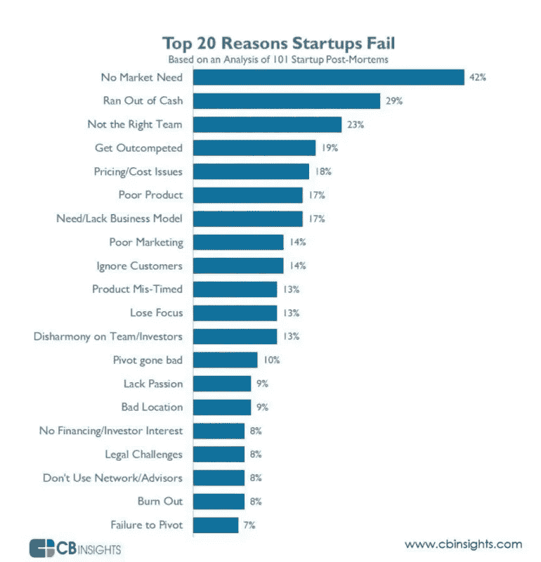
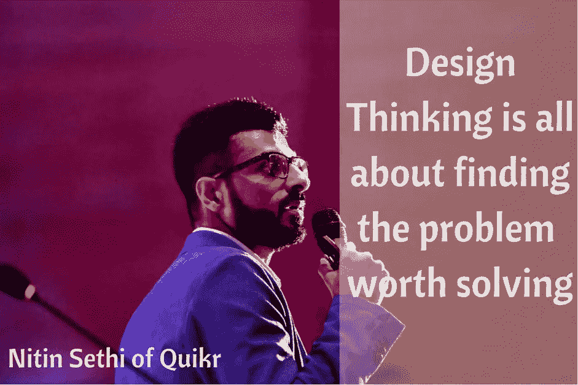
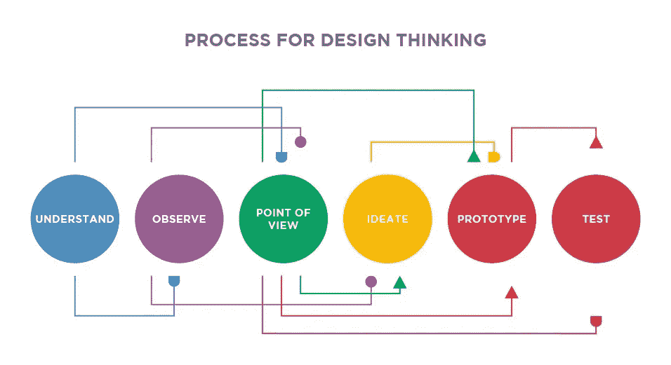

# 创业公司的设计思维

> 原文：<https://medium.com/hackernoon/design-thinking-for-startups-by-nitin-sethi-of-quikr-fe01a259c9bf>

## [推送面试](https://www.facebook.com/groups/Pushstarter/) 03:

## 与 [Quikr](https://en.wikipedia.org/wiki/Quikr) 的 [Nitin Sethi](https://www.linkedin.com/in/connect2nitin/) 就创业设计思维进行了坦诚的对话

Credits: [https://unsplash.com/](https://unsplash.com/)

十个创业者中有八个在最初的 18 个月内失败。这一比例高达 80%。

**但是为什么呢？你认为创业公司为什么会失败？** [**CB 见解**](https://www.cbinsights.com/) **这样说:**

Credits: [https://www.cbinsights.com/](https://www.cbinsights.com/)

创业公司失败的第一大原因(占失败案例的 42%)是因为开发的产品或服务没有市场需求。

是的，它看起来像一个百万美元的想法。是的，它看起来令人印象深刻。但不幸的是，这并没有解决人们愿意为之付费的核心问题。

这就是设计思维发挥作用的地方。

我得到了一个与 [Quikr](https://en.wikipedia.org/wiki/Quikr) 的 [Nitin Sethi](https://www.linkedin.com/in/connect2nitin/) 就**创业公司的设计思维进行互动的机会。**

> 在这次采访中， [Nitin](https://www.linkedin.com/in/connect2nitin/) 分享了他在过去 17 年中在这个领域获得的重要见解和知识。

这是由 [**Pushstart**](https://www.facebook.com/groups/Pushstarter/) 提供的“ **PushInterview:帮助你推动开始的面试”**系列的第三次面试。

如果你错过了我之前对“ [**我如何建立印度最活跃的创业社区之一**](https://hackernoon.com/how-i-built-the-most-active-startup-community-of-india-dfd83e8fe687) ”的采访，请查看一下。

 [## 我如何建立印度最活跃的创业社区之一

### 我从零到一建立创业社区的旅程

hackernoon.com](https://hackernoon.com/how-i-built-the-most-active-startup-community-of-india-dfd83e8fe687) 

## **1。告诉我们你到目前为止的旅程？**

我是一名产品设计和 UX 爱好者，拥有 17 年丰富的行业创业经验。

[Nitin Sethi](https://www.linkedin.com/in/connect2nitin/), VP Product Design & User Experience at [Quikr](https://en.wikipedia.org/wiki/Quikr)

在我迄今为止的职业历程中，我见过三代数码产品。我目前担任[**【Quikr.com】**](http://quikr.com/)**产品设计&用户体验**副总裁。此前任**[**Info Edge**](http://www.infoedge.in/)(即**Naukri.com 集团公司)。****

****在我职业生涯的初始阶段，我曾为 [**Bharti Airtel**](https://en.wikipedia.org/wiki/Bharti_Airtel) 、 [**Indiatimes**](https://www.indiatimes.com/) 、 [**Rediff**](http://www.rediff.com/) 等品牌工作，并担任各种国内和国际以消费者为中心的数码播放器的顾问。****

## ******2。你对设计思维有什么看法，它如何帮助初创企业？******

****设计思维就是寻找值得解决的问题。这是一种系统化的方法，基于对客户的密切和同情的观察来设计和解决问题。****

********

****Design Thinking is all about finding the problem worth solving****

****设计思维迫使人们广泛地考虑用户的需求，并具有生成性，而不是纯粹的分析性。这始终是一个协作和非线性的过程。****

****设计思维，如果做得正确，会导致成功产品的推出，让顾客高兴。当设计师团结在一起，分享有用的知识、技巧和反馈时，他们可以取得很大的成就。****

****一个由设计思想家组成的高绩效团队痴迷于创造伟大的成果。他们进行测试和验证，直到创造出满足业务目标并让客户满意的优秀产品。****

> ****“高绩效的设计思考者团队实践一个连续的构建、测量和学习结果的循环。他们关注的是结果，而不是产出。”****

****设计思维可以提高创业公司的成功率。通过以正确的方式接受它，一个人可以很快失败，并从消费者的角度准确地知道产品或服务出了什么问题。****

> ****“缺乏以客户为中心的方法、用户研究和产品测试对初创公司的伤害最大。”****

****在正确的时间用真实的用户来验证[创业](https://hackernoon.com/tagged/startup)的想法是非常关键的。大多数创始人缺乏“**问题寻求者**”的方法。****

> ****“你不一定要成为一名设计师，才能像设计思考者一样思考。”****

****设计思维只是一个时髦的词，除非它被用来作为一种方法，专注于正确的问题，并交付有意义的和高度功能性的解决方案，这些解决方案由传统的商业指标支持，以推动正确的投资回报率。****

## ******3。对你来说，设计思维的哪一部分最重要，为什么？******

****在我看来，**客户同理心**将继续是最重要的属性。****

********

****Customer Empathy is the most important ingredient of Design Thinking****

> ****"组织中应该有人代表顾客的观点."****

****还有谁能比设计思考者更适合这个角色呢？****

> ****“设计思维要求团队站在客户的角度出发。它鼓励他们跳出框框思考，在市场上快速原型化和测试想法，并适当地迭代。”****

****这意味着最终消费者最终决定了最终体验；因为他们从一开始就是这个过程的一部分，这种经历会引起共鸣。****

> ****“设计思维的核心是一种以人为中心的创新方式。”****

****工作提醒是任何工作门户网站找回用户的最关键部分。需要以个性化的方式来匹配警报，采用**“万里挑一”**的方法来定制用户体验。****

****我们非常努力地改善了 nau kri[的工作提醒的整体体验，并保持了迭代和测试。我相信这个过程还是一样的。](https://www.naukri.com/)****

## ******4。你一般的设计思维流程是怎样的？******

********

****The basic pillars of Design Thinking****

****设计思维的基本支柱在各个垂直行业和领域都是一样的。****

*   ******感同身受**:建立对客户身份的共识。****
*   ******定义**:对准要解决的核心问题/要做的工作。****
*   ****有想法的人:有条理地快速连续产生想法的方法。****
*   ****原型:把那些想法变成可测试的原型。****
*   ******测试**:用真实客户验证样机。****

****经历了无数次的失败和极少的成功，我明白了这一点，并把它藏在心里****

*   ****为用户设计，而不是为极客设计:它需要对每个人都有意义。****
*   ****做你的研究:了解你的用户和他们的需求。****
*   ******从一开始就整合 UX:**这不是最后一分钟追加的。在每个阶段用**真实用户**进行测试。****

## ******5。创业公司如何实现设计思维？******

> ****"在组建团队时，让设计成为一个关键的强调功能，而不是事后的想法."****

****设计思维与你通常为其规划预算和业务范围的技术或运营同样重要。****

****在印度，与技术相比，设计思维不受重视。很多创业公司在考虑设计的时候，还是局限于 UI 或者视觉设计。****

****我最初是一名视觉设计师，后来转到了 UI 设计领域，然后去了 UX，现在我开始接受设计思维。****

> ****“如果你的产品能解决问题，对消费者有意义，你就会顺利通过。一个人应该随时注意和倾听反馈。”****

****在 [Yatra](https://en.wikipedia.org/wiki/Yatra_(company)) ，我们开展了许多以客户为中心的活动，这些活动围绕着提高客户忠诚度和降低获得新客户的成本。****

> ****“如果你能开发一些功能，让顾客重复购买，你就能扩大业务，击败竞争对手。”****

****[**Yatra 的 eCash**](https://www.yatra.com/online/ecash-faq) 就是这种背景下一个很好的例子。****

## ******6。对于一家初创公司来说，应用设计思维成本太高了吗？******

> ******是和否:否**，如果你从第**天开始**和**是**，如果你计划在营销预算的后期。****

****它不会从第一天就给你直接的投资回报，但从长远来看，它会有所不同。尽管如此，你可以像许多成功的跨国公司一样衡量它并将其与投资回报率联系起来。****

> ****“这就像是[啜](https://economictimes.indiatimes.com/mf/analysis/a-five-minute-guide-to-sip-or-systematic-investment-plan/articleshow/60372408.cms)(共同基金)。保持定期系统投资，以获得长期回报。”****

****在设计思维中，发现阶段至关重要。在进入解决方案模式之前，大部分工作应该集中在开发以人为中心的对问题的理解上。****

> ****这就像你在高速公路上开车时系安全带一样。许多创业公司重做他们的产品，因为他们没有从一开始就投资于设计思维。****

## ******7。一个成功实施设计思维的创业公司？******

****我能说出至少 10-15 家成功实施设计思维的印度初创企业。****

****我们在支付、电子商务、旅游、汽车、制药、分类广告、新闻、食品技术、交付、物流等领域有新兴的领导者和许多独角兽。****

****作为一个生态系统，我们才刚刚开始我们的旅程。在太阳能、水、空气、健康、教育、最后一英里通勤和大规模食品领域有太多的事情要做。****

> ****"将设计思维作为一种文化的初创企业将在竞争中胜出多个档次."****

****它给了你竞争优势，因为你有关键的洞察力在正确的时间出现在你面前。****

> ****知道什么行得通，什么行不通，是任何初创企业旅程中最重要的部分。****

> ****“如今，客户期待一种不同的体验，一种简单而愉快的体验，在这种体验中，商业是无缝的，技术是无形的。”****

****在当今的全球经济中，一家公司的品牌主要是由体验驱动的，而不是由信息背后的广告费驱动的。****

> ****组织必须更接近**他们的客户需求、动机和期望**，以更好地确定**技术或平台**如何提供最佳体验。****

## ******8。如何建立一个用设计思维的语言思考的团队？******

****在这个领域雇佣合适的人才仍然非常具有挑战性。****

> ****“印度需要 10，000 名设计思想家来帮助创造一个更好的创业生态系统。”****

****这是关于从长远角度雇佣合适的合作伙伴。核心团队中应该有人成为消费者的代言人，坚决支持他们，让事情变得更好。****

> ****“公司使用的语言应该围绕消费者的利益。只有当合适的人获得足够的权力来实现用户目标时，这种情况才会发生。”****

****我很幸运能成为 Quikr 成长的一部分。我腾出手来建立核心产品设计&用户体验团队。****

****我们在 Quikr 做了很多跨平台的 A/B 测试，并密切关注客户体验。****

> ****在一个公司里，拥有一批拥有多样化互补技能的合适的人是非常重要的。****

## ******9。如果一个创始人开始设计思维之旅，他/她应该考虑哪些指标？******

****传统经营方式的内在风险，**“先建设，后找客户”**太高。****

******创业者的两种新时代设计思维方式(需求变化):******

*   ****失败得快，失败得便宜。****
*   ******整合不同的视角。******

> ****"成功实施设计思维过程的最重要成果是让客户更加满意."****

****关键指标因业务类型而异。对于以交易为导向的业务，可以是**点击率、转化率、重复订单、直接流量、取消率、社会评级、品牌召回等。******

> ****在开发产品时，采取以人为中心的方法来响应反馈，并使产品经历多次迭代和测试周期。****

## ****10。扼杀设计思维的一个标志？****

****团队是围坐在会议室桌子旁，听着**河马** **(薪酬最高的人的意见)**？****

****这是团队没有拥抱设计思维的最大迹象。****

> ****“构建一个功能很容易。但为合适的受众开发合适的功能是一项挑战。”****

****人生苦短，没时间去造没人想要的东西。在强大客户不断发展的时代，努力拥抱设计思维必须是重中之重。****

## ****11。有什么对创业公司有用的小技巧吗？****

******创业的几个小技巧:******

*   ****将您的内容翻译成更多的本地语言，以实现有机增长。****
*   ****做大量的A/B 测试。****
*   ****必须了解 UX 是一个重要的组成部分。****
*   ****缺乏以客户为中心的方法会很快扼杀你的业务。****
*   ****设计思维是你产品开发生命周期的零阶段。****
*   ****保持好奇，不断探索，茁壮成长。****
*   ****把客户当成资产，而不是交易。****

> ****"最后但同样重要的是，设计思维不是魔杖."****

## ******12。你有什么书籍或网上资源可以推荐来开始设计思维吗？******

****我更喜欢 [**砸杂志**](https://www.smashingmagazine.com/)**[**中**](/)**[**框和箭头**](http://boxesandarrows.com/)[**运球**](https://dribbble.com/)**[**design taxi**](http://designtaxi.com/)和 [**Slideshare**](https://www.slideshare.net/)**********

> ****人们可以在网上获得很多免费资料。但是我感觉真正的学习是在你做的时候，在你把手弄脏的时候。****

****当你开始阅读以精通某个主题时，先参加这个主题的研讨会。****

******我推荐的几本书/资源:******

*   ****[**服务启动:设计思维变得精益**](https://www.goodreads.com/book/show/22501716-the-service-startup)****
*   ****[**设计改变:设计思维如何改变组织并激发创新**](https://www.goodreads.com/book/show/6671664-change-by-design)****
*   ****[**设计思维 101**](https://www.nngroup.com/articles/design-thinking/)****

> ****“成为设计思考者的一大进步是提高你的倾听能力，积极接受对产品的批评。”****

## ******13。我们如何能与你取得联系？******

****可以联系我**@**[**Linkedin**](http://in.linkedin.com/in/connect2nitin/)**，**[**Twitter**](http://@nitinsethi80)**，**[**Skype**](http://nitinsethi_ued)**，** [**脸书**](http://www.facebook.com/nitinsethi80) **或者** [**邮箱**](http://Nitin.sethi@gmail.com) **。******

## ****非常感谢你的阅读！如果你喜欢，请鼓掌支持👏🏻还有分享帖子。请随意发表评论💬下面。****

## ****想成为印度最活跃的创业社区的一员吗？****

*****在* [***上发送请求，Pushstart***](https://www.pushstart.in/join-network-community) *成为我们不断壮大的大家庭中的一员。*****

*****嘿！Neeraj 这里，* [***的创始人，Pushstart***](http://pushstart.in/feed) *，印度最活跃的企业家群体。我每周都会发布对成功企业家的采访。**[***脸书***](https://www.facebook.com/jneeraj0807)***|***[***Linkedin***](https://www.linkedin.com/in/jneeraj0807)***| neeraj . Joshi @ pushstart . in |***[***Twitter***](https://twitter.com/jneeraj0807)【*****