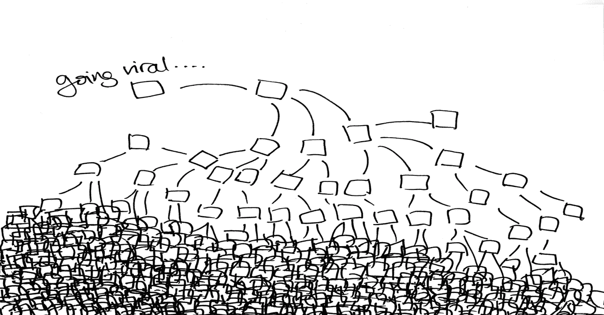
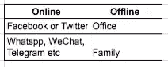

# 设计病毒式产品或品牌——简介

> 原文：<https://medium.com/hackernoon/design-viral-products-or-brands-intro-3894fa16dac8>

> 病毒传播是由大众或有影响力的人领导的交叉授粉

Masses or Influencers Create Virality

# **病毒式传播的成分？**

## **1。运营商&奖励—**

现有客户可以体现一个品牌或产品，在他们的网络中创造印记。

现有用户在其网络中携带或分享的奖励可以是—

*   货币——返现、折扣、赠品等。(例如优步邀请码)
*   虚拟权力——硬币、美化或游戏化等
*   网络或连接性—增强连接性，互惠互利(例如 FB、Whatsapp)
*   在网络中吹嘘——在内部满足人类(例如 Swarmapp)

> 奖励推销应该有即时满足感和分享的紧迫感。

## 2.网络和花粉部门—

现有用户的网络，更倾向于前景可以更多的媒体。

花粉单元可以是一个职位的网址，推广代码，标签图像(棱镜)等。易于在特定网络中共享。

## 3.奖励激活新用户—

信息和花粉单元的设计应能激活潜在客户，体验产品或品牌的基本价值主张。

> 对投资表现出即时的满足感，或创造消费回报的紧迫感

例如，优步促销代码或 Dropbox 或 Prisma 应用程序

尝试以此为框架，在你的产品或品牌中建立病毒式传播。如果你有任何建议或疑问，请通过[推特](https://twitter.com/gauravlakhani)与我联系

> [黑客中午](http://bit.ly/Hackernoon)是黑客如何开始他们的下午。我们是 [@AMI](http://bit.ly/atAMIatAMI) 家庭的一员。我们现在[接受投稿](http://bit.ly/hackernoonsubmission)并乐意[讨论广告&赞助](mailto:partners@amipublications.com)机会。
> 
> 如果你喜欢这个故事，我们推荐你阅读我们的[最新科技故事](http://bit.ly/hackernoonlatestt)和[趋势科技故事](https://hackernoon.com/trending)。直到下一次，不要把世界的现实想当然！

