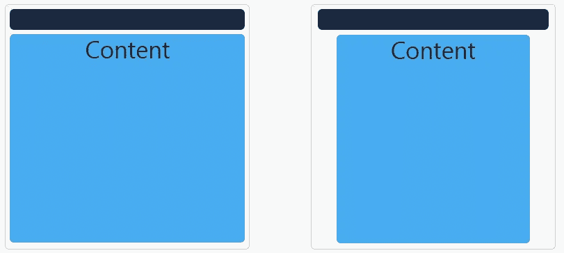

# 用 mini.css 设计一个简单的网页

> 原文：<https://medium.com/hackernoon/designing-a-simple-web-page-with-mini-css-f455e9f6403b>

在这个系列中，我们将带您了解一些基本的想法和技术，帮助您开始使用 [*mini.css*](http://minicss.org) *，并理解其背后的基本概念。*

mini.css — Minimal, responsive, style-agnostic CSS framework

**我们将在本文中讨论:**字体、网格和导航

**难度:**初学者(如果你已经熟悉了另一个 CSS 框架，可以跳到本系列的下一篇文章)

选择一个新的工具可能是相当令人生畏的，尤其是当它影响到你的项目的很多方面的时候。前端工具，尤其是 CSS 框架，是这种情况下最糟糕的罪犯，因为它们通常会迫使你修改大量的现有代码和/或工作流。通常，文档是不清楚的，固执己见的风格会妨碍你，在你知道之前，你的网站一半是一团糟，你必须重新设计几乎所有不是纯文本内容的东西。

在这一系列文章中，我将尝试帮助您从我开发的一个前端工具 **mini.css** 开始，创建一些简单的模板项目，并探索它可以为您带来长期好处的方式。不过，在我们开始之前，我建议你阅读一下我的前一篇文章[关于你为什么想尝试它，以及在开始之前温习一下你的 CSS 和 HTML 技能。](https://hackernoon.com/5-reasons-to-try-out-mini-css-62ddb47b9370)

 [## 试用 mini.css 的 5 个理由

### 在这篇文章中，我将解释为什么 mini.css 是 css 框架生态系统的一个有价值的补充，以及…

hackernoon.com](https://hackernoon.com/5-reasons-to-try-out-mini-css-62ddb47b9370) 

## 印刷术基础

先说排版。Mini.css 为所有文本元素(段落、标题、链接、代码)提供了一个很好的预定义样式。你可以对任何东西使用普通的 HTML5 标签，不需要类或自定义属性，它们开箱即用就能很好地工作。您可以查看下面由 Harald Borgen 制作的截图进行现场演示(这是一个 [Scrimba](https://scrimba.com/) 截图，意味着您可以在暂停时修改或复制代码，所以请务必查看)。

 [## Mini.css 简介- Scrimba 截屏

### 我正在看 Mini.css 框架，这是我今天刚刚发现的。在这个截屏中，我讲了一点…

scrimba.com](https://scrimba.com/casts/cast-1949) 

## 航行

在你开始写文章和设计用户档案之前，你需要建立一个可用的和一致的导航菜单，一个用户可以依靠它在你的网站上移动的菜单。在本文中，我们将只涉及基础知识，但是在本系列的后面会有更多关于菜单的内容。

Mini.css 的导航主要依赖于`<header>`元素。在页眉中，你可以为你的网站添加一个`.logo`和任意多个链接，只要它们看起来像一个`.button`。可访问性和响应性由框架处理，所以不用担心。我特别喜欢标题的`.sticky`类，它让菜单一直停留在屏幕的顶部，让你的网站更有本地应用的氛围。

说了这么多，让我们开始为我们的新猫社交媒体创建一个导航菜单，名为 *Catbook* ！步骤非常简单:

1.  创建一个`<heading>`元素并将`.sticky`类添加到其中，这样它就会一直位于页面的顶部。
2.  添加一个`<a>`元素，链接到你的猫社交媒体的页面，并给它一个`.logo`类，使它比其余的链接大。
3.  添加一些链接，如用户个人资料、好友列表和 c(h)atroom 的链接。记得给他们上`.button`课，让他们好看。

让我们看看那会是什么样子！

Catbook’s navigation

## 网格和布局

好了，现在是网站更复杂的部分。让我们先决定一个布局。一个非常简单的设计对大多数博客类(和其他)网站来说非常有效，那就是让我们的内容占据智能手机屏幕的整个宽度，并在平板电脑和桌面屏幕的主要内容周围留出一些空间。

假设我们的屏幕可以分为 12 个虚拟列，我们希望在智能手机上使用所有 12 个虚拟列，而在其他任何设备上只使用 10 个虚拟列，这意味着我们应该允许在台式机和平板电脑的屏幕两侧各有一个空列。12 列网格是 mini.css 采用的方法(虽然您可以自定义它，但那是另外一个故事了)，类似于市场上几乎所有其他的 css 框架，允许您根据屏幕大小操纵不同内容的宽度(在虚拟列中)。下面你可以看到我们希望这个布局看起来像什么:

The desired layout for smartphones (left) and all other devices (right)

因此，在深入研究布局本身之前，让我们先习惯网格语法。网格语法在最外层使用可选的流体`.container`，对行使用`.row`元素(显然)，对行内的列使用响应性的`.col-SIZE-WIDTH`元素。每列可以有一个为一个、两个或三个设备尺寸(小型— `sm`、中型— `md`和大型— `lg`)指定的布局。列可以是流动的(尽可能多地占用空间)或具有预定义的宽度(1 到 12 之间的数字)。最后，为了简化布局，我们可以使用`.col-SIZE-OFFSET-offset-WIDTH`语法，允许我们在列周围创建空间。我知道这很难理解，所以让我们慢慢来，应用这些知识来创建我们想要的布局。注意，为了让事情变得简单一点，我们将跳过本教程中的`.container`。

1.  创建一个`
`元素，并给它一个`.row`类。它将作为我们内容的外部容器。
2.  然后，在里面再加一个`
`。这将是页面内容的容器。
3.  给最后一个容器一个`.col-sm-12`类。这意味着它占据了智能手机屏幕的整个宽度(12 个虚拟列)。
4.  现在，对于其余的设备，我们*可以*为宽度使用两个以上的类，但是我们可以跳过用于大屏幕的类，因为布局与用于中等尺寸屏幕的完全相同。我们希望内容占据屏幕的 10 个虚拟列，所以添加了`.col-md-10`类。
5.  现在，我们还希望在内容周围有一个 1-虚列空间，所以我们也需要使用一个 offset 类。简单地添加`.col-md-offset-1`类，你就差不多设置好了。

向页面添加一些内容后，看起来像这样:

The implemented layout of Catbook

## 让我们擦亮它

我们的小猫社交媒体进展顺利。如果我们能在顶部导航菜单中应用同样的网格布局就好了。实际上，我们可以！我们可以用完全相同的原理。我们还应该在网站上添加一个`<footer>`,让它遵循与其他内容相同的响应模式。我将让您自己找出如何做到这一点(**提示:**将`.row`类应用到您的`<header>`元素)。如果你很懒或者你已经完成了你的 Catbook 版本，看看下面的例子，看看最终的设计应该是什么样子。

The final design of Catbook

所以，你有它！一个完全使用 HTML5 和一些简单的类和模式设计的简单网站，这些类和模式是由 mini.css 提供的。我们刚刚讨论了组成框架的三个最重要的模块:[核心](http://minicss.org/core)、[网格](http://minicss.org/grid)和[导航](http://minicss.org/navigation)。如果你想开始创作一些更复杂的东西，我强烈建议你点击那些链接并阅读更多关于它们的内容。

在下一篇文章中，我们将讨论一些更有趣的表示模式，比如[卡片](http://minicss.org/card)和[媒体对象模式](http://minicss.org/grid#media-object)，它们将帮助我们创建一个更高级的网站布局。敬请期待！

> [黑客中午](http://bit.ly/Hackernoon)是黑客如何开始他们的下午。我们是 AMI 家庭的一员。我们现在[接受投稿](http://bit.ly/hackernoonsubmission)并乐意[讨论广告&赞助](mailto:partners@amipublications.com)机会。
> 
> 如果你喜欢这个故事，我们推荐你阅读我们的[最新科技故事](http://bit.ly/hackernoonlatestt)和[趋势科技故事](https://hackernoon.com/trending)。直到下一次，不要把世界的现实想当然！

