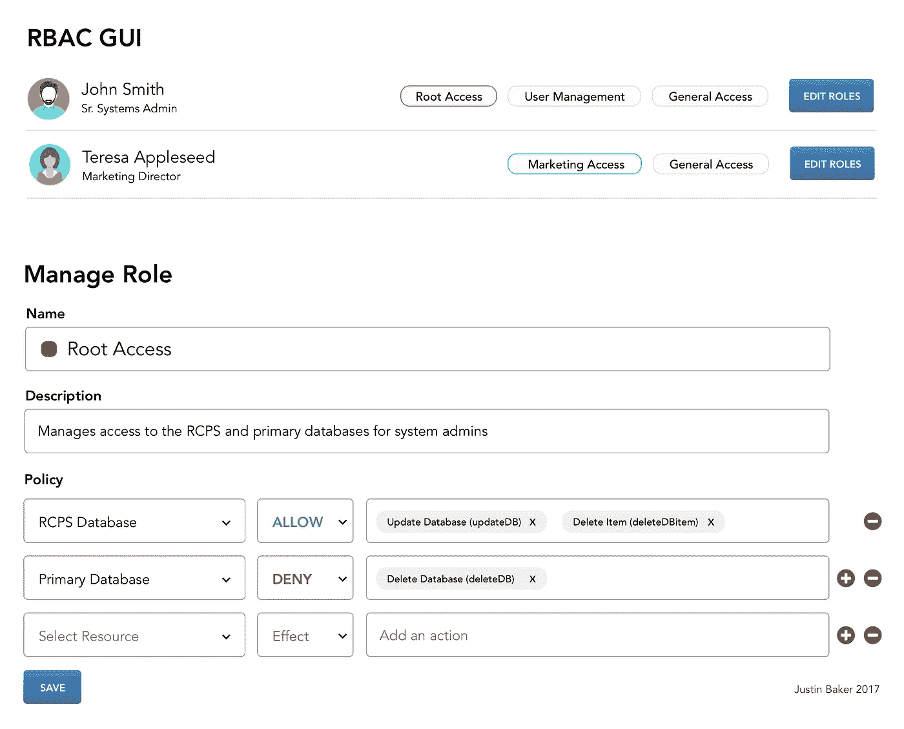

# 设计基于角色的企业访问控制(RBAC)系统

> 原文：<https://medium.com/hackernoon/designing-an-enterprise-role-based-access-control-rbac-system-96e645c659b7>

基于角色的访问控制(RBAC)是一种根据定义的角色限制用户访问系统的方法。许多公司已经建立了这样的内部系统，但通常是以一种非常陈旧和随意的方式。

角色有一些主要的语义，以及定义角色的一组属性、操作符和动作。



# 定义角色

角色应该有五个语义组成部分:

*   名称——一种人类可读且业务友好的识别角色的方式
*   描述—明确定义的角色目的
*   标签—对于管理多个角色和创建角色以管理角色非常重要
*   指派—将角色指派给个人或个人群组
*   策略—分配给角色的特定规则和权限集

# 定义策略

策略有一个主要组件:

*   语句数组—一个策略可以有许多语句。您应该能够保存策略并在多个角色之间重用它们。换句话说，策略是特定权限规则的集合。

# 定义语句

a 报表有三个组成部分:

*   资源—目标特征、环境或操作
*   效果—通常是“允许”或“拒绝”
*   操作—一个资源可以有许多操作，如 deleteUser、addUser、modifyUser。这些操作应该有人类可读的名称，比如“删除用户”代表“删除用户”。当您进入更复杂的操作时，这是必不可少的，比如“imgUploadMod”的“修改图片上传”。

```
{
    "effect": "deny",
    "resources": [
      "prod/primaryDB/*"
    ],
    "actions": [
      "deleteDB"
    ]
  }
```

# 映射角色

您应该能够为单个用户分配多个角色。理想情况下，您应该有一个清晰的用户界面，允许您构建这些角色并将它们附加到单个用户或用户组。

# 避免技术债务

随着时间的推移，在大公司中积累成百上千个职位是很常见的。拥有一个直观的 GUI 可以让您管理这些债务，让您的角色保持最新，并保证您的系统安全。