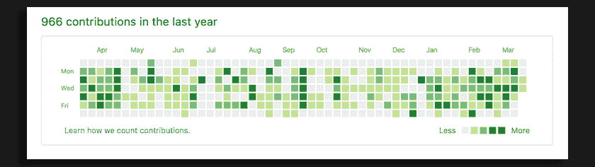
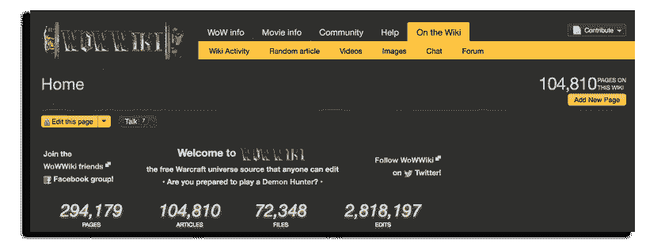
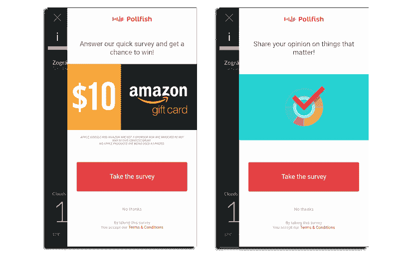
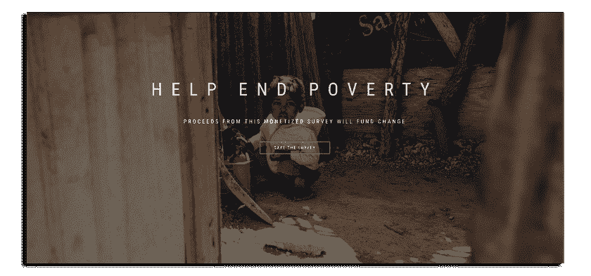
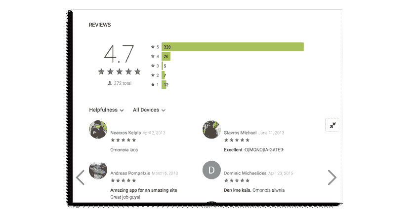
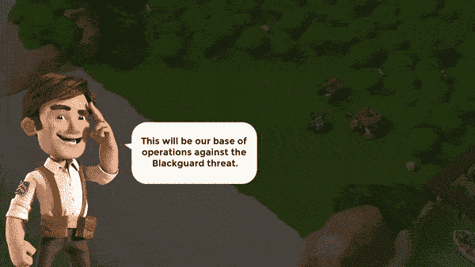

# 设计能够提高用户参与度和忠诚度的应用

> 原文：<https://medium.com/hackernoon/designing-apps-that-drive-user-engagement-and-retention-403b2dddbf98>

[手机](https://hackernoon.com/tagged/mobile) app 用户。如何找到它们以及如何保存它们是开发人员关心的两个主要问题。而与用户体验和 app [设计](https://hackernoon.com/tagged/design)携手而来的，是心理学。我们能提高用户参与度和忠诚度吗？广告每天都在利用人们的情感，以我们无法想象的方式。我们能设计出通过人们的感觉来提高参与度和忠诚度的应用和产品吗？

# 社区和社会身份

社会认同理论认为，人们所属的群体是骄傲和自尊的重要来源。我们希望提高我们所属群体的地位，以增加我们的自我形象。但是那个群体代表了什么呢？那群人背后的理念是什么？如果我们能围绕一个平台或者 app 产生这样一个想法，产生这样一个群体呢？这有助于吸引人们再次使用某款应用，并提高用户的忠诚度。一旦人们将自己归类为一个群体的一部分，并认同了这个群体，他们的自尊就与这个群体紧密相连。团队做得越好，用户感觉越好，他就越有可能采取进一步的行动来改善、保护或促进团队的地位。我们在日常生活中通过宗教、体育和其他事情经历了类似的情况，但当你看到这一概念在技术产品和应用程序中的应用时，它真的很迷人。

## 开放源码

一个很好的例子是人们为开源项目做贡献。编写代码需要专业知识、时间和努力，但他们免费提供。为什么？人们决定贡献的一个主要原因是因为他们相信开源文化和思想。鼓励人们贡献和创造更好的产品。

## 从 Reddit 和维基百科到魔兽世界和游戏王！

Reddit 还因其专注的社区和大多数成员之间的紧密联系而闻名。在社区中监督或回答问题并没有真正的好处(经济或其他方面)。然而，人们觉得自己是一群专家或志趣相投的人的一部分，他们想保持这个群体的地位。他们每天都在监控每一个提交、向上投票和向下投票，以努力维护一个干净、向上的社区。都是为了寻找完美的精英团体。如果你的社区是完美的，你也一定是完美的，对吗？维基百科呢？背后没有伟大的学术委员会；简单来说，志愿者放弃自己的个人时间来监控提交的内容。

如果你想在游戏行业找到这样的例子，看看魔兽世界游戏就知道了，这个社区贡献了一个巨大的 [wiki](http://wowwiki.wikia.com/wiki/Portal:Main) ，超过 104k 页长。这同样适用于游戏王！现象跟 [97k 页](http://yugioh.wikia.com/wiki/Yu-Gi-Oh!_Wikia)差不多。所有这些都是围绕一个推动内容和奉献的故事而创建的社区。

# 拯救世界——让世界变得更美好

没有什么比一项崇高的事业更能打动人心了。你可能觉得拯救世界不能适用于 app 或者平台，是吗？嗯，当人们觉得他们为一项崇高的事业做出了贡献时，看到他们愿意走多远是很有趣的。

## 分享你对重要事情的看法

在 [Pollfish](http://www.pollfish.com/) ，我们通过移动应用程序调查人们。当我们在市场研究领域迈出第一步时，我们认为没有人会花时间在一个应用程序中回答调查，除非有足够的激励。因此，我们引入了随机抽取亚马逊礼品卡的概念。然后我们想尝试一些不同的东西；我们把标语从礼物提示改为“分享你对重要事物的看法”。

我们有点犹豫要不要这么做，预计转化率会下降。相反，我们看到了近 1%的增长。这听起来可能不多，但在我们的调查世界里，这实际上很难相信。然后我们决定进行一项调查，询问人们为什么要回答调查。很难相信我们想要得到一些硬数据！结果是惊人的。以下是我们收到的一些最难忘的回答:

*   这样我就可以真正把我的想法放在产品上了。
*   回答调查会让人觉得有人在倾听，并在努力改进。
*   回答调查让我能够以一种重要的方式陈述我的观点。
*   我可以向企业展示真实的反应，以帮助他们发挥潜力。
*   它帮助开发者、市场研究者等了解客户和社区更多或更少想要什么。
*   对人很重要。我喜欢分享我的观点和贡献。
*   我觉得这可以让我更深入地了解我可能想要或不想要什么东西的方式或原因，而不仅仅是提供产品，从而有助于更好地开发产品。
*   我认为做得很好很有趣，因为我能够表达我对产品的看法。
*   因为它给了别人灵感
*   我喜欢表达我的观点，因为这是公司知道他们做得好不好的方式。
*   你可以表达我们对产品的欣赏
*   因为我提供反馈，所以我是这个过程的积极参与者。
*   我不介意为某人的知识做出贡献
*   我喜欢通过调查给出反馈，因为人们会看到这一点，并根据我的回答做出决定。
*   发表意见会有所不同。让我有参与感

好吧，如果这不是硬数据，我们不知道什么是。你说“积极参与者”？你说“有人在听”？谁能想到呢？！那么，让我们回到设计板。我们将 Pollfish 核心模型建立在人们愿意感受自己的重要性并帮助塑造更好的产品和业务的基础上，这也是我们今天正在发展的模型。

## 消除贫困

只有一件事能打败那些想要分享观点的人，那就是慈善。我们在 Pollfish 有很多合作伙伴在他们的盈利策略中使用这种方法。受访者充分意识到出版商和我们都从调查过程中获利，但仍然认为只要他们有机会向慈善机构捐款，这是可以的。我们发现，只要他们能做到这一点，他们需要观看/点击/接受的视频、广告或调查都没关系。

# 品牌方法

## 苹果、耐克等

在下面的视频中，史蒂夫·乔布斯亲自解释了“与众不同/疯狂的人”活动是如何运作的。没有必要吹嘘你的品牌的新功能或先进技术。没有必要显示你比你的竞争对手更好。向世界展示你的产品周围的社区充满了有价值的人，他们被改变世界的热情所驱使。他还提到了像耐克这样的公司。耐克的活动只是在他们的广告中展示所有伟大的运动员。他们不关注竞争对手或新产品的进步。然而，你还是忍不住想成为这个团队的一员。实际产品甚至都不重要！

## 团队是一种理念

回到我们都喜欢感觉属于一个团体，一个拥有某些(好)属性的团体的概念，这里有另一个例子:当我作为一个年轻的开发人员第一次开始时，我为我支持的团队创建了一个[应用](https://play.google.com/store/apps/details?id=com.wajeemobile.omonoianews)。请注意，我不认为这是任何团队。这是我的团队，我的团队比任何其他团队都好。它有最好的球员和最好的球迷。我们相信我们有自己的文化和看待事物的方式。所以，尽管这个应用没什么特别的，我意识到它变得非常受欢迎，因为其他粉丝发现了它。球迷们对球队的评价源源不断。人们使用这款应用并对其进行评级，因为它与团队相关联。当我们感到自己是一个群体的一部分时，不久我们就开始将自己的群体与其他群体进行比较。从对该应用的负面评价中也可以明显看出这一点。这些评论(正面的或负面的)很少与实际的应用程序有关，而是与它背后的想法有关。这款应用的留存率有所上升，反映了该团队的受欢迎程度。这是一个很好的例子，说明了如何使用一个已经建立的想法，并围绕它开发一个应用程序，以增加参与度和保留度。

# 像在游戏中一样创造一个故事

有很多其他方法可以吸引人们，并激励他们一次又一次地回来使用你的应用。为什么不像游戏一样为你的用户创造一个故事；一个他们真正想关注并参与其中的故事。“保护你的土地/部落免受敌人/邪恶的人，拯救女王”等等。

嗯，一个很好的例子说明了如何将这一点应用到应用程序而不仅仅是游戏，这是一个很受欢迎的喝水提醒应用程序，一个告诉你什么时候喝水的应用程序！老实说，你知道什么时候渴了，对吗？也许吧。但是你知道你喝够了吗？还是你忘了定时喝水？你身材好吗？你水分充足吗？喝水是一个良好的健康习惯。它让你保持良好的状态。看到了吗？你已经在跟踪这个故事了。你确实需要这个应用程序！一款可以帮你养成健康习惯的应用。

那么，你如何设计一款能提高用户参与度和忠诚度的应用呢？是创造美好故事的 app 吗？你能创造一个应用程序的想法，让人们参与进来，让他们感觉自己是一个团体的一部分吗？它是一个帮助塑造一个更美好世界的应用程序，还是一个围绕一个已经建立的充满激情的团体的应用程序？选择你的事业或想法，并让它发挥作用。回到基础，了解人们需要什么。一个值得追随的故事，一个崇高的事业，一个“胜利”的团队。一旦人们站在你这边，留住和参与就是你的了。

> [黑客中午](http://bit.ly/Hackernoon)是黑客如何开始他们的下午。我们是 [@AMI](http://bit.ly/atAMIatAMI) 家庭的一员。我们现在[接受投稿](http://bit.ly/hackernoonsubmission)，并乐意[讨论广告&赞助](mailto:partners@amipublications.com)机会。
> 
> 如果你喜欢这个故事，我们推荐你阅读我们的[最新科技故事](http://bit.ly/hackernoonlatestt)和[趋势科技故事](https://hackernoon.com/trending)。直到下一次，不要把世界的现实想当然！

