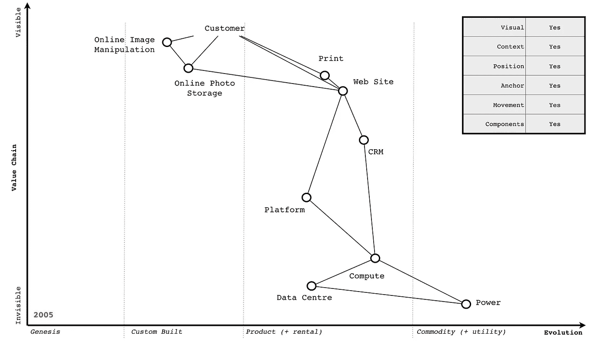
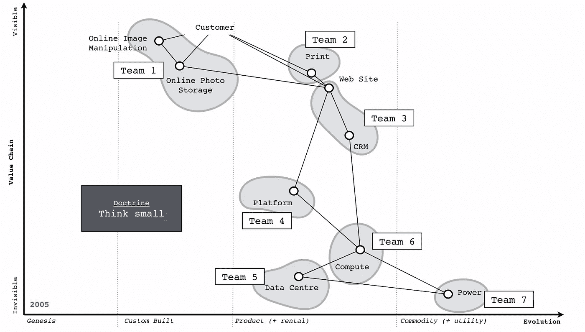
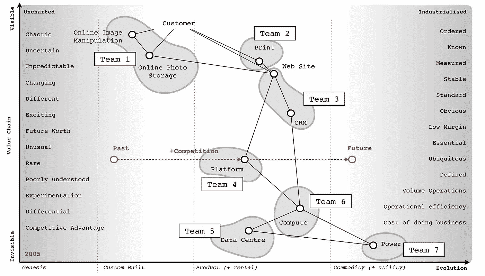
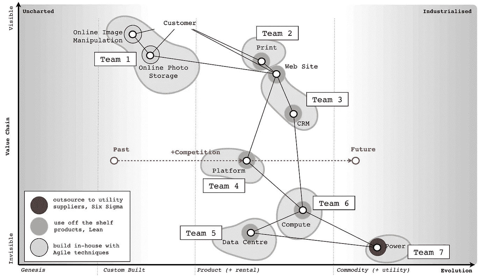
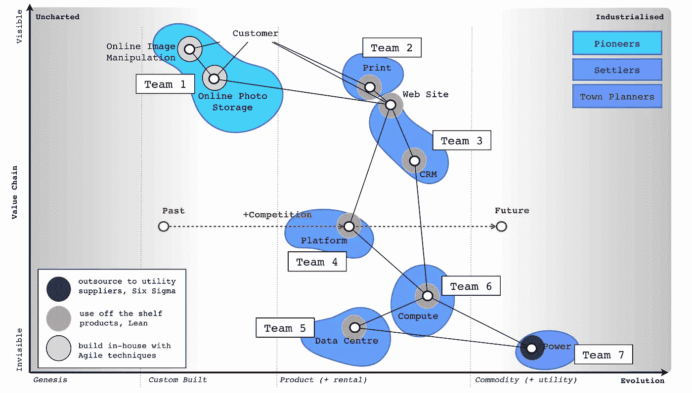
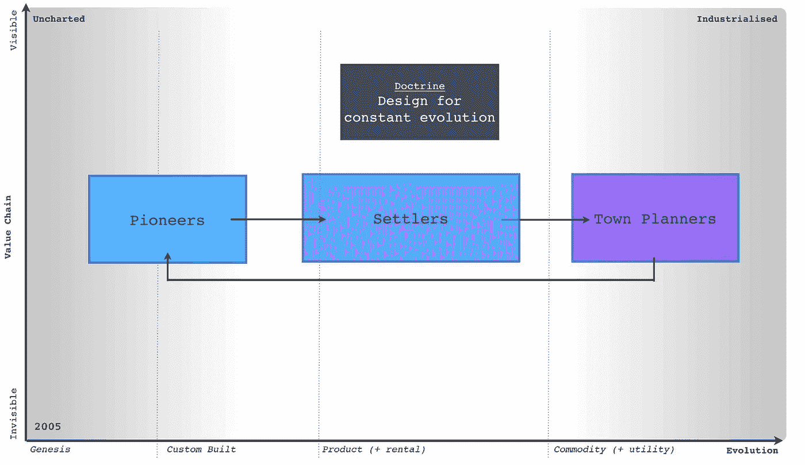
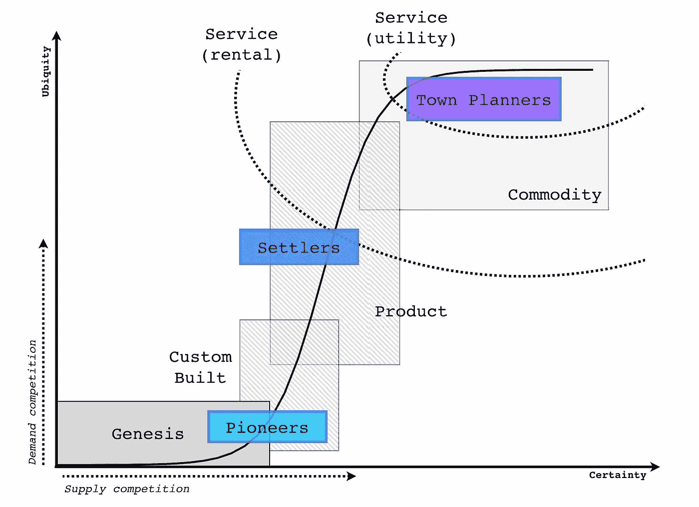

# 为不断进化而设计

> 原文：<https://medium.com/hackernoon/designing-for-constant-evolution-41b216741974>

## 开拓者、定居者和城市规划师

门环工、司炉工、点灯工和电力总裁都是属于过去的头衔。它们的出现是技术变革的结果，它们繁荣了一段时间，然后又消失在黑暗中。今天也不例外。

> 然而，创新从未如此频繁和普遍。使信息和材料从家庭流向办公室、工厂、世界各国首都和偏远乡村的技术已经改变了生产产品和提供服务的方式。快速的技术进步需要一个灵活多变的组织结构，在更成熟的运营中，这种结构可能会面临控制不足和不必要错误的风险。相反，无错成熟操作的要求可能与持续改进所需的创新行为相冲突。组织生命周期中的这种冲突并不新鲜，在发展鼓励创新的结构和人员时必须认识到这一点，同时保持组织持续运营所必需的东西

…国家研究委员会关于工作场所中的人员和技术的报告(1991 年)指出。2017 年感觉很像。

*的解决方案*对于这种变化，过去是这样，今天往往是栓上一个新的部门。让它成长，然后让它死去。经受重组的痛苦。不一定要这样。你可以设计组织来进化，但这需要对当今许多组织中存在的东西进行相当多的改造。

## 首先，你需要了解你的景观。

很难围绕你看不见的东西组织起来。了解细节和理解你所处的环境是很重要的。这需要某种形式的地图。但是，地图不是任何旧的图表，它有具体的特征，使你能够看到各个部分的位置以及事物如何移动。图 1 给出了一个围绕用户需求的业务地图的例子。一张地图有所有列在灰色方框中的特征。

**图 1—2005 年在线照片业务的沃德利地图**

有了对景观的理解，你现在可以围绕它进行组织

## 但是怎么做呢？

由美国空军中校丹·沃德提倡并由特种作战司令部展示的火力原则(快速、廉价、克制和优雅)在这里是适用的。你需要把风景分成小的部分，围绕它建立团队。你需要往小处想。

在亚马逊，这是典型的“两个比萨饼”模型，在海尔(世界上最大的电器制造商)，你有类似的细胞为基础的结构。我在图 2 中提供了一个例子。

**图 2——分解成小单元的沃德利地图**

## 但是那些团队是怎么运作的呢？它们是静态的吗？

这些细胞通过界面相互作用。细胞也可以由于一个组件的成功而生长。然而，组件和地图可以被细分以保持小单元的原则。我们可以建立团队的团队或细胞的细胞和地图的地图。每个细胞都可以被赋予自主权，掌控自己的空间和目的。

管理结构也可以覆盖在上面。这不是通过告诉细胞成员做什么的细节来完成的，而是通过根据商定的标准(一个适应度函数)来衡量他们的表现。这提供了一个海星式的运营模式，日常决策活动被分散到各个单元，管理层级的蜘蛛覆盖在顶层，提供一个方向。这种结构不常见，但扩散缓慢。

然而，有一个复杂的问题。细胞控制的那些组件不只是生长，它们通过供需竞争进化，并且随着它们的进化，它们的特征也发生变化——见图 3。

## **图 3——不断发展的组件和不断变化的特性**

## 管理变革

我们用来管理组件的技术和方法必须随着组件的发展而改变。我们管理一些新发现的勘探和开发的方式，与我们管理一个高度工业化组件的批量操作的方式不同。我们必须采用多种方法。

仅仅用正确的能力来填充细胞是不够的(例如，金融或工程或运营或营销)，我们还必须考虑正确的态度。例如，未知领域的软件工程更加敏捷，但是一旦相同的组件工业化，那么六西格玛就变得更加合适。采购、财务和营销也是如此，没有一种方法可以放之四海而皆准，但你必须使用多种方法——见图 4。

**图 4 —不同的方法**

## 不同的不仅仅是方法。

在未知的空间里，你面对的是未知、稀有、鲜为人知和不断变化的事物。你必须对失败、赌博和直觉感到高兴。然而，当同样的组件发展到更加工业化时，那么它就完全是关于批量操作和减少一些常见和标准化的偏差。你必须对效率的不懈追求、所需的复杂科学建模和一致性的巨大压力感到满意。态度的文化差异很大。

我们称这些态度为先锋、定居者和城镇规划者。图 5 提供了一个例子(记住这张图是 2005 年的)。我还在图 6 中添加了一个公共特征列表。

**图 5——拓荒者、定居者和城镇规划者**

**图 6 —特征。**

先驱们是聪明的人。他们能够探索以前从未发现过的概念，未知的领域。他们向你展示奇迹，但他们失败了很多。这东西多半不能正常工作。你不会相信他们建造的东西。他们创造“疯狂”的想法。他们的创新类型就是我们所说的核心研究。他们使未来的成功成为可能。大多数时候，我们看着他们，问“什么？”，“我不明白？”和“这是魔法吗？”。过去，我们经常在火刑柱上烧死他们。他们制造了第一个电源(帕提亚电池，公元 400 年)和第一台数字计算机(Z3，1943 年)。

**定居者**是聪明的人。他们可以把半生不熟的东西变成对更多观众有用的东西。他们建立信任。他们建立理解。他们学习并提炼概念。他们让可能的未来成为现实。他们将原型转化为产品，使其可制造，倾听客户的意见，并将其转化为利润。他们的创新是我们倾向于认为的应用研究和差异化。他们制造了第一台计算机产品(如 IBM 650 及以后的产品)，第一台发电机(Hippolyte Pixii，西门子发电机)。

**城市规划者**是聪明的人。他们能够利用规模经济的优势生产某种产品并将其产业化。他们构建未来的平台，这需要高超的技能。你信任他们建造的东西。他们想方设法让事情变得更快、更好、更小、更高效、更经济和足够好。他们建立了先驱者所依赖的服务。他们的创新类型是工业研究。他们将现有的东西转化为商品或公用事业(如电力，然后是爱迪生、特斯拉和西屋电气)。他们是我们依赖的工业巨头。

然而，仅仅通过细胞来组织，并让人们以正确的态度来居住是不够的。你还需要再走一步。

## 盗窃系统

你需要模仿系统内的进化，这可以通过引入一个盗窃系统来实现。定居者偷拓荒者的东西，迫使他们去探索新的土地。城镇规划者偷定居者的东西，迫使他们前进。拓荒者建立在城镇规划者和定居者提供的组件和服务之上。这个盗窃系统完成了一个良性循环——见图 7。

**图 7 —盗窃系统**

但是你需要小心，因为每一组都很重要。你需要避免只有拓荒者和城镇规划者(两党国家)而没有人管理过渡(缺少定居者问题)的战争。你需要避免当你让一个团队在无聊的时候把项目扔给另一个团队时出现的自负。因此，殖民者偷拓荒者的东西，而不是拓荒者扔面包屑给殖民者。偷窃也是迫使团体放手的必要条件。定居者将希望保持他们成功的产品组合，他们将对过去的成功所带来的变化产生惰性，因此城镇规划者必须从他们那里偷东西。最后，每个细胞不仅建造而且操作它所建造的东西。它使用其他公司的组件，但对自己的领域负责。

## 为不断进化而设计

通过将基于细胞的结构与态度(先锋、定居者和城镇规划者)以及盗窃系统结合起来，你可以创建一个能够成长、探索新领域并不断适应不断发展的环境的组织。不再有附加条款，不再有不断的重组，不再有单一公司文化的故事。

我非常感谢罗伯特·x·克林格利和他 1993 年的书《偶然的帝国》，这本书是拓荒者、定居者和城镇规划者的来源。我也非常感谢 James A. Duncan，他不仅是这些概念的共同作者，而且在我管理的公司担任首席信息官期间，实现了这种结构的第一个例子。

然而，这大部分是十年前的技术水平。当今的艺术水平如何？这将是一个小心翼翼保守的秘密，但它会发展。

## 付诸实践

如果你对创建这样的结构感兴趣，那么你需要采取一些步骤。你不能照搬现有组织的结构。这些步骤包括

*   以用户需求为中心(这是主播)。
*   借助地图了解你的风景。使用此类地图来改善协作、创建持续学习并帮助减少重复。
*   将多种方法的概念社会化，远离单一方法的专制。
*   引入基于细胞的结构——实现自主和掌握——同时将态度的概念社会化。
*   介绍拓荒者、定居者、城镇规划者的结构和盗窃系统。

## 关于演化曲线的注记

地图的 x 轴是一条平坦的演化曲线(见图 8)。曲线可以追溯到 2007 年。最初在地图上，这只是一个预先注意到的模式，需要相当长的时间来收集数据以确认曲线。早在 2008 年至 2010 年间，我在会议上经常使用[曲线(用先锋等标记)](http://blog.gardeviance.org/2008/04/more-oa-with-your-aas.html)，但现在我更喜欢使用映射形式。

**图 8 —进化曲线上的 PST 阶段。**

## 进一步阅读

我强烈建议你阅读

*   GCHQ 的打赏论文[《沸腾的青蛙》](https://github.com/gchq/BoilingFrogs)
*   [AirBnB 的弹性团队之旅](http://firstround.com/review/the-power-of-the-elastic-product-team-airbnbs-first-pm-on-how-to-build-your-own/)
*   罗伯特·x·克林利《偶然的帝国》，1993 年
*   奥里·布拉夫曼和罗德·贝克斯特罗姆《海星和蜘蛛》，2006 年
*   关于地图，然后[我有一本书](https://medium.com/wardleymaps)(见下文)，我还在写。请自便。

## 这本书到目前为止

第一章— [关于迷失](/wardleymaps/on-being-lost-2ef5f05eb1ec)
第二章— [寻找道路](/wardleymaps/finding-a-path-cdb1249078c0)
第三章— [探索地图](/wardleymaps/exploring-the-map-ad0266fad59b)
第四章— [主义](/wardleymaps/doctrine-8bb0015688e5)
第五章— [游戏和行动的决定](/wardleymaps/the-play-and-a-decision-to-act-8eb796b1dff1)
第六章— [开始自己](/wardleymaps/getting-started-yourself-e1a359b785a2)
第七章— [寻找新的目标](/wardleymaps/finding-a-new-purpose-8c60c9484d3b)
第八章—
第 11 章— [稍微有用的自助餐](/wardleymaps/a-smorgasbord-of-the-slightly-useful-2498a1163dd6)
第 12 章— [场景](/wardleymaps/the-scenario-8bc05feee81)
第 13 章— [邪恶的东西来了](/wardleymaps/something-wicked-this-way-comes-b028d5c607bf)
第 14 章— [对自己真实](/wardleymaps/to-thine-own-self-be-true-543cfe2cd1a)

这篇文章由原作者西蒙·沃德利[前沿论坛](https://leadingedgeforum.com/)的研究员提供，作为知识共享 [**归属-共享 4.0 国际**](http://creativecommons.org/licenses/by-sa/4.0/) 。

> [黑客中午](http://bit.ly/Hackernoon)是黑客如何开始他们的下午。我们是 [@AMI](http://bit.ly/atAMIatAMI) 家庭的一员。我们现在[接受投稿](http://bit.ly/hackernoonsubmission)，并乐意[讨论广告&赞助](mailto:partners@amipublications.com)机会。
> 
> 如果你喜欢这个故事，我们推荐你阅读我们的[最新科技故事](http://bit.ly/hackernoonlatestt)和[趋势科技故事](https://hackernoon.com/trending)。直到下一次，不要把世界的现实想当然！

