# 为人类直觉挑战设计神经网络

> 原文：<https://medium.com/hackernoon/designing-neural-nets-for-the-human-intuition-challenge-c380ce5c595c>

## 改进简单张量流模式的直观指南

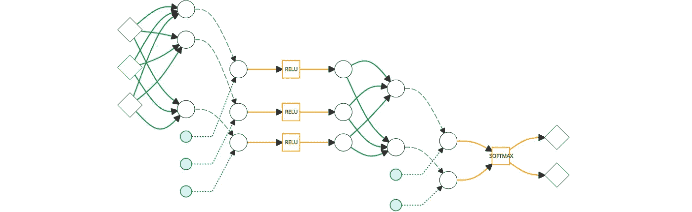

本文描述了围绕数据收集、分析和神经[网络](https://hackernoon.com/tagged/network)开发的技术细节，用于本文中总结的一个实验: [**“你直观吗？挑战我的机器！**](/p/82c3faed97da)

**这些内容代表了大量的实验、代码和可视化，非常适合[机器学习](https://hackernoon.com/tagged/machine-learning)新手使用。**

**如果您是 TensorFlow 初学者或者只是对这个独特的数据集感兴趣，请查看文章底部 Github 上的代码链接。**

# **实验**

**人类直觉挑战是在探索谷歌用于机器学习的 TensorFlow 框架时出现的。当探索一项新技术时，从简单的例子开始并慢慢建立直觉会很有帮助。众所周知，对神经网络进行可视化和故障诊断非常困难，因此从简单的例子开始也有助于获得坚实的基础。**

**[“尤里卡因素](https://www.amazon.com/Eureka-Factor-Moments-Creative-Insight/dp/1400068541)”作者约翰·考尼奥斯博士和马克·比曼博士引用了阿瑟·雷伯的一项研究，他曾做过人类直觉的实验。如果 Arthur Reber 的研究可以重现，那么就可以获得一个简单而相当有趣的数据集来训练神经网络。它还可以用来比较人类和人工神经网络之间的直觉。**

**在 Arthur Reber 的研究中，参与者查看了由两种不同的规则集生成的字母串。参与者被要求简单地将每个字符串分配给两个“家族”中的一个。以下是向参与者展示的一个字符串示例:**

> **RNIWKQ**

**随着时间的推移，参与者学会了在不实际“知道”用于生成这些字符串的规则集的情况下更好地对这些字符串进行分类。**

**为人类重现这个实验非常简单，数据可用于机器学习。**

# **Web 应用程序**

**灵活性和效率对这个实验很重要。需要为人类和机器生成数据，同时以不同的形式和数量呈现。构建 web 应用程序是满足实验需求的自然方式。**

**构建的 web 应用程序是一个具有 AngularJS 前端的 NodeJS 应用程序。它在本地计算机上用于为神经网络生成训练数据，并被部署到 Amazon EC2 实例以收集人类数据。**

**[](https://github.com/gitsome/HumanIntuitionChallenge) [## git some/human intuition 挑战

### human intuition challenge——一个用 TensorFlow 比较人类直觉和神经网络的项目

github.com](https://github.com/gitsome/HumanIntuitionChallenge) 

web 应用程序的第一个角色是管理“方案”(规则集)，这些方案将被用来生成类似 Arthur Reber 研究中的随机字符串。UI 有创建、删除和编辑这些“方案”的屏幕

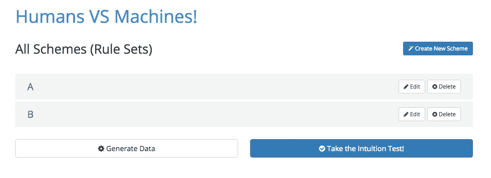

对于这个实验，产生了两个方案，“A”和“B”。每个方案都是一个转换列表，这些转换顺序应用于随机生成的 7 个字符的字符串。

如果您想在看到实验中使用了什么转换之前进行人类直觉测试，那么您现在就可以这样做:

[参加人类直觉测试！](http://ec2-35-161-47-191.us-west-2.compute.amazonaws.com:3000/)

好的，这是方案 A 和方案 B 的转换:

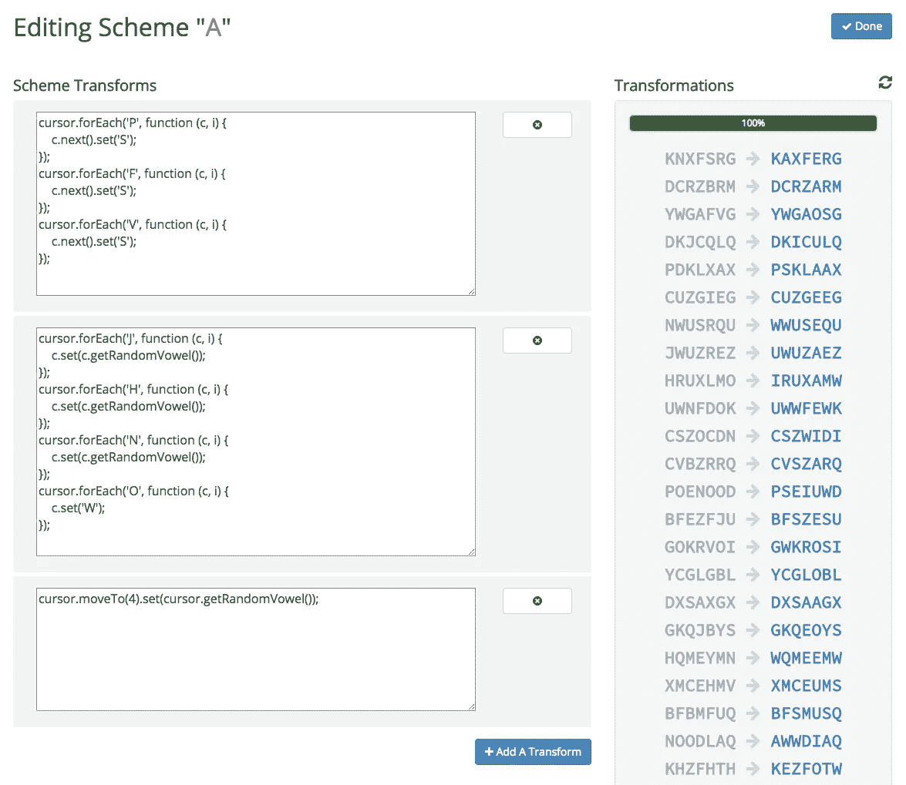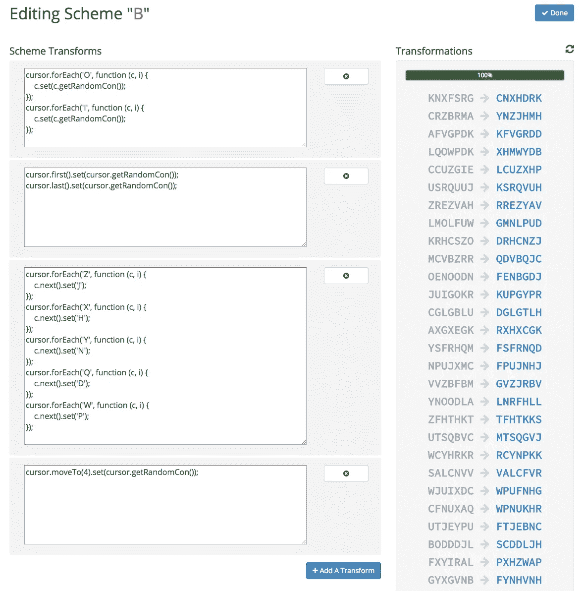

每个转换脚本都使用一个全局“cursor”类实例来导航字符串，以便使用一些辅助方法来修改字母。例如，您可以看到方案 B 中的最后一个转换是:

```
cursor.moveTo(4).set(cursor.getRandomCon());
```

该转换将光标移动到第 5 个字母(因为第一个字母在零位置)，并将其设置为随机辅音。

# 从人类那里收集数据

下面是 web 应用程序中人工测试的屏幕截图。这种交付机制就是 web 应用程序记录人类准确性的方式。让真实的人参加在线测试是下一个障碍。

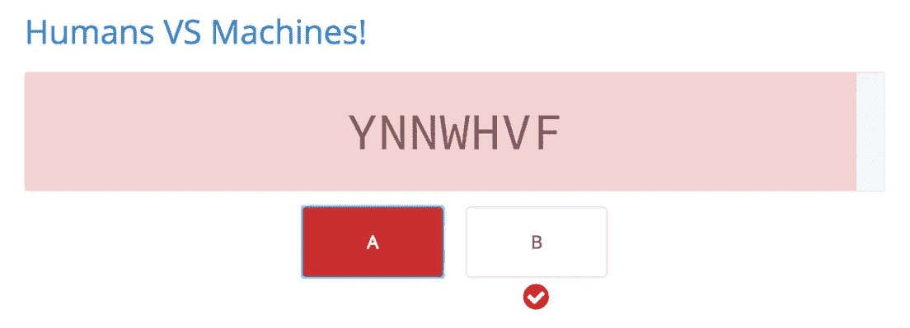

The Human Intuition Online Test : Wrong Answer!

[**如何吸引“土耳其人”，做一个机械土耳其人英雄！**](https://medium.com/u/697030361dd9#.y9vhm2oy7)**)**

# **为机器收集数据**

**获得用于训练神经网络的标记数据是容易的部分。web 应用程序使用已配置的方案生成随机字符串，这些字符串带有相应的标签“A”或“B”。**

# **开发神经网络**

**在完成对人类参与者的分析之后，需要建立神经网络来与人类参与者进行比较。**

**在这里查看人类的结果:“ [**你直观吗？挑战我的机器！”**](/p/82c3faed97da)**

**创建神经网络的过程是如何开始的？**

**数据集将最终决定最佳网络的结构。例如，在[图像网](http://image-net.org/)数据集上进行图像识别需要一个具有许多卷积和池层的深度网络，以便提取越来越复杂的模式。也经常建议使你的隐藏层尽可能小，以避免过度拟合。**

**数据集不像二维彩色图像那样复杂，所以从一个隐藏层开始，然后根据需要移动到更复杂的网络和更多的层是合理的。**

## **输入应该是什么样的？**

**将字母直接输入神经网络并不理想。这是因为确保每一个重要的特征都被表现出来并且可以被数学地操作是很重要的。**

**将每个 7 个字母的字符串转换为数字输入的简单方法是将每个字母映射到 1–26 之间的相应数字。这意味着“A”是 1，“Z”是 26。在数学意义上，“Z”可能被视为更重要，因为其较大的量值可能在训练期间导致不期望的结果。**

**还有另一个选项，仍然描绘字母之间的相对位置，但不会对字母进行不同的加权。该选项将每个字符串转换成其**一个热编码**表示**。****

**one hot 编码格式将把每个字母转换成 26 维数组，除了在字母“开”的位置上有一个 1 之外，该数组中的所有条目都为零。**

**例如，以“WIYLEWS”中的第一个字母“W”为例。对于第一个字母，你可以说“W”是“开”，其余可能的字母是“关”。在 one hot 编码表示中，这将是一个矩阵符号，其中 1 表示第 23 个字母，0 表示其余的字母。作为一维矩阵/向量，如下所示:**

```
[0,0,0,0,0, 0,0,0,0,0, 0,0,0,0,0, 0,0,0,0,0, 0,0,1,0,0, 0] — “W”
```

**对整个字符串重复该过程得到:**

```
[0,0,0,0,0, 0,0,0,0,0, 0,0,0,0,0, 0,0,0,0,0, 0,0,1,0,0, 0] — “W”[0,0,0,0,0, 0,0,0,1,0, 0,0,0,0,0, 0,0,0,0,0, 0,0,0,0,0, 0] — “I”[0,0,0,0,0, 0,0,0,0,0, 0,0,0,0,0, 0,0,0,0,0, 0,0,0,0,1, 0] — “Y”[0,0,0,0,0, 0,0,0,0,0, 0,1,0,0,0, 0,0,0,0,0, 0,0,0,0,0, 0] — “L”[0,0,0,0,1, 0,0,0,0,0, 0,0,0,0,0, 0,0,0,0,0, 0,0,0,0,0, 0] — “E”[0,0,0,0,0, 0,0,0,0,0, 0,0,0,0,0, 0,0,0,0,0, 0,0,1,0,0, 0] — “W”[0,0,0,0,0, 0,0,0,0,0, 0,0,0,0,0, 0,0,0,1,0, 0,0,0,0,0, 0] — “S”
```

**这些数组中的每一个都被连接成一个大的有序数组，该数组现在代表了所有可能的字母，这些字母可以以 7 种不同的组合“开”或“关”。因此，每个输入将是一个长度为 7 x 26 = 182 的一维数组。**

**这种方法可以让神经网络获得所有可能的信息。**

## **单一隐藏层**

**有了合适的输入，现在就可以开发神经网络了。探索的第一个人工神经网络是一个简单的只有一个隐藏层的网络。这个隐藏层的神经元数量与输入的数量相同(182)。**

**带有一个隐藏层的神经网络的代码在这里:**

**[](https://github.com/gitsome/HumanIntuitionChallenge/blob/master/hidden_layers_one.py) [## git some/human intuition 挑战

### human intuition challenge——一个用 TensorFlow 比较人类直觉和神经网络的项目

github.com](https://github.com/gitsome/HumanIntuitionChallenge/blob/master/hidden_layers_one.py) 

比较神经网络和人类的学习能力是我们的目标。表现最好的人类平均在 43 个例子中能达到 80%的准确率。因此，需要确定神经网络需要多少次训练迭代才能达到 80%的准确度。

在训练期间，在一个时期(使用数据集的次数)使用批量大小为 1(在每次输入后调整权重)来模拟人类接收的迭代训练。

以下是使用的超级参数和配置:

```
Batch Size: 1
Epochs: 1
Non-linear Activation Function: None (simple linear activation)
Gradient Descent Learning Rate: 0.03
Initial Random Weight Function: Random Uniform with stddev = 0.01
Initial Random Weights for Bias: Zeros
```

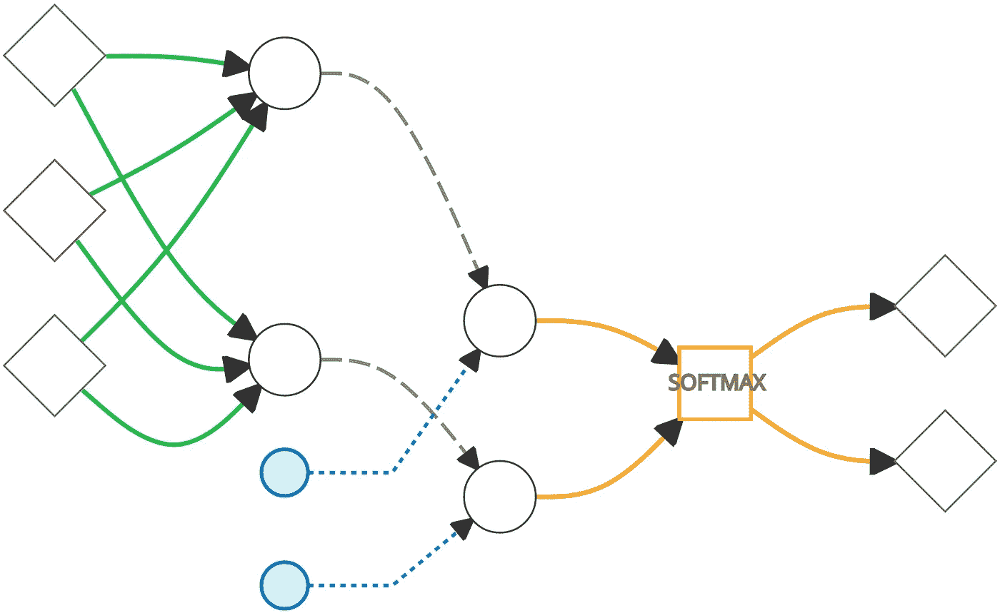

Single hidden layer as a first attempt (3 inputs on the left represent the actual 182 input used in the real neural network)

超参数优化后，神经网络经过 43 轮训练后，在验证数据上取得了平均 **77%的准确率**。下面是 20 个随机数据集的准确度图:

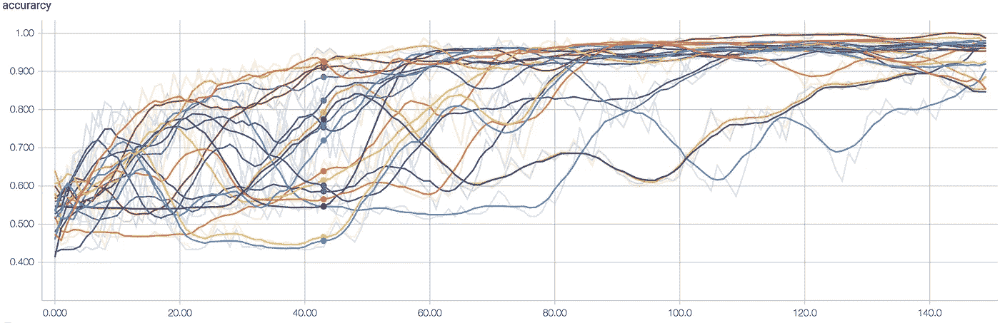

神经网络在学习，但最好的人类平均 43 次尝试就能达到 80%。需要一个更强大的神经网络，是时候排除故障了。

可视化每个输入的重要性是了解神经网络正在学习什么的良好的第一步。为此，神经网络对 2500 个项目进行了训练，以使其收敛到 99.8%的准确率。由于该网络只有一组权重，因此每个输入对分类的影响是透明的。

以下是按字符串位置和字母值组织的与每个方案相关的 182 个权重:

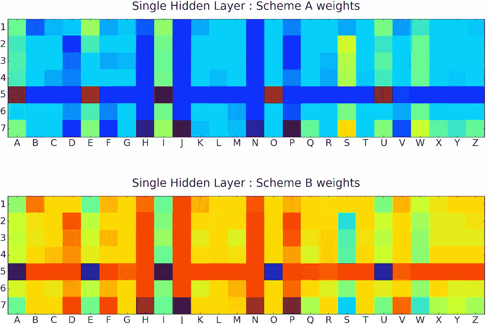

权重很好地代表了许多规则集！

例如，在方案 A 中，随机元音在第 5 位置被强制，而对于方案 B，随机辅音在第 5 位置被强制。你可以看到，第五个位置的所有权重都被认为是显著的(平均来说更热或更冷)。

可视化机器正在“思考”的东西有助于验证隐藏层正在展示一些预期的行为。从权重中出现的模式看起来很合适，但神经网络无法击败最优秀的人类似乎很奇怪。

单一隐藏层网络在识别与生成字符串的规则集相关的特定位置的字母方面非常出色，但它可能错误地表示了不同字母和位置之间的相对关联。

例如，看看应用于方案 A 的这些转换:

```
cursor.forEach('P', function (c, i) {
    c.next().set('S');
});
cursor.forEach('F', function (c, i) {
    c.next().set('S');
});
cursor.forEach('V', function (c, i) {
    c.next().set('S');
});
```

这些规则说找到每一个“P”、“F”或“V”构成下一个字母“S”。这应该转化为神经网络识别“P”、“F”、“V”和“S”在分类中的重要性。如果你回头看看权重，你会发现方案 A 认为“S”很重要，但是相应的字母“P”、“F”和“V”对方案 A 来说很“酷”

然而，问题是，现在如果网络显示一个“S”，它将自动向方案 a 增加权重。这通常可能是一个假阳性，因为要求不仅仅是有一个“S”，而是在“S”之前有字母“P”、“F”或“V”。

也许一层还不够？

## 深入学习的尝试

单一隐藏层做得很好，但有一些位置不变的模式，需要加以考虑。添加更多具有非线性激活的隐藏层应该有助于位置不变模式的识别。

方案 A 和方案 B 具有创建位置相关和位置不变模式的规则集，但是在测试原始方案之前，测试一组仅具有位置不变模式的方案将是有帮助的。这里有两个这样的方案 C 和 D:

```
/*======= Scheme C ========*/cursor.forEach('A', function (c, i) {
    c.next().set('Z');
});
cursor.forEach('B', function (c, i) {
    c.next().set('Y');
});
cursor.forEach('C', function (c, i) {
    c.next().set('X');
});
cursor.forEach('D', function (c, i) {
    c.next().set('W');
});
cursor.forEach('E', function (c, i) {
    c.next().set('V');
});
cursor.forEach('F', function (c, i) {
    c.next().set('U');
}); /*======= Scheme D ========*/cursor.forEach('Z', function (c, i) {
    c.next().set('A');
});
cursor.forEach('Y', function (c, i) {
    c.next().set('B');
});
cursor.forEach('X', function (c, i) {
    c.next().set('C');
});
cursor.forEach('W', function (c, i) {
    c.next().set('D');
});
cursor.forEach('V', function (c, i) {
    c.next().set('E');
});
cursor.forEach('U', function (c, i) {
    c.next().set('F');
});
```

在一般的方案 C 和 D 中，每个都找到一组字母，然后在每次出现后放置一个相应的字母。这就产生了不会出现在同一个点上，而是会出现在整个琴弦上的图案。

尝试学习方案 C 和方案 D 的第一个网络是具有非线性激活的隐藏层和线性激活的另一个隐藏层的神经网络。

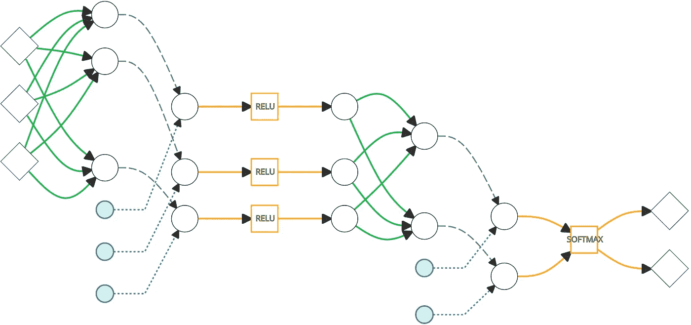

用来自方案 C 和方案 D 的 1500 个项目进行训练，该神经网络达到 94%的准确率。使用 Olden 的连接权重算法，生成了以下输入“重要性”图像:

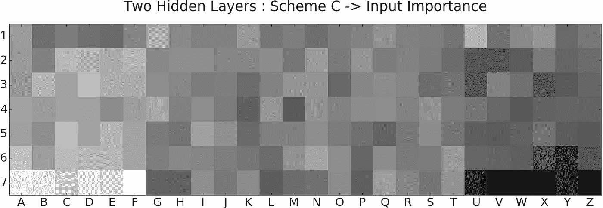

如果考虑方案 C 和 D 的模式，您会注意到相关的输入被用于预测。

该神经网络能够识别重要的输入，但需要对照原始方案 A 和 B 进行测试。下图显示了它对方案 A 和方案 B 中 150 个训练项目的 20 个随机数据集的准确性:

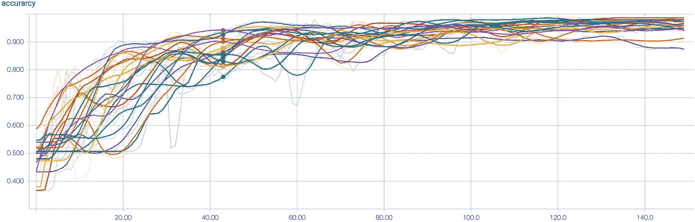

在试验 43 中，方差有点高，但是平均值在 84%左右，这比单个隐藏层神经网络达到的 77%好得多。很明显，这个网络在早期的迭代中更好，但是方差没有单一隐藏层稳定得快。以下是在对 400 个项目进行训练后，该神经网络输入的重要性度量:

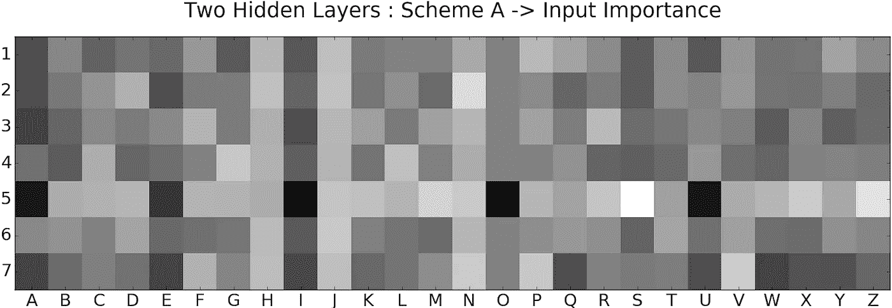

看起来好像这个网络可以识别重要的输入，但是额外的隐藏层可能已经失去了来自位置相关规则的确定性。

## 进入多轨道神经网络

我们需要的是两全其美。该实验的理想神经网络需要处理位置相关和位置不变的模式。将两个不同的网络合并成一个会很棒。

幸运的是，组合多个分类器是 Perrone 94 讨论的一种常见技术。其中一种技术叫做[竞争专家](http://www.cs.toronto.edu/~fritz/absps/nh91.pdf)，这种方法似乎最适合这种情况。

竞争专家方法使用多个“专家”(神经网络)。这些神经网络中的每一个都被输入一个输入的副本，并且它们都产生一个具有相同大小的输出。然后将这些输出组合起来，同时训练整个网络。


Multi track neural net, track one with two hidden layers, track two with one hidden layer

这个网络表现更好。顶部轨迹(2 个隐藏层)和底部轨迹(单个隐藏层)通过加法合并它们的输出，并且在单个 softmax 层中进行最终分类。请参见下图，该图显示了使用多轨迹神经网络进行的 20 次随机试验的准确度:

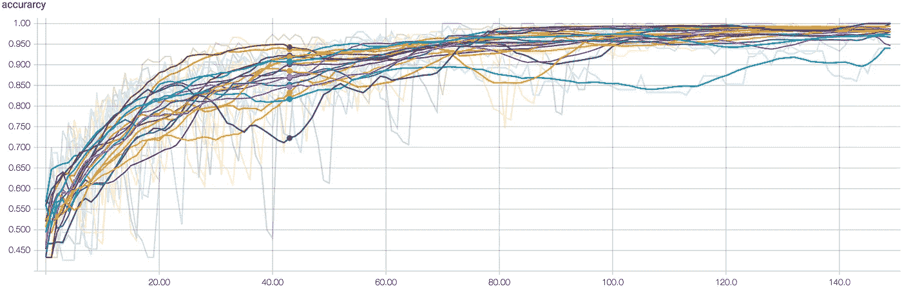

该网络在 43 个训练步骤中挤出了 88%的准确率，在第 43 步及以后的步骤中变化较小。

很高兴看到一些改进，但证明神经网络确实在做预期的事情还没有确定，需要进一步的调查。以下是经过 400 次迭代训练后两个不同轨迹的重要性测量值(此时神经网络稳定在 99%左右):

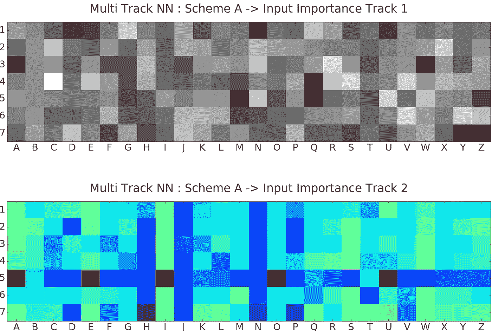

你可以看到轨道 2 中的单个隐藏层具有与原始单个隐藏层相似的图案。

轨迹 1(具有两个隐藏层)似乎没有显示任何与输入的重要性相关的模式。可能的是，第一轨道是过度拟合的，并导致位置相关规则的重要性被过度集中于允许其达到 100%的准确度。需要对这种多轨架构的效果进行更多的探索，并将在以后的文章中进行讨论。

# 结论

该实验探索了三种不同的神经网络及其对一个独特数据集的应用。我们的目标是看看精确度可以提高多快，同时也最小化方差，以便在相同类型的数据上击败一组人类参与者。请注意，开发神经网络的目标是创建一个有效使用新输入数据的模型。虽然了解如何提高效率和减少差异可能是有用的，但网络学习速度并不一定很快。

有很多工作需要做，以冲洗出一个最佳的神经网络，可以处理这个实验的许多不同的规则集，但这里有一些见解，可能有助于你和其他人理解这个实验和机器学习。

首先，这是本文中探讨的三种不同神经网络经过 700 多次迭代训练后的准确度图:

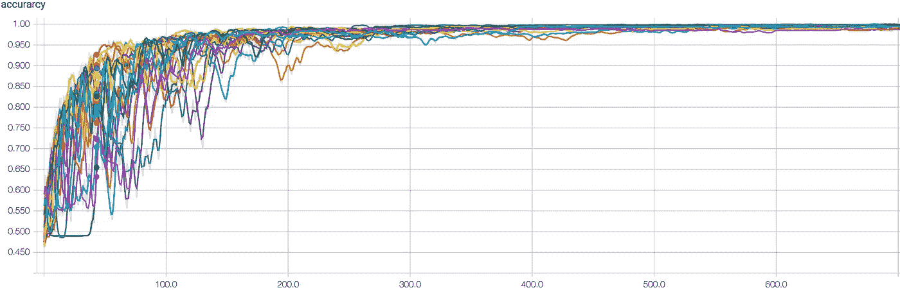

Single Hidden Layer

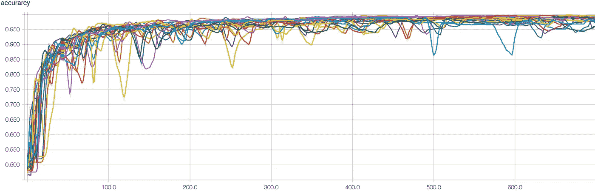

Two Hidden Layers

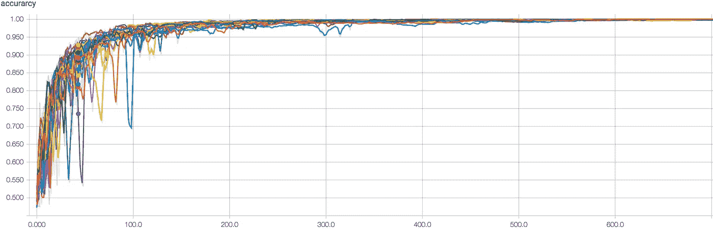

Multi-Track

以下是这个实验中值得考虑的一些有趣的观点:

1.  人类参与者表现得令人难以置信的好，但他们的结果有很大的差异。同样，所有神经网络在第 43 次迭代时都出现了显著的差异。有趣的是，应用数学的严谨性来阐明这个数据集的方差和精确度的极限。
2.  单隐层和多轨迹神经网络的方差比双隐层神经网络下降得更快。事实上，两个隐藏层的网络在精度上继续经历更高的变化，甚至远远超过 600 次训练迭代。
3.  达到 100%的准确率应该是可能的，因为方案 A 和方案 B 中用于生成字符串的规则使得这些集合相互排斥(保证在第五个位置有一个元音或一个辅音),但是在短时间内达到 100%的准确率是很难做到的。多轨迹神经网络达到了 100%的准确率，并最好地消除了方差。
4.  “竞争专家”变体的应用是临时的，需要更多的调查。很可能有许多可以改进的地方，并且需要更多的分析来探索这个数据集上的多分类器的组合。

# 给新来者的教训

这个实验对于那些学习人工神经网络和张量流的人来说是很棒的。这里有一些适合初学者记住的经验。专家们，请用你们自己的指导来帮助初学者(像我一样)避免常见的陷阱。

1.  学习如何可视化你的神经网络在做什么是至关重要的。了解如何使用 Matplotlib 生成图像，以及如何在 TensorBoard 中生成可视化数据。
2.  假设会让你很快陷入困境。深入了解并确认你认为正在发生的事情。尽可能寻找数学上的支持。
3.  学习理解相对输入重要性的方法，损失/准确性随时间的变化，以及来自特定输入的单个神经元的激活。
4.  试错法是一种有效而重要的方法，在可能的情况下应该自动化，例如优化超参数。
5.  扩展您的机器学习技术工具箱可以带来新的有效的实现。

感谢您的耐心等待，请回复任何对他人有用的建议。

**感谢阅读！**点击中的*💚下面把这篇文章推荐给别人！*

# 相关故事和链接

*   ” [**你直观吗？挑战我的机器！**](/p/82c3faed97da)
*   " [**如何吸引“Turkers”，做一个机械的 Turkers 英雄！**](/@JohnDavidFive/how-to-attract-turkers-and-be-the-ultimate-mechanical-turk-hero-75002da72c3d#.y9vhm2oy7)
*   [**人类直觉挑战的源代码**](https://github.com/gitsome/HumanIntuitionChallenge)

[](http://bit.ly/HackernoonFB)[](https://goo.gl/k7XYbx)[](https://goo.gl/4ofytp)

> [黑客中午](http://bit.ly/Hackernoon)是黑客如何开始他们的下午。我们是 [@AMI](http://bit.ly/atAMIatAMI) 家庭的一员。我们现在[接受投稿](http://bit.ly/hackernoonsubmission)，并乐意[讨论广告&赞助](mailto:partners@amipublications.com)机会。
> 
> 如果你喜欢这个故事，我们推荐你阅读我们的[最新科技故事](http://bit.ly/hackernoonlatestt)和[趋势科技故事](https://hackernoon.com/trending)。直到下一次，不要把世界的现实想当然！

****