# 在 React Studio 中设计响应式网页布局

> 原文：<https://medium.com/hackernoon/designing-responsive-web-layouts-in-react-studio-2e1d796704d5>

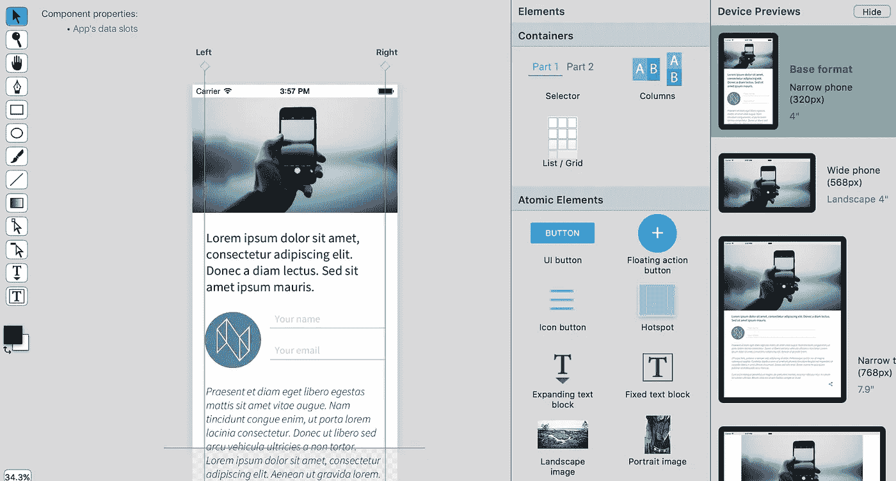

> 现代网络必须适应不同的屏幕尺寸。移动无处不在。很少有网络应用程序可以享受桌面应用的奢侈！但用 Photoshop 或 Sketch 等传统工具很难做出这样的响应式设计。
> 
> React Studio 有一个强大的自动布局系统，带有即时设备预览，用于创建灵活、响应迅速的用户界面。
> 
> 本教程向你展示了你需要知道的一切。它不同于静态设计……但是很容易，一旦你掌握了窍门！

欢迎光临！本教程将带你了解 [React Studio](https://reactstudio.com) 中一些最重要的布局功能，React Studio 是由 [Neonto](https://neonto.com) 开发的 web 应用程序设计工具。您将了解关键词、覆盖、滚动流程、内容“折叠之下”、排版风格以及许多其他适用于移动优先网页设计的有趣概念。

最终结果是一个单屏幕站点，如下所示:

[**布局演示**](https://neonto.cloud/u/layoutdemo/) (点击查看)

当您打开该链接时，请确保调整浏览器的大小，以便您可以看到设计在不同大小下的表现。

如果你想看看完成的教程项目，你可以在 React Studio 的项目模板中找到它(文件菜单→“从模板新建”)。

重点是布局特性，所以这里还有很多关于 React Studio 的内容没有介绍。例如，我们不会深入到导航、组件、高级交互、数据链接、脚本或草图导入程序…但我们会不断地研究关于这些主题的更多内容。那么，为什么不通过 Medium[或 Twitter](/@reactstudio) 关注我们，确保你不会错过呢？

> 我必须提到，我们有一个非常棒的草图插件！你可以在 Sketch 中做一个静态的基线设计，然后在 React Studio 中把它变成真实的布局，导出成高质量的 React 代码:[看看这个视频](https://www.youtube.com/watch?v=r0MgVq_BN5w)

## 概观

布局演示屏幕只有少数元素，但它们有一些有趣的行为:

*   标题图像填充小屏幕的宽度，但在较大的屏幕上留有空白；
*   其余内容在一列中，该列的边距与屏幕大小相适应；
*   文本输入字段(“姓名”和“电子邮件”)具有占位符文本，并根据材料设计指南进行样式设计；
*   电子邮件字段执行简单的验证。如果您输入的文本不是电子邮件地址，它会以红色突出显示。

让我们从顶部开始，一点一点地建立起来。

在 React Studio 中，使用“移动优先 Web 应用程序”设置启动一个新的空项目。您将看到一个项目地图，其中包含一个名为“开始”的屏幕:

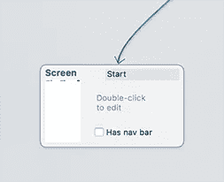

双击屏幕块将其打开进行编辑。

## 标题图像

众所周知，很酷的网页设计展示的是拿着智能手机的人，所以我们在这里也使用了这样的图片。你可以从[这个链接](https://s3.amazonaws.com/sc.neonto.com/reactstudio_layoutdemo_headerpic.jpg)下载图像文件(JPG，916kB)。(顺便说一下，这张相当不错的照片是由 Neonto 的联合创始人兼营销主管 Antti Sihlman 拍摄的！也许他本该成为一名摄影师…？😋)

在 React Studio 中，点击工具栏中的*导入图片*按钮，找到下载的图片。当提示如何放置时，选择“画一个框”。然后在画布上画一个区域。(您绘制的区域实际上并不重要，因为我们接下来无论如何都要更改对齐。)

您现在应该看到以下内容:

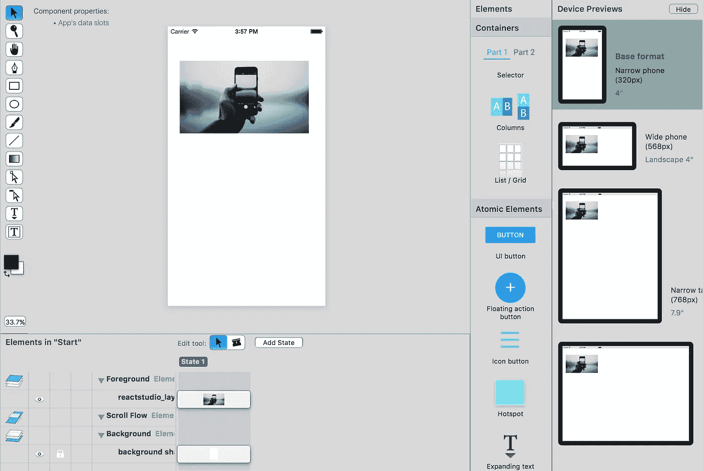

让我们实现我们想要的布局。点击新图像将其选中，然后在检查器(右侧)中打开*布局*选项卡。

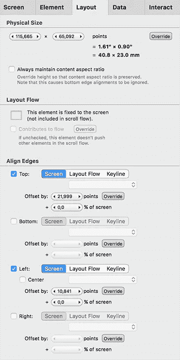

左边的截图显示了设置。物理尺寸、布局流程、对齐——这些都是我们可以用来制作布局的核心部分！

我们将对所有这些设置进行更改。我们可以通过简单地在画布中拖动来改变它们中的大多数(例如，要调整元素的大小，只需抓住它的角并拖动)。但是当你需要的时候，知道在哪里可以找到这些精确的测量值是很有用的。

先说“对齐边缘”。我们希望这个图像被固定在三个方面:顶部，左侧和右侧。

因此，单击“右”旁边的复选框来启用它。然后为“顶部”和“左侧”偏移值输入零。

您现在应该会看到:

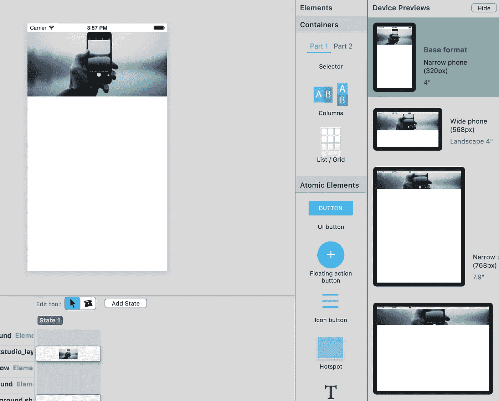

嗯，还是少了点什么。正如您在预览中看到的，图像的高度在所有尺寸的设备上都是相同的。这使得内容被裁剪。

对于像背景图像这样的东西，这通常是你想要的。但在这种情况下，我们想展示完整的图像。实际上有三种不同的方法可以做到这一点，这取决于您对设计的要求:

1.  **禁用裁剪。如果你想在可用的布局框中显示完整的图像，你可以告诉 React Studio 不要裁剪图像。该设置可在*元件*选项卡中找到。**
2.  **进行设备特定的覆盖。**如果您觉得某个屏幕上的图像尺寸需要变大，您可以简单地覆盖该特定尺寸。(为此，双击设备预览，然后调整图像大小。它将在图像的 size 属性上创建一个覆盖。)
3.  **设置图像以保持其内容纵横比。**有时您知道您想要显示整个图像，并相应地调整布局。

对于本演示，我们将选择最后一个选项。在*布局*选项卡中，点击“始终保持内容纵横比”复选框。您将看到设备预览更新，以显示完整的图像。

## 页眉图像边距的布局覆盖

好了，现在我们有完整的图像显示。但是对于最大的设备尺寸来说，它太大了。增加我们在[完成版本](https://neonto.cloud/u/layoutdemo/)中的空白怎么样？

双击设备预览中的最大屏幕尺寸(如果此视图隐藏，请转到视图>显示设备预览)。这将使你进入**超驰模式**。它在编辑区域以深绿色背景表示。

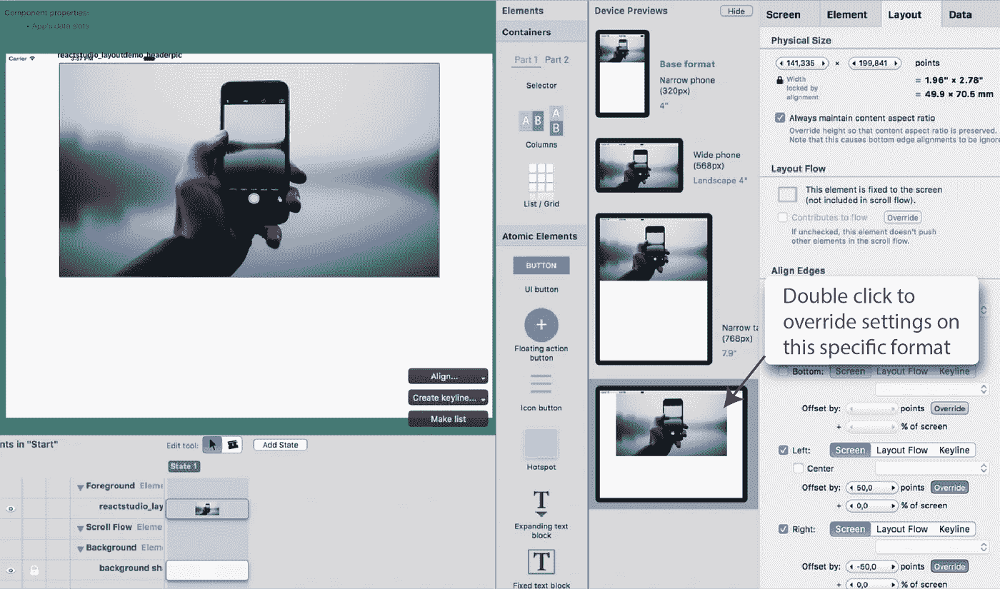

选择图像并打开*布局*选项卡。看到左侧和右侧偏移栏旁边的“覆盖”按钮了吗？这就是我们接下来要用的。

点击左对齐的“覆盖”按钮，并选择“设置覆盖”。该按钮现在被按下，表示在该屏幕尺寸下该设置被覆盖。如果您再次单击该按钮，您将会看到清除覆盖的选项，以及具有活动覆盖的所有格式的列表:

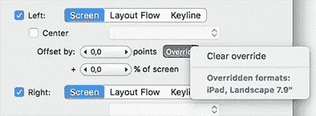

对右对齐进行同样的操作。

现在我们必须重写，但是值仍然为零。若要更改边距，您可以在编辑区域中直观地拖移元素的边缘，或者在“偏移”栏中输入一个特定的数值。(顺便说一下，您也可以通过单击数字字段并用鼠标向左或向右拖动来输入一个值—试试看！)

对于发布的演示，偏移值设置为左侧+50，右侧-50:

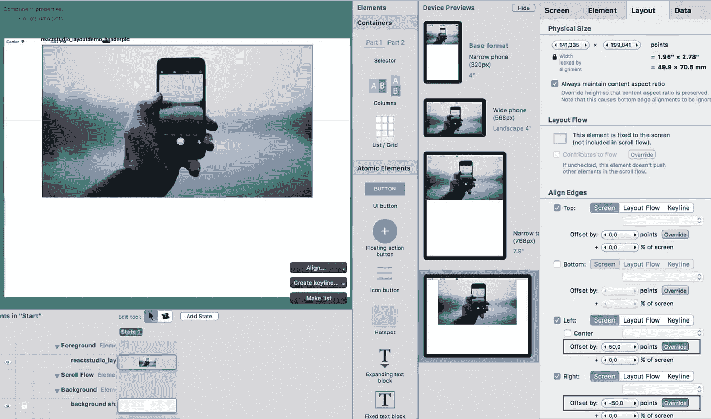

在进行更多编辑之前，返回到**基本格式**:双击设备预览中的第一个屏幕尺寸。(如果我们不返回到基本格式，我们可能会在以后意外地创建覆盖。)

基本格式实际上是一个项目范围的设置:如果你想改变它，点击项目地图中的*应用程序设置*块…但是对于大多数移动友好的 web 应用程序，我们建议保持基本格式为最小的设备大小。(这就是“移动优先”设计的意义所在:首先考虑最受约束的用户体验，然后再扩展。)

## 可滚动的内容和元素

接下来我们需要创建内容列——但是首先，让我们修改一下布局。

当我们导入图像时，它被放置在**前景组**中。您可以在 React Studio 屏幕底部的元素列表中看到这一点。该组中的元素固定在屏幕上其他内容的上方。这对于像导航页脚这样的东西来说是很好的，但是在这种情况下，我们希望页眉图像和内容一起滚动。

为了使它可滚动，我们将把它放入**滚动流组**。在元素列表中，单击图像元素的名称(在“前景”组标题下的行)，并将其拖动到“滚动流”标题下。就是这样。图像现在是可滚动内容的一部分。

接下来，让我们添加内容元素。我们只是先把碎片扔进去，然后再修改布局！所以不要担心事情一时半会看起来不对劲。

要创建新元素，从编辑区域右侧的**元素面板**中拖放。当您将元素拖放到屏幕中时，默认情况下，它会进入滚动流组。(如果您想让它位于前台，请在拖动时按住 Alt 键。)

从调色板中，抓取以下元素并将其放入屏幕:

*   扩展文本块
*   透明占位符图像(圆形“N”标志)
*   文本字段
*   另一个文本字段
*   另一个扩展文本块

您现在将看到以下内容:

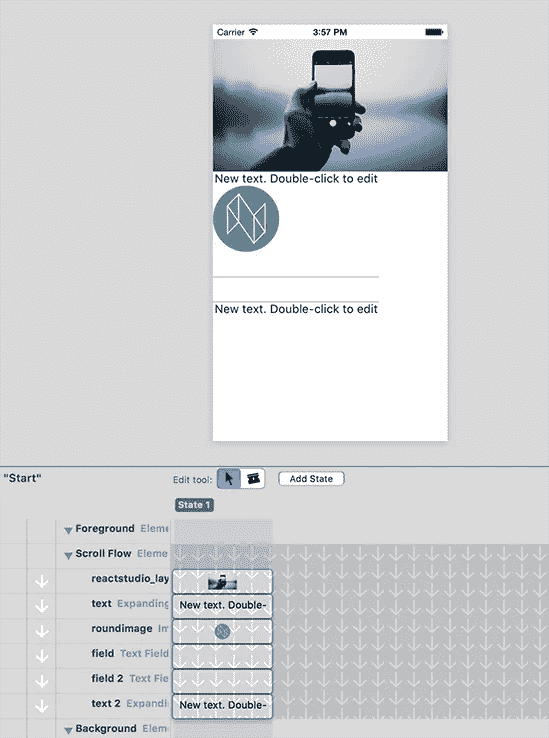

好的，我们需要修改内容。对于两个文本块，输入任意文本(双击文本块进行编辑)。[发布的演示](https://neonto.cloud/u/layoutdemo/)使用了一些“Lorem ipsum”占位符文本——你可以从那里复制。

对于第一个文本块，将其设置为标题样式。选择文本元素，然后在*元素*选项卡中，在*文本设置*下，选择样式。

然后，让我们对文本字段进行一些样式化处理。选择第一个字段并输入占位符文本:“您的姓名”(在*元素*选项卡中)。同时启用复选框“使用 UI 框架样式”。

选择第二个文本栏，并选取以下设置:

*   占位符文本:“您的电子邮件”
*   字段类型:“电子邮件地址”
*   “使用 UI 框架样式”复选框已启用

通过将字段类型设置为 email 并启用 UI 框架样式，我们获得了良好的验证行为，其中如果输入不是有效的 email，字段将获得红色高亮显示。(默认的 UI 框架是 [MUI](https://muicss.com) ，但是我们很快会提供插件让你把它换成别的东西！)

您还可以选择所有元素(在编辑区域中拖动选择)并将它们向右移动，以使布局看起来更好。

以下是您现在应该拥有的:

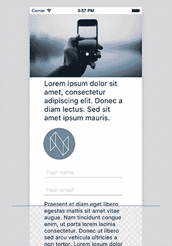

注意到屏幕底部的溢出了吗？这条紫色的线叫做**褶皱**。它向您显示最初可见的屏幕区域的结束位置。“文件夹下”的内容需要用户滚动才能看到。(这通常是设计中的一个重要关注点，例如，如果您有一个“行动号召”类型的按钮，您希望它立即可见)。

## 关键词

在其他尺寸的设备上，布局仍然是一团糟。让我们将这些元素放在一个响应列中。为此，我们将使用**关键线**。

点击工具栏中的“添加关键行”按钮。您会在编辑区域看到一条垂直的关键线。抓住钥匙线顶部的小菱形指示器，将其拖到右边。您将在检查器中看到关键线的位置更新。

将此关键线简单地重命名为“Left ”,并将其放置在距离左侧大约 7.5%的位置:

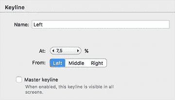

创建另一个关键词。重命名为“右”，放置在距离右边缘-7.5%的位置。(您可以在上面显示的“关键线”检查器中手动输入这些设置。)

现在您有两条关键词:

接下来，让我们将内容与这些关键词对齐。选择所有元素，点击编辑区右下角的“对齐…”命令按钮，然后选择“左边缘到关键线”和“左”:

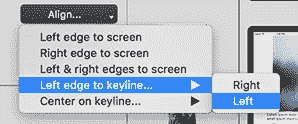

接下来对齐两个文本元素和两个文本字段(但不是带有 N 标志的图像——它将只保持向左对齐！).在*布局*选项卡中，启用右对齐并选择右关键线:

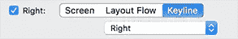

这就是我们现在所拥有的:

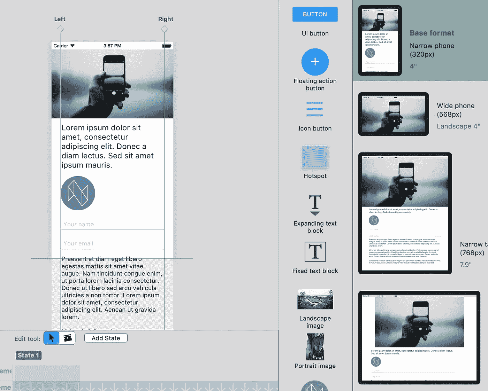

让我们暂时忽略“N”标志。相反，在设备预览中查看最大的屏幕尺寸。看到文本内容如何挂在标题图像的左边了吗？这看起来不太好。相反，我们希望文本向右缩进。此外，我们希望图像和文本之间有更多的空白。

要解决这个问题，让我们创建覆盖。双击设备预览中的最大屏幕尺寸。然后将关键线拖向中间。此外，选择第一个文本元素并向下移动一点。您将看到为该特定屏幕创建了覆盖:

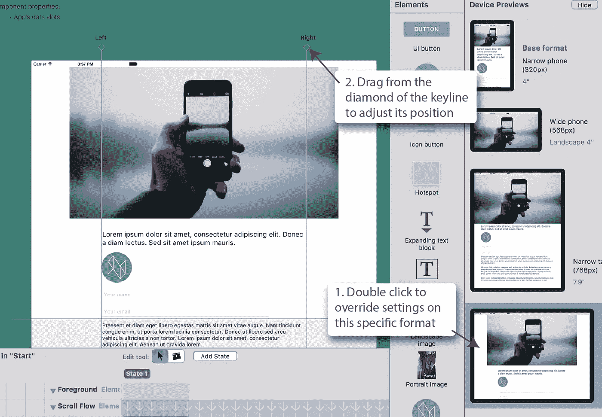

编辑覆盖后，记得双击**基本格式**返回基本格式。

## 关于滚动流的更多信息(以及如何不推动它)

最后，我们将修复“N”徽标和文本字段的位置。

在元素列表中，单击“roundimage”元素名称左侧的箭头。它会变成一个负号:

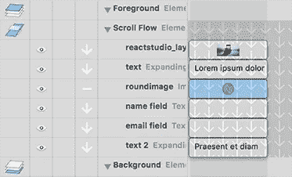

这意味着元素不再**对滚动流**有贡献。你可以把这个设置想成:*“这个元素是不是把滚动流往前推？”*

在编辑区域，您可以看到文本字段已经跳到了“N”徽标的顶部。我们会用一个偏移量来解决这个问题。选择两个文本字段，并给它们一个合理的左偏移量，例如 45 磅。现在它们整齐地位于徽标的右侧:

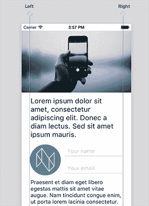

“有助于流动”设置对于布局中元素之间的这种简单重叠非常有用。但是如果你需要更复杂的多列布局，你应该使用*列*元素。它为您提供了更多的功能，包括响应能力(例如，您可以让内容在窄屏幕上显示为一个堆叠的列，但在宽屏幕上显示为两个并排的列)。

## 字体(以及它们如何嵌入到您的 web 应用程序中)

到目前为止，我们还没有触及文本元素的样式，除了改变其中一个使用标题样式。让我们做一些关于排版的事情。

我们总是可以在元素上单独设置字体，但是使用**应用程序范围的样式**是一个更好的主意。这些是你项目的排版基础。你可以在*应用设置*块中找到它们——在项目地图中点击它，然后在检查器中选择*应用样式*标签。

我们项目中使用的样式是“基本文本”和“标题”。我们可以看到两者当前都设置为使用系统字体:

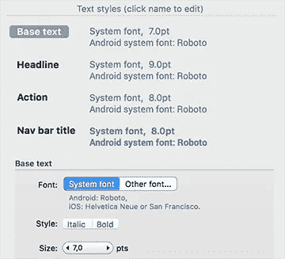

点击“其他字体”设置。出现用于选择字体的菜单按钮。点击按钮并选择名为 *Source Sans Pro* 的字体。然后，选择标题样式(字体设置上方的粗体文本)，并在那里设置相同的字体。

这两种样式现在都应该设置为使用源 Sans Pro。预览现在将反映这种字体选择:

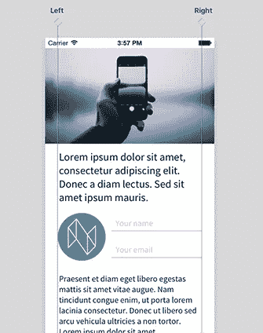

React Studio 中实际上包含了源 Sans Pro 字体。这是 Adobe 开发的免费字体，即使在小屏幕上看起来也很棒，是移动网络用户体验的绝佳选择。出于这个原因，我们在默认的 React Studio 安装中捆绑了该字体。(我们包括的另一种字体是 Open Sans，它同样可以免费使用，在显示器上非常清晰。)

您也可以使用电脑上安装的任何其他字体。当您导出项目时，React Studio 会将字体文件复制到导出的 React/Webpack 项目的资源中。换句话说，你不需要做任何事情就可以在你的网站上启用高质量的字体！但是，有几点需要注意:

*   商业字体可能具有禁止在网站上嵌入字体文件的许可。如果您不确定，请联系字体供应商。
*   Mac 上的一些标准字体的格式不能被网络浏览器载入，因此它们不能被嵌入。如果是这种情况，您会在导出项目时看到一条警告。

如果你再看看最终发布的演示版本[，你会看到排版的最后一个不同。该长文本块使用浅斜体字体，并且是中灰色(而不是黑色)。您可以通过选择文本元素并查看检查器中的*元素*选项卡来完成这些更改。](https://neonto.cloud/u/layoutdemo/)

## 具有交互功能的按钮

这个演示的最后一部分是右下角的按钮。如果您在[发布的演示](https://neonto.cloud/u/layoutdemo/)中点击它，您会看到一条警告消息。这是互动的一个简单例子。

要创建按钮，请将“图标按钮”从元素面板拖到编辑区域。

然后将新按钮与右关键线对齐:打开*布局*选项卡，点击右对齐复选框以启用它。当提示对齐时，回答“保持大小和重新定位”，这将清除左对齐设置。

图标按钮的默认内容是一个三行的“汉堡”菜单图标，但是很容易更改。React Studio 包括数百个常用图标作为模板。或者，如果您不喜欢默认设置，您可以导入一个 SVG 矢量图像作为图标内容。

打开*元素*标签，在*按钮图标*下查看。点击“模板”菜单按钮:

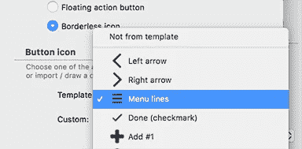

我们在演示中使用的图标是一个名为“Share #6”的模板，但是你当然可以使用任何你喜欢的东西。

打开*交互*选项卡。点按“当用户轻按时”旁边的复选框，然后选取“脚本”交互类型:

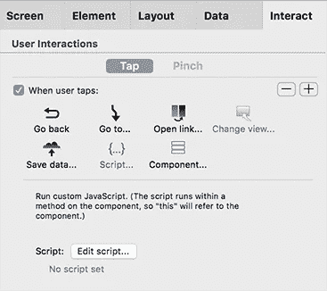

这意味着我们希望在点击这个按钮时运行一些 JavaScript 代码。(可以针对单个用户事件进行一系列的交互——看看右上角的加号和减号按钮。)

点击“编辑脚本”。这将打开脚本编辑器窗口。输入以下文本:

> alert(“你好！”)

然后点击“保存”。这个按钮现在会显示一个警告框，当它被点击。

## 预览和发布

让我们在网络浏览器中看看这个完成的设计！有三种方法可以查看您的应用程序，只需在工具栏中单击一下即可访问:

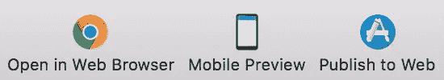

1.  **在网络浏览器中打开。这在你的本地计算机上运行一个所谓的开发网络服务器，并在网络浏览器中打开你的应用程序。**
2.  **手机预览。**该命令将您的项目导出为 React+Web 项目，在其上运行生产构建(例如，缩小 JavaScript)，然后在 Neonto 的服务器上为您的内容创建一个隐藏的 Web 链接。通过这种方式，您可以获得预览的真实网址，因此您可以在自己的设备上轻松查看。链接也可以共享。它是不可猜测的，但却是公开的，因此只有与你共享了链接的人才能访问它。
3.  **发布到网络。**该命令的工作方式类似于移动预览，但是它允许您为您的站点选择一个 URL 路径。比如本教程中[发布的演示](https://neonto.cloud/u/layoutdemo/)就是 React Studio 利用这个特性发布的，路径为“layoutdemo”。一旦你发布到一个路径，该网址不能被其他任何人使用，所以你实际上拥有它！

还有第四种方式，工具栏中的**导出**按钮。这将为您提供一个遵循最新最佳实践的完整 React+Webpack 项目。这里没有“锁定”任何 Neonto 特有的特性。如果您想将项目交给 web 开发人员进行进一步开发，没有什么可以阻止您这样做！这就是 React Studio 的真正强大之处:干净、高质量的 React 代码总是一键完成。

## 下一步是什么

感谢您读到这里！你是真正的冠军。希望你对使用 React Studio 的工具集进行响应式 web 设计的神奇之处有所启发。(如果没有，请告诉我们哪里出了问题？)

我们正在建立一个学习材料的内容库。查看[我们的媒体博客](/@reactstudio)上的其他帖子。然后前往 [React 工作室网站](https://reactstudio.com)获取视频教程(YouTube)等链接。

如果您有任何问题，或者对您想看的材料有任何建议，请随时联系我们！你可以通过*reactstudio@neonto.com*联系我们，或者使用 React Studio 应用程序内的内置聊天工具(查看帮助菜单)。

> [黑客中午](http://bit.ly/Hackernoon)是黑客如何开始他们的下午。我们是 [@AMI](http://bit.ly/atAMIatAMI) 家庭的一员。我们现在[接受投稿](http://bit.ly/hackernoonsubmission)并乐意[讨论广告&赞助](mailto:partners@amipublications.com)机会。
> 
> 如果你喜欢这个故事，我们推荐你阅读我们的[最新科技故事](http://bit.ly/hackernoonlatestt)和[趋势科技故事](https://hackernoon.com/trending)。直到下一次，不要把世界的现实想当然！

